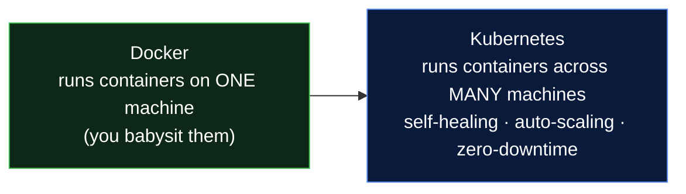

# Learn Kubernetes - Day-Wise, Beginner to Advanced

> **Module 4 of the DevOps Masterclass.** You can package apps in containers (Docker ). Kubernetes is how you run them **reliably, at scale, in production**. Each day builds on the last - explaining **why** before **how**.

---

## Why Kubernetes? (30-second version)

Docker runs containers on **one machine**. But what happens when a container crashes at 3 AM? When traffic spikes 10×? When you need zero-downtime deploys across 50 servers? Doing that by hand is impossible.

**Kubernetes is an automatic manager for your containers** - it restarts crashed ones, scales them up and down with demand, spreads them across many machines, and heals itself when servers die.



> **Analogy:** Docker is *driving one car*. Kubernetes is *running the whole Uber fleet* - dispatching, replacing, and scaling thousands of cars automatically.

---

## Interactive Animations (open in any browser - no install)

| Animation | What it teaches |
|---|---|
| [**Architecture Explorer**](https://siva9800.github.io/devops-animations/k8s/k8s-architecture.html) | Click each component (api-server, etcd, scheduler, kubelet…) to learn its job |
| [**Self-Healing & Auto-Scaling**](https://siva9800.github.io/devops-animations/k8s/k8s-self-healing.html) | Crash pods and watch Kubernetes restore desired state automatically |

---

## Who Is This For?
- Complete beginners who know basic Linux and Docker
- Students who want to understand Kubernetes end-to-end
- Anyone preparing for **CKA/CKAD** exams

## Prerequisites
- Basic Linux commands (`cd`, `ls`, `cat`, `vim`)
- Docker fundamentals → see the [`learn-docker`](../learn-docker) module
- A laptop with 4GB+ RAM (for Minikube)

---

## Day-Wise Roadmap

> Folder names use `dayNN-topic`. A few day numbers in this table map to the nearest existing folder; follow the links.

| Day | Topic | Type | What You'll Learn |
|-----|-------|------|-------------------|
| [Day 01](day01-why-kubernetes/notes.md) | **Why Kubernetes?** | Theory | Problems with manual deployment; why containers alone aren't enough |
| [Day 02](day02-architecture/notes.md) | **Architecture** | Theory | Control plane, worker nodes, all internal components |
| [Day 03](day03-setup/notes.md) | **Setup** | Setup | Install Minikube, kubectl, run your first cluster |
| [Day 04](day04-pods/notes.md) | **Pods** | Theory + Lab | The smallest unit in K8s; create & manage Pods |
| [Day 05](day05-replicasets/notes.md) | **ReplicaSets** | Theory + Lab | Running multiple copies; self-healing |
| [Day 06](day06-deployments/notes.md) | **Deployments** | Theory + Lab | Rolling updates, rollbacks, zero-downtime |
| [Day 07](day07-services/notes.md) | **Services & Networking** | Theory | ClusterIP, NodePort, LoadBalancer, Headless |
| [Day 08](day08-services-demo/notes.md) | **Services Demo** | Hands-On | All service types, DNS discovery, load balancing |
| [Day 09](day09-namespaces/notes.md) | **Namespaces** | Theory + Lab | Organizing & isolating resources |
| [Day 10](day10-configmaps-secrets/notes.md) | **ConfigMaps & Secrets** | Theory + Lab | Externalizing config; managing sensitive data; [production secrets](day10-configmaps-secrets/production-secrets.md) (ESO, Vault, Sealed Secrets, SOPS) |
| [Day 11](day11-eks/notes.md) | **EKS (Managed K8s on AWS)** | Cloud | Managed control plane, [node groups](day11-eks/managed-nodegroups/notes.md); full [cluster-creation guide](day11-eks/eks-cluster-creation/README.md) (manual · deep-dive · best-practices · Terraform) |
| [Day 12](day12-volumes/notes.md) | **Volumes & Storage** | Theory | PV, PVC, StorageClass; [AWS](day12-volumes/aws-volumes/notes.md) & [NFS](day12-volumes/nfs-volumes/notes.md) |
| [Day 13](day13-volumes-demo/notes.md) | **Volumes Demo** | Hands-On | Data survives pod deletion; [EKS demo](day13-volumes-demo/eks-demo.md) |
| [Day 14](day14-statefulsets/notes.md) | **StatefulSets** | Theory | Running stateful apps like databases |
| [Day 15](day15-statefulsets-demo/notes.md) | **StatefulSets Demo** | Hands-On | Ordered creation, stable identity; [EKS demo](day15-statefulsets-demo/eks-demo.md) |
| [Day 16](day16-resource-management-autoscaling/notes.md) | **Resource Management & Autoscaling** | Theory + Lab | Requests/limits, QoS, HPA, VPA, Cluster Autoscaler; [scheduling](day16-resource-management-autoscaling/scheduling.md) (affinity, taints, topology spread) |
| [Day 17](day17-rbac-security/notes.md) | **RBAC & Cluster Security** | Theory + Lab | Roles, RoleBindings, ServiceAccounts, least privilege; [RBAC on EKS](day17-rbac-security/rbac-on-eks.md) (IAM bridge, access entries/policies) |
| [Day 18](day18-ingress-demo/notes.md) | **Ingress** | Hands-On | HTTP routing, host/path rules, TLS; [EKS demo](day18-ingress-demo/eks-demo.md) |
| [Day 19](day19-daemonsets-jobs-cronjobs/notes.md) | **DaemonSets, Jobs & CronJobs** | Theory + Lab | One-pod-per-node, batch & scheduled tasks |
| [Day 20](day20-network-policies/notes.md) | **Network Policies** | Theory + Lab | Pod-to-pod firewalls, default-deny, CNI requirement |
| [Day 21](day21-monitoring-logging/notes.md) | **Monitoring & Logging** | Theory + Lab | Prometheus, Grafana, alerting, log aggregation, probes; [probes deep dive](day21-monitoring-logging/probes.md) (liveness/readiness/startup, tuning, debugging) |
| [Day 22](day22-helm/notes.md) | **Helm** | Theory + Lab | Package manager for K8s; [demo](day22-helm/demo.md) |

---

## How to Use This Module
1. **Follow day by day** - each concept builds on the previous.
2. **Type the commands yourself** - build muscle memory.
3. **Break things on purpose** - delete pods, crash containers, watch K8s recover (try the [self-healing animation](https://siva9800.github.io/devops-animations/k8s/k8s-self-healing.html) first!).
4. **Read the YAML** - understanding YAML structure is key to mastering K8s.

## kubectl Cheat Sheet
```bash
# Cluster info
kubectl cluster-info
kubectl get nodes

# Working with resources
kubectl get pods | deployments | services | all
kubectl describe pod <pod-name>
kubectl logs <pod-name>
kubectl exec -it <pod-name> -- /bin/bash

# Create / Apply / Delete
kubectl apply -f <file.yaml>
kubectl delete -f <file.yaml>
kubectl delete pod <pod-name>

# Debugging
kubectl get events
kubectl top pods
kubectl get pods -o wide
```

---

## Learning Outcomes
By the end you'll be able to:
- Explain what Kubernetes does and why it exists
- Read and write Kubernetes YAML manifests
- Deploy, scale, update, and roll back applications
- Expose apps with Services and Ingress
- Manage config, secrets, storage, and stateful apps
- Package apps with Helm and run on managed K8s (EKS)

---

## Reference manifests

The [`Manifest-files/`](Manifest-files/) folder holds ready-to-use YAML you can copy during the labs - Pods, ReplicaSets, Deployments, Services, PV/PVC, a StatefulSet with a headless Service, EBS StorageClass examples, and a small Helm chart (`my-webapp/`). Use them as starting points rather than typing every manifest from scratch.

---

**Start with** → [Day 01 - Why Kubernetes?](day01-why-kubernetes/notes.md)
Next module → [**learn-cicd**](../learn-cicd)
