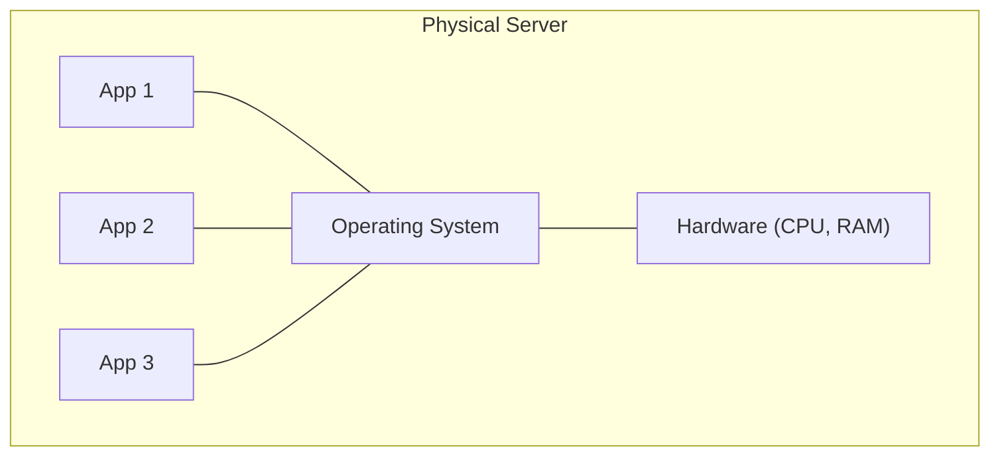
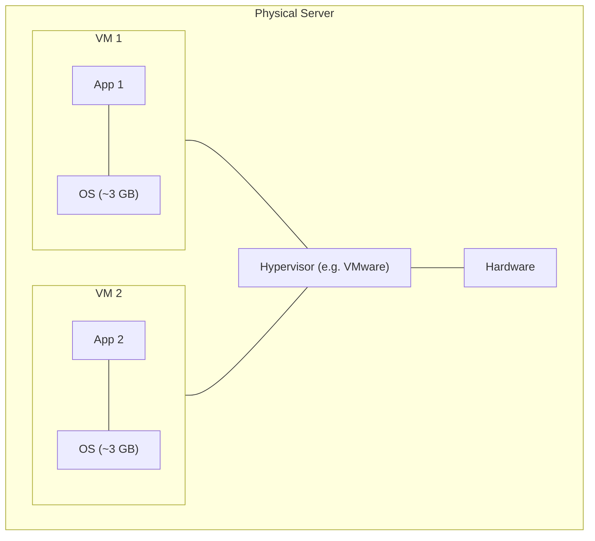
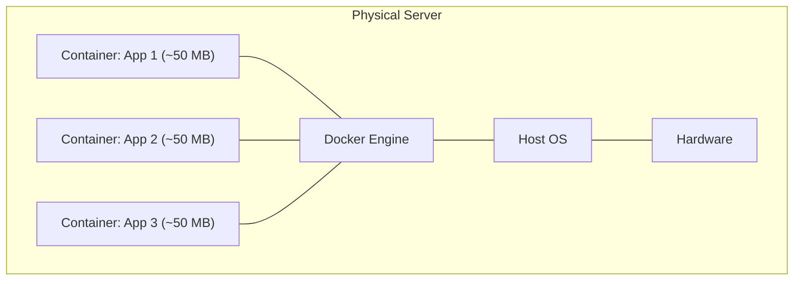

# Day 01 - Why Kubernetes?

> **Goal:** Understand the journey from physical servers to containers, why Docker alone isn't enough, and what problem Kubernetes actually solves.

---

## Learning Objectives

By the end of this lesson, you will be able to:

- Explain how application deployment evolved: bare metal -> VMs -> containers
- Describe why running containers manually breaks down at scale
- Explain in plain English what Kubernetes (K8s) is and what it does for you
- List the key features of Kubernetes (self-healing, auto-scaling, rolling updates)
- Know the basic terminology (cluster, node, pod, kubectl, YAML)

---

## Real-World Analogy: From a Food Truck to a Restaurant Chain

Imagine you sell food.

- **One food truck** = one app on one server. You cook, you serve, you fix everything yourself. If you get sick, the truck closes.
- **A single restaurant** = Docker. A proper kitchen, organized and repeatable. But if the only chef quits mid-shift, dinner stops.
- **A restaurant chain with a head office** = **Kubernetes**. The head office decides how many chefs each branch needs, hires replacements when someone calls in sick, opens extra branches on busy weekends, and rolls out a new menu without ever closing the doors.

Kubernetes is that **head office for your containers** - it manages the whole operation so you don't have to babysit every kitchen.

---

## The Problem: How Applications Were Deployed Before

Let's walk through the journey of how we deploy applications and why each step led to the next.

### Stage 1: Bare Metal Servers (The Old Way)

**Problems:**
- One app crashes -> the entire server can go down
- App 1 needs Java 8, App 2 needs Java 11 -> **dependency conflicts**
- Server uses only 10-20% of its CPU -> **wasted resources and money**
- Scaling = buying a new physical server -> **slow (weeks!)**

### Stage 2: Virtual Machines (VMs)

**Better:** Each app gets its own OS, so no dependency conflicts.

**But still problems:**
- Each VM runs a **full OS** -> wastes 2-3 GB RAM per VM
- VMs take **minutes to start**
- Moving VMs between servers is **complex**
- You still manage each OS separately (updates, patches)

### Stage 3: Containers (Docker)

**Much better!**
- Containers are **lightweight** (~50 MB vs ~3 GB for a VM)
- They start in **seconds**, not minutes
- The same app runs **exactly the same everywhere** (laptop, server, cloud)
- Easy to build and share (Dockerfile -> image -> run anywhere)

### But Wait... Docker Alone Is Not Enough!

Imagine your app becomes popular. You're running it with Docker. Now:

| Problem | What Happens Without K8s? |
|---------|---------------------------|
| Container crashes | Nobody restarts it automatically |
| Traffic increases 10x | You manually start more containers |
| Server goes down | All your containers vanish with it |
| Deploy a new version | You manually stop old + start new (users see downtime) |
| 50 containers running | Which talks to which? How do you track them? |

> **The takeaway:** You need someone to **manage** your containers automatically. That someone is Kubernetes.

---

## The Solution: Kubernetes!

**Kubernetes (K8s)** is an open-source **container orchestration platform**.

> **Docker** = driving a single car
> **Kubernetes** = running an entire fleet (think Uber/Ola)

> "K8s" is just shorthand - there are 8 letters between the **K** and the **s** in "Kubernetes".

Kubernetes was originally designed by Google, based on their internal system called **Borg** (which managed billions of containers). Google open-sourced it in 2014, and it's now maintained by the Cloud Native Computing Foundation (CNCF).

### What Kubernetes Does For You

| You Tell K8s | K8s Does |
|--------------|----------|
| "Run 5 copies of my app" | Creates 5 containers across multiple servers |
| "A container crashed" | Automatically restarts it (**self-healing**) |
| "Traffic is high" | Spins up more containers (**auto-scaling**) |
| "Deploy a new version" | Gradually replaces old with new (**rolling update**, zero downtime) |
| "Roll back!" | Instantly returns to the previous version |
| "This container needs 256 MB RAM" | Places it on a server that has enough RAM (**scheduling**) |

### Key Features of Kubernetes

1. **Self-Healing** - Container crashes? K8s restarts it. Server dies? K8s moves containers to a healthy server.
2. **Auto-Scaling** - Traffic up? K8s adds containers. Traffic down? K8s removes the extras.
3. **Rolling Updates & Rollbacks** - Deploy without downtime; if something breaks, roll back in seconds.
4. **Service Discovery & Load Balancing** - K8s gives a set of containers one address and balances traffic across them.
5. **Storage Orchestration** - Automatically mount storage (local, cloud, NFS) to your containers.
6. **Secret & Config Management** - Store passwords, API keys, and configs separately from your code.

---

## Analogy Revisited: The Restaurant Kitchen

| Restaurant | Kubernetes |
|------------|------------|
| Chef | Container (runs your app) |
| Kitchen Manager | Kubernetes (manages all chefs) |
| "We need 3 chefs today" | `replicas: 3` |
| Chef calls in sick | Manager calls a replacement (self-healing) |
| Saturday night rush | Manager brings in extra chefs (auto-scaling) |
| New recipe | Gradually train chefs on it (rolling update) |
| Recipe is bad | Go back to the old one (rollback) |

---

## What Kubernetes is NOT

- **NOT a replacement for Docker** - it uses a container runtime (containerd, CRI-O, etc.) underneath.
- **NOT only for big companies** - even small teams benefit, and you can run it on a laptop.
- **NOT a programming language** - it's a platform you configure with YAML files.
- **NOT a place that hosts your code** - it manages containers that run your code.

---

## Key Terminology (Just Awareness for Now)

| Term | Simple Meaning |
|------|----------------|
| **Cluster** | A group of servers running Kubernetes together |
| **Node** | A single server (machine) in the cluster |
| **Pod** | The smallest thing you can deploy (usually wraps 1 container) |
| **kubectl** | The command-line tool used to talk to Kubernetes |
| **YAML** | The text file format used to tell K8s what you want |

> Don't worry about memorizing these - we'll use each one hands-on in the coming days.

---

## Common Mistakes

1. **Thinking Kubernetes replaces Docker.** It doesn't - K8s still relies on a container runtime to actually run containers.
2. **Reaching for Kubernetes too early.** For a single tiny app, plain Docker or Docker Compose may be plenty. K8s shines when you have many containers to manage.
3. **Confusing a container with a pod.** A pod is the K8s unit; it usually contains one container, but the two are not the same thing.
4. **Expecting K8s to write your app.** Kubernetes runs and manages your containers - it does not host source code or build it for you.
5. **Assuming "self-healing" means "no monitoring needed."** K8s restarts crashed containers, but you still need to watch logs and metrics to find the *root cause*.

---

## Quick Self-Check

1. In one sentence, what problem does Kubernetes solve that Docker alone does not?
2. Why did containers replace virtual machines for many workloads? Give two reasons.
3. What does "self-healing" mean in Kubernetes?
4. True or false: Kubernetes is a replacement for Docker. Explain your answer.
5. Match the term to its meaning: *cluster, node, pod, kubectl*.

---

## Summary

- Deployment evolved from **bare metal -> VMs -> containers**, each fixing the previous stage's waste and conflicts.
- **Docker** packages apps neatly, but managing **many** containers by hand (restarts, scaling, updates) is painful.
- **Kubernetes** is the "head office" that orchestrates containers: self-healing, auto-scaling, rolling updates, service discovery, and more.
- Core vocabulary to remember: **cluster, node, pod, kubectl, YAML**.

**Next up ->** [Day 02 - Kubernetes Architecture](../day02-architecture/notes.md)

---

*This is part of the [Learn Kubernetes](../README.md) series.*
