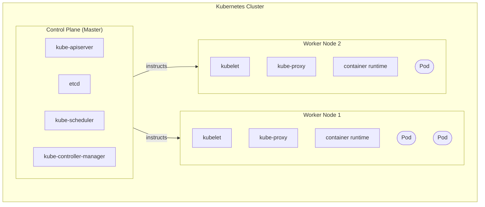
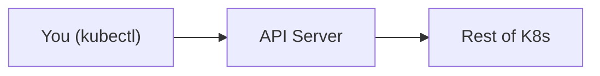
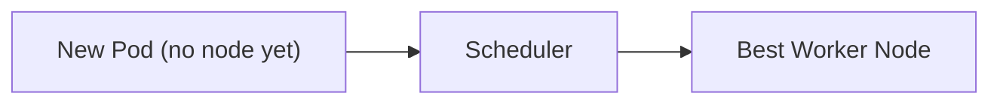
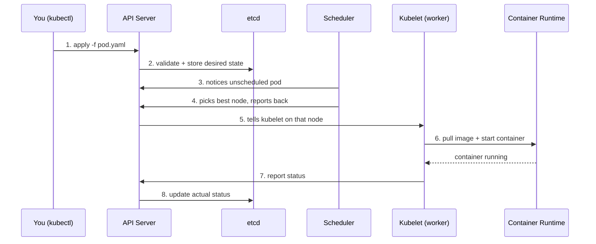

# Day 02 - Kubernetes Architecture

> **Goal:** Understand what's happening *inside* a Kubernetes cluster - the control plane, the worker nodes, and how a request flows through them.

---

## Learning Objectives

By the end of this lesson, you will be able to:

- Describe the two kinds of machines in a cluster (control plane vs. worker nodes)
- Name the control plane components (API server, etcd, scheduler, controller manager) and what each does
- Name the worker node components (kubelet, kube-proxy, container runtime) and what each does
- Trace what happens, step by step, when you run `kubectl apply -f pod.yaml`
- Explain why understanding the architecture makes debugging much easier

---

## Why This Matters

Before you start *using* Kubernetes, you need to understand **what's happening inside**. If you skip this, debugging later feels like magic gone wrong. Once you know the parts, error messages start to make sense.

---

## Real-World Analogy: A Hospital

A Kubernetes cluster works a lot like a **hospital**:

- The **control plane** is the **administration wing** - doctors, the records room, the admissions desk, the supervisor. It *decides* what should happen.
- The **worker nodes** are the **hospital floors** - nurses, equipment, and the patients (your apps). This is where the actual care happens.

We'll reuse this hospital analogy for every component below.

---

## Big Picture: The Cluster

A Kubernetes **cluster** has two types of machines (nodes):



> **Control plane** = the **brain** - makes all the decisions.
> **Worker nodes** = the **hands** - do the actual work (run your containers).

> In modern Kubernetes the older term "master node" has been replaced by **control plane**. You'll still hear "master" in older docs.

---

## Control Plane Components

The control plane has 4 main components.

### 1. API Server (`kube-apiserver`)



- **What:** The front door of Kubernetes. **Everything** goes through it.
- **Why:** A single entry point. When you type `kubectl get pods`, the request hits the API server first.
- **Analogy:** The **admissions desk / receptionist** - every request goes through them first.

### 2. etcd

- **What:** A key-value database that stores **all** cluster data (the "source of truth").
- **Why:** K8s must remember how many pods are running, which version, on which node - all of it lives in etcd.
- **Analogy:** The **records room** - every patient record and room assignment is stored here.
- **Important:** If etcd is lost, your cluster's entire configuration is lost. Always back it up!

### 3. Scheduler (`kube-scheduler`)



- **What:** Decides **which** worker node should run a new pod.
- **Why:** Nodes differ - some have more CPU, some more RAM. The scheduler picks the best fit.
- **Analogy:** The **room-assignment desk** - a new patient arrives, it finds a room with space and assigns it.

**How the scheduler decides:**
- Does the node have enough CPU/RAM?
- Does the pod have special requirements (e.g., must run on a node with a GPU)?
- Is the node already overloaded?

### 4. Controller Manager (`kube-controller-manager`)

- **What:** Runs background loops that constantly ask: *"Does the actual state match the desired state?"*
- **Why:** You say "I want 3 pods." The controller checks - if only 2 exist, it creates one more.
- **Analogy:** The **floor supervisor** walking around asking "Is every department staffed properly?"

**Common controllers:**

| Controller | What It Does |
|-----------|--------------|
| ReplicaSet Controller | Ensures the correct number of pod replicas |
| Deployment Controller | Manages rolling updates |
| Node Controller | Monitors node health |
| Job Controller | Manages one-time tasks |

---

## Worker Node Components

Each worker node has 3 main components.

### 1. Kubelet

- **What:** An agent running on every worker node that talks to the API server.
- **Why:** The API server tells the kubelet "run this pod," and the kubelet makes it happen.
- **Analogy:** The **nurse** on each floor - receives instructions from the doctor and cares for patients.

### 2. Kube-Proxy

- **What:** Handles networking on each node.
- **Why:** When a request comes for your app, kube-proxy routes it to the right pod.
- **Analogy:** The **internal phone system** - routes calls to the correct department.

### 3. Container Runtime

- **What:** The software that actually runs containers (containerd, CRI-O - or Docker via a shim in older clusters).
- **Why:** K8s doesn't run containers itself; it asks the container runtime to do it.
- **Analogy:** The **medical equipment** - the nurse (kubelet) uses it to treat patients (run containers).

> **Note:** Kubernetes removed the built-in Docker shim ("dockershim") in **v1.24**. Most clusters now use **containerd** or **CRI-O** directly. Your Docker-built images still run fine - image format is unchanged.

---

## How It All Works Together

Let's trace what happens when you run `kubectl apply -f pod.yaml`:



**In words:**
1. `kubectl` sends the request to the **API server**.
2. The API server validates it and stores the desired state in **etcd**.
3. The **scheduler** notices a new pod with no node assigned.
4. The scheduler picks the best worker node and tells the API server.
5. The API server tells the **kubelet** on that node.
6. The kubelet asks the **container runtime** to pull the image and start the container.
7. The container is running; the kubelet reports status back to the API server.
8. The API server updates **etcd** with the pod's current status.

---

## Summary Table

| Component | Where | What It Does |
|-----------|-------|--------------|
| API Server | Control plane | Front door - receives all requests |
| etcd | Control plane | Database - stores all cluster state |
| Scheduler | Control plane | Picks which node runs a new pod |
| Controller Manager | Control plane | Keeps actual state = desired state |
| Kubelet | Worker | Runs pods on the node |
| Kube-Proxy | Worker | Handles networking/routing |
| Container Runtime | Worker | Actually runs the containers |

---

## Hands-On / Practice

If you already have a cluster running (we set one up on Day 03), try these:

```bash
# List the nodes in your cluster (control plane + workers)
kubectl get nodes

# See the control plane components running as pods
kubectl get pods -n kube-system
```

- `kubectl get nodes` - shows every machine in the cluster and its status.
- `kubectl get pods -n kube-system` - the `-n kube-system` flag looks in the system namespace, where the API server, etcd, scheduler, and controller manager actually run.

> **Pen-and-paper homework:** Draw the architecture from memory, then answer:
> - What happens if etcd goes down?
> - Where does your app actually run - control plane or worker?
> - Which component handles `kubectl get pods` *first*?
> - What's the difference between the scheduler and the controller manager?

---

## Common Mistakes

1. **Thinking apps run on the control plane.** Your apps run on **worker nodes**. The control plane only makes decisions.
2. **Ignoring etcd backups.** Lose etcd and you lose the whole cluster's state - back it up in any real setup.
3. **Confusing the scheduler with the controller manager.** The scheduler *places* a new pod on a node; the controller manager *maintains* the desired count and state over time.
4. **Believing Kubernetes runs containers itself.** It delegates to a container runtime (containerd/CRI-O). K8s only orchestrates.
5. **Bypassing the API server in your mental model.** Every component communicates *through* the API server - it's never a direct free-for-all.

---

## Quick Self-Check

1. Name the four control plane components and one job of each.
2. Which component is the single entry point for every request?
3. On which type of node do your application pods actually run?
4. What is stored in etcd, and why is backing it up important?
5. In the `kubectl apply` flow, what does the scheduler do, and when?

---

## Summary

- A cluster has a **control plane** (the brain) and **worker nodes** (the hands).
- Control plane = **API server** (front door), **etcd** (database), **scheduler** (placement), **controller manager** (keeps desired = actual).
- Worker node = **kubelet** (agent), **kube-proxy** (networking), **container runtime** (runs containers).
- Every request flows **through the API server**; understanding this flow makes debugging far easier.

**Next up ->** [Day 03 - Setting Up Kubernetes](../day03-setup/notes.md)

---

*This is part of the [Learn Kubernetes](../README.md) series.*
