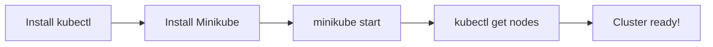
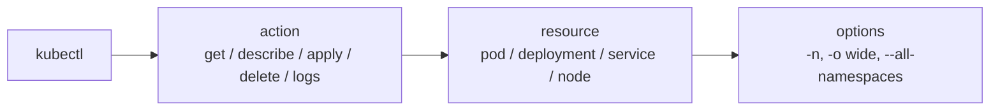

# Day 03 - Setting Up Kubernetes (Minikube + kubectl)

> **Goal:** Install `kubectl` and Minikube on your machine (Windows / Mac / Linux), start your very first single-node cluster, and confirm it works.

---

## Learning Objectives

By the end of this lesson, you will be able to:

- Explain why we use Minikube instead of a real multi-server cluster for learning
- Install `kubectl` and Minikube on Windows, macOS, or Linux
- Start a local cluster with `minikube start`
- Verify the cluster with `kubectl version --client`, `kubectl get nodes`, and friends
- Recognize and fix the most common setup errors

---

## Real-World Analogy: A Flight Simulator

You don't learn to fly on a real Boeing 747 full of passengers.

You start in a **flight simulator** - same cockpit, same controls, zero risk. Minikube is the flight simulator for Kubernetes: it runs a **complete, real cluster on your laptop** so you can practice every command safely before touching production.

---

## Why Can't We Just Install Kubernetes Directly?

Kubernetes is designed to run across **multiple servers** (a cluster). For learning, we don't need a fleet of machines - we use tools that simulate a cluster locally.

| Tool | What It Does | Best For |
|------|--------------|----------|
| **Minikube** | Creates a single-node K8s cluster in a VM/container | Learning, local development |
| **kind** | Runs K8s inside Docker containers | CI/CD testing |
| **kubeadm** | Sets up a real multi-node cluster | Production-like setup |
| **Managed K8s** | AWS EKS, Azure AKS, Google GKE | Real production |

We'll use **Minikube** - the easiest on-ramp for beginners.



---

## Step 1: Install kubectl (the K8s CLI Tool)

`kubectl` is the command-line tool you use to talk to Kubernetes. You'll use it every single day.

> **Pro tip:** Keep your `kubectl` version within **one minor version** of your cluster (e.g. cluster 1.31 -> kubectl 1.30/1.31/1.32). The commands below pin to a recent stable release - check <https://kubernetes.io/releases/> for the latest.

### On Windows

```powershell
# Option A: using Chocolatey (run PowerShell as Administrator)
choco install kubernetes-cli

# Option B: using winget
winget install -e --id Kubernetes.kubectl

# Option C: download the binary directly, then move kubectl.exe into a folder on your PATH
curl.exe -LO "https://dl.k8s.io/release/v1.31.0/bin/windows/amd64/kubectl.exe"
```

### On macOS

```bash
# Using Homebrew (works on Intel and Apple Silicon)
brew install kubectl
```

### On Linux

```bash
# Download the latest stable kubectl, make it executable, and install it
curl -LO "https://dl.k8s.io/release/$(curl -L -s https://dl.k8s.io/release/stable.txt)/bin/linux/amd64/kubectl"
chmod +x kubectl
sudo mv kubectl /usr/local/bin/
```

### Verify the install

```bash
kubectl version --client
```

- `kubectl version --client` prints the kubectl version **without needing a running cluster** (the `--client` flag is what makes it safe to run before setup). If you see a version number, kubectl is installed correctly.

---

## Step 2: Install Minikube

### On Windows

```powershell
# Option A: Chocolatey
choco install minikube

# Option B: winget
winget install -e --id Kubernetes.minikube

# Or download the installer from https://minikube.sigs.k8s.io/docs/start/
```

### On macOS

```bash
brew install minikube
```

### On Linux

```bash
curl -LO https://storage.googleapis.com/minikube/releases/latest/minikube-linux-amd64
sudo install minikube-linux-amd64 /usr/local/bin/minikube
```

### Prerequisites: Pick a Driver

Minikube needs a **driver** to create the VM/container that holds your cluster:

- **Docker** (recommended, cross-platform) - install Docker Desktop (Win/Mac) or Docker Engine (Linux)
- **VirtualBox** - works everywhere, a bit heavier
- **Hyper-V** (Windows Pro/Enterprise) - enable it in "Windows Features"

> Docker is the smoothest choice on all three operating systems. Make sure Docker is **running** before the next step.

---

## Step 3: Start Your First Cluster!

```bash
# Start Minikube using the Docker driver (recommended)
minikube start --driver=docker

# Or request specific resources (handy on bigger machines)
minikube start --driver=docker --cpus=2 --memory=4096
```

- `minikube start` downloads the cluster image and boots a **single-node Kubernetes cluster**, then automatically points `kubectl` at it.
- `--driver=docker` tells Minikube to run the cluster inside a Docker container.
- `--cpus` / `--memory` reserve resources for the cluster (memory is in MB).

**Expected output (versions will differ):**

```
  minikube v1.34.0 on Windows 11
  Using the docker driver based on user configuration
  Starting "minikube" primary control-plane node in "minikube" cluster
  Creating docker container (CPUs=2, Memory=4096MB) ...
  Preparing Kubernetes v1.31.0 on Docker ...
  Verifying Kubernetes components...
  Enabled addons: storage-provisioner, default-storageclass
  Done! kubectl is now configured to use "minikube" cluster
```

---

## Step 4: Verify Everything Works

Run these one at a time:

```bash
# 1. Is the cluster up and healthy?
minikube status

# 2. Can kubectl reach the cluster's control plane?
kubectl cluster-info

# 3. List the cluster's node(s) - should show one node, "Ready"
kubectl get nodes

# 4. See the control plane components running as system pods
kubectl get pods -n kube-system
```

**What each command does:**
- `minikube status` - reports whether the host, kubelet, and API server are running.
- `kubectl cluster-info` - shows the addresses of the control plane; confirms kubectl is talking to the cluster.
- `kubectl get nodes` - lists every machine in the cluster. For Minikube you'll see exactly one.
- `kubectl get pods -n kube-system` - the `-n kube-system` flag looks in the system namespace where K8s' own components live.

**Expected output for `kubectl get nodes`:**

```
NAME       STATUS   ROLES           AGE   VERSION
minikube   Ready    control-plane   5m    v1.31.0
```

**Expected output for `kubectl get pods -n kube-system`:**

```
NAME                               READY   STATUS    RESTARTS   AGE
coredns-xxxxxxxxxx-xxxxx           1/1     Running   0          5m
etcd-minikube                      1/1     Running   0          5m
kube-apiserver-minikube            1/1     Running   0          5m
kube-controller-manager-minikube   1/1     Running   0          5m
kube-proxy-xxxxx                   1/1     Running   0          5m
kube-scheduler-minikube            1/1     Running   0          5m
storage-provisioner                1/1     Running   0          5m
```

> **Look familiar?** Every control plane component from **Day 02** is right there running as a pod - API server, etcd, controller manager, scheduler, and kube-proxy!

---

## Step 5: Handy Minikube Commands

```bash
minikube stop        # Stop the cluster (frees CPU/RAM, keeps your work)
minikube start       # Start it again later
minikube delete      # Delete the cluster completely (fresh start)
minikube dashboard   # Open the Kubernetes web UI in your browser
minikube ip          # Show the cluster's IP address
minikube ssh         # Open a shell inside the Minikube node
```

---

## Understanding the kubectl Command Structure



```
kubectl  <action>  <resource>  <options>
```

### Examples

```bash
kubectl get pods                    # List pods in the current namespace
kubectl get pods -n kube-system     # List pods in the kube-system namespace
kubectl get pods -o wide            # List pods with extra detail (node, IP)
kubectl get all                     # List the common resources at once
kubectl describe pod <name>         # Detailed info + events for one pod
kubectl logs <pod-name>             # Print a pod's logs
kubectl delete pod <pod-name>       # Delete a pod
```

---

## Common Mistakes

1. **Forgetting `--client` before the cluster exists.** Running plain `kubectl version` tries to reach a cluster and may hang/error. Use `kubectl version --client` to check the install first.
2. **Docker not running.** With the Docker driver, `minikube start` fails if Docker Desktop/Engine isn't started. Start Docker, then retry.
3. **Allocating too little memory.** Defaults can be tight on small laptops. If startup fails on memory, try `minikube start --memory=2048`.
4. **"kubectl connection refused" / "did you specify the right host?"** Usually means no cluster is running - run `minikube start` first.
5. **Version skew.** A `kubectl` that's far ahead of or behind the cluster can behave oddly. Keep them within one minor version.

---

## Quick Self-Check

1. Why do we use Minikube instead of setting up several real servers?
2. Which command verifies kubectl is installed **without** needing a running cluster?
3. What does the `--driver=docker` flag tell `minikube start` to do?
4. How many nodes does a default Minikube cluster have, and what command confirms it?
5. You see "connection refused" from kubectl. What's the most likely cause and fix?

---

## Summary

- **Minikube** runs a real, single-node Kubernetes cluster on your laptop - a safe "flight simulator" for learning.
- Install **kubectl** first (verify with `kubectl version --client`), then **Minikube**, choosing a driver (Docker recommended).
- `minikube start` boots the cluster and points kubectl at it; `kubectl get nodes` confirms it's `Ready`.
- `kubectl get pods -n kube-system` reveals the Day 02 control plane components running for real.

**Next up ->** [Day 04 - Pods](../day04-pods/notes.md)

---

*This is part of the [Learn Kubernetes](../README.md) series.*
