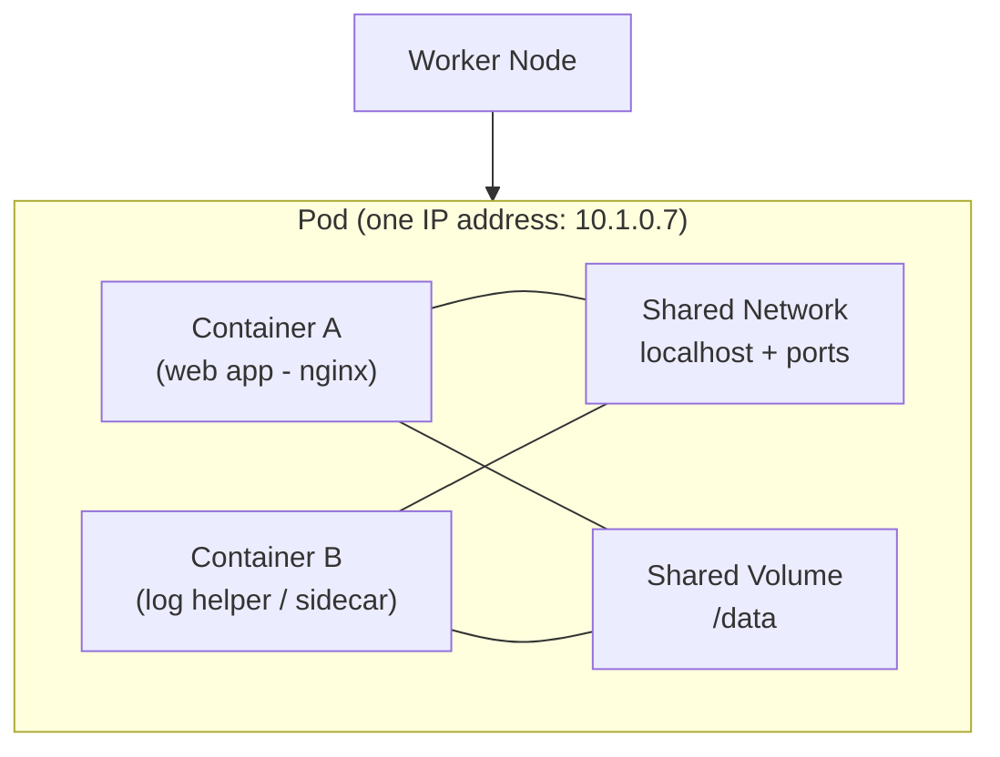

# Day 04 - Kubernetes Pods

> **Goal:** Understand what a Pod is, why it is the smallest deployable unit in Kubernetes, and how to create, inspect, and delete one.

> **Related deep dive:** a Pod can hold more than one container. For **init containers** (ordered setup before your app starts) and **sidecar containers** (helpers that run alongside it), see [Init and Sidecar Containers](init-and-sidecar-containers.md).

---

## Learning Objectives

By the end of this lesson you will be able to:

- Explain what a **Pod** is in plain language.
- Describe how containers inside a Pod **share networking and storage**.
- Write a simple Pod **YAML manifest** and read every line.
- Use `kubectl` to **create, inspect, exec into, and delete** Pods.
- Understand the **Pod lifecycle** and why bare Pods do **not** self-heal.

---

## Real-World Analogy (read this first!)

Imagine a **shared apartment** .

- The **apartment** is the **Pod**.
- The **roommates** living in it are the **containers**.
- They all share the **same front door and address** (the network - one IP for the whole Pod).
- They share the **same kitchen and fridge** (the storage - shared volumes).
- If the building is demolished, **everyone moves out together** (containers in a Pod live and die together).

So a Pod is not a single program - it is a **shared living space** where one or more closely-cooperating containers run side by side.

> In real life, **most Pods have exactly one container**. Multiple containers are only used when two programs must work as one tight team (for example, an app + a small "helper" that ships its logs).

---

## What Is a Pod?

A **Pod** is the **smallest deployable unit** in Kubernetes. It's a wrapper around one or more containers.

> **You don't deploy containers directly in K8s. You deploy Pods.**

### Diagram: Containers sharing one Pod's network & volume



### Why Not Just Use Containers?

| Without Pods (Docker) | With Pods (K8s) |
|----------------------|-----------------|
| Each container has its own IP | All containers in a pod share one IP |
| Networking between containers is manual | Containers in same pod talk via `localhost` |
| No health monitoring | K8s monitors and restarts unhealthy containers |
| No scheduling | K8s decides which server runs the pod |

---

## One Container Per Pod (The Standard Way)

In 90% of cases, **one pod = one container**. This is the recommended pattern.

```
┌── Pod ──┐
│ ┌─────┐ │
│ │nginx│ │
│ └─────┘ │
└─────────┘
```

## Multi-Container Pod (Advanced - Sidecar Pattern)

Sometimes you need helper containers alongside your main app:

```
┌────── Pod ──────┐
│ ┌─────┐ ┌─────┐ │
│ │nginx│ │ log  │ │  <- log collector sidecar
│ │     │ │agent │ │
│ └─────┘ └─────┘ │
│   shared network │
│   shared storage │
└──────────────────┘
```

Don't worry about multi-container pods for now. We'll keep it simple.

---

## Creating Your First Pod

### Method 1: Imperative Command (Quick, for testing)

```bash
# Create a pod running nginx
kubectl run mynginx --image=nginx:1.25

# Verify it's running
kubectl get pods
```

### Method 2: Declarative YAML (Recommended for real work)

Create a file called `pod.yaml`:

```yaml
apiVersion: v1            # Pods are a "core" object -> version is just v1
kind: Pod                 # What type of resource we're creating
metadata:
  name: mynginx           # Name of the pod (must be unique in the namespace)
  labels:
    app: web              # A label = a sticky note used to find this Pod later
spec:
  containers:             # The list of containers inside this pod
  - name: nginx-container # Name of the container (for identification)
    image: nginx:1.25     # The image to run (pinned version - avoid :latest)
    ports:
      - containerPort: 80 # The port the app listens on inside the pod
```

**Let's break down every line:**

| Line | Meaning |
|------|---------|
| `apiVersion: v1` | Which K8s API to use. Pods use core `v1` (**not** `apps/v1`) |
| `kind: Pod` | What type of resource we're creating |
| `metadata.name` | Name of the pod (must be unique) |
| `metadata.labels` | Key-value tags for organizing/selecting pods |
| `spec.containers` | List of containers to run in this pod |
| `name: nginx-container` | Name of the container (for identification) |
| `image: nginx:1.25` | Docker image to use |
| `ports.containerPort` | Port the container listens on |

```bash
# Create the pod from YAML  -> "Make the cluster match this file"
kubectl apply -f pod.yaml

# Check if it's running
kubectl get pods
```

**Expected output:**
```
NAME      READY   STATUS    RESTARTS   AGE
mynginx   1/1     Running   0          30s
```

---

## Pod Lifecycle

A pod goes through these states:

```
Pending -> ContainerCreating -> Running -> Succeeded/Failed
                                          |
                                          +-> CrashLoopBackOff (if container keeps crashing)
```

| State | Meaning |
|-------|---------|
| **Pending** | Pod accepted but image not pulled / not scheduled yet |
| **ContainerCreating** | Image is being pulled and container is starting |
| **Running** | Container is running and healthy |
| **Succeeded** | Container finished its job (for Jobs) |
| **Failed** | Container exited with an error |
| **CrashLoopBackOff** | Container crashes repeatedly, K8s waits before retrying |

---

## Essential Pod Commands

```bash
# List all pods (and their status)
kubectl get pods

# List pods with more details (IP, Node)
kubectl get pods -o wide

# Detailed information + recent events (great for debugging)
kubectl describe pod mynginx

# View pod logs
kubectl logs mynginx

# Follow logs in real-time
kubectl logs -f mynginx

# Execute a command inside the pod
kubectl exec mynginx -- ls /usr/share/nginx/html

# Get an interactive shell inside the pod
kubectl exec -it mynginx -- /bin/bash

# Delete a pod
kubectl delete pod mynginx

# Delete pod using YAML file
kubectl delete -f pod.yaml
```

| Command | Plain English |
|---|---|
| `kubectl apply -f pod.yaml` | "Make the cluster match this file." |
| `kubectl get pods` | "Show me my Pods and whether they're healthy." |
| `kubectl describe pod ...` | "Tell me everything, including what went wrong." |
| `kubectl logs ...` | "Show me what the app printed." |
| `kubectl exec -it ... -- /bin/bash` | "Let me step inside the container." |
| `kubectl delete pod ...` | "Remove this Pod." |

---

## Let's Experiment! (Very Important)

### Experiment 1: See self-healing (Spoiler: Pods DON'T self-heal!)

```bash
# Create a pod
kubectl run testpod --image=nginx:1.25

# Delete it
kubectl delete pod testpod

# Check - it's gone forever!
kubectl get pods
# No pods! Pods alone do NOT restart.
```

**This is why we need ReplicaSets and Deployments (Day 05 & 06).**

### Experiment 2: Access your app

```bash
# Forward pod port to your laptop
kubectl port-forward mynginx 8080:80

# Now open browser: http://localhost:8080
# You'll see the nginx welcome page!
# Press Ctrl+C to stop port-forwarding
```

### Experiment 3: Look inside the pod

```bash
# Get a shell inside the container
kubectl exec -it mynginx -- /bin/bash

# Inside the container:
cat /usr/share/nginx/html/index.html
hostname
exit
```

---

## Pod YAML with More Options

```yaml
apiVersion: v1
kind: Pod
metadata:
  name: myapp
  labels:
    app: web
    environment: dev
spec:
  containers:
  - name: myapp-container
    image: nginx:1.25
    ports:
      - containerPort: 80
    resources:
      requests:              # Minimum resources the container needs
        memory: "64Mi"
        cpu: "250m"
      limits:                # Maximum resources the container can use
        memory: "128Mi"
        cpu: "500m"
    env:                     # Environment variables passed to the container
      - name: APP_ENV
        value: "development"
```

**New fields explained:**
- `resources.requests` - Minimum resources the container needs.
- `resources.limits` - Maximum resources the container can use.
- `env` - Environment variables passed to the container.
- `250m` CPU = 0.25 CPU cores.

---

## Common Mistakes

1. **Treating a Pod like a long-lived server.** A bare Pod is **not self-healing**. If it (or its node) dies, **nothing brings it back**. Use a ReplicaSet/Deployment for that (Day 05 - 06).
2. **Using the `latest` tag.** `image: nginx` silently means `nginx:latest`, which can change under you. **Always pin a version** like `nginx:1.25`.
3. **Wrong `apiVersion`.** Pods are core objects -> use `apiVersion: v1`, **not** `apps/v1`.
4. **Putting unrelated apps in one Pod.** Two containers in a Pod share a fate and a node. Only co-locate things that truly belong together (e.g. app + sidecar).
5. **Broken YAML indentation.** YAML is whitespace-sensitive - list items under `containers:` use 2-space indentation and a `-` for each entry.

---

## Quick Self-Check

1. What is the **smallest deployable unit** in Kubernetes?
2. How many **IP addresses** does a Pod with two containers have?
3. What `apiVersion` do you use for a Pod?
4. Which command shows the **events** that explain why a Pod is stuck in `Pending`?
5. If you delete a bare Pod, does Kubernetes recreate it? Why / why not?

<details>
<summary>Answers</summary>

1. A **Pod**.
2. **One** - containers in a Pod share a single network namespace/IP.
3. `apiVersion: v1`.
4. `kubectl describe pod <name>` (read the Events section).
5. **No.** A bare Pod is not managed by a controller, so nothing recreates it - that's the job of a ReplicaSet/Deployment.

</details>

---

## Summary

1. **Pod = smallest unit** in Kubernetes (wraps containers).
2. Containers in a Pod **share one IP and can share volumes**, and they **live and die together**.
3. **Usually 1 container per pod**; multi-container pods are for tight helpers (sidecars).
4. Use `apiVersion: v1` for Pods.
5. **Pods are temporary** - they don't restart themselves -> we need ReplicaSets/Deployments.

**Next up -> [Day 05 - ReplicaSets](../day05-replicasets/notes.md):** how Kubernetes keeps the right number of Pods alive automatically.

---

**Previous:** [<- Day 03 - Setup](../day03-setup/notes.md)
**Next:** [Day 05 - ReplicaSets ->](../day05-replicasets/notes.md)
