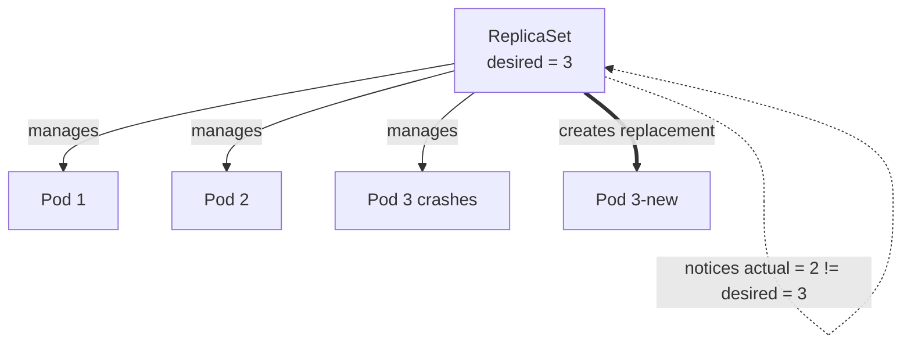
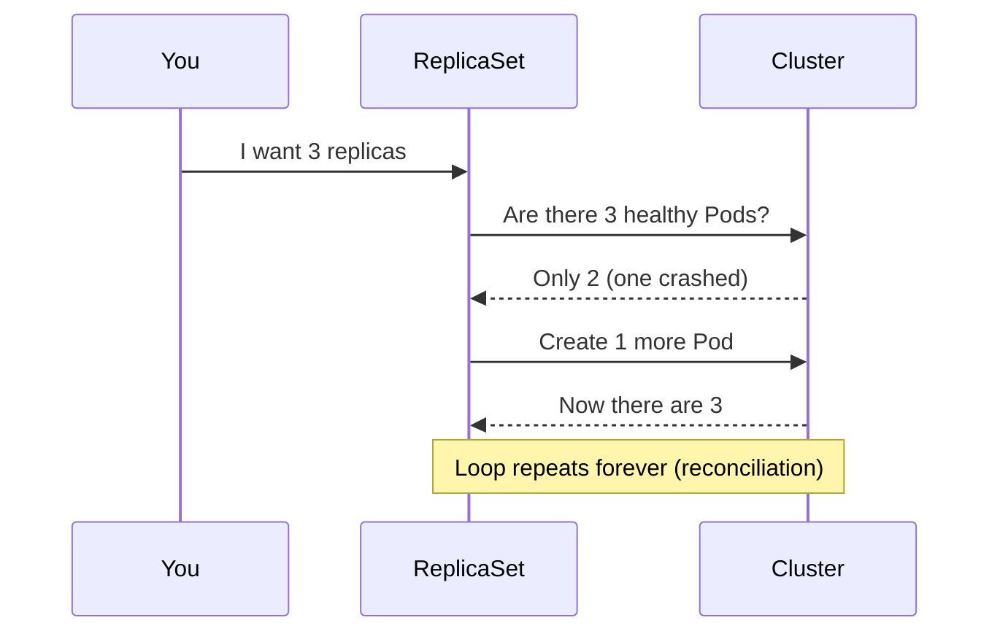

# Day 05 - Kubernetes ReplicaSets

> **Goal:** Understand how a ReplicaSet keeps a desired number of identical Pods running and automatically replaces any that fail (self-healing).

---

## Learning Objectives

By the end of this lesson you will be able to:

- Explain what a **ReplicaSet** does in plain language.
- Understand **desired state vs. actual state** and the reconciliation loop.
- See how Kubernetes performs **self-healing**.
- Write a valid ReplicaSet **YAML manifest** with **matching labels**.
- Use `kubectl` to **scale** and **inspect** ReplicaSets.

---

## Real-World Analogy (read this first!)

Think of a **busy coffee shop** with a manager.

- The manager has a rule: **"There must always be 3 baristas on the floor."**
- That rule is the **desired state** (3 replicas).
- The baristas actually working right now are the **actual state**.
- If one barista goes home sick , the manager **immediately calls in a replacement** so the count returns to 3.
- If someone accidentally hires a 4th, the manager **sends one home**.

A **ReplicaSet** is that manager. Its only job: **keep the number of identical Pods equal to the number you asked for** - no more, no less.

---

## Why Do We Need ReplicaSets?

Remember from Day 04: **when a Pod dies, it stays dead.** Nobody brings it back.

In the real world, you need:
- **Multiple copies** of your app (for handling more traffic).
- **Self-healing** (if a pod crashes, someone should create a new one).

That "someone" is the **ReplicaSet**.

---

## What Is a ReplicaSet?

A **ReplicaSet** ensures that a **specified number of pod replicas** are running at any given time. It works through a constant loop:

1. **Read** the desired replica count (e.g. `3`).
2. **Count** how many matching Pods actually exist.
3. **Reconcile**: create Pods if there are too few, delete Pods if there are too many.

This **reconciliation loop** is what gives Kubernetes its **self-healing** superpower.

| Situation | What ReplicaSet Does |
|-----------|---------------------|
| You say `replicas: 3` | Creates 3 identical pods |
| A pod crashes | Creates a new pod to replace it (self-healing!) |
| You have 4 pods but want 3 | Terminates 1 extra pod |
| A worker node dies | Creates replacement pods on other nodes |

### Diagram: Desired vs Actual + Self-Healing





---

## ReplicaSet YAML

```yaml
apiVersion: apps/v1          # ReplicaSets live in the "apps" API group (NOT v1)
kind: ReplicaSet
metadata:
  name: test-rs             # Name of the ReplicaSet
spec:
  replicas: 3                # Desired state: keep 3 Pods running
  selector:
    matchLabels:
      app: web              # The ReplicaSet "adopts" Pods with this label
  template:                  # Blueprint for each Pod it creates
    metadata:
      labels:
        app: web            # MUST match spec.selector.matchLabels above
    spec:
      containers:
      - name: nginx
        image: nginx:1.25   # Pinned version (avoid :latest)
```

### Breaking Down the YAML

```
spec:
  replicas: 3              <- "I want 3 pods running"

  selector:                <- "How to FIND my pods"
    matchLabels:
      app: web             <- "Look for pods with label app=web"

  template:                <- "Blueprint for creating new pods"
    metadata:
      labels:
        app: web           <- "Give new pods this label" (MUST match selector!)
    spec:
      containers:          <- "What container to run in each pod"
      - name: nginx
        image: nginx:1.25
```

> **Critical rule:** `spec.selector.matchLabels` **must match** `spec.template.metadata.labels`. Otherwise the API server rejects the manifest with `selector does not match template labels`. Here both are `app: web` .

---

## How the Selector Works

```
ReplicaSet selector: app=web
        │
        ├── Finds Pod with label app=web   (this is mine)
        ├── Finds Pod with label app=web   (this is mine)
        ├── Finds Pod with label app=api   (not mine, ignore)
        +-- Only 2 pods found, want 3 -> creates 1 more!
```

---

## Hands-On: Let's See Self-Healing

```bash
# Step 1: Create the ReplicaSet
kubectl apply -f replicaset.yaml

# Step 2: See 3 pods running
kubectl get pods
# NAME             READY   STATUS    RESTARTS   AGE
# test-rs-abc12    1/1     Running   0          10s
# test-rs-def34    1/1     Running   0          10s
# test-rs-ghi56    1/1     Running   0          10s

# Step 3: Delete one pod (simulate a crash)
kubectl delete pod test-rs-abc12

# Step 4: Immediately check again
kubectl get pods
# NAME             READY   STATUS    RESTARTS   AGE
# test-rs-xyz99    1/1     Running   0          2s   <- NEW pod created!
# test-rs-def34    1/1     Running   0          60s
# test-rs-ghi56    1/1     Running   0          60s

# The ReplicaSet detected: "I need 3 pods, but only 2 exist"
# So it immediately created a new one!
```

---

## Scaling Up and Down

```bash
# Scale up to 5 replicas (change the desired state on the fly)
kubectl scale rs test-rs --replicas=5

# Check - you'll see 5 pods
kubectl get pods

# Scale down to 2 replicas
kubectl scale rs test-rs --replicas=2

# Check - extra pods are terminated
kubectl get pods
```

---

## Useful ReplicaSet Commands

```bash
# List all ReplicaSets -> shows DESIRED, CURRENT, READY counts
kubectl get rs

# Describe a ReplicaSet (full details + events)
kubectl describe rs test-rs

# See which pods belong to a ReplicaSet
kubectl get pods --show-labels

# Delete a ReplicaSet (also deletes its pods)
kubectl delete rs test-rs

# Delete ReplicaSet but keep pods running (orphan them)
kubectl delete rs test-rs --cascade=orphan
```

| Command | Plain English |
|---|---|
| `kubectl get rs` | "Show desired vs. current vs. ready Pod counts." |
| `kubectl delete pod <name>` | "Kill one Pod" -> ReplicaSet quietly recreates it. |
| `kubectl scale rs ... --replicas=5` | "Change the rule to 5 Pods." |
| `kubectl delete rs test-rs` | "Remove the manager **and** its Pods." |

---

## The Problem with ReplicaSets (Why We Need Deployments)

ReplicaSets are great for self-healing and scaling, BUT they have a major limitation.

### What Happens When You Want to Update Your App?

```
Current: nginx:1.25  ->  Want: nginx:1.27
```

If you change the image in the ReplicaSet YAML and re-apply, **the existing pods DON'T get updated** - only NEW pods will use the new image. To update, you'd have to manually delete old pods one by one. That's:

- Error-prone
- Causes downtime
- Not scalable

**This is exactly why we need Deployments (Day 06)!**

---

## ReplicaSet vs Pod (Comparison)

| Feature | Pod Alone | Pod with ReplicaSet |
|---------|-----------|-------------------|
| Self-healing | No | Yes |
| Multiple copies | No (manual) | Yes (automatic) |
| Scaling | Manual | `kubectl scale` |
| Rolling updates | No | No (use Deployment) |
| When to use | Testing only | Rarely directly (use Deployment) |

---

## Common Mistakes

1. **Mismatched labels.** If `selector.matchLabels` does not equal `template.metadata.labels`, Kubernetes rejects the manifest (`selector does not match template labels`).
2. **Using `apiVersion: v1`.** ReplicaSets need `apiVersion: apps/v1` (that core `v1` is for Pods).
3. **Deleting Pods and expecting them gone.** The ReplicaSet just **recreates** them. To remove them, delete or scale the ReplicaSet itself.
4. **Overlapping selectors.** Two ReplicaSets with the same selector will fight over the same Pods. Keep label sets unique per workload.
5. **Expecting an image change to update running pods.** Editing the template image does **not** restart existing pods - only newly created ones get it. Use a Deployment for rolling updates.

---

## Quick Self-Check

1. What is the **one job** of a ReplicaSet?
2. What does "**desired state vs. actual state**" mean?
3. Which two fields in the YAML **must match**?
4. What `apiVersion` does a ReplicaSet use?
5. If you delete a Pod managed by a ReplicaSet, what happens?

<details>
<summary>Answers</summary>

1. Keep a **specified number of identical Pods** running at all times.
2. Desired = the count you asked for; actual = how many are really running. Kubernetes reconciles actual -> desired.
3. `spec.selector.matchLabels` and `spec.template.metadata.labels`.
4. `apiVersion: apps/v1`.
5. The ReplicaSet **creates a replacement** automatically (self-healing).

</details>

---

## Summary

1. **ReplicaSet** = ensures a desired number of pods are always running (the "shop manager").
2. **Self-healing** = if a pod dies, the ReplicaSet creates a replacement via its reconciliation loop.
3. **Selector + Labels** = how a ReplicaSet finds its pods (**they must match the template labels**).
4. **Template** = the blueprint used to create new pods.
5. **Limitation** = can't do rolling updates -> use Deployments instead.
6. In practice, **you rarely create ReplicaSets directly** -> Deployments create them for you. Use `apiVersion: apps/v1`.

**Next up -> [Day 06 - Deployments](../day06-deployments/notes.md):** rolling updates, rollbacks, and zero-downtime releases.

---

**Previous:** [<- Day 04 - Pods](../day04-pods/notes.md)
**Next:** [Day 06 - Deployments ->](../day06-deployments/notes.md)
