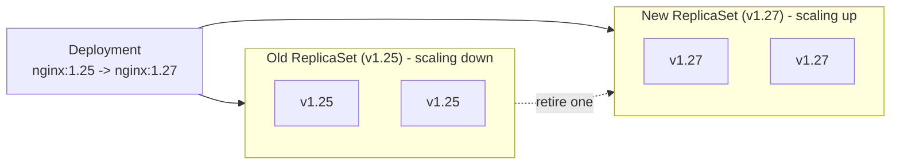
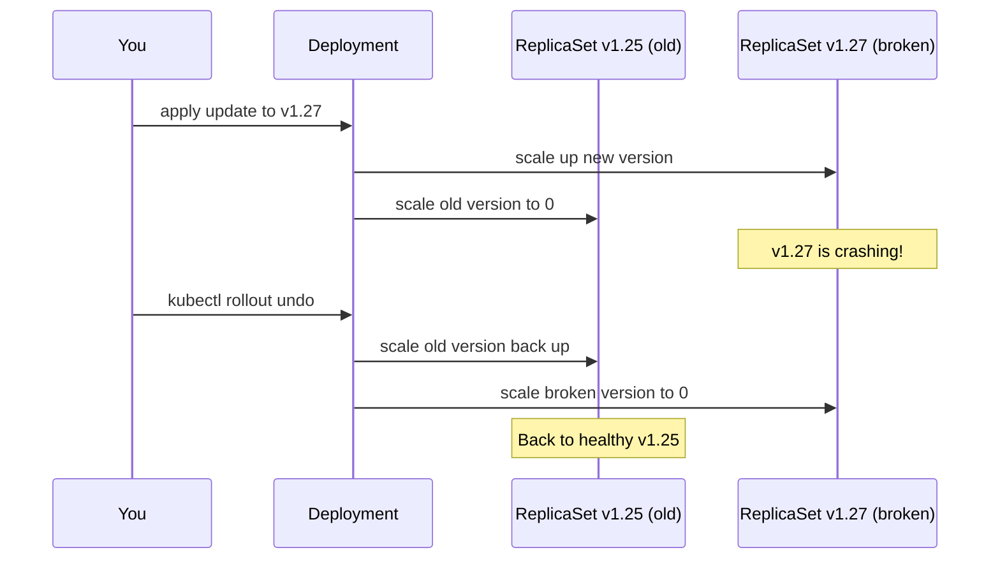

# Day 06 - Kubernetes Deployments

> **Goal:** Understand how a Deployment manages ReplicaSets to roll out new versions with zero downtime and roll back safely when something breaks.

---

## Learning Objectives

By the end of this lesson you will be able to:

- Explain what a **Deployment** is and how it relates to ReplicaSets and Pods.
- Perform a **rolling update** (old version -> new version with no downtime).
- Check rollout **status** and **history**.
- **Roll back** to a previous version when an update goes wrong.
- Write a valid Deployment **YAML manifest** and tune its update strategy.

---

## Real-World Analogy (read this first!)

Imagine **changing the tyres on a car that is still moving** without ever bringing it to a stop.

- You don't stop the car and swap all four tyres at once (that would be downtime - the car is parked and useless).
- Instead, you replace **one tyre at a time**: fit a new tyre, confirm the car still drives fine, then take the old one off - and repeat.
- The car **keeps driving the entire time**. That is a **rolling update**.
- If a new tyre turns out to be faulty, you **put the old reliable tyre back on** - that is a **rollback**.

A **Deployment** is the pit crew running this process: it gradually swaps old Pods for new ones, and can instantly reverse course if something goes wrong.

---

## Why Do We Need Deployments?

From Day 05, we learned that ReplicaSets can maintain a desired number of pods (self-healing) and scale up/down. But ReplicaSets **cannot** do rolling updates - when you change the image version, existing pods don't get updated.

**Deployment = ReplicaSet + Rolling Updates + Rollbacks**

> **In the real world, you almost ALWAYS use Deployments. Never create Pods or ReplicaSets directly.**

---

## The Hierarchy

A **Deployment** is a higher-level object that **manages ReplicaSets for you**:

```
Deployment  (you create this)
    │
    +-- creates -> ReplicaSet  (automatically managed)
                      |
                      +-- creates -> Pods  (automatically managed)
```

You only interact with the Deployment. K8s handles the rest.

### Diagram: Rolling Update (old -> new)



---

## Deployment YAML

```yaml
apiVersion: apps/v1          # Deployments live in the "apps" API group
kind: Deployment
metadata:
  name: web-deploy
spec:
  replicas: 3                # Desired number of Pods
  selector:
    matchLabels:
      app: web              # Must match the template labels below
  template:
    metadata:
      labels:
        app: web            # MUST match spec.selector.matchLabels
    spec:
      containers:
      - name: nginx
        image: nginx:1.25   # Pinned version (we'll upgrade this later)
```

> Same golden rule as ReplicaSets: `spec.selector.matchLabels` **must equal** `spec.template.metadata.labels` (both are `app: web` here ).

**Notice:** The YAML looks almost identical to a ReplicaSet. The only difference is `kind: Deployment` instead of `kind: ReplicaSet`.

---

## Creating a Deployment

```bash
# Method 1: Using YAML (recommended)
kubectl apply -f deployment.yaml

# Method 2: Imperative command (quick testing)
kubectl create deployment web-deploy --image=nginx:1.25 --replicas=3
```

### Verify

```bash
# See the deployment (READY / UP-TO-DATE / AVAILABLE)
kubectl get deployments
# NAME          READY   UP-TO-DATE   AVAILABLE   AGE
# web-deploy    3/3     3            3           30s

# See the ReplicaSet it created
kubectl get rs
# NAME                    DESIRED   CURRENT   READY   AGE
# web-deploy-7f8b9c6d5f   3         3         3       30s

# See the pods it created
kubectl get pods
# NAME                          READY   STATUS    RESTARTS   AGE
# web-deploy-7f8b9c6d5f-abc12   1/1     Running   0          30s
```

**Notice the naming pattern:**
```
web-deploy  -  7f8b9c6d5f  -  abc12
Deployment     ReplicaSet     Pod
   name          hash         random
```

---

## Rolling Updates (The Killer Feature)

This is WHY you use Deployments. Let's update nginx from `1.25` to `1.27`.

### Method 1: Edit the YAML and apply

```yaml
# Change image in deployment.yaml
image: nginx:1.27  # was nginx:1.25
```

```bash
kubectl apply -f deployment.yaml
```

### Method 2: Command line

```bash
kubectl set image deployment/web-deploy nginx=nginx:1.27
```

> The container name (`nginx=`) must match `spec.template.spec.containers[].name` in your manifest.

### What Happens During a Rolling Update

```
Step 1: Current state (3 pods with v1.25)
┌─────────┐ ┌─────────┐ ┌─────────┐
│ v1.25   │ │ v1.25   │ │ v1.25   │
└─────────┘ └─────────┘ └─────────┘

Step 2: New pod created with v1.27, old pod terminated
┌─────────┐ ┌─────────┐ ┌─────────┐
│ v1.27  │ │ v1.25   │ │ v1.25   │
└─────────┘ └─────────┘ └─────────┘

Step 3: Another new pod, another old pod removed
┌─────────┐ ┌─────────┐ ┌─────────┐
│ v1.27  │ │ v1.27  │ │ v1.25   │
└─────────┘ └─────────┘ └─────────┘

Step 4: All updated! Zero downtime!
┌─────────┐ ┌─────────┐ ┌─────────┐
│ v1.27  │ │ v1.27  │ │ v1.27  │
└─────────┘ └─────────┘ └─────────┘
```

**Zero downtime!** At no point were all pods down at the same time.

### Watch it happen in real-time

```bash
# In terminal 1: watch the rollout ("Is the update finished and healthy?")
kubectl rollout status deployment/web-deploy

# In terminal 2: watch pods
kubectl get pods -w
```

---

## Rollback (Undo a Bad Deployment)

Deployed a buggy version? No problem!

```bash
# See past revisions ("Show me the list of past versions")
kubectl rollout history deployment/web-deploy

# Inspect what a specific revision contained
kubectl rollout history deployment/web-deploy --revision=2

# Roll back to the PREVIOUS version ("Go back one version - something broke")
kubectl rollout undo deployment/web-deploy

# Roll back to a SPECIFIC revision ("Go back to a known-good version")
kubectl rollout undo deployment/web-deploy --to-revision=1

# Verify
kubectl rollout status deployment/web-deploy
```

### Diagram: How Rollback Works



K8s keeps old ReplicaSets (scaled to 0 pods) so it can roll back instantly!

> Make history readable: annotate the change cause with
> `kubectl annotate deployment web-deploy kubernetes.io/change-cause="upgrade to nginx 1.27"`.
> (The old `--record` flag is deprecated.)

---

## Rolling Update Strategy Options

```yaml
apiVersion: apps/v1
kind: Deployment
metadata:
  name: web-deploy
spec:
  replicas: 3
  strategy:
    type: RollingUpdate
    rollingUpdate:
      maxUnavailable: 1    # Max pods that can be unavailable during update
      maxSurge: 1          # Max extra pods created during update
  selector:
    matchLabels:
      app: web
  template:
    metadata:
      labels:
        app: web
    spec:
      containers:
      - name: nginx
        image: nginx:1.27
```

| Strategy | Behavior |
|----------|----------|
| `RollingUpdate` (default) | Gradually replace old pods with new (zero downtime) |
| `Recreate` | Kill ALL old pods first, then create new ones (has downtime!) |

| Setting | Meaning |
|---------|---------|
| `maxUnavailable: 1` | At most 1 pod can be down during the update |
| `maxSurge: 1` | At most 1 extra pod can be created during the update |

---

## Scaling & Other Useful Commands

```bash
# Scale to 5 replicas
kubectl scale deployment web-deploy --replicas=5

# List all deployments
kubectl get deployments

# Describe a deployment (full details + events)
kubectl describe deployment web-deploy

# Pause a rollout (useful for canary-style checks)
kubectl rollout pause deployment/web-deploy

# Resume a paused rollout
kubectl rollout resume deployment/web-deploy

# Delete a deployment (also deletes its RS and Pods)
kubectl delete deployment web-deploy
```

| Command | Plain English |
|---|---|
| `kubectl set image deployment/... nginx=nginx:1.27` | "Switch to the new version." |
| `kubectl rollout status ...` | "Is the update finished and healthy?" |
| `kubectl rollout history ...` | "Show me the list of past versions." |
| `kubectl rollout undo ...` | "Go back one version - something broke." |
| `kubectl rollout undo ... --to-revision=1` | "Go back to a specific known-good version." |

---

## Pod vs ReplicaSet vs Deployment

| Feature | Pod | ReplicaSet | Deployment |
|---------|-----|------------|------------|
| Run containers | Yes | Yes | Yes |
| Self-healing | No | Yes | Yes |
| Scaling | No | Yes | Yes |
| Rolling updates | No | No | **Yes** |
| Rollback | No | No | **Yes** |
| Use in production | Never alone | Rarely directly | **Always** |

---

## Common Mistakes

1. **Mismatched labels.** Just like ReplicaSets, `selector.matchLabels` must equal `template.metadata.labels`, or the manifest is rejected.
2. **Wrong `apiVersion`.** Deployments use `apps/v1`. Old tutorials may show `extensions/v1beta1` - that is **removed** in modern Kubernetes.
3. **Expecting rollback to restore data.** `rollout undo` reverts the **Pod template/image**, not your database or persisted data.
4. **Confusing the commands.** `rollout status` (is it done?) vs `rollout history` (list versions) vs `rollout undo` (revert). Don't mix them up.
5. **Editing the ReplicaSet directly.** Always change the **Deployment** - it owns and overwrites its ReplicaSets. Manual ReplicaSet edits get reverted.

---

## Quick Self-Check

1. What does a Deployment **manage** on your behalf?
2. What is a **rolling update**, in one sentence?
3. Which command shows you the **list of past revisions**?
4. Which command **reverts** to the previous version?
5. Why does the Deployment keep the **old ReplicaSet** (scaled to 0) around?

<details>
<summary>Answers</summary>

1. **ReplicaSets** (which in turn manage Pods).
2. Gradually replacing old Pods with new ones so the app stays available (zero downtime).
3. `kubectl rollout history deployment/web-deploy`.
4. `kubectl rollout undo deployment/web-deploy`.
5. So you can **roll back** quickly to that previous version.

</details>

---

## Summary

1. **Always use Deployments** - never create Pods or ReplicaSets directly in production.
2. **Deployment = ReplicaSet + Updates + Rollbacks** (it manages **ReplicaSets -> Pods** for you).
3. **Rolling updates** (`maxUnavailable` / `maxSurge`) give you **zero-downtime** releases.
4. **Rollback** with `kubectl rollout undo` lets you undo bad deployments instantly; K8s keeps old ReplicaSets for this.
5. The YAML is almost identical to a ReplicaSet (just `kind: Deployment`) - use `apiVersion: apps/v1` and keep selector labels matching template labels.

**Next up -> [Day 07 - Services and Networking](../day07-services/notes.md):** how to give your Pods a stable network address and load-balance traffic to them.

---

**Previous:** [<- Day 05 - ReplicaSets](../day05-replicasets/notes.md)
**Next:** [Day 07 - Services and Networking ->](../day07-services/notes.md)
