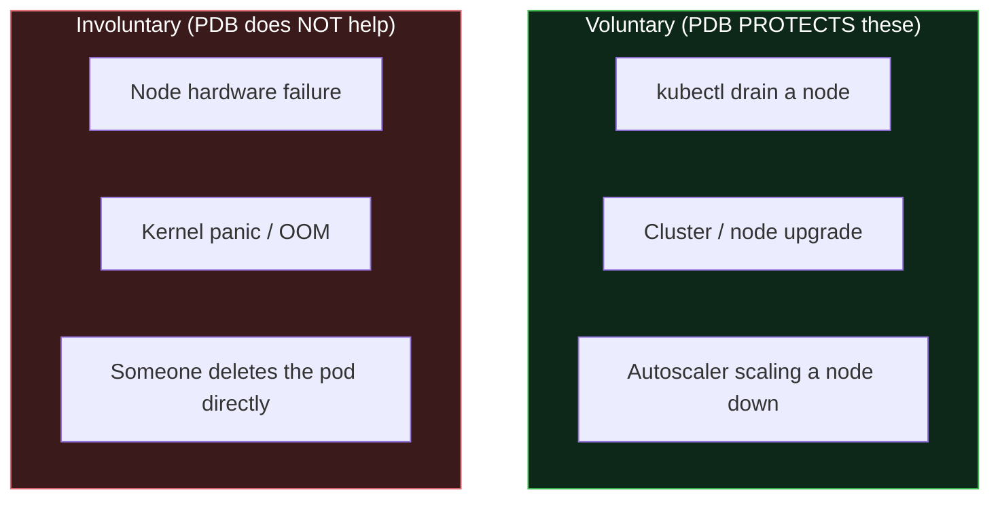
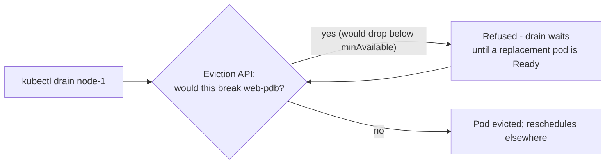

# Day 06 (Deep Dive) - Pod Disruption Budgets (PDB)

> **Companion to [Day 06 - Kubernetes Deployments](notes.md).** A Deployment keeps the *desired* number of replicas running. A **PodDisruptionBudget** protects that availability during **planned disruptions** - node drains, cluster upgrades, and autoscaler scale-downs - so an admin (or a controller) cannot accidentally take down too many of your pods at once.

> **Why this matters:** without a PDB, a `kubectl drain` (or a cluster upgrade, or Karpenter consolidating nodes) can evict **all** replicas of your service at the same moment and cause an outage - even though your Deployment is "healthy." A PDB is how you say "you may take pods, but never leave me with fewer than N."

---

## Voluntary vs Involuntary Disruptions (PDB only guards one)



- **Voluntary disruption** = a deliberate, controlled eviction through the **Eviction API** (`kubectl drain`, upgrades, autoscalers). **This is what a PDB governs.**
- **Involuntary disruption** = something unplanned (a node dies, an OOM kill). A PDB **cannot** prevent these - only replicas + multi-node/AZ spreading help there.

> A PDB is a **guardrail on planned maintenance**, not a shield against crashes.

---

## Defining a PDB

You set **one** of two fields: `minAvailable` or `maxUnavailable` (a number or a percentage), plus a selector matching the pods.

```yaml
apiVersion: policy/v1
kind: PodDisruptionBudget
metadata:
  name: web-pdb
spec:
  minAvailable: 2            # never voluntarily drop below 2 healthy web pods
  selector:
    matchLabels:
      app: web
```

Or express it as a ceiling on how many can be down:

```yaml
spec:
  maxUnavailable: 1          # at most 1 web pod down at a time (good for rolling drains)
  selector:
    matchLabels: { app: web }
```

Percentages work too (`minAvailable: 50%`), rounded up for `minAvailable`.

---

## How It Actually Works

The **Eviction API** checks the PDB before removing a pod. If evicting one more pod would violate the budget, the eviction is **refused**, and the drain **waits** (retries) until enough pods are healthy again elsewhere.



So during a node drain with `minAvailable: 2` on a 3-replica app: Kubernetes evicts one pod, **waits** for its replacement to become `Ready` on another node, and only then evicts the next. The service never drops below 2. Check the budget with:

```bash
kubectl get pdb web-pdb
# NAME      MIN AVAILABLE   MAX UNAVAILABLE   ALLOWED DISRUPTIONS   AGE
# web-pdb   2               N/A               1                     5m
#                                             ^ how many pods may be evicted right now
```

`ALLOWED DISRUPTIONS: 0` means a drain will **block** until more pods are healthy.

---

## PDB vs Deployment Rolling Update (do not confuse them)

This trips people up constantly:

| | Deployment `strategy` (`maxUnavailable`/`maxSurge`) | PodDisruptionBudget |
|---|---|---|
| **Controls** | How the **rollout** replaces pods with a new version | How many pods **evictions/drains** may remove |
| **Triggered by** | `kubectl apply` of a new image/spec | Node drains, upgrades, autoscaler |
| **Object** | Field inside the Deployment | Separate `PodDisruptionBudget` object |

A rolling update is governed by the Deployment strategy; a node drain is governed by the PDB. You often want **both**.

---

## Common Mistakes

1. **`minAvailable` equal to the replica count.** `minAvailable: 3` on a 3-replica app means **no** pod can ever be voluntarily evicted, so **node drains and upgrades hang forever**. Leave headroom (e.g. `minAvailable: 2` of 3, or `maxUnavailable: 1`).
2. **A PDB on a single-replica app.** `minAvailable: 1` with 1 replica blocks every drain. Single-replica workloads cannot be both always-up and drainable - scale to >=2 first.
3. **Expecting a PDB to prevent crashes.** It only governs **voluntary** disruptions. A node failure ignores it.
4. **Selector mismatch.** If the PDB's `selector` does not match the pods' labels, it silently protects nothing.
5. **Forgetting a PDB entirely on critical services.** Then a routine cluster upgrade can evict all replicas at once. Add a PDB to anything that must stay up during maintenance.

---

## Quick Self-Check

1. Which kind of disruption does a PDB protect against - a node hardware failure, or a `kubectl drain`?
2. You set `minAvailable: 3` on a 3-replica Deployment. Why do node drains now hang?
3. What is the difference between a Deployment's `maxUnavailable` and a PDB's `maxUnavailable`?
4. What does `ALLOWED DISRUPTIONS: 0` in `kubectl get pdb` tell you?
5. Why is a PDB pointless on a single-replica app?

<details>
<summary>Answers</summary>

1. A **voluntary** disruption like `kubectl drain` (also upgrades and autoscaler scale-downs). It does **not** protect against involuntary events like a node dying.
2. `minAvailable: 3` means no pod may be voluntarily evicted (that would drop below 3), so the drain can never remove a pod and waits forever. Use `minAvailable: 2` or `maxUnavailable: 1`.
3. Deployment `maxUnavailable` controls **rollouts** (replacing pods for a new version); PDB `maxUnavailable` controls **evictions/drains** (maintenance). Different triggers, different objects.
4. Right now **no** pod may be voluntarily evicted without violating the budget - a drain will block until more pods become healthy.
5. With one replica, any budget that keeps it available also forbids evicting it, so the node can never be drained. You need >=2 replicas.

</details>

---

## Summary

- A **PodDisruptionBudget** caps how many pods **voluntary** disruptions (drains, upgrades, autoscalers) may remove - via `minAvailable` or `maxUnavailable`.
- It works through the **Eviction API**: an eviction that would breach the budget is refused, so a drain **waits** for replacements instead of causing an outage.
- It does **not** protect against involuntary events (node death, OOM) - that is what replicas and spreading are for.
- Do not confuse it with a Deployment's rollout `strategy`; and never set `minAvailable` equal to the replica count, or maintenance will hang.

---

**Back to:** [Day 06 - Kubernetes Deployments](notes.md)
