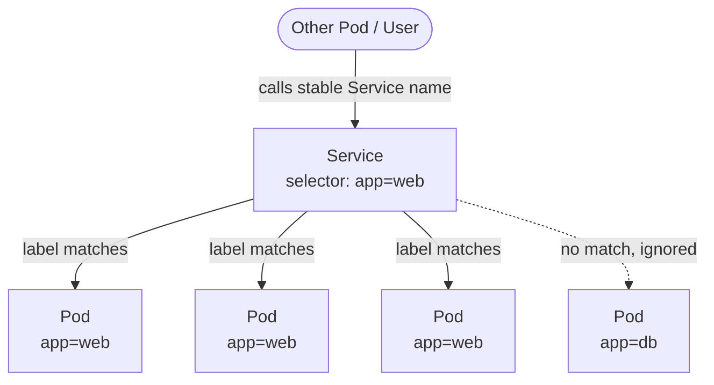
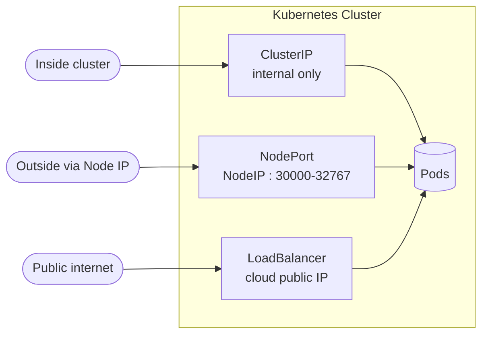

# Day 07 - Services & Networking

> **Goal:** Give your constantly-changing Pods a single, stable address - and load-balance traffic across them.

## Learning Objectives
- Explain why Pods need a Service in front of them
- Describe the three main Service types: **ClusterIP**, **NodePort**, **LoadBalancer**
- Understand how a Service finds Pods using **label selectors**
- Tell apart `port`, `targetPort`, and `nodePort`
- Write, apply, and inspect a Service with `kubectl`

---

## Real-World Analogy: The Pizza Shop Phone Number

Imagine a pizza shop with several delivery drivers. Each driver has their **own personal phone**, and those phones change all the time - drivers quit, new ones get hired, phones get replaced.

If you, the customer, had to memorize every driver's personal number, you'd be lost the moment anything changed.

Instead, the shop gives you **one stable number** to call: the front desk. You call that one number, and the front desk routes your order to whichever driver is free right now.

In Kubernetes:
- **Drivers** = your Pods (created and destroyed constantly, each with a new IP).
- **The shop's front-desk number** = the **Service** (one stable address that never changes).
- **The front desk knowing who works there today** = the Service's **selector** matching Pod **labels**.

> Pods are disposable; their IPs change on every restart. A **Service** is the permanent "phone number" that always reaches the right Pods.

---

## The Problem - Why Do We Need Services?

From Day 06, you have a Deployment running 3 nginx pods. But:

1. **Pods get random IPs** - Every time a pod restarts, it gets a NEW IP address
2. **How do other apps find your pods?** - You can't hardcode pod IPs
3. **How do users access your app?** - Pods are inside the cluster, not reachable from outside

```
Pod restarts → New IP!

Before restart: Pod IP = 10.244.0.5
After restart:  Pod IP = 10.244.0.9  ← Different!

Anyone using 10.244.0.5 gets "connection refused"
```

**Service** = A stable address that always points to the right pods, even when they restart.

---

## What Is a Service?

A **Service** provides:
- A **stable IP address** (doesn't change even when pods restart)
- A **stable DNS name** (e.g., `backend.default.svc.cluster.local`)
- **Load balancing** across multiple pods

```
                   ┌─────────────┐
                   │   Service   │
Users/Other ──────→│   (stable   │
  Apps             │    IP)      │
                   └──────┬──────┘
                          │
                ┌─────────┼─────────┐
                │         │         │
           ┌────┴──┐ ┌───┴───┐ ┌───┴───┐
           │ Pod 1 │ │ Pod 2 │ │ Pod 3 │
           │10.0.1 │ │10.0.2 │ │10.0.3 │
           └───────┘ └───────┘ └───────┘
           IPs can change, but Service IP stays the same!
```

---

## How Services Find Pods (Selectors!)

Services use **labels** to find pods - the same label system we used in ReplicaSets and Deployments.

```yaml
# Service says: "Send traffic to pods with label app=web"
selector:
  app: web

# Pods with label app=web get traffic
# Pods without this label are ignored
```



> If the Service `selector` does not EXACTLY match the Pods' `labels`, the Service ends up with **no endpoints** and traffic goes nowhere. This is the #1 beginner bug - check it with `kubectl get endpoints <svc>`.

---

## Types of Services



> Each type **builds on** the previous one: a NodePort also gets a ClusterIP, and a LoadBalancer also gets a NodePort + ClusterIP.

### 1. ClusterIP (Default) - Internal Communication

```
┌─────────────── Kubernetes Cluster ───────────────┐
│                                                    │
│  ┌──────────┐         ┌──────────┐               │
│  │ Frontend │ ──────→ │ Backend  │               │
│  │ Service  │         │ Service  │               │
│  │          │         │(ClusterIP│               │
│  └──────────┘         │10.96.0.1)│               │
│                        └────┬─────┘               │
│                       ┌─────┼─────┐               │
│                       │     │     │               │
│                      Pod   Pod   Pod              │
│                                                    │
│   NOT accessible from outside the cluster       │
└────────────────────────────────────────────────────┘
```

**Use case:** Backend services that only need to talk to other services inside the cluster.

```yaml
apiVersion: v1
kind: Service
metadata:
  name: backend
spec:
  type: ClusterIP       # default, can be omitted
  selector:
    app: web
  ports:
    - port: 80           # Port the service listens on
      targetPort: 80     # Port on the pod/container
```

### 2. NodePort - Expose on Node's IP

```
┌──── Outside World ────┐
│                        │
│   http://NodeIP:30080  │
│         │              │
└─────────┼──────────────┘
          │
┌─────────┼──────── Kubernetes Cluster ──────────┐
│         ↓                                       │
│  ┌──────────────┐                              │
│  │   NodePort    │                              │
│  │  Service      │                              │
│  │ Port: 30080   │                              │
│  └──────┬────────┘                              │
│    ┌────┼────┐                                  │
│   Pod  Pod  Pod                                 │
└─────────────────────────────────────────────────┘
```

**Use case:** Quick access during development. NOT recommended for production.

```yaml
apiVersion: v1
kind: Service
metadata:
  name: web-nodeport
spec:
  type: NodePort
  selector:
    app: web
  ports:
    - port: 80           # Internal cluster port
      targetPort: 80     # Port on the pod
      nodePort: 30080    # Port opened on the Node (30000-32767)
```

**Access:** `http://<any-node-ip>:30080`

```bash
# With Minikube:
minikube service web-nodeport --url
```

### 3. LoadBalancer - Cloud Load Balancer

```
┌──── Internet ────┐
│                   │
│   http://lb-ip    │
│       │           │
└───────┼───────────┘
        │
  ┌─────┴─────┐
  │   Cloud    │
  │   Load     │        ← Created by cloud provider (AWS/Azure/GCP)
  │  Balancer  │
  └─────┬──────┘
        │
┌───────┼──────── Kubernetes Cluster ──────────┐
│       ↓                                       │
│  ┌──────────────┐                            │
│  │ LoadBalancer  │                            │
│  │   Service     │                            │
│  └──────┬────────┘                            │
│    ┌────┼────┐                                │
│   Pod  Pod  Pod                               │
└───────────────────────────────────────────────┘
```

**Use case:** Production apps in the cloud. Gets a public IP from your cloud provider.

```yaml
apiVersion: v1
kind: Service
metadata:
  name: web-lb
spec:
  type: LoadBalancer
  selector:
    app: web
  ports:
    - port: 80
      targetPort: 80
```

**Note:** Only works in cloud environments (AWS, Azure, GCP). On Minikube, use `minikube tunnel`.

---

## Comparison of Service Types

| Type | Accessible From | Use Case | Port Range |
|------|----------------|----------|------------|
| **ClusterIP** | Inside cluster only | Internal services | Any |
| **NodePort** | Outside via Node IP | Dev/testing | 30000-32767 |
| **LoadBalancer** | Internet (via cloud LB) | Production | Any |

---

## Port Terminology (Confusing but Important!)

```yaml
ports:
  - port: 80          #  Service port (what other services use)
    targetPort: 8080   #  Container port (where your app listens)
    nodePort: 30080    #  Node port (external access, NodePort only)
```

```
External User -> NodePort(30080) -> Service Port(80) -> Container Port(8080)
```

If `targetPort` is not specified, it defaults to the same value as `port`.

---

## Hands-On Lab

### Step 1: Make sure you have a Deployment running

```bash
kubectl apply -f deployment.yaml
kubectl get pods
```

### Step 2: Create a ClusterIP Service

```yaml
# service-clusterip.yaml
apiVersion: v1
kind: Service
metadata:
  name: backend
spec:
  selector:
    app: web
  ports:
    - port: 80
      targetPort: 80
```

```bash
kubectl apply -f service-clusterip.yaml
kubectl get services
# NAME      TYPE        CLUSTER-IP    EXTERNAL-IP   PORT(S)   AGE
# backend   ClusterIP   10.96.45.23   <none>        80/TCP    10s
```

### Step 3: Test the Service from inside the cluster

```bash
# Create a temporary pod to test
kubectl run test-pod --image=busybox --rm -it -- wget -qO- http://backend
# You should see the nginx welcome page HTML!
```

### Step 4: Create a NodePort Service

```yaml
# service-nodeport.yaml
apiVersion: v1
kind: Service
metadata:
  name: web-nodeport
spec:
  type: NodePort
  selector:
    app: web
  ports:
    - port: 80
      targetPort: 80
      nodePort: 30080
```

```bash
kubectl apply -f service-nodeport.yaml

# Access it (Minikube)
minikube service web-nodeport --url
# Open the URL in your browser!
```

---

## DNS Inside Kubernetes

Every service gets a DNS name automatically:

```
<service-name>.<namespace>.svc.cluster.local
```

Examples:
```
backend.default.svc.cluster.local       # Full DNS name
backend.default                          # Short form
backend                                  # Shortest (works within same namespace)
```

So your app can connect to the backend using just `http://backend:80`

---

## Useful Commands

```bash
# List all services
kubectl get services   # or: kubectl get svc

# Describe a service (shows endpoints/pods)
kubectl describe svc backend

# See endpoints (actual pod IPs)
kubectl get endpoints backend

# Delete a service
kubectl delete svc backend
```

---

## Common Mistakes

1. **Selector / label mismatch.** `spec.selector` must exactly match the Pods' `metadata.labels`. A typo means zero endpoints and "connection refused." Confirm with `kubectl get endpoints <svc>`.
2. **Confusing `port` and `targetPort`.** `port` is what the Service listens on; `targetPort` is the port **inside the container**. They are often different.
3. **Expecting ClusterIP to work from your laptop.** ClusterIP is **internal only** - reach it via NodePort, LoadBalancer, or `kubectl port-forward`.
4. **Picking a `nodePort` outside 30000 - 32767.** Values outside this range are rejected.
5. **Using `type: LoadBalancer` on a local cluster** (Minikube/kind) and expecting a public IP - it stays `<pending>` without `minikube tunnel` or a cloud provider.

---

## Quick Self-Check

1. Why can't you reliably talk to a Pod by its IP address directly?
2. How does a Service know which Pods to send traffic to?
3. What is the default Service type, and who can reach it?
4. What's the difference between `port` and `targetPort`?
5. Your Service shows no endpoints. What's the likely cause, and which command confirms it?

---

## Summary

A **Service** gives a stable IP + DNS name to a constantly-changing set of Pods and load-balances across them. It finds Pods via **label selectors**. The three core types: **ClusterIP** (internal), **NodePort** (external via Node IP), **LoadBalancer** (external via cloud LB). Remember `port` (service) vs `targetPort` (container) vs `nodePort` (external).

Next up → [Day 08 - Services Demo](../day08-services-demo/notes.md)

---

## Key Takeaways

1. **Services** give pods a stable IP and DNS name
2. **ClusterIP** = internal only (default)
3. **NodePort** = accessible from outside via node's IP
4. **LoadBalancer** = cloud load balancer for production
5. Services find pods using **label selectors**
6. Pods can reach services using **DNS names** (e.g., `http://backend`)
7. `port` = service port, `targetPort` = container port, `nodePort` = external port

---

## Practice / Homework

1. Create a ClusterIP service and test it from within the cluster
2. Create a NodePort service and access nginx from your browser
3. Run `kubectl get endpoints` and compare IPs with `kubectl get pods -o wide`
4. Delete a pod and check: does the service still work? (Yes! Self-healing)
5. Scale your deployment to 5 replicas and check endpoints again

---

**Previous:** [← Day 06 - Deployments](../day06-deployments/notes.md)
**Next:** [Day 08 - Services Demo →](../day08-services-demo/notes.md)
