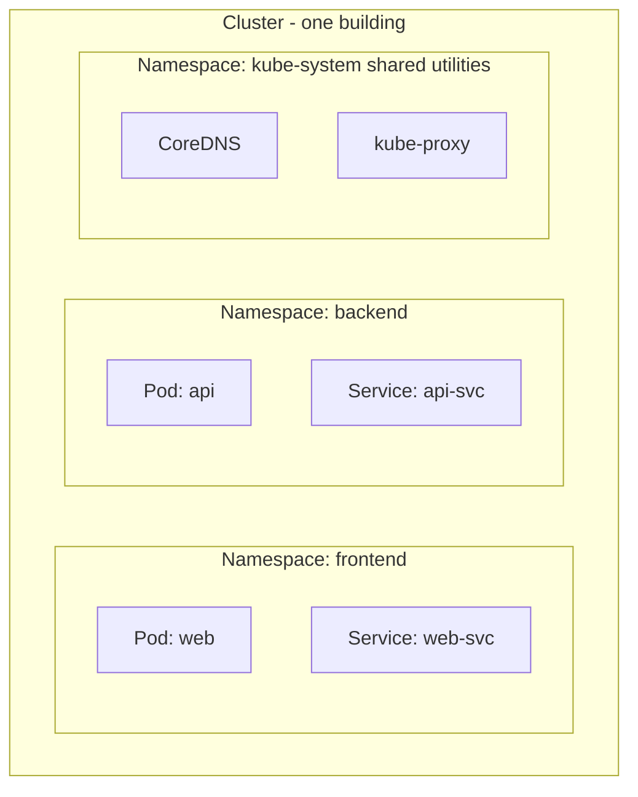
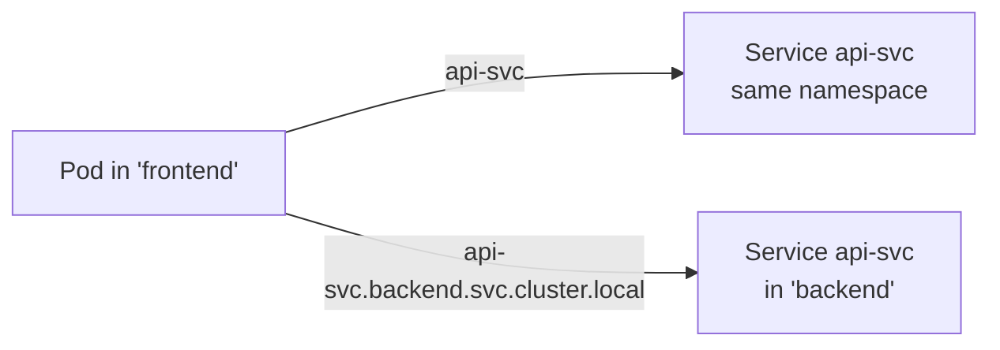

# Day 09 - Namespaces

> **Goal:** Split one cluster into separate, organized spaces so teams and apps don't step on each other.

## Learning Objectives
- Explain what a Namespace is and why it exists
- List the default namespaces Kubernetes ships with
- Create, use, switch, and delete namespaces
- Understand cross-namespace DNS names
- Know what namespaces do **not** do (they're not a network security boundary)

---

## Real-World Analogy: Apartments in One Building

Picture a single apartment building. The **building** is your Kubernetes cluster. Inside are many **apartments** - each one is a **Namespace**.

- Every apartment has its own furniture, residents, and mess - without disturbing the neighbors.
- Two apartments can each have a "John" living there; the names don't clash because they're in different units.
- The building still shares infrastructure (plumbing, electricity) - like the cluster's Nodes and control plane that everyone shares.



> `frontend` and `backend` can each contain objects with the same name. Because they live in different namespaces, **the names don't collide**.

> Namespaces are **not** a security boundary by themselves. By default, a Pod in one namespace can still reach a Service in another. Real network isolation needs **NetworkPolicies**.

---

## Why Do We Need Namespaces?

Imagine you have one K8s cluster and multiple teams:
- Team A is working on the **frontend**
- Team B is working on the **backend**
- Team C is working on **testing**

Without namespaces, all resources are in one place:
```
All pods, services, deployments → one big mess
Team A might accidentally delete Team B's pods!
Names must be unique across EVERYTHING
```

**Namespaces** = Virtual clusters inside your physical cluster. They isolate resources.

```
┌──────────────── Kubernetes Cluster ────────────────┐
│                                                     │
│  ┌── Namespace: frontend ──┐  ┌── Namespace: backend ──┐
│  │  Pod: web               │  │  Pod: api               │
│  │  Service: web-svc       │  │  Service: api-svc       │
│  │  Deployment: web-deploy │  │  Deployment: api-deploy │
│  └─────────────────────────┘  └─────────────────────────┘
│                                                     │
│  ┌── Namespace: testing ───┐                       │
│  │  Pod: test-web          │                       │
│  │  Pod: test-api          │                       │
│  └─────────────────────────┘                       │
└─────────────────────────────────────────────────────┘
```

---

## Default Namespaces

Kubernetes comes with 4 built-in namespaces:

```bash
kubectl get namespaces
# NAME              STATUS   AGE
# default           Active   10d
# kube-system       Active   10d
# kube-public       Active   10d
# kube-node-lease   Active   10d
```

| Namespace | Purpose |
|-----------|---------|
| `default` | Where your resources go if you don't specify a namespace |
| `kube-system` | K8s system components (API Server, etcd, CoreDNS, etc.) |
| `kube-public` | Publicly readable data (rarely used) |
| `kube-node-lease` | Node heartbeat tracking (internal) |

---

## Creating Namespaces

### Method 1: Command

```bash
kubectl create namespace dev
kubectl create namespace staging
kubectl create namespace production
```

### Method 2: YAML

```yaml
# namespace.yaml
apiVersion: v1
kind: Namespace
metadata:
  name: dev
```

```bash
kubectl apply -f namespace.yaml
```

---

## Using Namespaces

### Create resources in a specific namespace

```bash
# Using -n flag
kubectl apply -f deployment.yaml -n dev

# Or specify namespace in the YAML
```

```yaml
apiVersion: apps/v1
kind: Deployment
metadata:
  name: web-deploy
  namespace: dev          # ← specify namespace here
spec:
  replicas: 2
  selector:
    matchLabels:
      app: web
  template:
    metadata:
      labels:
        app: web
    spec:
      containers:
      - name: nginx
        image: nginx:1.27
```

### View resources in a namespace

```bash
# List pods in 'dev' namespace
kubectl get pods -n dev

# List pods in all namespaces
kubectl get pods --all-namespaces
kubectl get pods -A                    # shortcut

# List all resources in a namespace
kubectl get all -n dev
```

---

## Switch Default Namespace

Tired of typing `-n dev` every time?

```bash
# Set 'dev' as your default namespace
kubectl config set-context --current --namespace=dev

# Now all commands default to 'dev' namespace
kubectl get pods    # shows pods in 'dev'

# Check which namespace you're currently in
kubectl config view --minify | grep namespace

# Switch back to default
kubectl config set-context --current --namespace=default
```

---

## Cross-Namespace Communication

Pods in different namespaces **can** communicate using the full DNS name:

```
<service-name>.<namespace>.svc.cluster.local
```

```
┌── Namespace: frontend ──┐     ┌── Namespace: backend ──┐
│                          │     │                         │
│  Frontend Pod            │     │  Backend Pod            │
│  wants to call backend ──┼────→│  Service: api-svc       │
│                          │     │                         │
│  URL: http://api-svc.    │     │                         │
│  backend.svc.cluster.    │     │                         │
│  local:8080              │     │                         │
└──────────────────────────┘     └─────────────────────────┘
```

**Within same namespace:** `http://api-svc:8080` (short name works)
**Across namespaces:** `http://api-svc.backend:8080` (must include namespace)



---

## When to Use Namespaces

| Use Case | Example |
|----------|---------|
| **Environment separation** | `dev`, `staging`, `production` |
| **Team isolation** | `team-frontend`, `team-backend` |
| **Project separation** | `project-a`, `project-b` |
| **Resource quotas** | Limit CPU/RAM per namespace |

### When NOT to Use Namespaces

- Small teams with few applications → `default` is fine
- Don't create a namespace per microservice (too granular)

---

## Resource Quotas (Bonus)

You can limit resources per namespace:

```yaml
apiVersion: v1
kind: ResourceQuota
metadata:
  name: dev-quota
  namespace: dev
spec:
  hard:
    pods: "10"                    # Max 10 pods
    requests.cpu: "4"             # Max 4 CPU cores requested
    requests.memory: "8Gi"        # Max 8GB RAM requested
    limits.cpu: "8"               # Max 8 CPU cores limit
    limits.memory: "16Gi"         # Max 16GB RAM limit
```

```bash
kubectl apply -f quota.yaml
kubectl describe quota dev-quota -n dev
```

---

## Useful Commands

```bash
# List all namespaces
kubectl get namespaces    # or: kubectl get ns

# Create namespace
kubectl create namespace dev

# Delete namespace (WARNING: deletes ALL resources in it!)
kubectl delete namespace dev

# Get resources in all namespaces
kubectl get pods -A
kubectl get all -A

# Describe a namespace
kubectl describe namespace dev
```

---

## Common Mistakes

1. **Deleting a namespace to "clean up one app."** `kubectl delete namespace` wipes **every** object inside it - Deployments, Services, Secrets, everything.
2. **Forgetting `-n` and looking in the wrong place.** `kubectl get pods` only shows the `default` namespace; your Pods may be in `dev`. Use `-A` to see all.
3. **Assuming namespaces isolate network traffic.** They don't by default - you need NetworkPolicies for real isolation.
4. **Cross-namespace calls using only the short name.** `api-svc` resolves only in the *same* namespace. From elsewhere use `api-svc.<namespace>`.
5. **Deploying your apps into `kube-system`.** That namespace is for core cluster components - keep your workloads out.

---

## Quick Self-Check

1. In the apartment analogy, what is the *building* and what is an *apartment*?
2. Which namespace do your objects go into if you don't specify one?
3. Can two namespaces each contain a Service named `api-svc`? Why or why not?
4. What does `kubectl delete namespace dev` actually delete?
5. From a Pod in `frontend`, what DNS name reaches Service `api-svc` in `backend`?

---

## Summary

**Namespaces** split a single cluster into isolated "apartments" for organization, name separation, access control (RBAC), and resource quotas. They are a logical/organizational boundary - **not** a network security boundary on their own. Use `-n` (or `-A`) and cross-namespace DNS like `service.namespace` to work across them.

Next up → [Day 10 - ConfigMaps & Secrets](../day10-configmaps-secrets/notes.md)

---

## Key Takeaways

1. **Namespaces** = virtual clusters for resource isolation
2. **default** namespace is used when you don't specify one
3. **kube-system** contains K8s internal components - don't touch!
4. Use `-n <namespace>` flag to target a specific namespace
5. Cross-namespace communication uses full DNS: `service.namespace.svc.cluster.local`
6. Use Resource Quotas to limit resources per namespace
7. Don't over-use namespaces - they're for logical grouping, not per-pod isolation

---

## Practice / Homework

1. Create namespaces: `dev`, `staging`
2. Deploy nginx in both namespaces
3. Try communicating across namespaces using DNS
4. Set your default namespace to `dev`
5. Run `kubectl get pods -A` to see pods across all namespaces
6. Delete the `staging` namespace and observe what happens to its pods

---

**Previous:** [← Day 08 - Services Demo](../day08-services-demo/notes.md)
**Next:** [Day 10 - ConfigMaps & Secrets →](../day10-configmaps-secrets/notes.md)
