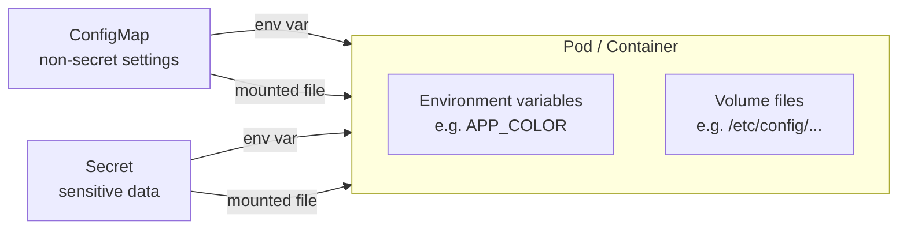

# Day 10 - ConfigMaps & Secrets

> **Goal:** Keep configuration and sensitive data **out of your container images** by injecting them at runtime with ConfigMaps and Secrets.

## Learning Objectives
- Explain why config should be separate from code
- Create ConfigMaps and Secrets (imperatively and with YAML)
- Inject them as **environment variables** or **mounted files (volumes)**
- Understand the critical truth: **Secrets are base64-ENCODED, NOT encrypted by default**

---

## Real-World Analogy: The Recipe vs. The Ingredients

Think of your container image as a **recipe card** - it lists the *steps* but should never hard-code the *specific ingredients* for one kitchen.

- A **ConfigMap** is like a **shopping list taped to the fridge**: "use 2% milk, oven at 180°C." Non-secret settings anyone can read.
- A **Secret** is like the **safe combination or your card PIN**: still just written on paper, but you keep it locked away and don't read it aloud.

You hand the cook (the Pod) the shopping list and the PIN **at cooking time** - you don't reprint the recipe card every time a price or PIN changes.

> Same image, different config per environment (dev / staging / prod). Change the ConfigMap, not the image.

---

## How Config Reaches a Pod



There are **two ways** to inject either one: as **environment variables** (simple key/value) or as **mounted files** (whole config files / certs).

---

## The Problem - Hardcoded Configuration

Look at this container:

```yaml
containers:
- name: myapp
  image: myapp:1.0
  env:
    - name: DB_HOST
      value: "192.168.1.100"      # ← Hardcoded!
    - name: DB_PASSWORD
      value: "supersecret123"      # ← Password in YAML! 
```

**Problems:**
1. To change the DB host, you have to **rebuild and redeploy** the container
2. Password is visible to anyone who reads the YAML file
3. Different values for dev/staging/prod require different YAML files

**Solution:**
- **ConfigMap** = Store non-sensitive configuration separately
- **Secret** = Store sensitive data (passwords, tokens) separately

---

## ConfigMaps

### What Is a ConfigMap?

A ConfigMap stores **key-value pairs** of configuration data. Your pods read from it instead of hardcoding values.

```
┌── ConfigMap ──┐          ┌── Pod ──┐
│ DB_HOST=...   │ ────────→│  reads  │
│ APP_MODE=prod │          │  config │
│ LOG_LEVEL=info│          │  from   │
└───────────────┘          │  here   │
                           └─────────┘
```

### Creating a ConfigMap

#### Method 1: From Command Line

```bash
# From literal values
kubectl create configmap app-config \
  --from-literal=DB_HOST=192.168.1.100 \
  --from-literal=APP_MODE=production \
  --from-literal=LOG_LEVEL=info

# From a file
kubectl create configmap nginx-config --from-file=nginx.conf

# From env file
kubectl create configmap app-config --from-env-file=config.env
```

#### Method 2: YAML (Recommended)

```yaml
# configmap.yaml
apiVersion: v1
kind: ConfigMap
metadata:
  name: app-config
data:
  DB_HOST: "192.168.1.100"
  APP_MODE: "production"
  LOG_LEVEL: "info"

  # You can also store entire files
  app.properties: |
    server.port=8080
    spring.datasource.url=jdbc:mysql://db:3306/mydb
```

```bash
kubectl apply -f configmap.yaml
```

### Using ConfigMap in a Pod

#### Option 1: As Environment Variables

```yaml
apiVersion: v1
kind: Pod
metadata:
  name: myapp
spec:
  containers:
  - name: myapp
    image: nginx

    # Load specific keys
    env:
    - name: DATABASE_HOST
      valueFrom:
        configMapKeyRef:
          name: app-config       # ConfigMap name
          key: DB_HOST           # Key in ConfigMap

    # Or load ALL keys as env vars
    envFrom:
    - configMapRef:
        name: app-config
```

#### Option 2: As a Volume (File Mount)

```yaml
apiVersion: v1
kind: Pod
metadata:
  name: myapp
spec:
  containers:
  - name: myapp
    image: nginx
    volumeMounts:
    - name: config-volume
      mountPath: /etc/config      # Where to mount
  volumes:
  - name: config-volume
    configMap:
      name: app-config           # Each key becomes a file
```

This creates files like:
```
/etc/config/DB_HOST           → contains "192.168.1.100"
/etc/config/APP_MODE          → contains "production"
/etc/config/app.properties    → contains the full file content
```

---

## Secrets

### The Most Important Point About Secrets

> **A Kubernetes Secret is base64-ENCODED, not ENCRYPTED.**
>
> Base64 is just a reversible text format - **anyone who can read the Secret can decode it instantly.** It is NOT security on its own.

```bash
# "Encoding" is trivially reversible - no password needed:
echo -n 'S3cr3t!' | base64        # -> UzNjcjN0IQ==
echo 'UzNjcjN0IQ==' | base64 -d   # -> S3cr3t!   (decoded right back)
```

To make Secrets **actually** secure, you must additionally:
- Enable **encryption at rest** (etcd encryption) on the cluster, and/or
- Use an external secrets manager (HashiCorp Vault, AWS/GCP/Azure secret stores), and
- Restrict access with **RBAC**.

So why use Secrets at all? They keep sensitive values out of your image, can be mounted as in-memory (tmpfs) files instead of on disk, and integrate with RBAC so you can limit who reads them.

### What Is a Secret?

A Secret is like a ConfigMap, but for **sensitive data**. Values are base64 encoded (not encrypted by default!).

```
┌── Secret ─────┐          ┌── Pod ──┐
│ DB_PASS=***   │ ────────→│  reads  │
│ API_KEY=***   │          │ secrets │
│ TLS_CERT=***  │          │  from   │
└───────────────┘          │  here   │
                           └─────────┘
```

### Creating a Secret

#### Method 1: Command Line

```bash
kubectl create secret generic db-secret \
  --from-literal=DB_PASSWORD=supersecret123 \
  --from-literal=DB_USERNAME=admin
```

#### Method 2: YAML

**Important:** Values must be **base64 encoded** in YAML:

```bash
# Encode your values first
echo -n 'supersecret123' | base64
# Output: c3VwZXJzZWNyZXQxMjM=

echo -n 'admin' | base64
# Output: YWRtaW4=
```

```yaml
# secret.yaml
apiVersion: v1
kind: Secret
metadata:
  name: db-secret
type: Opaque
data:
  DB_PASSWORD: c3VwZXJzZWNyZXQxMjM=    # base64 encoded
  DB_USERNAME: YWRtaW4=                  # base64 encoded
```

Or use `stringData` to avoid manual base64 encoding:

```yaml
apiVersion: v1
kind: Secret
metadata:
  name: db-secret
type: Opaque
stringData:                              # ← stringData (not data)
  DB_PASSWORD: "supersecret123"          # plain text, K8s encodes it
  DB_USERNAME: "admin"
```

### Using Secrets in a Pod

#### As Environment Variables

```yaml
apiVersion: v1
kind: Pod
metadata:
  name: myapp
spec:
  containers:
  - name: myapp
    image: nginx
    env:
    - name: DB_PASSWORD
      valueFrom:
        secretKeyRef:
          name: db-secret
          key: DB_PASSWORD

    # Or load all keys
    envFrom:
    - secretRef:
        name: db-secret
```

#### As Volume (File Mount)

```yaml
apiVersion: v1
kind: Pod
metadata:
  name: myapp
spec:
  containers:
  - name: myapp
    image: nginx
    volumeMounts:
    - name: secret-volume
      mountPath: /etc/secrets
      readOnly: true
  volumes:
  - name: secret-volume
    secret:
      secretName: db-secret
```

---

## ConfigMap vs Secret

| Feature | ConfigMap | Secret |
|---------|-----------|--------|
| **Purpose** | Non-sensitive config | Sensitive data |
| **Stored as** | Plain text | Base64 encoded |
| **Size limit** | 1 MB | 1 MB |
| **Example data** | DB host, log level, feature flags | Passwords, API keys, TLS certs |
| **RBAC** | Standard | Can have stricter access controls |

**Important:** Base64 is NOT encryption! Anyone can decode it. For real security, use:
- Kubernetes RBAC (restrict who can read secrets)
- Encrypted etcd (encrypt secrets at rest)
- External secret managers (AWS Secrets Manager, HashiCorp Vault)

---

## Useful Commands

```bash
# ConfigMaps
kubectl get configmaps              # or: kubectl get cm
kubectl describe configmap app-config
kubectl delete configmap app-config

# Secrets
kubectl get secrets
kubectl describe secret db-secret   # values are hidden
kubectl get secret db-secret -o yaml  # see base64 values

# Decode a secret value
kubectl get secret db-secret -o jsonpath='{.data.DB_PASSWORD}' | base64 --decode
```

---

## Hands-On Lab

```bash
# 1. Create a ConfigMap
kubectl create configmap app-config \
  --from-literal=APP_COLOR=blue \
  --from-literal=APP_MODE=production

# 2. Create a Secret
kubectl create secret generic app-secret \
  --from-literal=API_KEY=my-secret-key-123

# 3. Create a pod that uses both
kubectl apply -f - <<EOF
apiVersion: v1
kind: Pod
metadata:
  name: config-test
spec:
  containers:
  - name: busybox
    image: busybox
    command: ["sh", "-c", "echo Color=\$APP_COLOR Mode=\$APP_MODE Key=\$API_KEY && sleep 3600"]
    envFrom:
    - configMapRef:
        name: app-config
    - secretRef:
        name: app-secret
EOF

# 4. Check the values
kubectl logs config-test
# Output: Color=blue Mode=production Key=my-secret-key-123
```

---

## Common Mistakes

1. **Believing Secrets are encrypted.** They are **base64-encoded only** by default - anyone with read access decodes them in one command. Add etcd encryption-at-rest + RBAC for real protection.
2. **Committing Secret YAML with real values to Git.** Base64 hides nothing. Never push real credentials to a repo.
3. **Hand-encoding into `data:` and getting it wrong** (e.g. a trailing newline). Use `echo -n` to avoid the newline, or just use `stringData:`.
4. **Expecting env-var changes to reach a running Pod.** Editing a ConfigMap/Secret used as **env vars** does NOT update existing Pods - you must `kubectl rollout restart`. (Mounted-volume values do update eventually.)
5. **Key name mismatch.** The `key:` in `configMapKeyRef`/`secretKeyRef` must exactly match a key in the ConfigMap/Secret, or the Pod fails to start.

---

## Quick Self-Check

1. Why should configuration live outside the container image?
2. What are the two ways to inject a ConfigMap or Secret into a Pod?
3. **True or false:** Kubernetes Secrets are encrypted by default. Explain your answer.
4. What does `stringData:` do that `data:` doesn't?
5. You changed a ConfigMap used as env vars, but the running Pod still shows the old value. Why, and how do you fix it?

---

## Summary

**ConfigMaps** hold non-secret settings; **Secrets** hold sensitive data - but Secrets are only **base64-encoded, not encrypted**, so add etcd encryption-at-rest and RBAC for real security. Inject either as **environment variables** or **mounted files**, keeping the same image reusable across dev, staging, and prod.

Next up → [Day 11 - Amazon EKS](../day11-eks/notes.md)

---

## Key Takeaways

1. **Never hardcode** configuration or passwords in your YAML or Docker images
2. **ConfigMap** = non-sensitive configuration (DB host, feature flags, config files)
3. **Secret** = sensitive data (passwords, API keys, TLS certificates)
4. Both can be used as **environment variables** or **volume mounts**
5. **Base64 is not encryption** - use proper secret management in production
6. **`stringData`** in Secrets lets you write plain text (K8s encodes it for you)

---

## Practice / Homework

1. Create a ConfigMap with 3 key-value pairs
2. Create a Secret with a username and password
3. Create a Pod that reads from both ConfigMap and Secret
4. Verify values using `kubectl exec <pod> -- env`
5. Try mounting ConfigMap as a volume and read the files
6. Decode a secret: `kubectl get secret <name> -o jsonpath='{.data.KEY}' | base64 --decode`

---

**Previous:** [← Day 09 - Namespaces](../day09-namespaces/notes.md)
**Next:** [Day 11 - Amazon EKS →](../day11-eks/notes.md)
