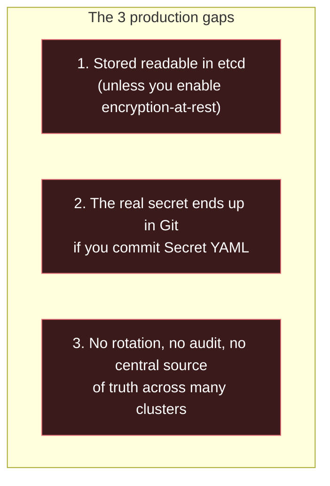
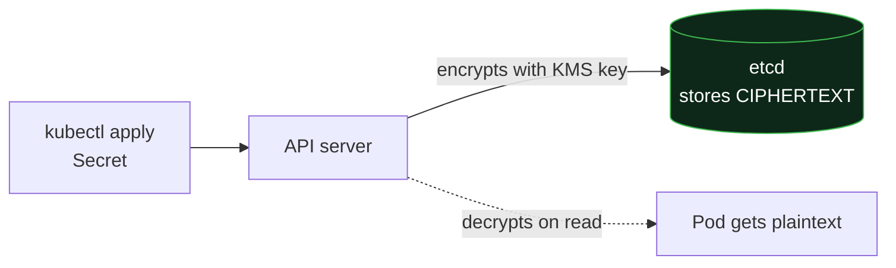
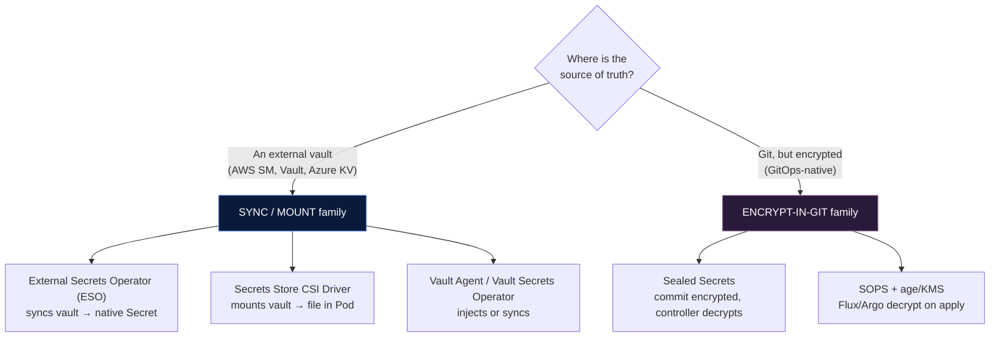
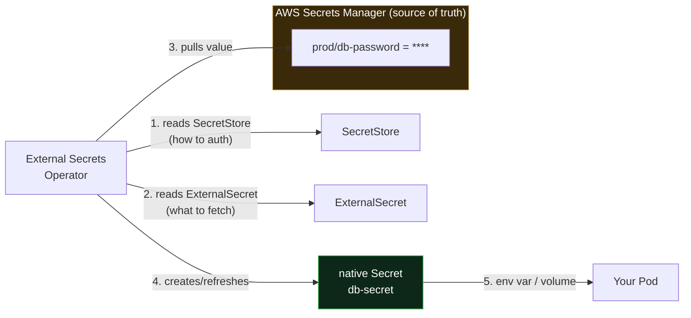
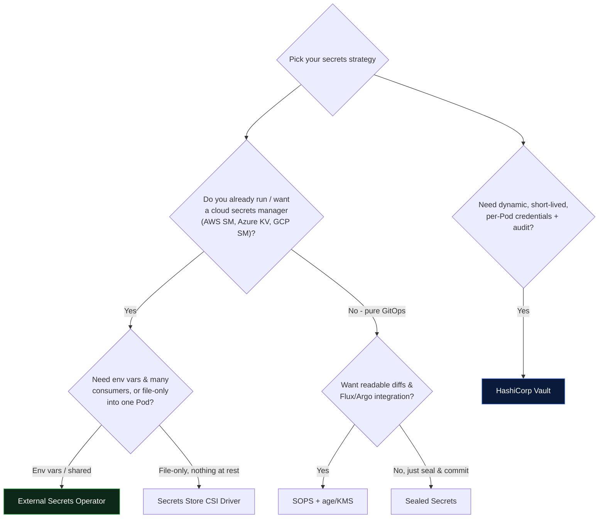
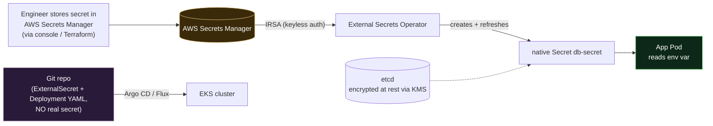

# Day 10 (Deep Dive) - Production-Grade Secrets & Config Management

> **Companion to [Day 10 - ConfigMaps & Secrets](notes.md).**
> The base notes teach you *what* a Secret is. This file teaches you how **real teams handle secrets in production** - where "base64 in a YAML" is never the answer.

## Learning Objectives
- Explain **why native Secrets alone are not enough** for production
- Turn on **encryption-at-rest** so etcd no longer stores readable secrets
- Understand and integrate the **External Secrets Operator (ESO)** - the current industry-standard pattern
- Know the alternatives: **Secrets Store CSI Driver**, **Sealed Secrets**, **SOPS**, **HashiCorp Vault**
- **Choose the right tool** for GitOps, EKS/cloud, or Vault-centric shops
- Apply modern **config management** patterns (12-factor, config rollout, rotation)

---

## 1. Recap: Why Native Secrets Aren't Enough

From the base notes you already know **base64 ≠ encryption**. But even with RBAC, plain Kubernetes Secrets have three production gaps:



> **Analogy: where do you keep the master keys?**
> A plain Secret is like taping the spare house key under the doormat *and* writing "it's under the mat" in a note you photocopy for everyone (Git). Production teams instead keep keys in a **bank vault** (a secrets manager), and hand out **time-limited copies** only to the people/apps that need them, with a **log of who took what**.

The production goal: **the real secret lives in a dedicated vault, and Kubernetes only ever holds a short-lived, tightly-scoped copy - never Git.**

---

## 2. Layer 1 - Encryption at Rest (do this on every real cluster)

By default, whatever is in a Secret sits in **etcd** essentially in the clear (just base64). Anyone who can read an etcd backup can read every password. **Encryption-at-rest** fixes that: the API server encrypts Secret data *before* writing to etcd.



You configure it with an `EncryptionConfiguration`. The **best practice today is the KMS v2 provider** (GA since Kubernetes 1.29), which uses an external Key Management Service (AWS KMS, GCP KMS, Azure Key Vault) so the *encryption key itself* is never stored on the cluster.

```yaml
# EncryptionConfiguration passed to kube-apiserver (--encryption-provider-config)
apiVersion: apiserver.config.k8s.io/v1
kind: EncryptionConfiguration
resources:
  - resources:
      - secrets                     # encrypt Secrets (add configmaps too if you like)
    providers:
      - kms:                        # ← preferred: external KMS (envelope encryption)
          apiVersion: v2
          name: aws-kms-provider
          endpoint: unix:///var/run/kmsplugin/socket.sock
      - identity: {}                # fallback for reads of not-yet-encrypted data
```

> **On managed clusters this is often a checkbox.** On **EKS** you enable "Secrets encryption" with a KMS key at (or after) cluster creation. **GKE** has "Application-layer secrets encryption"; **AKS** has KMS etcd encryption. Turn it on - it's nearly free and closes the etcd-backup hole.

> **Already have unencrypted Secrets?** After enabling, re-write them so they get encrypted:
> `kubectl get secrets -A -o json | kubectl replace -f -`

**Encryption-at-rest is necessary but not sufficient** - the secret still originates in Git/YAML. That's what the next layer solves.

---

## 3. The Modern Landscape (map before we dive)

There are two big families. Pick based on **"where should the source of truth live?"**



- **SYNC/MOUNT family** - the real secret lives in a cloud vault; Kubernetes pulls a copy on demand. Best when you already have (or want) a central secrets manager. **This is the dominant pattern in cloud/EKS shops.**
- **ENCRYPT-IN-GIT family** - you want a pure GitOps flow where *everything* (including secrets, encrypted) lives in Git. Best for small teams / GitOps purists without a separate vault.

---

## 4. Pattern A - External Secrets Operator (ESO)

**This is the pattern to learn first** - it's the de-facto standard for connecting Kubernetes to an external secrets manager.

### The idea

> **Analogy: a self-restocking fridge.**
> You never carry groceries home (secrets into Git). Instead a smart fridge (ESO) is told *"keep it stocked from the supermarket."* It periodically fetches from the supermarket (AWS Secrets Manager / Vault) and refills the fridge (a normal Kubernetes Secret) so your apps just open the fridge as usual.

ESO runs as a controller and introduces Custom Resources:

| CRD | Role |
|-----|------|
| **SecretStore** | *Which vault, and how to authenticate* - namespaced |
| **ClusterSecretStore** | Same, but cluster-wide (shared by all namespaces) |
| **ExternalSecret** | *"Fetch key X from the vault and create native Secret Y"* |
| **ClusterExternalSecret** | Roll an ExternalSecret out to many namespaces |
| **PushSecret** | Reverse direction: push a K8s Secret *into* the vault |



### Step-by-step: ESO + AWS Secrets Manager on EKS

**Install ESO (Helm):**
```bash
helm repo add external-secrets https://charts.external-secrets.io
helm install external-secrets external-secrets/external-secrets \
  -n external-secrets --create-namespace
```

**Authenticate without static keys - use IRSA (IAM Roles for Service Accounts).** This is the modern, keyless way: the ServiceAccount is annotated with an IAM role, and AWS trusts the cluster's OIDC provider. **No AWS keys ever touch the cluster.**

```yaml
# The ServiceAccount ESO will use, tied to an IAM role via IRSA
apiVersion: v1
kind: ServiceAccount
metadata:
  name: eso-sa
  namespace: external-secrets
  annotations:
    eks.amazonaws.com/role-arn: arn:aws:iam::111122223333:role/eso-secrets-reader
```

**Define the store (where + how to auth):**
```yaml
apiVersion: external-secrets.io/v1beta1
kind: ClusterSecretStore
metadata:
  name: aws-secrets-manager
spec:
  provider:
    aws:
      service: SecretsManager
      region: ap-south-1
      auth:
        jwt:
          serviceAccountRef:
            name: eso-sa
            namespace: external-secrets
```

**Ask for a specific secret (the fetch instruction):**
```yaml
apiVersion: external-secrets.io/v1beta1
kind: ExternalSecret
metadata:
  name: db-secret
  namespace: team-a
spec:
  refreshInterval: 1h                 # re-pull every hour (rotation-friendly)
  secretStoreRef:
    kind: ClusterSecretStore
    name: aws-secrets-manager
  target:
    name: db-secret                   # the native K8s Secret ESO will create
    creationPolicy: Owner
  data:
    - secretKey: DB_PASSWORD          # key inside the K8s Secret
      remoteRef:
        key: prod/db                  # secret name in AWS Secrets Manager
        property: password            # JSON field inside it
```

Result: ESO creates and continuously refreshes a normal `db-secret` in `team-a`. **Your app doesn't change at all** - it still reads `db-secret` as an env var or mount. The magic is invisible to the workload.

> **Why teams love ESO:** the real secret never enters Git; rotation in AWS propagates automatically on the next `refreshInterval`; works with AWS/GCP/Azure/Vault/1Password and dozens more providers through one consistent API.

---

## 5. Pattern B - Secrets Store CSI Driver

Instead of *creating a Secret object*, this **mounts the secret straight into the Pod as a file**, using the Container Storage Interface (the same plumbing as volumes).

> **Analogy: a delivery hatch, not a fridge.**
> ESO restocks the fridge (a Secret object other things can read). The CSI driver installs a **private hatch** directly into *one* Pod - the value appears as a file at `/mnt/secrets/...` and disappears when the Pod stops. Nothing lands in a shared Secret object unless you explicitly ask it to.

```yaml
# SecretProviderClass - "what to fetch and where from"
apiVersion: secrets-store.csi.x-k8s.io/v1
kind: SecretProviderClass
metadata:
  name: aws-db
spec:
  provider: aws
  parameters:
    objects: |
      - objectName: "prod/db"
        objectType: "secretsmanager"
        jmesPath:
          - path: password
            objectAlias: DB_PASSWORD
  # Optional: ALSO mirror into a native K8s Secret (for env vars)
  secretObjects:
    - secretName: db-secret
      type: Opaque
      data:
        - objectName: DB_PASSWORD
          key: DB_PASSWORD
```

```yaml
# Pod mounts it as a volume
volumes:
  - name: secrets
    csi:
      driver: secrets-store.csi.k8s.io
      readOnly: true
      volumeAttributes:
        secretProviderClass: aws-db
# ...
volumeMounts:
  - name: secrets
    mountPath: /mnt/secrets
    readOnly: true
```

**ESO vs CSI Driver in one line:** ESO *reconciles a Secret object* (good when many things need it / you want env vars); the CSI driver *mounts files into a specific Pod* (good when you want secrets to exist only inside the running Pod's memory and never as a standalone object). Many teams use ESO; regulated environments often prefer CSI's "nothing at rest" property. You can even use both.

---

## 6. Pattern C - Sealed Secrets (encrypt so you CAN commit to Git)

From **Bitnami**. The one tool designed to let you **safely commit secrets to a public Git repo.**

> **Analogy: a public mailbox with a one-way slot.**
> Anyone can drop a letter in (encrypt), but only the post office (the controller in your cluster) has the key to open it. So you can publish the sealed envelope anywhere - GitHub included.


```bash
# Turn a normal Secret into a SealedSecret you can commit
kubectl create secret generic db-secret \
  --from-literal=DB_PASSWORD=supersecret123 \
  --dry-run=client -o yaml \
| kubeseal --controller-namespace kube-system -o yaml > sealed-db-secret.yaml

git add sealed-db-secret.yaml   #  safe: only YOUR cluster can decrypt it
```

**Trade-off:** the source of truth is Git (not a central vault), and secrets are encrypted **per-cluster** (the encryption is scoped to that controller's key). Great for **GitOps with no separate vault**; less ideal when you need one secret shared/rotated across many clusters.

---

## 7. Pattern D - SOPS + age/KMS (GitOps-native encryption)

**SOPS** (Mozilla) encrypts **only the values** in a YAML/JSON file, leaving keys readable, so diffs stay meaningful. It encrypts to an `age` key or a cloud KMS key. **Flux decrypts natively**; **Argo CD** does it via a plugin (e.g. KSOPS).

```yaml
# db-secret.enc.yaml - committed to Git; values are ciphertext, keys stay readable
apiVersion: v1
kind: Secret
metadata:
  name: db-secret
stringData:
  DB_PASSWORD: ENC[AES256_GCM,data:9x2...,tag:...]   # ← only the value is encrypted
sops:
  age:
    - recipient: age1qz...                            # who can decrypt
```

```bash
sops --encrypt --age age1qz... db-secret.yaml > db-secret.enc.yaml   # before commit
# Flux/Argo decrypt automatically at apply time inside the cluster
```

**Sealed Secrets vs SOPS:** both let you commit encrypted secrets. Sealed Secrets ties decryption to an in-cluster controller (encrypt with `kubeseal`); SOPS ties it to keys *you* manage (age/KMS) and integrates cleanly with Flux/Argo pipelines and readable diffs. SOPS is often preferred in mature GitOps setups.

---

## 8. Pattern E - HashiCorp Vault (when you need dynamic secrets)

Vault is a full secrets **platform**, not just storage. Its superpower is **dynamic secrets**: instead of a long-lived DB password, Vault **generates a fresh, short-lived credential per Pod** and auto-revokes it. That shrinks the blast radius of any leak to near zero.

Three ways to consume Vault from Kubernetes:

| Method | How it works |
|--------|--------------|
| **Vault Agent Injector** | A mutating webhook adds a sidecar that logs into Vault (K8s auth) and writes secrets to a shared in-memory file |
| **Vault Secrets Operator (VSO)** | Vault-native operator that syncs Vault → native K8s Secret (conceptually like ESO, first-party) |
| **Secrets Store CSI + Vault provider** | Mount Vault secrets as files via the CSI driver |

```yaml
# Vault Agent Injector - pure annotations, no app code change
apiVersion: apps/v1
kind: Deployment
metadata:
  name: myapp
spec:
  template:
    metadata:
      annotations:
        vault.hashicorp.com/agent-inject: "true"
        vault.hashicorp.com/role: "myapp"
        vault.hashicorp.com/agent-inject-secret-db: "database/creds/myapp"
    spec:
      serviceAccountName: myapp-sa
      # ...
```

The app just reads `/vault/secrets/db`. **Dynamic secret = a brand-new DB user per Pod, revoked when the lease ends.** Use Vault when you have many teams, need audit + dynamic credentials, and can run the extra infrastructure.

---

## 9. Decision Guide - Which One Should You Use?



| Tool | Source of truth | Secret in Git? | Rotation | Best for |
|------|-----------------|----------------|----------|----------|
| **External Secrets Operator** | Cloud vault | never | auto (refreshInterval) | **Default choice** on EKS/AKS/GKE |
| **Secrets Store CSI Driver** | Cloud vault / Vault | never | (with rotation reconciler) | "Nothing at rest", file mounts |
| **Sealed Secrets** | Git (encrypted) | encrypted | Manual re-seal | Small teams, GitOps, no vault |
| **SOPS + age/KMS** | Git (encrypted) | encrypted | Manual re-encrypt | Mature GitOps (Flux/Argo) |
| **HashiCorp Vault** | Vault | never | + **dynamic** | Large orgs, dynamic creds, audit |

> **If you're unsure and you're on a cloud provider: start with the External Secrets Operator.** It's the most widely adopted, has the gentlest learning curve, and doesn't force you to run Vault.

---

## 10. Config Management - Modern Patterns (the ConfigMap side)

Secrets get the spotlight, but **non-secret config** has its own best practices:

1. **12-Factor: config comes from the environment**, not the image. Same image → dev/staging/prod, differing only by ConfigMap/Secret. (You already do this - keep doing it.)
2. **Treat config as immutable + versioned.** For critical config, prefer creating `app-config-v2` over editing `app-config` in place - you get clean rollbacks. Kubernetes even supports `immutable: true` on ConfigMaps/Secrets, which improves performance and prevents accidental edits:
   ```yaml
   apiVersion: v1
   kind: ConfigMap
   metadata: { name: app-config-v2 }
   immutable: true          # cannot be changed; delete+recreate to update
   data: { LOG_LEVEL: info }
   ```
3. **Roll Pods when config changes.** Env-var config does **not** hot-reload (base notes, Common Mistake #4). The standard trick is a **checksum annotation** so the Deployment's Pod template changes whenever the config does, triggering a rolling restart:
   ```yaml
   spec:
     template:
       metadata:
         annotations:
           checksum/config: "{{ sha256sum of the configmap }}"   # Helm/Kustomize computes this
   ```
   (Helm charts commonly template this; it's the cleanest way to make `helm upgrade` restart Pods on config change.)
4. **Mounted files DO auto-update** (eventually, ~1 min) - if your app watches the file and reloads, you can change config without restarting. Reloader tools (e.g. Stakater **Reloader**) can also auto-restart workloads when a referenced ConfigMap/Secret changes.
5. **Externalize big/feature-flag config** to a real config service (AWS AppConfig, Consul, LaunchDarkly for flags) when you need runtime changes with guardrails - ConfigMaps aren't a feature-flag platform.

---

## 11. End-to-End Real-World Flow (EKS example)

Putting it together - what a production setup actually looks like:



1. Secret is created **once** in AWS Secrets Manager (by a human or Terraform).
2. **Git holds only** the `ExternalSecret` + `Deployment` manifests - **no real credential**.
3. **Argo CD/Flux** applies those manifests (GitOps).
4. **ESO** authenticates via **IRSA** (no static keys), pulls the value, creates `db-secret`.
5. **etcd** stores it **encrypted at rest** (KMS).
6. The app reads it as a normal env var - **oblivious to all the machinery**.
7. **Rotation:** update the value in AWS SM → ESO refreshes automatically → restart via Reloader/checksum.

This is the shape of a mature setup: **no secret in Git, no static cloud keys, encrypted etcd, automatic rotation, full GitOps.**

---

## 12. Secret Rotation (the part people forget)

A secret you can't rotate quickly is a liability. Rotation maturity, low to high:

1. **Manual** - edit the Secret, `kubectl rollout restart`. Fine for tiny setups.
2. **Manager-driven** - rotate in AWS SM/Vault; ESO's `refreshInterval` syncs it; Reloader restarts Pods. **The common production baseline.**
3. **Dynamic (Vault)** - no rotation needed because each Pod gets a fresh short-lived credential that auto-expires. **The gold standard** for databases.

> **Rule of thumb:** if a laptop is lost or an engineer leaves, how fast can you rotate every secret they saw? If the answer is "days," move up this list.

---

## 13. Production Security Checklist

- [ ] **Encryption-at-rest enabled** (KMS provider) on every cluster
- [ ] **No real secrets in Git** (only ExternalSecrets / SealedSecrets / SOPS-encrypted)
- [ ] **No static cloud keys in cluster** - use IRSA / Workload Identity / K8s auth
- [ ] **RBAC least-privilege** on `secrets`: `get` on named secrets, `list`/`watch` locked down ([base notes](notes.md#secrets--rbac---what-stricter-access-control-actually-means))
- [ ] **One ServiceAccount per app**, not the shared `default`
- [ ] **Rotation path exists** and is tested (not just documented)
- [ ] **Audit logging on** for secret access
- [ ] **Secrets mounted read-only**, prefer tmpfs/in-memory over disk
- [ ] **`.gitignore` blocks** `*.tfstate`, `secret*.yaml`, `.env` so nothing leaks by accident
- [ ] **Scanning in CI** (gitleaks / trufflehog) to catch committed secrets

---

## 14. Hands-On Lab (no cloud account needed)

Practice the GitOps-encryption flow locally with **Sealed Secrets** on Minikube:

```bash
# 1. Install the controller
helm repo add sealed-secrets https://bitnami-labs.github.io/sealed-secrets
helm install sealed-secrets sealed-secrets/sealed-secrets -n kube-system

# 2. Install the kubeseal CLI (mac: brew install kubeseal)

# 3. Create a normal secret manifest (do NOT apply it) and seal it
kubectl create secret generic demo-secret \
  --from-literal=API_KEY=super-secret-123 \
  --dry-run=client -o yaml \
| kubeseal --controller-namespace kube-system -o yaml > sealed-demo.yaml

# 4. Inspect it - the value is encrypted; this file is safe to commit
cat sealed-demo.yaml

# 5. Apply the SEALED version; the controller decrypts it into a real Secret
kubectl apply -f sealed-demo.yaml
kubectl get secret demo-secret -o jsonpath='{.data.API_KEY}' | base64 -d
# -> super-secret-123 (the controller decrypted it for you)
```

You just committed a secret to "Git" (the sealed file) that **only your cluster** can open. 

**Stretch goal (if you have AWS):** install ESO, put a value in Secrets Manager, and sync it with an `ExternalSecret` using the Section 4 manifests.

---

## Quick Self-Check

1. Native Secrets have three production gaps beyond "base64 isn't encryption." Name them.
2. What does **encryption-at-rest** protect against that RBAC does not?
3. In **ESO**, what is the job of a `SecretStore` vs an `ExternalSecret`?
4. Why is **IRSA** (or Workload Identity) better than putting AWS keys in a Secret?
5. **Sealed Secrets vs SOPS** - both encrypt-in-Git. Give one difference.
6. When would you reach for **HashiCorp Vault** over ESO?
7. Your app reads config as an **env var** and you changed the ConfigMap - why didn't the Pod update, and what pattern fixes it automatically?

---

## Summary

Native Secrets are a *transport format*, not a *security system*. Production layers on: **encryption-at-rest** (KMS) so etcd is safe, an **external source of truth** (AWS SM / Vault) so the real secret never touches Git, and a **sync/mount tool** to bridge them - with the **External Secrets Operator** as the modern default, **CSI driver** for file-only mounts, **Sealed Secrets / SOPS** for GitOps-in-Git, and **Vault** for dynamic per-Pod credentials. Wrap it all in **least-privilege RBAC**, **keyless auth (IRSA)**, and a **tested rotation path**.

---

**Back to:** [← Day 10 - ConfigMaps & Secrets](notes.md)
**Related:** [Day 17 - RBAC & Cluster Security →](../day17-rbac-security/notes.md)
