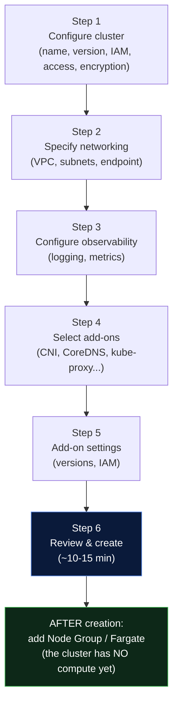
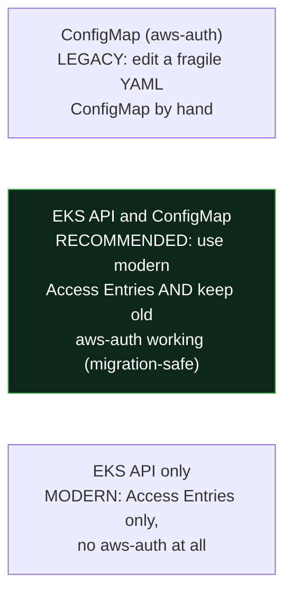
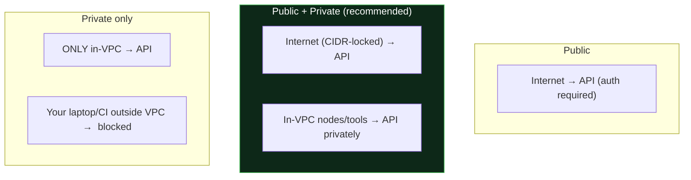
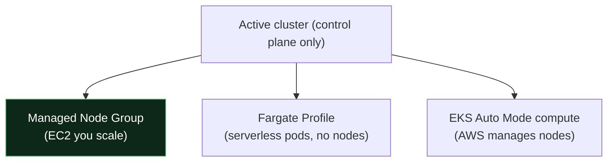

# 00 - Creating EKS from the AWS Console: Every Step and Option Explained

> **Goal:** Walk through the **exact AWS Console "Create EKS cluster" wizard**, field by field, so when you see a screen full of dropdowns and toggles you know **what each one does, what to pick, and what it costs you if you get it wrong.**

> **Analogy:** The console wizard is like the **order form for a custom-built PC.** Every dropdown (CPU, RAM, case) maps to a real decision. This page is the salesperson who explains what each option actually means - so you don't tick "water cooling" without knowing why.

> This is the **visual companion** to [01-manual-eks-setup.md](01-manual-eks-setup.md) (which does the same thing via CLI). Read this to understand the *screens*; read 01 for the *commands*.

---

## Before You Start: What You Can NEVER Change Later

Some choices are **permanent for the life of the cluster.** Get these wrong and your only fix is to delete and rebuild. Decide them deliberately:

| Setting | Immutable? | Why it matters |
|---------|-----------|----------------|
| **Cluster name** | Yes | Baked into ARNs and everything referencing it |
| **Region** | Yes | Cluster lives in one region |
| **VPC** | Yes | You can add subnets, but not move VPCs |
| **IP address family (IPv4/IPv6)** | Yes | Networking model is fixed at birth |
| **Kubernetes service CIDR** | Yes | Overlaps here = permanent routing pain |
| **KMS secrets encryption** | One-way | Can enable later, but **cannot disable** once on |

Everything else (version, endpoint access, logging, add-ons, node groups) **can** be changed after creation.

---

## The Whole Flow at a Glance

> **Critical mental model:** creating the cluster gives you a **control plane only - no worker nodes.** Your pods have nowhere to run until you add a **node group** (or Fargate) afterward. Beginners often create the cluster, run `kubectl get nodes`, see nothing, and panic. That's expected.

**Where to start:** EKS console → **Clusters → Add cluster → Create**.

---

## Quick vs Custom Configuration (the first choice)

The modern console opens by asking **how much you want to configure yourself:**

| Option | What it does | Use when |
|--------|--------------|----------|
| **Quick configuration (EKS Auto Mode)** | AWS manages compute, scaling, networking, storage, and node lifecycle for you. You just deploy pods; AWS provisions/removes nodes automatically. | You want minimal ops, fastest path, and are OK with AWS-opinionated defaults |
| **Custom configuration** | You control every setting below (node groups, add-ons, CNI, etc.) | Learning, or you need specific control (this guide follows Custom) |

> **EKS Auto Mode** (2024+) is like ordering a **fully managed meal** - AWS picks and runs the compute for you (think "Fargate-like ease" but for your whole cluster, including right-sized EC2). **Custom** is cooking yourself: more control, more decisions. We walk the **Custom** path so you learn the pieces; in production, Auto Mode is a legitimate low-ops choice.

---

## STEP 1 - Configure Cluster

### 1.1 Cluster configuration

| Field | What it is / options | Guidance & pitfalls |
|-------|----------------------|---------------------|
| **Name** | A unique name in this account+region | Immutable. Use a clear convention: `prod-web-euw1`. |
| **Kubernetes version** | The minor version (e.g. 1.30, 1.31) | Pick a recent-but-not-bleeding-edge version. You can upgrade later, **one minor at a time**. |
| **Upgrade policy** | **Standard support** (~14 months, included) vs **Extended support** (up to 26 months, **extra hourly cost**) | Standard is fine if you upgrade regularly. Extended buys time for slow-to-upgrade orgs - at a price. Don't pay for Extended just from inertia. |
| **Cluster IAM role** | The **service role** the EKS control plane assumes to manage AWS resources on your behalf (create ENIs, LBs) | Must trust `eks.amazonaws.com` and have `AmazonEKSClusterPolicy`. Create it first if the dropdown is empty (see [01](01-manual-eks-setup.md#step-1---iam-role-for-the-eks-cluster-control-plane)). This is **not** the node role. |

### 1.2 Cluster access (who can administer it)

This is where most "I created it but can't use it" problems are born.

| Field | Options | What each does |
|-------|---------|----------------|
| **Bootstrap cluster administrator access** | Allow / Disallow | **Allow** = the IAM identity creating the cluster is granted `cluster-admin` automatically (via an Access Entry). **Disallow** = no one gets admin by default - you must set up access entries yourself, or you're locked out. **Keep Allow** unless you have a managed access process. |
| **Cluster authentication mode** | **EKS API and ConfigMap** / **EKS API** / **ConfigMap** | How IAM identities map to Kubernetes permissions (see below). |

**Authentication mode - what each means:**

- **ConfigMap** - the old way; one bad edit to `aws-auth` and nobody can log in. Avoid for new clusters.
- **EKS API and ConfigMap** - **best default**: you get modern **Access Entries** (an API, no YAML surgery) while any existing `aws-auth` mappings still work. Safe for migrations.
- **EKS API** - cleanest, Access Entries only. Great for brand-new clusters with no legacy tooling.

> **Pitfall:** choosing **ConfigMap** + **Disallow bootstrap admin** = a real chance of locking every human out of the cluster. Prefer **EKS API and ConfigMap** + **Allow**.

### 1.3 Secrets encryption (KMS)

| Field | What it does |
|-------|--------------|
| **Enable secrets encryption** + choose a **KMS key** | Turns on **envelope encryption** so Kubernetes Secrets are encrypted at rest in etcd with your KMS key - not just base64. Protects secrets in etcd backups. |

> Recommended **on** for production. Remember: **you can enable this later but never turn it off.** Pairs with the wider secrets story in [Day 10 production-secrets.md](../../day10-configmaps-secrets/production-secrets.md).

### 1.4 Cluster tags

Key-value tags for cost allocation, ownership, automation. Cheap insurance - always tag `Environment`, `Owner`, `Project`. (Note: these tag the **cluster resource**, not the nodes.)

---

## STEP 2 - Specify Networking

This step decides where the cluster lives and who can reach its API. **The VPC choice is permanent.**

| Field | What it is / options | Guidance & pitfalls |
|-------|----------------------|---------------------|
| **VPC** | The VPC the cluster's networking lives in | **Immutable.** Use a VPC with both public and private subnets across **≥2 AZs** (3 recommended). |
| **Subnets** | Which subnets EKS may place control-plane ENIs and (later) nodes in | Select your **private** subnets for nodes; include enough AZs. Must be in **≥2 AZs**. Undersized subnets → pods run out of IPs later (VPC CNI uses subnet IPs). |
| **Security groups** | Additional SG(s) applied to the control-plane cross-account ENIs | EKS also creates a **cluster security group** automatically - don't delete that one. Add SGs only if you have specific rules. |
| **Cluster IP address family** | **IPv4** or **IPv6** | **Immutable.** IPv4 is the default and simplest. Choose IPv6 only if you specifically need it (huge pod scale, avoiding IP exhaustion) and understand the trade-offs. |
| **Kubernetes service IPv4 CIDR** (advanced) | The virtual IP range for `ClusterIP` Services (e.g. `10.100.0.0/16`) | **Immutable.** Must **not overlap** your VPC CIDR or any peered/on-prem network. Leave default unless it collides. |

### Cluster endpoint access (very important)

Who can reach the Kubernetes **API server**:

| Option | Who can reach the API | Use when |
|--------|----------------------|----------|
| **Public** | Anyone on the internet (auth still required). Optional **source CIDR allowlist** under advanced. | Demos. Risky for prod unless CIDR-locked. |
| **Public and private** | Internet (ideally CIDR-restricted) **and** in-VPC traffic stays internal | **Most production** - lock public to office/VPN CIDRs. |
| **Private** | Only from inside the VPC (VPN / bastion / in-VPC CI) | Highest security, regulated environments. |

> **The classic self-lockout:** pick **Private** but your laptop/CI isn't inside the VPC (no VPN/bastion) → `Unable to connect to the server: i/o timeout`. Plan your access path *before* going private-only. Good news: **endpoint access is editable after creation**, unlike VPC/CIDR.

---

## STEP 3 - Configure Observability

You can enable everything here later too, but turning it on now means you have data from day one.

### Control plane logging

Five independent toggles - logs ship to **CloudWatch Logs** (and cost money there):

| Log type | What it captures | When it saves you |
|----------|------------------|-------------------|
| **API server** | Requests to the API | Debugging what changed / who called what |
| **Audit** | Security-relevant actions | Forensics: "who deleted that secret?" (verbose + priciest) |
| **Authenticator** | IAM → Kubernetes auth | **The #1 "why can't I connect" log** |
| **Controller manager** | Built-in controllers | Pods/replicas not reconciling |
| **Scheduler** | Scheduling decisions | Pods stuck `Pending` |

> **Recommendation:** enable at least **Authenticator** + **Audit** + **API server** in production. **Cost caution:** Audit is high-volume - set a **retention policy** on the CloudWatch log group (e.g. 30-90 days).

### Metrics / CloudWatch Observability

Newer consoles let you opt into **Prometheus metrics** and the **Amazon CloudWatch Observability** add-on (Container Insights) here or in Step 4. This gives node/pod CPU/memory dashboards. You can also do this later with your own Prometheus/Grafana ([03-eks-best-practices.md](03-eks-best-practices.md#5-logging--monitoring-setup)).

---

## STEP 4 - Select Add-ons

Add-ons are cluster components AWS can install and **version-manage for you** (instead of you patching DaemonSets by hand).

### Core add-ons (usually pre-selected - a cluster needs these to function)

| Add-on | Job | Skip it? |
|--------|-----|----------|
| **Amazon VPC CNI** (`aws-node`) | Gives every pod a real VPC IP | No - required for pod networking |
| **CoreDNS** | In-cluster DNS (service discovery) | No - services can't be found by name without it |
| **kube-proxy** | Routes Service traffic to pods | No - required |
| **Amazon EKS Pod Identity Agent** | Enables **Pod Identity** (simpler per-pod IAM than IRSA) | Optional but recommended for the modern IAM path |

### Common optional add-ons

| Add-on | Why you'd add it |
|--------|------------------|
| **Amazon EBS CSI Driver** | Persistent block storage for StatefulSets/databases (see [02](02-eks-config-explanation.md#8-storage---ebs-csi-vs-efs-csi)) |
| **Amazon EFS CSI Driver** | Shared `ReadWriteMany` file storage across pods/AZs |
| **Mountpoint for Amazon S3 CSI** | Mount S3 buckets as file systems |
| **Amazon CloudWatch Observability** | Container Insights metrics/logs |
| **Snapshot Controller** | Volume snapshots |
| **AWS Marketplace add-ons** | Third-party (e.g. Datadog, Cilium enterprise) |

> **Pitfall:** forgetting the **EBS CSI driver**, then wondering why a `PersistentVolumeClaim` sits `Pending` forever. Storage drivers are add-ons now - not built in.

---

## STEP 5 - Configure Selected Add-ons Settings

For each add-on you picked, you set:

| Setting | What it does |
|---------|--------------|
| **Version** | Which add-on version to install. **Keep add-ons in step with the cluster version** - drifting behind causes DNS/networking bugs after upgrades. |
| **IAM role (Pod Identity / IRSA)** | Some add-ons (EBS/EFS CSI, VPC CNI, CloudWatch) need AWS permissions. Attach a scoped role via **Pod Identity** or **IRSA** rather than relying on the node role - least privilege. |
| **Conflict resolution / config values** | How to handle fields you've customized (Overwrite vs Preserve), plus optional JSON config (e.g. enable **prefix delegation** on VPC CNI for more pod IPs). |

> **Best practice:** give the **VPC CNI** its own IAM role (via Pod Identity/IRSA) instead of the node role - it's the component managing your networking, so scope it tightly.

---

## STEP 6 - Review and Create

Review every choice (especially the **immutable** ones from the top of this page), then **Create**.

> **Timing:** control-plane provisioning takes **~10-15 minutes** (AWS is building a multi-AZ HA control plane). The cluster shows **Creating** → **Active**. Nodes come later and faster.

---

## AFTER Creation - Add Compute (your cluster has none yet)

Once the cluster is **Active**, open it → **Compute** tab. You have three ways to run pods:

### Add a Managed Node Group

**Node group configuration:**

| Field | What it is / options | Guidance |
|-------|----------------------|----------|
| **Name** | Node group identifier | e.g. `ng-general` |
| **Node IAM role** | Role the **EC2 nodes** assume | **Different from the cluster role.** Needs `AmazonEKSWorkerNodePolicy` + `AmazonEKS_CNI_Policy` + `AmazonEC2ContainerRegistryReadOnly`. Miss the CNI policy → `ContainerCreating` forever; miss ECR → `ImagePullBackOff`. |
| **Launch template** (optional) | Use a custom EC2 launch template | For custom AMIs, user-data, disk encryption, IMDSv2 hop-limit hardening. Optional. |
| **Kubernetes labels / taints** | Scheduling metadata on nodes | Labels for `nodeSelector`; taints to reserve nodes (e.g. GPU). |

**Compute configuration:**

| Field | Options | What each does |
|-------|---------|----------------|
| **AMI type** | **AL2023** (default), **Bottlerocket**, **Windows**, **GPU (accelerated)** | AL2023 = modern default Linux. Bottlerocket = minimal, security-focused container OS. GPU for ML. Windows for .NET workloads. |
| **Capacity type** | **On-Demand** / **Spot** | On-Demand = stable, full price. **Spot = up to ~90% cheaper but can be reclaimed** - only for fault-tolerant/stateless workloads. |
| **Instance types** | One or more EC2 types | Pick several (e.g. `t3.medium`, `t3a.medium`) to improve Spot availability. Size for your pods. |
| **Disk size** | Root EBS volume per node (GB) | Default ~20GB. Bump for image-heavy or log-heavy workloads. |

**Scaling configuration:**

| Field | What it does |
|-------|--------------|
| **Desired size** | Nodes to start with |
| **Minimum size** | Floor the group won't scale below |
| **Maximum size** | Ceiling (also the cap the Cluster Autoscaler/Karpenter can grow to) |
| **Node group update config - max unavailable** | How many nodes can be replaced at once during upgrades. Higher = faster upgrade, more disruption. Pair with **PodDisruptionBudgets**. |

**Networking:**

| Field | What it does |
|-------|--------------|
| **Subnets** | Which subnets nodes launch in - **choose PRIVATE subnets** (multi-AZ). |
| **Configure SSH access (remote access)** | Optionally attach an SSH key + source SG. **Prefer leaving this off** and using SSM Session Manager - no open SSH port = smaller attack surface. |

### Add a Fargate Profile (optional - serverless pods)

| Field | What it does |
|-------|--------------|
| **Name** | Profile identifier |
| **Pod execution role** | IAM role Fargate uses to run pods (pull images, write logs) |
| **Subnets** | Private subnets pods run in |
| **Namespace + label selectors** | Which pods run on Fargate: any pod matching this namespace (and optional labels) runs serverless, no node needed |

> Fargate is great for bursty/low-ops workloads and per-pod isolation, but **no DaemonSets, no privileged pods, pricier per-vCPU**. See the trade-offs in [02](02-eks-config-explanation.md#3-node-groups---managed-vs-self-managed-vs-fargate).

---

## Console vs CLI vs Terraform - which field lives where

| Console screen | CLI equivalent | Terraform equivalent |
|----------------|----------------|----------------------|
| Step 1 cluster config | `aws eks create-cluster` | `module.eks` inputs |
| Step 2 networking | `--resources-vpc-config` | `vpc_id`, `subnet_ids`, endpoint vars |
| Step 3 logging | `--logging ...` | `cluster_enabled_log_types` |
| Steps 4-5 add-ons | `aws eks create-addon` | `cluster_addons` |
| Node group | `aws eks create-nodegroup` | `eks_managed_node_groups` |

> The console is best for **learning and first-time visibility**. For anything repeatable, use **[Terraform](04-eks-terraform-setup/README.md)** - clicking through this wizard for prod is not reproducible and drifts over time.

---

## Top Console Pitfalls

1. **Expecting nodes after cluster creation** - you must add a node group/Fargate separately.
2. **Private endpoint with no VPN/bastion** - instant self-lockout.
3. **ConfigMap auth + Disallow bootstrap admin** - risk of locking out all admins.
4. **VPC / IP family / service CIDR** chosen carelessly - these are **permanent**.
5. **Undersized subnets** - pods run out of IPs weeks later.
6. **Node IAM role missing CNI/ECR policies** - `ContainerCreating` / `ImagePullBackOff`.
7. **Add-ons left behind cluster version** on upgrade - flaky DNS/networking.
8. **Audit logging on with no retention** - a surprise CloudWatch bill.
9. **Leaving SSH remote access open** - needless attack surface (use SSM instead).
10. **Building prod by clicking** - not reproducible; move to Terraform once you understand it.

---

## Self-Check
1. After the wizard finishes and the cluster is Active, why does `kubectl get nodes` return nothing?
2. Which Step 1 combination risks locking every admin out, and what should you pick instead?
3. Name three settings that are **impossible to change** after creation.
4. What breaks if you choose **Private** endpoint access but your CI runs outside the VPC?
5. Which three IAM policies must the **node** role have, and what fails if each is missing?

---

**Next:** [01 - Manual EKS Setup (CLI) →](01-manual-eks-setup.md) · [Section index](README.md)
