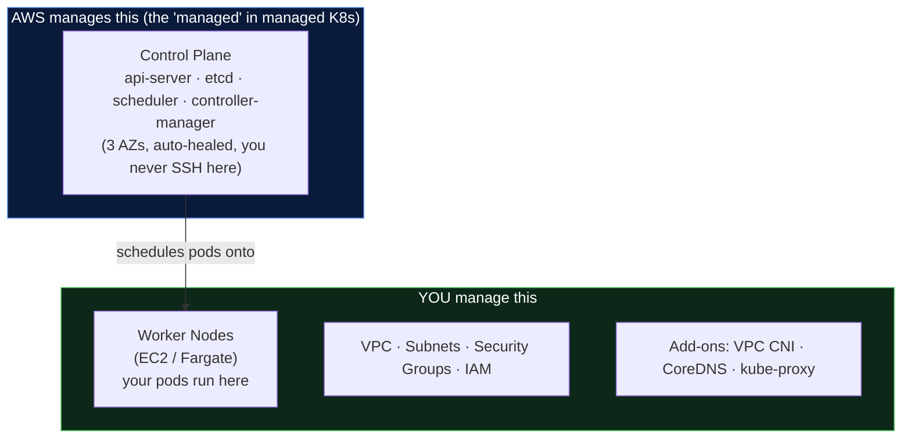
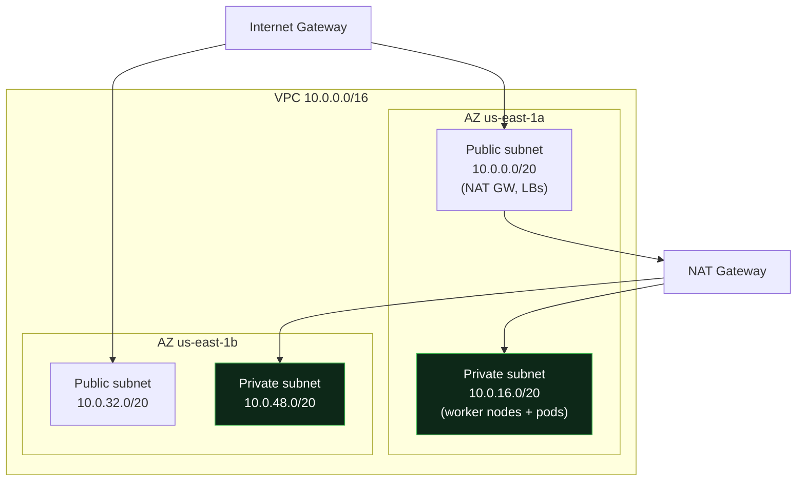

# 01 - Manual EKS Cluster Creation (Console + CLI)

> **Goal:** Stand up a production-shaped Amazon EKS cluster **by hand** first, so you understand every moving part *before* you automate it with Terraform. You can't debug what you've only ever `apply`-ed.

> **Analogy:** Building the cluster manually once is like assembling flat-pack furniture without the electric screwdriver the first time. Slower - but now you know which screw does what, so when the automated tool strips a thread, you know exactly where to look.

---

## The Big Picture First

Before any clicking, understand what EKS actually gives you and what it doesn't:



> **Key mental model:** EKS = "AWS runs the Kubernetes brain (control plane); you bring the muscle (nodes) and the plumbing (VPC/IAM)." You pay **$0.10/hour (~$73/mo) per cluster** for the control plane, plus whatever your nodes cost.

---

## Step 0 - Prerequisites

| Tool / Resource | Why you need it | Check |
|-----------------|-----------------|-------|
| **AWS account + admin/appropriate IAM** | To create the cluster, roles, VPC | `aws sts get-caller-identity` |
| **AWS CLI v2** | Talk to AWS; generate kubeconfig | `aws --version` (want v2.x) |
| **kubectl** | Talk to the cluster once it's up | `kubectl version --client` |
| **eksctl** *(optional but recommended)* | The fastest CLI to create EKS correctly | `eksctl version` |
| **IAM permissions** | You need rights to create EKS, EC2, IAM, VPC | see below |
| **A VPC with subnets** | EKS *must* live in a VPC; nodes need subnets | we'll create/verify |

> ⚠️ **Version-skew rule:** keep your `kubectl` **within one minor version** of the cluster. A 1.30 cluster works with kubectl 1.29-1.31, not 1.26.

### The IAM permissions you actually need
You (the human/CI principal) need to be able to create: `eks:*`, `ec2:*` (for VPC/ENI/SG), `iam:CreateRole`/`AttachRolePolicy`/`PassRole`, and `cloudformation:*` if using eksctl (it uses CloudFormation under the hood). For learning, an admin role is fine; for real orgs, scope this down.

---

## Step 1 - IAM Role for the EKS **Cluster** (control plane)

**Why:** The EKS control plane is an AWS-run service that needs permission to act **on your behalf** - create the ENIs (network cards) that connect the control plane to your VPC, manage load balancers, etc. That permission is granted via an **IAM role the EKS service assumes.**

> **Analogy:** You're hiring a building manager (the EKS service). You give them a **badge** (IAM role) that opens only the doors they need (create network interfaces, read your VPC). They can't open your other offices.

```bash
# Trust policy: ONLY the EKS service may assume this role
cat > eks-cluster-trust.json <<'EOF'
{
  "Version": "2012-10-17",
  "Statement": [{
    "Effect": "Allow",
    "Principal": { "Service": "eks.amazonaws.com" },
    "Action": "sts:AssumeRole"
  }]
}
EOF

aws iam create-role \
  --role-name eks-cluster-role \
  --assume-role-policy-document file://eks-cluster-trust.json

# The AWS-managed policy that grants exactly what the control plane needs
aws iam attach-role-policy \
  --role-name eks-cluster-role \
  --policy-arn arn:aws:iam::aws:policy/AmazonEKSClusterPolicy
```

> 🕳️ **Common pitfall:** People attach `AmazonEKSClusterPolicy` to the **node** role by mistake, or forget the trust policy's `Service: eks.amazonaws.com`. Wrong trust principal = "cannot assume role" at create time.

---

## Step 2 - Networking (VPC, Subnets, Security Groups)

**Why this is the step that makes or breaks the cluster:** EKS networking is not an afterthought - the **VPC CNI gives every pod a real VPC IP address.** That means your subnets must have **enough IP space for pods, not just nodes.** Undersized subnets = "pods stuck in `ContainerCreating`, no IPs available" in month three.

### The recommended layout (multi-AZ, public + private)



**Design rules that matter in production:**
- **Nodes go in PRIVATE subnets.** No public IPs on your workers = smaller attack surface. Outbound internet (pull images, reach AWS APIs) goes through a **NAT Gateway** in the public subnet.
- **At least 2 AZs** (3 is better). If an AZ dies and all your nodes were in it, your app is down. Multi-AZ is the #1 availability lever.
- **Big private subnets** (`/20` = 4091 usable IPs each). With the VPC CNI, **pods consume subnet IPs**, so size for pods × nodes, not just nodes.
- **Subnet tagging is mandatory for EKS to auto-discover them for load balancers:**

```bash
# Public subnets (for internet-facing load balancers)
kubernetes.io/role/elb = 1
# Private subnets (for internal load balancers)
kubernetes.io/role/internal-elb = 1
# Both (older requirement, still wise): tag with the cluster name
kubernetes.io/cluster/<cluster-name> = shared
```

> 🕳️ **The classic outage:** forgetting the `kubernetes.io/role/elb` tags → you create an Ingress/Service type LoadBalancer and **nothing happens**, because the AWS Load Balancer Controller can't find a subnet to place the LB in.

### Security Groups
- **Cluster security group** (EKS creates one): allows control-plane ↔ node communication. Don't delete it.
- **Node security group:** allow nodes to talk to each other (pod-to-pod across nodes) and to the control plane on 443/10250.
- Keep it tight: **do not** open `0.0.0.0/0` to node ports.

---

## Step 3 - Create the Cluster (two paths)

### Path A - eksctl (recommended for humans; does networking + IAM for you)

```bash
# One command creates VPC, subnets, IAM roles, cluster, and a managed nodegroup
eksctl create cluster \
  --name demo-eks \
  --region ap-south-1 \
  --version 1.30 \
  --vpc-nat-mode Single \
  --node-private-networking \        # nodes in private subnets
  --managed \
  --nodegroup-name ng-default \
  --node-type t3.medium \
  --nodes 2 --nodes-min 2 --nodes-max 5 \
  --with-oidc                        # ENABLE OIDC now → needed for IRSA later
```

> 💡 **Always pass `--with-oidc`.** It sets up the OIDC identity provider that **IRSA** (pod-level IAM) depends on. Adding it later is a chore; enabling it upfront costs nothing.

### Path B - AWS CLI (shows the raw API; good for understanding)

```bash
# Control plane only (nodes come after)
aws eks create-cluster \
  --name demo-eks \
  --region ap-south-1 \
  --kubernetes-version 1.30 \
  --role-arn arn:aws:iam::<acct>:role/eks-cluster-role \
  --resources-vpc-config \
      subnetIds=subnet-aaa,subnet-bbb,subnet-ccc,subnet-ddd,\
endpointPublicAccess=true,endpointPrivateAccess=true,\
publicAccessCidrs=<YOUR_OFFICE_IP>/32 \
  --logging '{"clusterLogging":[{"types":["api","audit","authenticator","controllerManager","scheduler"],"enabled":true}]}'

# Wait ~10-15 min for control plane to be ACTIVE
aws eks wait cluster-active --name demo-eks
```

> ⏱️ **Control plane creation takes 10-15 minutes.** This is normal - AWS is provisioning a multi-AZ, HA Kubernetes control plane. Nodes come up faster.

---

## Step 4 - Cluster Endpoint Access (public vs private)

**Why this matters:** the "endpoint" is the address of the Kubernetes API server - where `kubectl` and your control plane management traffic go. Who can reach it is a **major security decision.**

| Mode | Who can reach the API | Use when |
|------|----------------------|----------|
| **Public** (default) | Anyone on the internet (auth still required) | Demos only; risky for prod |
| **Public + Private** | Internet **restricted by CIDR** + inside-VPC traffic stays private | **Most common prod** - lock public to office/VPN CIDR |
| **Private only** | Only from inside the VPC / via VPN/bastion | Highest security, regulated envs |

```bash
# Best practice: enable private access + restrict public to known CIDRs
aws eks update-cluster-config --name demo-eks \
  --resources-vpc-config \
    endpointPublicAccess=true,endpointPrivateAccess=true,\
publicAccessCidrs=203.0.113.10/32
```

> 🕳️ **Pitfall - locking yourself out:** if you set **private-only** but your CI/CD or your laptop isn't inside the VPC (no VPN/bastion), you'll get `Unable to connect to the server: dial tcp ... i/o timeout`. Plan your access path *before* going private-only.

---

## Step 5 - Worker Nodes (Managed Node Group)

**Why nodes need their own IAM role:** each node (an EC2 instance running the kubelet) must register with the cluster, pull images from ECR, and let the CNI attach pod IPs. Those permissions come from the **node IAM role.**

```bash
# Node role trust: EC2 assumes it
aws iam create-role --role-name eks-node-role \
  --assume-role-policy-document '{"Version":"2012-10-17","Statement":[{"Effect":"Allow","Principal":{"Service":"ec2.amazonaws.com"},"Action":"sts:AssumeRole"}]}'

# The three policies EVERY node role needs:
aws iam attach-role-policy --role-name eks-node-role --policy-arn arn:aws:iam::aws:policy/AmazonEKSWorkerNodePolicy
aws iam attach-role-policy --role-name eks-node-role --policy-arn arn:aws:iam::aws:policy/AmazonEKS_CNI_Policy
aws iam attach-role-policy --role-name eks-node-role --policy-arn arn:aws:iam::aws:policy/AmazonEC2ContainerRegistryReadOnly

# Create the managed node group (AWS handles AMI, scaling, draining)
aws eks create-nodegroup \
  --cluster-name demo-eks \
  --nodegroup-name ng-default \
  --node-role arn:aws:iam::<acct>:role/eks-node-role \
  --subnets subnet-priv-a subnet-priv-b \
  --instance-types t3.medium \
  --scaling-config minSize=2,maxSize=5,desiredSize=2 \
  --ami-type AL2023_x86_64_STANDARD
```

**The 3 node-role policies, in plain English:**
- `AmazonEKSWorkerNodePolicy` → "let this node join the cluster."
- `AmazonEKS_CNI_Policy` → "let the CNI attach pod IP addresses (ENIs)."
- `AmazonEC2ContainerRegistryReadOnly` → "let it pull container images from ECR."

> 🕳️ **Pitfall:** miss `AmazonEKS_CNI_Policy` and pods fail to get IPs → stuck `ContainerCreating`. Miss the ECR policy → `ImagePullBackOff` on private images.

> 💡 **Managed vs self-managed** (covered deeply in [02-eks-config-explanation.md](02-eks-config-explanation.md)): use **managed node groups** unless you have a specific reason not to - AWS handles AMI patching, graceful draining on scale-down, and rolling updates.

---

## Step 6 - Add-ons (VPC CNI, CoreDNS, kube-proxy)

**Why add-ons exist:** a bare control plane has no networking or DNS for your pods. These three add-ons are the **minimum for a functioning cluster.** EKS can manage their lifecycle (versioning, upgrades) as **"EKS add-ons"** instead of you patching DaemonSets by hand.

| Add-on | Job | Analogy |
|--------|-----|---------|
| **VPC CNI** (`aws-node`) | Gives each pod a real VPC IP | The postal service assigning every pod a street address |
| **CoreDNS** | In-cluster DNS (`my-svc.ns.svc.cluster.local`) | The phone book pods use to find each other |
| **kube-proxy** | Routes Service traffic to the right pods | The switchboard connecting calls to services |

```bash
# Install/upgrade as managed EKS add-ons (recommended over self-managed)
aws eks create-addon --cluster-name demo-eks --addon-name vpc-cni
aws eks create-addon --cluster-name demo-eks --addon-name coredns
aws eks create-addon --cluster-name demo-eks --addon-name kube-proxy

# See versions & upgrade paths
aws eks describe-addon-versions --addon-name vpc-cni --kubernetes-version 1.30
```

> 💡 **Modern best practice:** run **VPC CNI with IRSA** (give the `aws-node` service account its own IAM role) instead of relying on the node role - least privilege for the component that manages networking. The Terraform module wires this for you.

> 🕳️ **Pitfall:** upgrading the cluster version but leaving add-ons on old versions → subtle DNS/networking breakage. Keep add-ons in step with the control plane.

---

## Step 7 - Logging & Observability

**Why:** when the control plane misbehaves (auth failures, admission denials), you need the **control-plane logs** - which are off by default and can't be turned on retroactively for past events.

```bash
# Enable control-plane logs → they flow to CloudWatch Logs
aws eks update-cluster-config --name demo-eks \
  --logging '{"clusterLogging":[{"types":["api","audit","authenticator","controllerManager","scheduler"],"enabled":true}]}'
```

**The 5 log types and when each saves you:**
- **api** → who called the API and what happened.
- **audit** → security forensics ("who deleted that secret?").
- **authenticator** → IAM→K8s auth failures (the #1 "why can't I connect" log).
- **controllerManager** / **scheduler** → why pods aren't scheduling / controllers misbehaving.

> ⚠️ **Cost note:** control-plane logs (especially `audit`) can be **voluminous and pricey** in CloudWatch. Enable what you need, set **log-group retention** (e.g. 30-90 days), and ship to cheaper storage if you must keep them long-term.

Node/pod-level observability (Prometheus, Grafana, CloudWatch Container Insights) is covered in [03-eks-best-practices.md](03-eks-best-practices.md).

---

## Step 8 - Connect and Verify

```bash
# Generate/merge kubeconfig for this cluster
aws eks update-kubeconfig --name demo-eks --region ap-south-1

# Verify the control plane answers and nodes are Ready
kubectl get nodes -o wide
kubectl get pods -A            # aws-node, coredns, kube-proxy should be Running
kubectl cluster-info
```

Expected: two `Ready` nodes, and the three add-on pods `Running`. If nodes are `NotReady`, it's almost always **CNI (no pod IPs)** or the **node role missing a policy** - check `kubectl describe node` and the `aws-node` pod logs.

---

## End-to-End Recap

```mermaid
flowchart LR
    A["1. IAM cluster role"] --> B["2. VPC + subnets<br/>(tagged, multi-AZ)"]
    B --> C["3. Create control plane<br/>(10-15 min)"]
    C --> D["4. Endpoint access<br/>(public+private, CIDR-locked)"]
    D --> E["5. Node role + managed<br/>node group (private subnets)"]
    E --> F["6. Add-ons<br/>CNI · CoreDNS · kube-proxy"]
    F --> G["7. Control-plane logging"]
    G --> H["8. update-kubeconfig<br/>→ kubectl get nodes"]
    style C fill:#0a1a3a,stroke:#5b8def,color:#fff
    style H fill:#0d2818,stroke:#3fb950,color:#fff
```



---

## Top 10 Manual-Setup Pitfalls (memorize these)

1. **Undersized private subnets** → pods run out of IPs (VPC CNI uses subnet IPs).
2. **Missing subnet tags** (`kubernetes.io/role/elb`) → load balancers won't provision.
3. **Wrong IAM trust principal** (`eks.amazonaws.com` vs `ec2.amazonaws.com`) → can't assume role.
4. **Node role missing `AmazonEKS_CNI_Policy`** → `ContainerCreating` forever.
5. **Node role missing ECR policy** → `ImagePullBackOff`.
6. **Forgot `--with-oidc`** → IRSA won't work later.
7. **Private-only endpoint with no VPN/bastion** → you lock yourself out.
8. **Nodes in public subnets** with public IPs → needless attack surface.
9. **Single-AZ node group** → one AZ failure = full outage.
10. **Add-ons drifting behind the control-plane version** → flaky DNS/networking after upgrades.

---

## Self-Check
1. Why does the **cluster** IAM role trust `eks.amazonaws.com` but the **node** role trusts `ec2.amazonaws.com`?
2. With the VPC CNI, why does subnet **size** directly limit how many **pods** you can run?
3. What breaks if you forget the `kubernetes.io/role/elb` subnet tags?
4. Give one real scenario where **private-only endpoint** access would lock out your CI/CD, and how you'd fix it.
5. Name the three add-ons and what each one does.

---

**Next:** [02 - EKS Configuration Deep Dive →](02-eks-config-explanation.md)
