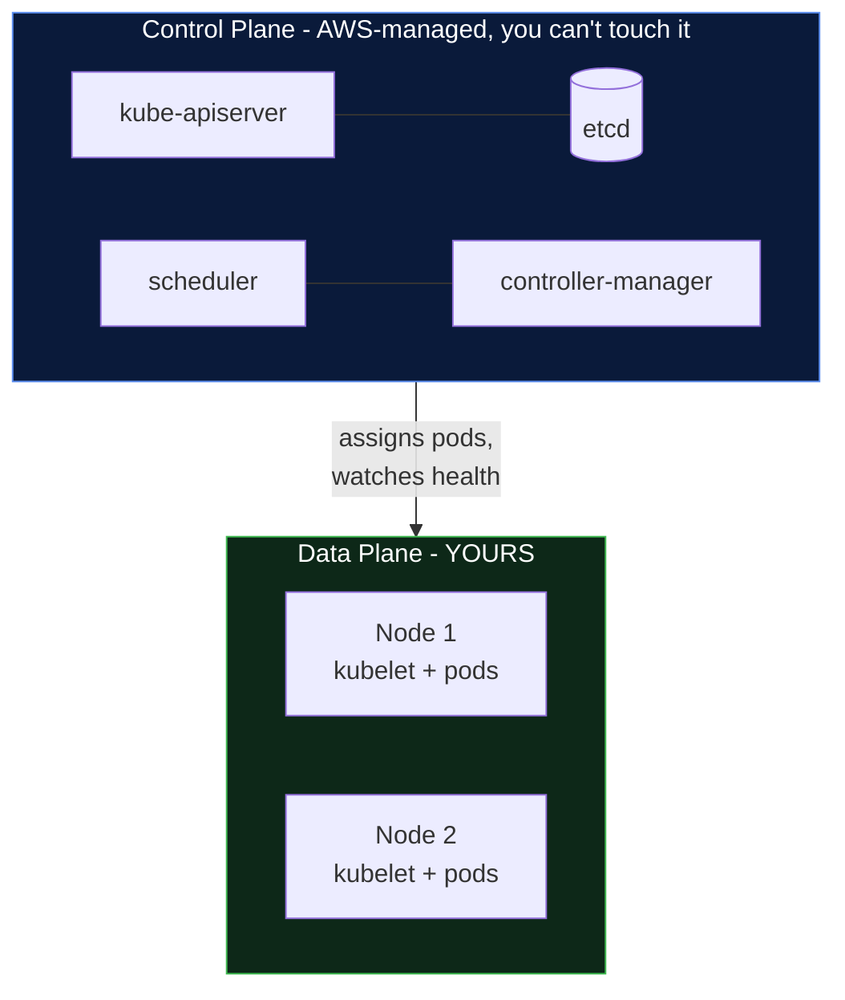
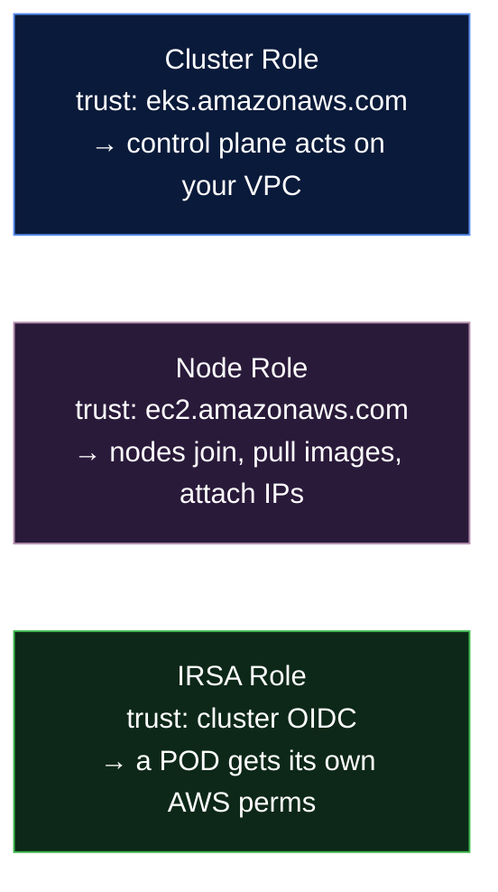
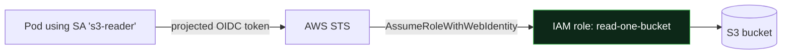
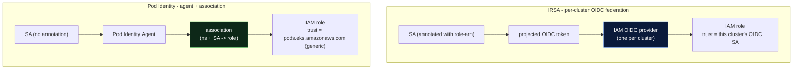
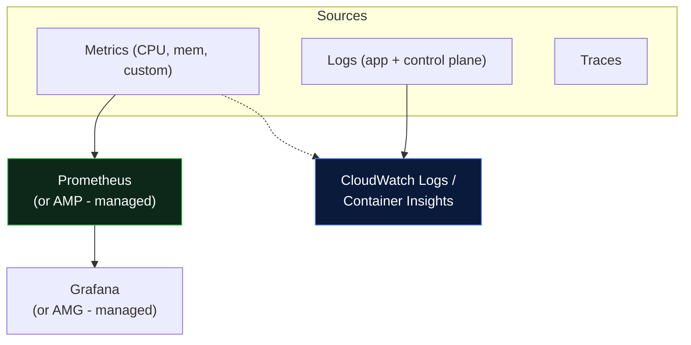

# 02 - EKS Configuration Deep Dive

> **Goal:** Understand the **trade-offs** behind every EKS design choice - so you can defend your architecture in a design review, not just copy a tutorial. This is the "why" companion to the "how" in [01-manual-eks-setup.md](01-manual-eks-setup.md).

---

## 1. VPC & Subnet Design

### Public vs Private subnets - the core rule

> **Analogy:** A private subnet is the **kitchen** of a restaurant - staff (nodes/pods) work there, customers never enter. The public subnet is the **front door and reception** (load balancers, NAT) - the only place the outside world touches.

| | Public subnet | Private subnet |
|---|---|---|
| **Has route to Internet Gateway?** | Yes (direct) | No (via NAT only) |
| **What lives here** | Load balancers, NAT gateways, bastion | **Worker nodes + pods** |
| **Inbound from internet** | Yes | Never directly |
| **Why** | Front door for traffic | Protect the workloads |

**Multi-AZ is non-negotiable for production.** Spread subnets across **≥2 (ideally 3) AZs.** The control plane is already multi-AZ (AWS handles it); your **nodes** must be too, or an AZ outage takes your app down.

### IP sizing - the mistake that surfaces months later
The VPC CNI assigns **each pod a real VPC IP**. A `t3.medium` can host ~17 pods; each of those eats a subnet IP. Formula to keep in your head:

```
IPs needed per subnet ≈ (max nodes in that AZ) × (pods per node) + headroom
```

> **Real-world failure:** a `/24` private subnet (251 usable IPs) looks fine with 3 nodes, then autoscaling to 12 nodes × 15 pods = 180 IPs + ENIs blows past it → `failed to assign an IP address to container`. **Use `/20` or larger** for node subnets, or adopt **prefix delegation** / **custom networking** to stretch IPs.

---

## 2. Control Plane vs Worker Nodes



| | Control Plane | Worker Nodes |
|---|---|---|
| **Who manages** | AWS (HA across 3 AZs, auto-patched) | **You** (or managed node groups) |
| **You pay** | $0.10/hr flat per cluster | EC2/Fargate cost of the nodes |
| **You can SSH?** | No | Yes (but prefer not to) |
| **Scales how** | AWS scales it invisibly | You scale via ASG / Karpenter |

**Implication:** you never tune etcd or api-server flags on EKS (a trade-off vs self-managed K8s - less control, far less ops burden). Your energy goes into **nodes, networking, and workloads.**

---

## 3. Node Groups - Managed vs Self-Managed vs Fargate

| Option | Who patches the OS/AMI | Draining on scale-down | Best for |
|--------|------------------------|------------------------|----------|
| **Managed node group** | AWS (you trigger) | Graceful, automatic | **Default choice** - 90% of workloads |
| **Self-managed** (raw ASG) | You | You script it | Custom AMIs, special kernels, GPU tuning |
| **Fargate** (serverless pods) | AWS (no nodes at all) | N/A - per-pod | Spiky/low-ops workloads, per-pod isolation |

> **Analogy:** Managed node groups are a **leased car with a service plan** (AWS does maintenance on schedule). Self-managed is **owning the car** (full control, all the wrenching). Fargate is **Uber** - no car at all, you just request a ride (pod) and pay per trip.

**Trade-offs that bite:**
- **Managed** can't use fully custom AMIs easily and gives less bootstrap control → fine for most.
- **Self-managed** = you own AMI patching and node draining; forget the drain logic and rolling updates cause **downtime**.
- **Fargate** = no DaemonSets, no privileged pods, pricier per-vCPU, ~higher pod start latency; great for jobs and bursty services, awkward for things needing node-level agents.

---

## 4. IAM Roles - the three you must not confuse



### IRSA - the one that makes EKS secure (and confuses everyone)

**The problem it solves:** without IRSA, *every pod on a node inherits the node's IAM role.* So your logging pod and your payment-service pod share the same AWS powers - a violation of least privilege. If one is compromised, the attacker has the node's full permissions.

**IRSA (IAM Roles for Service Accounts)** gives **each Kubernetes ServiceAccount its own IAM role**, via the cluster's OIDC provider.

> **Analogy:** Without IRSA, everyone in the building shares **one master keycard** (the node role). IRSA gives each employee (pod) their **own keycard** scoped to just their office.



```yaml
# The ServiceAccount is annotated with the role ARN - that's the whole trick
apiVersion: v1
kind: ServiceAccount
metadata:
  name: s3-reader
  annotations:
    eks.amazonaws.com/role-arn: arn:aws:iam::111122223333:role/read-one-bucket
```

> **Newer alternative - EKS Pod Identity** (2024+): a simpler association API that doesn't require managing OIDC trust policies per role. IRSA is still everywhere and portable; Pod Identity is easier to operate on EKS specifically. For new EKS-only clusters, evaluate Pod Identity; IRSA remains the safe, widely-documented default.

### IRSA vs EKS Pod Identity (know this difference)

Both give a **pod its own IAM role** instead of the shared node role - they just wire the trust two different ways. This is a very common interview and design question, and it also decides how your **EKS add-ons** (EBS/EFS CSI, VPC CNI, etc.) get their AWS permissions.

**IRSA (IAM Roles for Service Accounts)** - the original (2019). It federates through an **IAM OIDC identity provider**:

- Each cluster exposes an OIDC issuer URL; you register it once as an **IAM OIDC identity provider** (one per cluster).
- The IAM role's **trust policy** references *that specific provider* and the ServiceAccount (`system:serviceaccount:ns:sa`).
- The ServiceAccount is annotated with `eks.amazonaws.com/role-arn`.
- The pod gets a projected OIDC token and calls `AssumeRoleWithWebIdentity`.

**EKS Pod Identity** - the newer way (2023). **No OIDC provider at all:**

- You install the **EKS Pod Identity Agent** add-on (a DaemonSet on the nodes).
- You create an **association** (`aws eks create-pod-identity-association`) linking a namespace + ServiceAccount to an IAM role - an EKS API call, kept *separate* from the role.
- The role's trust policy just trusts the generic `pods.eks.amazonaws.com` principal - no cluster-specific OIDC - so the **same role can be reused across many clusters**.
- No ServiceAccount annotation needed.



| Aspect | IRSA | EKS Pod Identity |
|--------|------|------------------|
| **Introduced** | 2019 (mature, everywhere) | 2023 (newer, simpler ops) |
| **Needs an OIDC provider?** | **Yes** - one IAM OIDC identity provider per cluster | **No** - uses the Pod Identity Agent add-on |
| **Role trust policy** | References *this cluster's* OIDC provider + SA | Generic `pods.eks.amazonaws.com` |
| **Reuse one role across many clusters** | Painful (add each cluster's OIDC to the trust policy) | **Easy** (same role, one association per cluster) |
| **SA annotation** | Required (`eks.amazonaws.com/role-arn`) | Not needed (the association maps it) |
| **Where it works** | EKS **and** any OIDC-federated K8s (portable) | **EKS only** |
| **Fargate pods** | **Supported** | **Not supported** (agent is a DaemonSet; EC2 nodes only) |
| **How the pod gets creds** | OIDC token -> `AssumeRoleWithWebIdentity` | Agent -> role via the association |
| **Best for** | Fargate, portable/multi-cloud, tools that only document IRSA | New EKS-only clusters, many clusters/roles, least setup |

> **On "identity provider":** IRSA *is* the identity-provider path - EKS registers the cluster's OIDC issuer as an **IAM OIDC identity provider**, and IAM federates the pod's token through it. **Pod Identity removes that identity-provider machinery entirely** and uses a direct EKS-managed association instead. So "IRSA = OIDC identity provider; Pod Identity = no identity provider, just an association."

> **Analogy:** IRSA is every robot carrying a **passport** (OIDC token) that a border agent (the per-cluster IAM OIDC provider) verifies. Pod Identity is a **building keycard system** (the Pod Identity Agent) where you just add the robot to an **access list** (the association) - no passports, no per-cluster border post.

**For EKS add-ons:** managed add-ons that need AWS permissions (EBS/EFS CSI driver, VPC CNI, CloudWatch) can get their IAM role **either way** - attach a role ARN via **IRSA** (what the Terraform in [04](04-eks-terraform-setup/README.md) does for the EBS CSI driver) or create a **Pod Identity association** for the add-on's ServiceAccount. New clusters increasingly prefer Pod Identity for this.

> **One-liner:** IRSA federates a pod's ServiceAccount token through a **per-cluster IAM OIDC identity provider**; **EKS Pod Identity** replaces that with an **agent plus a namespace/ServiceAccount-to-role association**, giving reusable roles and far less setup - at the cost of being **EKS-only and not supporting Fargate**.

---

## 5. Networking - CNI, IP ranges, Service CIDR

- **VPC CNI (default):** pods get **VPC-routable IPs** → simplest security-group integration, but consumes VPC IPs fast. Mitigate with **prefix delegation** (assign /28 blocks to nodes → far more pods per node) or **custom networking** (pods in a separate CIDR).
- **Alternative CNIs** (Cilium, Calico): richer network policy, eBPF dataplane, overlay options to conserve VPC IPs. Trade-off: more to operate; you leave the "it just works with SGs" path.
- **Service CIDR:** a **virtual** IP range for `ClusterIP` Services (e.g. `10.100.0.0/16`), **separate from the VPC CIDR** and **immutable after creation.** CoreDNS typically sits at `.10` of this range.

> **Pitfall:** picking a Service CIDR that **overlaps** with your VPC or a peered network → routing chaos you can't fix without recreating the cluster. Choose a non-overlapping range up front.

```
VPC CIDR         10.0.0.0/16    ← real IPs: nodes + pods (VPC CNI)
Service CIDR     10.100.0.0/16  ← virtual: ClusterIP services only
                 (must NOT overlap the VPC or peered VPCs)
```

---

## 6. Security - RBAC, IAM auth, least privilege

EKS has **two layers of "who are you"** and it trips up everyone:


- **Authentication = AWS IAM.** EKS maps IAM identities to Kubernetes users/groups. Historically via the **`aws-auth` ConfigMap**; the **modern way is EKS Access Entries / Access Policies** (2024+) - an API instead of hand-editing a fragile ConfigMap.
- **Authorization = Kubernetes RBAC.** Once you're mapped to a group, standard `Role`/`RoleBinding` decide what you can do (see [Day 17 - RBAC](../../day17-rbac-security/notes.md) and the Secrets-RBAC section in [Day 10](../../day10-configmaps-secrets/notes.md)).

> **The #1 EKS lockout:** corrupting the `aws-auth` ConfigMap so **no IAM identity maps to `system:masters`** → nobody can administer the cluster. The creator identity keeps admin access, and **Access Entries** largely eliminate this footgun. Prefer them on new clusters.

**Least privilege in practice:** dedicated IRSA role per app · no wildcard `iam:*` on node roles · `system:masters` for as few humans as possible · audit with `kubectl auth can-i --list`.

---

## 7. Cluster Endpoint - Public vs Private Trade-offs

| Mode | Security | Operational ease | When |
|------|----------|------------------|------|
| **Public** | Weakest (internet-facing API) | Easiest | Demos only |
| **Public + Private (CIDR-locked)** | Good | Easy | **Most production** |
| **Private only** | Strongest | Needs VPN/bastion/CI-in-VPC | Regulated / high-security |

**The real-world trade-off:** private-only is the security ideal, but it means **your CI/CD runner and your engineers must reach the API from inside the VPC** (VPN, bastion, or self-hosted runners in-VPC). Many teams land on **public+private with `publicAccessCidrs` locked to office/VPN ranges** - 90% of the security benefit, a fraction of the friction.

---

## 8. Storage - EBS CSI vs EFS CSI

| | EBS CSI | EFS CSI |
|---|---|---|
| **Type** | Block storage (a virtual disk) | Shared file system (NFS) |
| **Access** | **ReadWriteOnce** - one node at a time | **ReadWriteMany** - many pods at once |
| **AZ** | **Locked to one AZ** | Spans AZs |
| **Use for** | Databases, StatefulSets, single-writer | Shared assets, ML datasets, WordPress uploads |

> **Analogy:** EBS is a **USB drive** - plug it into one laptop at a time, and it lives in one building (AZ). EFS is a **shared network drive** - everyone mounts it at once, from any building.

> **Pitfall - the StatefulSet that won't reschedule:** an EBS volume in `us-east-1a` **cannot** attach to a pod that gets scheduled in `us-east-1b`. Use topology-aware scheduling (the EBS CSI driver sets this) or your DB pod gets stuck `Pending` after a node failure in the wrong AZ. Both drivers should be installed as **EKS add-ons with IRSA**.

---

## 9. Observability - CloudWatch vs Prometheus/Grafana



- **CloudWatch Container Insights** - lowest effort, native AWS, good for logs + basic metrics + alarms. Trade-off: **cost at scale** and less flexible dashboards.
- **Prometheus + Grafana** - the K8s-native standard; rich metrics/alerting/dashboards. Run it yourself, or use **Amazon Managed Prometheus (AMP) + Managed Grafana (AMG)** to skip the ops.
- **Real-world combo:** control-plane + app logs → CloudWatch; metrics/alerting → Prometheus/AMP; dashboards → Grafana. (Full setup in [03-eks-best-practices.md](03-eks-best-practices.md).)

---

## Decision Cheat-Sheet

| Question | Production default |
|----------|--------------------|
| Subnets? | Private nodes, public LBs, **3 AZs**, `/20`+ |
| Node group? | **Managed** (Fargate for bursty jobs) |
| Pod IAM? | **IRSA** (or Pod Identity on new EKS) |
| CNI? | VPC CNI + **prefix delegation**; Cilium if you need advanced policy |
| Endpoint? | **Public+Private, CIDR-locked** |
| Auth? | **EKS Access Entries** (not `aws-auth`) |
| DB storage? | **EBS CSI** (topology-aware) |
| Shared storage? | **EFS CSI** |
| Metrics? | **Prometheus/AMP + Grafana** |

---

## Self-Check
1. Why can a `/24` node subnet run out of IPs even with only a dozen nodes?
2. Explain the difference between **authentication (IAM)** and **authorization (RBAC)** in EKS.
3. When would you choose **EFS** over **EBS**, and what breaks if you pick EBS for a multi-AZ shared-write workload?
4. What problem does **IRSA** solve that the node role can't?
5. Why must the **Service CIDR** not overlap the VPC CIDR?

---

**Previous:** [← 01 - Manual EKS Setup](01-manual-eks-setup.md) · **Next:** [03 - Best Practices →](03-eks-best-practices.md)
