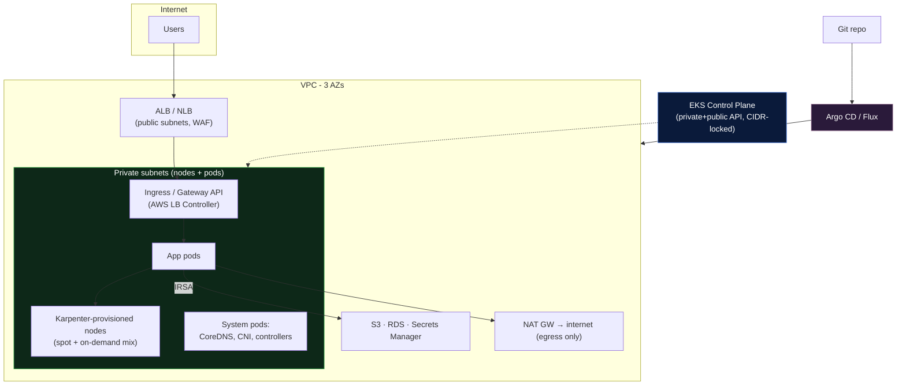
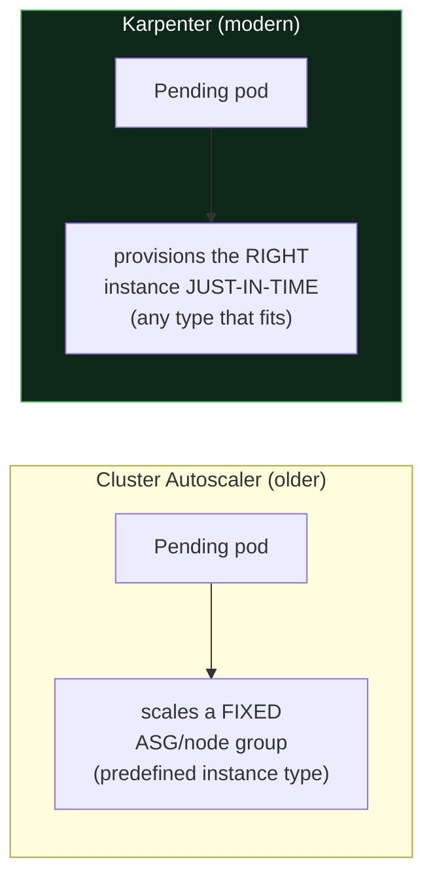
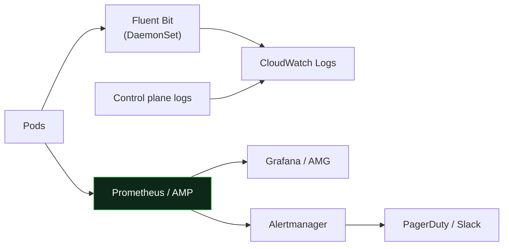
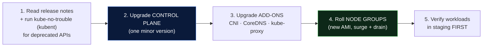
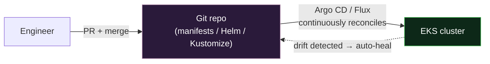
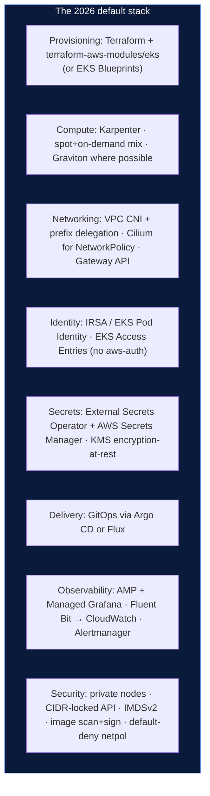

# 03 - EKS Best Practices (Modern / Production, 2026)

> **Goal:** The opinionated, production-grade playbook. Not "here are options" - **"here is what to do, and why."** Written for an intermediate DevOps engineer who has to run this at 3 AM.

---

## Recommended Reference Architecture



**The non-negotiables:** 3 AZs · private nodes · CIDR-locked API · IRSA for pod permissions · GitOps for deploys · Karpenter for compute · everything observable.

---

## 1. Security Best Practices

| Practice | Why | How |
|----------|-----|-----|
| **IRSA / Pod Identity per app** | No shared node-role blast radius | One SA → one scoped IAM role |
| **No public API** (or CIDR-locked) | API server is the crown jewel | `endpointPublicAccess` locked to VPN CIDR |
| **Private nodes only** | Shrinks attack surface | Nodes in private subnets, NAT egress |
| **EKS Access Entries** (not `aws-auth`) | No fragile ConfigMap lockouts | Manage IAM→K8s mapping via API |
| **Encryption at rest** (KMS) | etcd secrets safe in backups | Enable Secrets encryption with a KMS key |
| **External secrets, not YAML** | Real secrets never in Git/etcd | External Secrets Operator → Secrets Manager |
| **Restrict node → metadata** (IMDSv2, hop limit 1) | Blocks pods stealing node creds | Enforce IMDSv2, `httpPutResponseHopLimit=1` |
| **Network Policies** (default-deny) | Pod-to-pod firewalling | Cilium/Calico + `NetworkPolicy` |
| **Image scanning + signing** | Catch CVEs / supply-chain | ECR scan-on-push, cosign |
| **Least-privilege RBAC** | Limit `list secrets`, `system:masters` | See [Day 10 Secrets-RBAC](../../day10-configmaps-secrets/notes.md) |

> **The IMDSv2 pitfall few know:** if you don't set the metadata hop limit to 1, a compromised pod can reach the node's **instance metadata endpoint** and steal the **node role's** credentials - bypassing all your careful IRSA scoping. Lock it down.

> **Secrets:** the full modern secrets story (ESO, Vault, Sealed Secrets, SOPS, encryption-at-rest) is in [Day 10 → production-secrets.md](../../day10-configmaps-secrets/production-secrets.md). On EKS, the standard is **External Secrets Operator + AWS Secrets Manager + IRSA.**

---

## 2. Cost Optimization

> **Analogy:** Paying on-demand for baseline *and* burst is like renting your whole office at peak-hour rates 24/7. **Spot** and **autoscaling** let you rent extra desks only when people show up.

| Lever | Savings | Watch out for |
|-------|---------|---------------|
| **Spot instances** for stateless/batch | up to 70-90% | Interruptions - use for fault-tolerant workloads only |
| **Karpenter** (right-sizing bin-packing) | 20-50% | Learning curve vs Cluster Autoscaler |
| **Graviton (ARM)** nodes | ~20-40% price/perf | Rebuild images for `arm64` |
| **Compute Savings Plans** for baseline | up to ~66% | 1-3yr commitment |
| **Scale-to-zero** dev/nightly | 100% off-hours | Needs Karpenter or scheduled scaling |
| **Right-size requests/limits** | Stops over-provisioning | Use VPA/Goldilocks to find real usage |

**The modern pattern:** **on-demand for baseline + critical, spot for the rest**, mixed by Karpenter with automatic consolidation.

```yaml
# Karpenter NodePool - mix spot & on-demand, let Karpenter pick cheapest fit
apiVersion: karpenter.sh/v1
kind: NodePool
metadata: { name: default }
spec:
  template:
    spec:
      requirements:
        - key: karpenter.sh/capacity-type
          operator: In
          values: ["spot", "on-demand"]     # prefer spot, fall back to on-demand
        - key: kubernetes.io/arch
          operator: In
          values: ["arm64", "amd64"]         # allow Graviton
  disruption:
    consolidationPolicy: WhenEmptyOrUnderutilized   # actively bin-pack to cut waste
    consolidateAfter: 1m
```

---

## 3. Scalability - Cluster Autoscaler vs Karpenter



| | Cluster Autoscaler | **Karpenter** |
|---|---|---|
| **How it scales** | Adjusts count within pre-defined node groups | Provisions *any* fitting instance on demand |
| **Instance flexibility** | You pre-pick types per ASG | Picks optimal type/size/AZ automatically |
| **Speed** | Slower (ASG round-trip) | Fast (talks to EC2 directly) |
| **Bin-packing / consolidation** | Limited | **Active consolidation** (repacks to fewer nodes) |
| **Verdict (2026)** | Legacy but stable | **Recommended default** |

> **If building today: use Karpenter.** It replaces node-group sprawl, picks cheaper instances automatically, and consolidates underused nodes. Cluster Autoscaler is still fine if you're already invested in it.

---

## 4. Networking Best Practices

- **VPC CNI + prefix delegation** → 5-16× more pods per node, delays IP exhaustion.
- **AWS Load Balancer Controller** for Ingress → provisions ALB/NLB from K8s manifests; adopt the **Gateway API** for new setups (the successor to Ingress).
- **Default-deny NetworkPolicies**, then allow explicitly. Requires a policy-capable CNI (**Cilium** or Calico) - the default VPC CNI alone doesn't enforce `NetworkPolicy`.
- **Non-overlapping CIDRs** across VPC, Service CIDR, and any peered/on-prem networks (see [02](02-eks-config-explanation.md#5-networking---cni-ip-ranges-service-cidr)).
- **Private endpoints (VPC endpoints)** for ECR, S3, STS → nodes pull images/creds without traversing the NAT/internet (cheaper + more secure).

---

## 5. Logging & Monitoring Setup



**The production stack:**
- **Metrics:** `kube-prometheus-stack` (Prometheus + Grafana + Alertmanager) via Helm, **or** Amazon Managed Prometheus (AMP) + Managed Grafana (AMG) to offload ops.
- **Logs:** **Fluent Bit** DaemonSet → CloudWatch Logs (or OpenSearch/Loki). Enable **control-plane logs** (esp. `audit`, `authenticator`).
- **Alerts:** Alertmanager → Slack/PagerDuty. Alert on: node `NotReady`, pod crashloops, PVC full, cert expiry, control-plane error rates.
- **Health signals:** always define **liveness/readiness/startup probes** (see [Day 21 - Monitoring](../../day21-monitoring-logging/notes.md)).

> **Cost discipline:** `audit` logs and high-cardinality Prometheus metrics get expensive fast. Set **log retention**, drop noisy metric labels, and sample where you can.

---

## 6. Upgrade Strategy (cluster + nodes)

EKS supports each K8s minor version for a limited window, then **force-upgrades** you. Don't get caught - **upgrade proactively, one minor version at a time.**



**Rules:**
- **Never skip minor versions** - upgrade 1.29→1.30→1.31, not 1.29→1.31.
- **Control plane first, then add-ons, then nodes** - the control plane supports N and N-1 kubelets, so nodes can lag briefly but not for long.
- **Check deprecated APIs first** with `kubent`/`pluto` - the classic breakage is a removed API version (e.g. old Ingress/PSP).
- **Managed node groups do rolling updates** with surge + graceful drain - ensure **PodDisruptionBudgets** so you don't evict all replicas at once.
- **Always rehearse in staging.** Blue/green node groups (spin up new, cordon+drain old) give the safest rollback.

---

## 7. GitOps (Argo CD / Flux)

> **Analogy:** GitOps makes **Git the single source of truth** - the cluster is a *reflection* of the repo, not a place you `kubectl apply` to by hand. Git is the steering wheel; the cluster just follows.



**Why it wins in production:**
- **Auditability** - every change is a Git commit (who, what, when, revert with `git revert`).
- **Drift detection** - Argo/Flux flag or auto-correct manual `kubectl` changes.
- **Consistent multi-cluster** - the same repo drives dev/staging/prod.
- **No cluster creds in CI** - the in-cluster agent pulls from Git; CI never needs kube-admin.

**Argo CD vs Flux:** Argo CD has a rich UI and app-of-apps model (great for platform teams); Flux is lighter, CLI/CRD-first, and pairs cleanly with SOPS for secrets. Either is a solid default - pick one and standardize.

---

## If Building an EKS Cluster **Today (2026)**, This Is the Recommended Setup



**In one paragraph:** Provision with **Terraform** (`terraform-aws-modules/eks`) across **3 AZs with private nodes**. Use **Karpenter** for cost-efficient, right-sized compute (spot + Graviton). Give pods least-privilege AWS access via **IRSA/Pod Identity**, and manage cluster auth with **Access Entries**. Keep the **API private/CIDR-locked**, enforce **IMDSv2** and **default-deny NetworkPolicies** (Cilium). Handle secrets with the **External Secrets Operator → Secrets Manager** and **KMS encryption-at-rest**. Deliver everything via **GitOps (Argo CD/Flux)**, and observe with **Managed Prometheus + Grafana** plus **Fluent Bit** logs. Upgrade **proactively, one minor version at a time**, control-plane→add-ons→nodes, always rehearsed in staging.

---

## Production Readiness Checklist

- [ ] 3 AZs, private node subnets, `/20`+ with prefix delegation
- [ ] API endpoint private or CIDR-locked; IMDSv2 enforced (hop limit 1)
- [ ] IRSA/Pod Identity for every app needing AWS; no wildcard node perms
- [ ] EKS Access Entries manage IAM→K8s (not `aws-auth`)
- [ ] KMS encryption-at-rest + External Secrets Operator (no secrets in Git)
- [ ] Karpenter with consolidation; spot for fault-tolerant workloads
- [ ] Default-deny NetworkPolicies (Cilium/Calico)
- [ ] Prometheus/AMP + Grafana + Alertmanager; Fluent Bit logs; control-plane logging on
- [ ] PodDisruptionBudgets + probes on every workload
- [ ] GitOps (Argo CD/Flux) as the only deploy path
- [ ] Documented, staging-rehearsed upgrade runbook
- [ ] ECR scan-on-push + image signing (cosign)
- [ ] Cost: Savings Plan for baseline, tagging + Kubecost/CUR dashboards

---

## Self-Check
1. Why is **Karpenter** generally preferred over Cluster Autoscaler in 2026?
2. How can a compromised pod steal **node** credentials, and which setting stops it?
3. Give the correct **order** of an EKS upgrade and one thing that breaks if you reorder it.
4. Why does **GitOps** mean your CI system no longer needs cluster-admin credentials?
5. Name three levers to cut EKS cost and the risk each carries.

---

**Previous:** [← 02 - Config Deep Dive](02-eks-config-explanation.md) · **Next:** [04 - Terraform Setup →](04-eks-terraform-setup/README.md)
