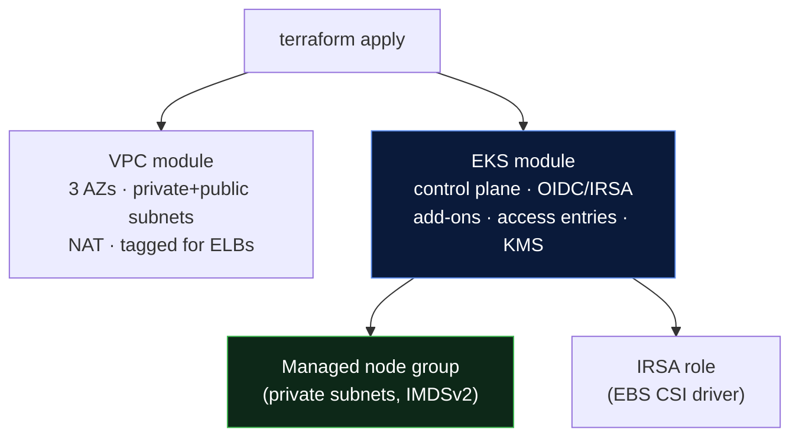

# 04 - EKS with Terraform (Working Setup)

> Provision the whole EKS stack - VPC, cluster, managed nodes, IRSA, add-ons - with `terraform-aws-modules`. This is the **automated version of everything in [01-manual-eks-setup.md](../01-manual-eks-setup.md).**

---

## What Gets Created



| File | Purpose |
|------|---------|
| [`main.tf`](main.tf) | VPC + EKS + node group + add-ons + IRSA |
| [`variables.tf`](variables.tf) | All tunable inputs with defaults |
| [`outputs.tf`](outputs.tf) | Endpoint, OIDC ARN, `update-kubeconfig` command |

---

## Prerequisites

```bash
terraform -version      # >= 1.5
aws sts get-caller-identity   # you're authenticated
kubectl version --client
```

Your AWS principal needs rights to create VPC, EKS, EC2, IAM, and KMS resources.

---

## Step 1 - Configure Inputs

Create a `terraform.tfvars` (do **not** commit real values / lock your API CIDR):

```hcl
region          = "ap-south-1"
cluster_name    = "demo-eks"
cluster_version = "1.30"
environment     = "dev"

# IMPORTANT: lock the API to YOUR IP/VPN - never leave 0.0.0.0/0 in prod.
public_access_cidrs = ["203.0.113.10/32"]

# Cost knobs
single_nat_gateway = true          # dev: 1 NAT. prod: set false (1 NAT/AZ).
node_capacity_type = "ON_DEMAND"   # "SPOT" for fault-tolerant/cheap
node_desired_size  = 2
node_max_size      = 5
```

> Add `terraform.tfvars`, `*.tfstate*`, and `.terraform/` to `.gitignore` - they hold secrets/state.

---

## Step 2 - Init / Plan / Apply

```bash
terraform init      # download modules + providers (+ configure backend)
terraform fmt       # format
terraform validate  # static checks

terraform plan -out tfplan   # review - expect ~40-60 resources to add
terraform apply tfplan       #  ~15-20 min (control plane is the slow part)
```

> **Be patient:** EKS control-plane creation alone is 10-15 minutes. Node group + add-ons add a few more. This is normal.

---

## Step 3 - Configure kubeconfig

Terraform prints the exact command as an output:

```bash
terraform output -raw configure_kubectl
# → aws eks update-kubeconfig --region ap-south-1 --name demo-eks

# Run it:
aws eks update-kubeconfig --region ap-south-1 --name demo-eks
```

This writes/merges cluster credentials into `~/.kube/config`. Auth uses your **AWS identity** (the applier was granted admin via `enable_cluster_creator_admin_permissions`).

> For the full connect story - how EKS auth works, granting teammates/CI access, reaching a private cluster, and troubleshooting every "why can't I connect" error - see [05 - Connecting to the Cluster](../05-connecting-to-the-cluster.md).

---

## Step 4 - Verify

```bash
kubectl get nodes -o wide
# NAME STATUS ROLES AGE VERSION
# ip-10-0-x-x.ec2.internal Ready <none> 3m v1.30.x
# ip-10-0-y-y.ec2.internal Ready <none> 3m v1.30.x

kubectl get pods -A       # coredns, aws-node (CNI), kube-proxy, ebs-csi → Running
kubectl cluster-info
```

 Two `Ready` nodes + system pods `Running` = success.

Quick smoke test:
```bash
kubectl create deployment hello --image=nginx --replicas=2
kubectl expose deployment hello --port=80 --type=ClusterIP
kubectl get pods -l app=hello -o wide   # spread across nodes/AZs
kubectl delete deployment,svc hello
```

---

## Step 5 - Destroy (don't leave it running - it costs money)

```bash
terraform destroy
```

> **Destroy pitfall:** if you (or a controller) created **LoadBalancer Services / Ingresses**, AWS made ELBs *outside* Terraform's knowledge → `destroy` can hang on the VPC because ENIs are still attached. **Delete Kubernetes Services of type LoadBalancer first**, then `terraform destroy`.

---

## Common Mistakes & Fixes

| Symptom | Cause | Fix |
|---------|-------|-----|
| `Unable to connect to the server: i/o timeout` | API not reachable from you | Add your IP to `public_access_cidrs`, or connect via VPN if private |
| Nodes `NotReady` | CNI/IP or node-role issue | Check `aws-node` pod logs; verify subnets have IP headroom |
| `destroy` hangs on VPC | Orphaned ELB/ENI from LB Services | Delete `type: LoadBalancer` Services first |
| Add-on version errors on upgrade | Add-ons behind control plane | Bump `cluster_addons` versions after a version bump |
| Pods `ContainerCreating`, no IPs | Subnet exhausted | Prefix delegation is on; still, grow subnets or scale down |
| State conflicts across team | Local state | Enable the **S3 backend** in `main.tf` |

---

## Where to Go Next (make it production)

This setup is a **solid, secure baseline.** To reach full production per [03-eks-best-practices.md](../03-eks-best-practices.md), layer on:
- **Karpenter** (replace/augment the static node group for cost-efficient autoscaling)
- **External Secrets Operator** + Secrets Manager (see [Day 10 production-secrets](../../../day10-configmaps-secrets/production-secrets.md))
- **AWS Load Balancer Controller** + Ingress/Gateway API
- **Cilium** + default-deny NetworkPolicies
- **kube-prometheus-stack** (or AMP/AMG) + Fluent Bit
- **Argo CD / Flux** for GitOps delivery

Each is typically its own Helm release/module, often installed via a follow-up Terraform stack or GitOps once the cluster exists.

---

**Back to:** [← 03 - Best Practices](../03-eks-best-practices.md) · [EKS section index](../README.md)
