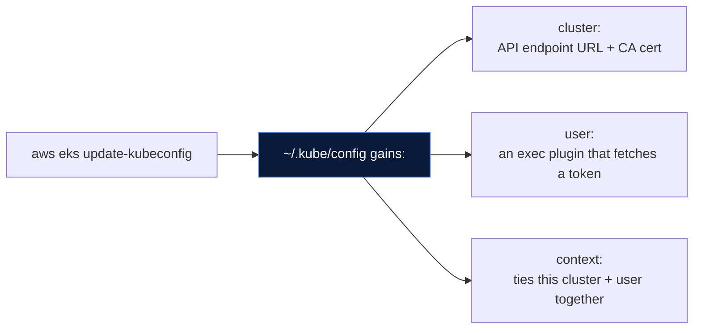
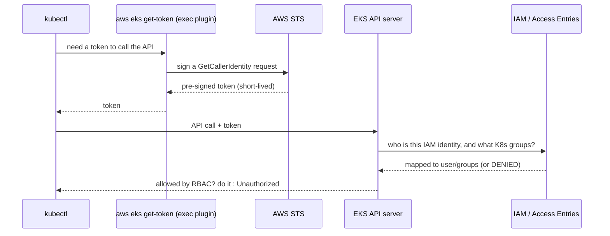
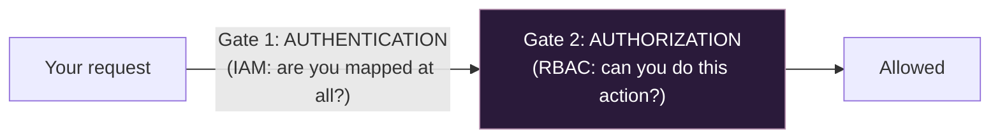
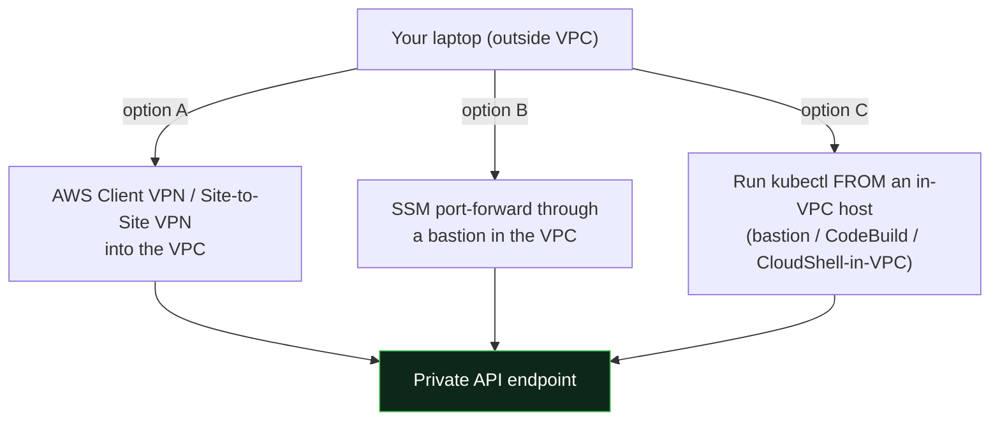
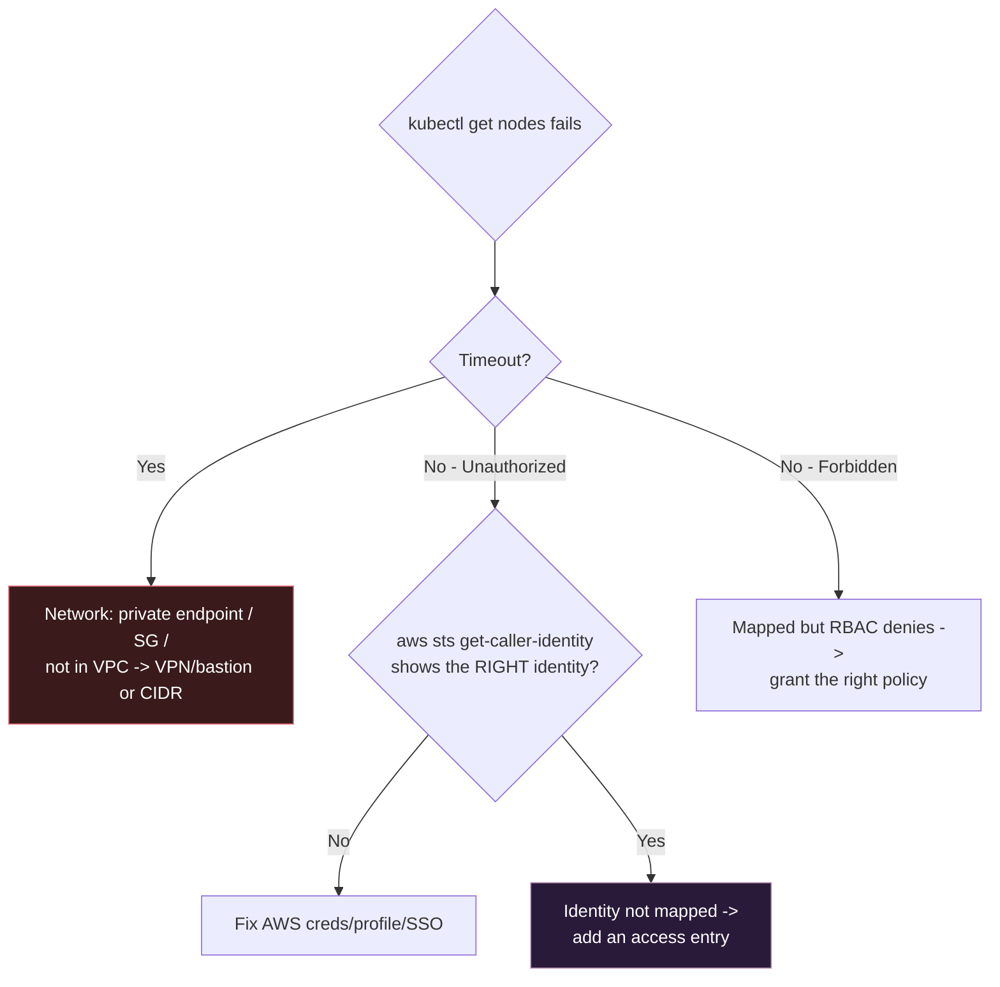

# 05 - Connecting to Your EKS Cluster (After Creation)

> **Goal:** The cluster is Active. Now how do you actually run `kubectl` against it? This page covers the full connect flow, what happens under the hood, how to give teammates access, how to reach a private cluster, and every "why can't I connect" error and its fix.

> **Analogy:** Creating the cluster built the building; **connecting is getting your keycard programmed.** The building exists whether or not you can get in - `update-kubeconfig` is the front desk programming your card, and IAM is the guard who checks it at the door.

> Works the same no matter how you created the cluster - Console ([00](00-eks-console-walkthrough.md)), CLI/eksctl ([01](01-manual-eks-setup.md)), or Terraform ([04](04-eks-terraform-setup/README.md)).

---

## The One Command (and then verify)

```bash
# 1. Point kubectl at the cluster (writes/merges a context into ~/.kube/config)
aws eks update-kubeconfig --region ap-south-1 --name my-cluster

# 2. Confirm it worked
kubectl get nodes
```

If you see your nodes listed `Ready`, you are connected. If not, jump to [Troubleshooting](#troubleshooting---every-connection-error-and-its-fix). The rest of this page explains what those two lines actually do, so you can fix things when they break.

---

## Prerequisites (the connect checklist)

You need **four** things lined up. Most connection failures are one of these being wrong:

| # | Requirement | Check | If missing |
|---|-------------|-------|------------|
| 1 | **AWS CLI v2** installed and on PATH | `aws --version` | Install AWS CLI v2 |
| 2 | **Valid AWS credentials** for the right account | `aws sts get-caller-identity` | `aws configure` / set profile / refresh SSO |
| 3 | **kubectl** installed, within one minor version of the cluster | `kubectl version --client` | Install/upgrade kubectl |
| 4 | **Your IAM identity has access** on the cluster | (see [Granting access](#granting-access-to-other-people--roles)) | Add an access entry / aws-auth mapping |

> **Version-skew rule:** keep `kubectl` within one minor version of the cluster (a 1.30 cluster works with kubectl 1.29-1.31). Too old or too new and commands behave oddly.

---

## Step 1 - `update-kubeconfig`: What It Actually Does

`aws eks update-kubeconfig` does **not** log you in or open a connection. It just **writes an entry into your kubeconfig file** (`~/.kube/config`) describing three things:



- **cluster** - the API server URL and the certificate authority to trust.
- **user** - **not** a stored password. It's an *exec plugin* config that runs `aws eks get-token` on demand to mint a short-lived token (more below).
- **context** - a named pairing of "this cluster" + "this user" so `kubectl` knows which to use.

Useful flags:

| Flag | Purpose |
|------|---------|
| `--region <r>` | Region the cluster is in (required if not in your default) |
| `--name <cluster>` | Cluster name |
| `--profile <p>` | Use a named AWS CLI profile's credentials |
| `--alias <name>` | Give the context a short, friendly name instead of the long ARN |
| `--role-arn <arn>` | Assume this IAM role when getting the token (great for cross-account / admin roles) |
| `--kubeconfig <path>` | Write to a specific file instead of `~/.kube/config` |

```bash
# Example: friendly alias + a specific profile + assume an admin role
aws eks update-kubeconfig \
  --region ap-south-1 --name my-cluster \
  --profile prod --role-arn arn:aws:iam::111122223333:role/eks-admin \
  --alias prod-eks
```

> **Note:** by default the context is named after the cluster ARN (`arn:aws:eks:...:cluster/my-cluster`) - long and ugly. Use `--alias` to make switching contexts pleasant.

---

## Step 2 - How EKS Authentication Works Under the Hood

This is the part that makes EKS auth confusing. **Kubernetes does not know about IAM.** So EKS bridges the two: your **AWS identity** is exchanged for a token the Kubernetes API server trusts.



1. `kubectl` needs to call the API, so it runs the **exec plugin** (`aws eks get-token`).
2. That plugin uses **your AWS credentials** to create a short-lived, signed token.
3. `kubectl` sends the token to the **API server**.
4. EKS checks the IAM identity against its **access entries** (or the legacy `aws-auth` ConfigMap) to map you to Kubernetes **users/groups**.
5. Kubernetes **RBAC** then decides what you're allowed to do.

**Two independent gates** - and knowing which one failed is how you debug fast:



- Fail **Gate 1** - "Unauthorized" / "you must be logged in". Your IAM identity isn't mapped to the cluster.
- Fail **Gate 2** - "forbidden: User cannot list resource ...". You're recognized, but RBAC denies the action.

---

## Step 3 - Verify the Connection

```bash
# Which context am I using?
kubectl config current-context

# Can I reach the control plane and are nodes healthy?
kubectl cluster-info
kubectl get nodes -o wide

# Are the core system pods running? (CNI, DNS, kube-proxy)
kubectl get pods -n kube-system

# What am I allowed to do? (great sanity check for RBAC)
kubectl auth can-i get pods
kubectl auth can-i '*' '*'        # am I effectively admin?
```

Expected on success: `cluster-info` shows the API URL, nodes are `Ready`, and `kube-system` pods are `Running`. If nodes are missing, the cluster may simply **have no node group yet** (a fresh cluster has no compute - see [00](00-eks-console-walkthrough.md#after-creation---add-compute-your-cluster-has-none-yet)).

---

## Granting Access to Other People / Roles

**The most common surprise:** *you* can connect (you created the cluster and, by default, got admin), but a teammate or a CI role gets **Unauthorized**. That's because **creating a cluster grants access only to the creator** - and even that is optional (see [What if the creator was NOT granted admin?](#what-if-the-creator-was-not-granted-admin)). Everyone else must be added.

There are two mechanisms - use **Access Entries** (modern) unless you're on a legacy cluster.

### Modern way: EKS Access Entries (recommended)

```bash
# 1. Register the IAM principal (user or role) as an access entry
aws eks create-access-entry \
  --cluster-name my-cluster \
  --principal-arn arn:aws:iam::111122223333:role/dev-team

# 2. Attach an access policy at a scope (namespace or cluster-wide)
aws eks associate-access-policy \
  --cluster-name my-cluster \
  --principal-arn arn:aws:iam::111122223333:role/dev-team \
  --policy-arn arn:aws:eks::aws:cluster-access-policy/AmazonEKSViewPolicy \
  --access-scope type=cluster
```

Common AWS-managed access policies:

| Policy | Grants |
|--------|--------|
| `AmazonEKSClusterAdminPolicy` | Full cluster-admin |
| `AmazonEKSAdminPolicy` | Admin within given namespaces |
| `AmazonEKSEditPolicy` | Read/write workloads (no RBAC/secrets admin) |
| `AmazonEKSViewPolicy` | Read-only |

> **Why this is better than the old way:** it's a real AWS API (auditable, IaC-friendly, no risk of corrupting a shared YAML). Requires the cluster's **authentication mode** to include the EKS API (see [00 Step 1.2](00-eks-console-walkthrough.md#12-cluster-access-who-can-administer-it)).

### What if the creator was NOT granted admin?

When you create the cluster, you choose whether the **creating IAM principal** is automatically given cluster-admin:

| Where | Setting |
|-------|---------|
| Console | "Bootstrap cluster administrator access" = Allow / **Disallow** ([00 Step 1.2](00-eks-console-walkthrough.md#12-cluster-access-who-can-administer-it)) |
| AWS CLI | `--access-config bootstrapClusterCreatorAdminPermissions=true` (or `=false`) |
| Terraform module | `enable_cluster_creator_admin_permissions = true` (or `false`) |

If you set this to **Disallow / false**, then right after creation **no IAM identity has Kubernetes access - not even you.** `kubectl get nodes` returns `Unauthorized` for everyone. This is intentional: some teams want access granted **only explicitly** (through IaC/a review process), so that "whoever happened to run `terraform apply`" is not silently a cluster admin.

**The crucial point - you are NOT locked out.** Access Entries are managed through the **AWS API, which is governed by IAM - not by kubectl / Kubernetes RBAC.** So any IAM principal that holds the EKS permissions (`eks:CreateAccessEntry`, `eks:AssociateAccessPolicy`) can grant admin to the right principal, even when nobody has `kubectl` access yet.

> **Analogy:** with the old `aws-auth` ConfigMap, the keycard machine was **inside the building** - if you lost every admin mapping, you were locked out (you needed `kubectl` to fix `kubectl` access). With Access Entries, the keycard machine is at the **AWS front desk (IAM)** - an AWS admin can always issue a card, so a fresh cluster with no admin is recoverable, not bricked.

So the deliberate flow when creator-admin is disabled: grant admin to your **intended** principal from any host with suitable IAM permissions:

```bash
# Grant cluster-admin to a DEDICATED admin role (not an individual, not the CI build role)
aws eks create-access-entry \
  --cluster-name my-cluster \
  --principal-arn arn:aws:iam::111122223333:role/platform-admins

aws eks associate-access-policy \
  --cluster-name my-cluster \
  --principal-arn arn:aws:iam::111122223333:role/platform-admins \
  --policy-arn arn:aws:eks::aws:cluster-access-policy/AmazonEKSClusterAdminPolicy \
  --access-scope type=cluster
```

Then someone assuming `platform-admins` runs `aws eks update-kubeconfig` and has admin.

**In Terraform**, do it declaratively so the cluster is never without an admin - disable the creator grant and define the access entry in the same apply:

```hcl
module "eks" {
  # ...
  enable_cluster_creator_admin_permissions = false   # no implicit admin for the applier

  access_entries = {
    platform_admins = {
      principal_arn = "arn:aws:iam::111122223333:role/platform-admins"
      policy_associations = {
        admin = {
          policy_arn   = "arn:aws:eks::aws:cluster-access-policy/AmazonEKSClusterAdminPolicy"
          access_scope = { type = "cluster" }
        }
      }
    }
  }
}
```

**Why do this in production:** access becomes **declarative and auditable**, it **survives** regardless of who ran the apply, and **no human is implicitly admin** just for having created the cluster once - the essence of least privilege.

> **One real lock-out risk:** this recovery only works when the cluster's **authentication mode includes the EKS API** (`API` or `API_AND_CONFIG_MAP`). A **ConfigMap-only** cluster with bootstrap admin **disabled** genuinely can lock everyone out - yet another reason to prefer the EKS API auth mode (see [00 Step 1.2](00-eks-console-walkthrough.md#12-cluster-access-who-can-administer-it)).

### Legacy way: the `aws-auth` ConfigMap

Older clusters map IAM identities by editing a ConfigMap in `kube-system`:

```yaml
# kubectl edit configmap aws-auth -n kube-system
apiVersion: v1
kind: ConfigMap
metadata:
  name: aws-auth
  namespace: kube-system
data:
  mapRoles: |
    - rolearn: arn:aws:iam::111122223333:role/dev-team
      username: dev-team
      groups:
        - system:masters      # careful: this is full admin
```

> **Danger:** one bad edit to `aws-auth` and **nobody** can authenticate - it's the classic EKS lockout. Prefer Access Entries; if you must edit `aws-auth`, back it up first (`kubectl get cm aws-auth -n kube-system -o yaml > aws-auth-backup.yaml`).

---

## Working With Multiple Clusters (Contexts)

Once you've run `update-kubeconfig` for several clusters, your kubeconfig holds multiple **contexts**. Switch between them:

```bash
kubectl config get-contexts             # list all (asterisk = current)
kubectl config current-context          # show the active one
kubectl config use-context prod-eks     # switch
kubectl config rename-context <long-arn> prod-eks   # tidy up a name
kubectl config delete-context old-eks   # remove one
```

> **Safety tip:** it is dangerously easy to run a command against the wrong cluster. Use short `--alias` names, and consider tools like `kubectx`/`kubens` or a shell prompt (kube-ps1, starship) that **shows your current context** so you never `delete` in prod thinking it's dev.

---

## Connecting to a PRIVATE-Only Cluster

If the cluster's endpoint is **private-only** ([00 Step 2](00-eks-console-walkthrough.md#cluster-endpoint-access-very-important)), the API is unreachable from the public internet - `update-kubeconfig` succeeds (it only writes a file) but `kubectl` will **time out**. You must reach the API **from inside the VPC**. Options:



- **A - VPN:** connect your machine into the VPC network, then `kubectl` works directly.
- **B - Bastion + SSM port forwarding:** no open SSH port needed:
  ```bash
  aws ssm start-session --target i-0bastion \
    --document-name AWS-StartPortForwardingSessionToRemoteHost \
    --parameters '{"host":["<cluster-endpoint-host>"],"portNumber":["443"],"localPortNumber":["443"]}'
  ```
- **C - Run kubectl inside the VPC:** a bastion EC2 instance, or your CI (CodeBuild) placed in the VPC subnets.

---

## Connecting from CI/CD (no long-lived keys)

CI should **never** store permanent AWS keys. Use OIDC to assume a role, then `update-kubeconfig`. Example for GitHub Actions:

```yaml
permissions:
  id-token: write        # allows OIDC
  contents: read
steps:
  - uses: aws-actions/configure-aws-credentials@v4
    with:
      role-to-assume: arn:aws:iam::111122223333:role/gha-deployer
      aws-region: ap-south-1
  - run: |
      aws eks update-kubeconfig --region ap-south-1 --name my-cluster
      kubectl get nodes
```

The IAM role `gha-deployer` must also be granted cluster access (an **access entry**, e.g. `AmazonEKSEditPolicy`) - otherwise you authenticate to AWS but get **Unauthorized** from Kubernetes.

> For real deployments, prefer **GitOps** (Argo CD / Flux) so CI doesn't touch the cluster at all - see [03 Best Practices](03-eks-best-practices.md#7-gitops-argo-cd--flux).

---

## Troubleshooting - Every Connection Error and Its Fix

| Error message | Which gate | Cause | Fix |
|---------------|-----------|-------|-----|
| `error: You must be logged in to the server (Unauthorized)` | Auth (Gate 1) | Your IAM identity isn't mapped to the cluster | Add an [access entry](#granting-access-to-other-people--roles) for your principal |
| `... i/o timeout` / `dial tcp ... connect: timed out` | Network | Private endpoint, or SG/NACL blocks you, or you're not in the VPC | Use VPN/bastion (private cluster), or add your IP to `publicAccessCidrs` |
| `exec: aws: executable file not found in $PATH` | Local | kubectl's exec plugin can't find the AWS CLI | Install AWS CLI v2 and ensure it's on PATH |
| `An error occurred (ExpiredToken)` / `... credentials ... expired` | Local creds | Your AWS session/SSO expired | `aws sso login` / refresh creds / re-set profile |
| `the server has asked for the client to provide credentials` | Auth | Wrong AWS profile/account, or unmapped identity | `aws sts get-caller-identity` to confirm who you are; set `AWS_PROFILE` |
| `Error from server (Forbidden): ... cannot list resource` | Authz (Gate 2) | You're recognized but RBAC denies this action | Grant the right RBAC/access policy (e.g. Edit vs View) |
| `Unable to connect to the server: x509: certificate signed by unknown authority` | Config | Stale/wrong CA in kubeconfig | Re-run `aws eks update-kubeconfig` to refresh |
| `couldn't get current server API group list` (with timeout) | Network | Same as i/o timeout - endpoint unreachable | See network row above |
| Nodes list is **empty** but connection works | Not an error | Cluster has no node group / Fargate yet | Add compute ([00](00-eks-console-walkthrough.md#after-creation---add-compute-your-cluster-has-none-yet)) |

**Fast diagnosis flow:**



---

## Quick Reference Card

```bash
# Connect
aws eks update-kubeconfig --region <region> --name <cluster> [--profile p] [--alias short]

# Who am I (AWS side) / (K8s side)
aws sts get-caller-identity
kubectl config current-context
kubectl auth can-i '*' '*'

# Verify
kubectl cluster-info
kubectl get nodes -o wide
kubectl get pods -n kube-system

# Switch clusters
kubectl config get-contexts
kubectl config use-context <name>

# Grant someone access (modern)
aws eks create-access-entry     --cluster-name <c> --principal-arn <arn>
aws eks associate-access-policy --cluster-name <c> --principal-arn <arn> \
  --policy-arn arn:aws:eks::aws:cluster-access-policy/AmazonEKSViewPolicy \
  --access-scope type=cluster
```

---

## Common Mistakes

1. **Assuming `update-kubeconfig` connects you** - it only writes a config file; auth happens per command.
2. **Teammate gets Unauthorized** - you forgot that cluster creation grants access only to the creator; add an access entry.
3. **Private cluster + no VPN/bastion** - `kubectl` times out; you cannot reach a private endpoint from outside the VPC.
4. **Wrong AWS profile/account** - kubectl uses whatever creds the exec plugin picks up; always check `aws sts get-caller-identity`.
5. **AWS CLI not on PATH** - the exec plugin fails with "executable file not found".
6. **Running against the wrong context** - no context indicator in your prompt; use aliases + kubectx.
7. **Editing `aws-auth` carelessly** - can lock out everyone; prefer Access Entries and back it up first.
8. **kubectl version skew** - too far from the cluster version causes odd failures.

---

## Self-Check
1. Does `aws eks update-kubeconfig` open a connection to the cluster? What does it actually do?
2. You can connect but your colleague gets `Unauthorized`. Why, and how do you fix it?
3. What is the difference between an **Unauthorized** and a **Forbidden** error?
4. `kubectl get nodes` hangs and times out. What are the two most likely causes?
5. How would you reach the API of a **private-only** cluster from your laptop?
6. Why should CI/CD use OIDC role assumption instead of stored AWS keys?
7. You created a cluster with **bootstrap admin disabled** and now nobody can `kubectl`. Are you locked out? Explain why Access Entries save you (and the one case where you truly could be locked out).

---

**Previous:** [04 - Terraform Setup](04-eks-terraform-setup/README.md) · **Section index:** [README](README.md)
