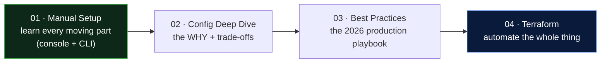

# EKS Cluster Creation - Manual → Deep Dive → Best Practices → Terraform

> A complete, production-shaped path to standing up **Amazon EKS**: do it by hand to understand it, learn the trade-offs, apply modern best practices, then automate with Terraform. Written for an **intermediate DevOps engineer** as teaching material + a real project reference.

---

## How to Read This Section

| # | File | What you get |
|---|------|--------------|
| 01 | [01-manual-eks-setup.md](01-manual-eks-setup.md) | Step-by-step manual build: IAM, VPC/subnets, endpoint access, nodes, add-ons, logging - **with the reason for each step** |
| 02 | [02-eks-config-explanation.md](02-eks-config-explanation.md) | Deep dive on VPC design, node groups, IAM/IRSA, CNI/CIDRs, security, storage, observability - **trade-offs** |
| 03 | [03-eks-best-practices.md](03-eks-best-practices.md) | Modern production playbook: security, cost (spot/Karpenter), scaling, upgrades, GitOps - **"if building today (2026)"** |
| 04 | [04-eks-terraform-setup/](04-eks-terraform-setup/README.md) | Working Terraform (`terraform-aws-modules`) + init/plan/apply + kubeconfig + verify |

---

## The One-Screen Summary

- **Control plane** = AWS-managed; **nodes + networking + IAM** = yours.
- **Private nodes, 3 AZs, big subnets** (VPC CNI eats pod IPs).
- **IRSA / Pod Identity** for per-pod AWS permissions (not the shared node role).
- **API endpoint public+private, CIDR-locked** (not wide open).
- **Managed node groups** by default; **Karpenter** for cost-smart autoscaling.
- **EKS Access Entries** for auth (not the fragile `aws-auth` ConfigMap).
- **External Secrets + KMS encryption-at-rest**; **GitOps** for delivery; **observe everything**.

---

## Related Notes
- [Day 10 - ConfigMaps & Secrets](../../day10-configmaps-secrets/notes.md) · [production-secrets.md](../../day10-configmaps-secrets/production-secrets.md) (ESO on EKS)
- [Day 17 - RBAC & Cluster Security](../../day17-rbac-security/notes.md)
- [Day 11 - EKS overview](../notes.md) · [Managed node groups](../managed-nodegroups/notes.md)

---

**Start here → [01 - Manual EKS Setup](01-manual-eks-setup.md)**
