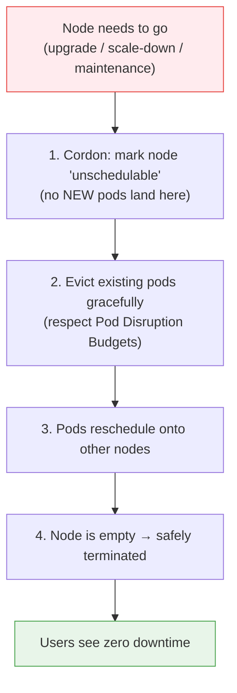

# EKS Managed Node Groups - Deep Dive

> **Goal:** Understand how AWS automatically provisions, patches, upgrades, and safely drains your EKS worker nodes - for zero extra cost beyond normal EC2 pricing.

## Learning Objectives

By the end you will be able to:

1. Explain what a Managed Node Group is and why it costs nothing extra.
2. Describe what "node draining" means and why it prevents downtime.
3. Identify who drains nodes (AWS, Cluster Autoscaler, or you) in each scenario.
4. Choose between Managed Node Groups, Self-Managed Nodes, and Fargate.

## Real-World Analogy

Imagine you run a hotel and need staff (your **EC2 worker nodes**) to serve guests (your **pods**).

- **Self-managed nodes** = you personally hire, train, schedule, and replace every staff member. Total control, but a lot of work.
- **Managed Node Groups** = you use a **staffing agency (AWS)**. You just say "I want between 1 and 3 staff." The agency hires them, keeps their training up to date (OS patching), and if one calls in sick (unhealthy node) the agency quietly replaces them. Crucially, when a staff member's shift ends, the agency moves their guests to another staff member *before* sending them home - no guest is left stranded. That "move the guests first" step is **node draining**.

And the best part: the staffing agency charges no booking fee - you pay only the staff's normal wages (standard EC2 price).

## What Are Managed Node Groups?

AWS manages EC2 instances (worker nodes) for you. **No extra cost** - you pay normal EC2 pricing.

```
┌─── What AWS Does for You (FREE) ───┐
│                                      │
│   Provisions EC2 and joins to      │
│     cluster automatically            │
│   OS patching & security updates   │
│   Graceful node draining during    │
│     K8s version upgrades             │
│   One-click K8s version upgrades   │
│   ASG with min/max boundaries      │
│   Health monitoring & auto-replace │
│     unhealthy nodes                  │
│                                      │
│  You pay ZERO extra for "managed"    │
│  Same EC2 price as self-managed!     │
└──────────────────────────────────────┘
```

---

## Cost Breakdown

```
EKS Costs:
├── Control Plane:          $0.10/hr  = ~$73/month (fixed, always)
│
├── Worker Nodes (EC2):     Normal EC2 pricing
│   ├── t3.medium  (2 vCPU, 4GB):   ~$30/month each
│   ├── t3.large   (2 vCPU, 8GB):   ~$60/month each
│   └── t3.xlarge  (4 vCPU, 16GB):  ~$120/month each
│
├── EBS Storage:            ~$0.10/GB/month
├── NAT Gateway:            ~$32/month
└── Load Balancer:          ~$16/month each

Example: 2-node cluster (t3.medium):
  $73 (control plane) + $60 (2 nodes) + $32 (NAT) = ~$165/month minimum
```

**"Managed" is FREE** - AWS doesn't charge anything extra for:
- Node provisioning
- OS patching
- Draining during upgrades
- Health monitoring
- ASG integration

---

## What Is Node Draining?

When a node needs to be removed (K8s upgrade, scaling down, maintenance), you can't just kill it - pods are running on it!



```
WITHOUT draining (bad):
  Node killed → All pods die instantly → Users see errors 

WITH draining (managed node groups do this AUTOMATICALLY):

  Step 1: Node marked as "unschedulable"
          (no NEW pods go here)

  Step 2: Existing pods gracefully moved to other nodes
          (respects Pod Disruption Budgets)

  Step 3: Node is empty → safely removed

  Step 4: Users see ZERO downtime 
```

```
BEFORE drain:                      AFTER drain:
┌─── Node 1 ───┐                 ┌─── Node 1 ───┐
│ Pod-A  Pod-B  │                 │   (empty)     │ ← safe to remove
│ Pod-C         │                 │ unschedulable │
└───────────────┘                 └───────────────┘
┌─── Node 2 ───┐                 ┌─── Node 2 ───┐
│ Pod-D         │                 │ Pod-D  Pod-A  │ ← pods moved here
└───────────────┘                 │ Pod-B  Pod-C  │
                                  └───────────────┘
```

### When Does Draining Happen?

| Scenario | Who Drains? |
|----------|------------|
| K8s version upgrade | **AWS does it automatically** (managed node groups) |
| Scale down (remove node) | **Cluster Autoscaler** does it automatically |
| Manual maintenance | You run `kubectl drain <node>` manually |
| Self-managed nodes | **Always manual** - you do everything |

---

## Managed vs Self-Managed vs Fargate

| Feature | Managed Node Groups | Self-Managed Nodes | Fargate |
|---------|-------------------|-------------------|---------|
| **Who manages nodes?** | AWS | You | No nodes (serverless) |
| **Extra cost?** | No (same EC2 price) | Same EC2 price | Per pod pricing |
| **OS patching** | Automatic | Manual | N/A |
| **Node draining** | Automatic | Manual | N/A |
| **K8s upgrades** | One-click | Manual (risky) | Automatic |
| **DaemonSets** | Yes | Yes | **No** |
| **GPU support** | Yes | Yes | **No** |
| **Custom AMI** | Limited | Full control | No |
| **Idle cost** | Yes (EC2 running) | Yes (EC2 running) | No (pay per pod) |
| **Recommendation** | **Default choice** | Only if custom needs | Small/simple apps |

---

## Common Mistakes

1. **Thinking "managed" costs extra.** It does not. You pay the same EC2 price as self-managed nodes - AWS gives away the management for free.
2. **Assuming min/max size auto-scales nodes.** The Auto Scaling Group's min/max are just *boundaries*. Nothing scales nodes automatically unless you install the **Cluster Autoscaler** or **Karpenter**.
3. **Skipping Pod Disruption Budgets (PDBs).** Without a PDB, an upgrade can evict all replicas of an app at once and cause a brief outage. Define PDBs for important workloads so draining keeps a minimum number of pods running.
4. **Manually killing or terminating a managed node's EC2 instance.** Let AWS/Autoscaler drain it. Hard-terminating skips graceful eviction and can drop traffic.
5. **Choosing Fargate for a workload that needs DaemonSets or GPUs.** Fargate supports neither - use a managed node group instead.

## Quick Self-Check

1. Do managed node groups cost more than self-managed nodes? Why or why not?
2. In plain words, what are the steps of draining a node?
3. During a Kubernetes version upgrade of a managed node group, who performs the draining?
4. The ASG is set to min=1, max=5. You suddenly have many pending pods. Will new nodes appear automatically? What's needed?
5. Name one workload type you cannot run on Fargate.

<details>
<summary>Answers</summary>

1. No - same EC2 price. AWS charges nothing extra for provisioning, patching, draining, or health monitoring.
2. Cordon the node (no new pods) → gracefully evict existing pods (respecting PDBs) → pods reschedule elsewhere → empty node is terminated.
3. **AWS does it automatically** for managed node groups.
4. Not automatically - min/max are only boundaries. You need the **Cluster Autoscaler** (or Karpenter) installed to actually add nodes.
5. Any of: DaemonSets, GPU workloads, `hostPath` volumes, custom AMIs.

</details>

## Summary

Managed Node Groups are the recommended default for EKS worker nodes: AWS provisions the EC2 instances, patches their OS, gracefully drains and replaces them during upgrades, and monitors their health - all for the standard EC2 price. Draining is the key safety mechanism that moves pods off a node before it's removed so users never see downtime. Remember that min/max sizes are only boundaries; real scaling needs the Cluster Autoscaler or Karpenter.

**Next up →** [Day 12 - Volumes & Persistent Storage](../../day12-volumes/notes.md), where your data finally survives pod restarts. (Autoscaling - HPA, Cluster Autoscaler, Karpenter - is covered in a later lesson.)

---

**Back to:** [EKS Notes](../notes.md)
