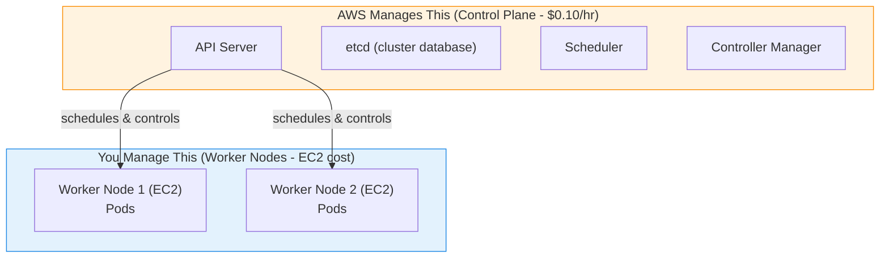

# Day 11 - Amazon EKS (Elastic Kubernetes Service)

> **Goal:** Move from a single-node Kubernetes on your laptop to a real, production-grade, AWS-managed Kubernetes cluster - and understand exactly what AWS runs for you and what you still own.

> **Going deeper - full production EKS build:** this page is the overview. For a complete, production-shaped walkthrough (manual setup → config trade-offs → 2026 best practices → working Terraform), see **[eks-cluster-creation/](eks-cluster-creation/README.md)**.

## Learning Objectives

By the end of this lesson you will be able to:

1. Explain what EKS is and which parts AWS manages vs. which parts you manage.
2. Install the three tools you need: `aws` CLI, `kubectl`, and `eksctl`.
3. Create an EKS cluster three different ways (eksctl flags, YAML config, AWS Console).
4. Connect `kubectl` to your cluster and deploy an app exposed by a real AWS load balancer.
5. Choose between Managed Node Groups, Self-Managed Nodes, and Fargate.
6. Scale your cluster - and (very important) **delete it** to avoid surprise bills.

## Real-World Analogy

Think of running Kubernetes yourself (self-managed) like **owning a house**: you fix the roof, the plumbing, the wiring - everything is your job.

**EKS is like renting a serviced apartment.** The building owner (AWS) takes care of the foundation, security, and maintenance of the shared infrastructure - this is the **control plane** (the "brain" of Kubernetes). You just bring your furniture and live there - your **worker nodes** and **apps**. You pay rent for the building service ($0.10/hour for the control plane) plus your own utilities (the EC2 worker nodes and storage).

You get all the benefits of a well-run building without having to become a building engineer.

## Why EKS? Why Not Just Minikube?

So far we've been using **Minikube** - a single-node K8s cluster on your laptop. That's great for learning, but in production you need:

| Minikube (Local) | EKS (Production) |
|-------------------|-------------------|
| Single node | Multiple nodes across availability zones |
| Your laptop's resources | AWS cloud resources (auto-scaling) |
| No high availability | High availability built-in |
| You manage everything | AWS manages the control plane |
| Free | Pay-as-you-go |
| For learning/testing | For real production workloads |

---

## What Is EKS?

**EKS** = Amazon Elastic Kubernetes Service

AWS runs and manages the **control plane** (the master components) for you. You only manage the **worker nodes**.



**What AWS handles on the control plane:** multi-AZ high availability, automatic patching, automatic etcd backups, and one-click version upgrades. You never SSH into the control plane - you can't even see it as EC2 instances.

---

## EKS vs Self-Managed K8s

| Feature | Self-Managed K8s | EKS |
|---------|-----------------|-----|
| Control plane setup | You do it (hard!) | AWS does it |
| etcd management | You back it up, patch it | AWS handles it |
| Control plane upgrades | Manual, risky | One-click |
| High availability | You configure it | Built-in (multi-AZ) |
| Cost | EC2 for master + worker | $0.10/hr for control plane + worker EC2 |
| Networking | You install CNI | AWS VPC CNI (pre-installed) |
| IAM integration | Manual | Native AWS IAM |
| Load balancer | Manual setup | Auto-provisions AWS ALB/NLB |

---

## Prerequisites

Before creating an EKS cluster, you need:

### 1. AWS CLI

```bash
# Install AWS CLI
# Windows
msiexec.exe /i https://awscli.amazonaws.com/AWSCLIV2.msi

# macOS
brew install awscli

# Linux
curl "https://awscli.amazonaws.com/awscli-exe-linux-x86_64.zip" -o "awscliv2.zip"
unzip awscliv2.zip
sudo ./aws/install

# Configure
aws configure
# AWS Access Key ID: <your-key>
# AWS Secret Access Key: <your-secret>
# Default region: ap-south-1 (or your preferred region)
# Default output format: json
```

### 2. kubectl (Already installed from Day 03)

```bash
kubectl version --client
```

### 3. eksctl (EKS CLI tool - makes everything easy!)

```bash
# Windows
choco install eksctl

# macOS
brew tap weaveworks/tap
brew install weaveworks/tap/eksctl

# Linux
curl --silent --location "https://github.com/eksctl-io/eksctl/releases/latest/download/eksctl_$(uname -s)_amd64.tar.gz" | tar xz -C /tmp
sudo mv /tmp/eksctl /usr/local/bin

# Verify
eksctl version
```

---

## Method 1: Create EKS Cluster with eksctl (Easiest)

### Create Cluster

```bash
# Simple cluster (takes 15-20 minutes)
eksctl create cluster \
  --name my-cluster \
  --region ap-south-1 \
  --nodegroup-name workers \
  --node-type t3.medium \
  --nodes 2 \
  --nodes-min 1 \
  --nodes-max 3
```

### What This Creates

```
AWS Resources Created:
├── VPC with public and private subnets
├── Internet Gateway
├── NAT Gateway
├── Security Groups
├── EKS Control Plane
├── IAM Roles (for cluster and nodes)
├── EC2 instances (worker nodes)
└── Auto Scaling Group
```

### Verify

```bash
# Check cluster
eksctl get cluster

# kubectl is automatically configured
kubectl get nodes
# NAME STATUS ROLES AGE
# ip-192-168-1-100.ap-south-1.compute.internal Ready <none> 5m
# ip-192-168-2-200.ap-south-1.compute.internal Ready <none> 5m

# Check all namespaces
kubectl get pods -A
```

---

## Method 2: Create EKS Cluster with YAML (More Control)

```yaml
# cluster.yaml
apiVersion: eksctl.io/v1alpha5
kind: ClusterConfig

metadata:
  name: my-cluster
  region: ap-south-1
  version: "1.31"        # ← use a currently-supported EKS version

managedNodeGroups:
  - name: workers
    instanceType: t3.medium
    minSize: 1
    maxSize: 3
    desiredCapacity: 2
    volumeSize: 20
    ssh:
      allow: true
    labels:
      role: worker
    tags:
      environment: dev
```

```bash
eksctl create cluster -f cluster.yaml
```

---

## Method 3: Create via AWS Console (UI)

```
1. Go to AWS Console → EKS → Create Cluster
2. Enter cluster name, K8s version, select IAM role
3. Configure networking (VPC, subnets, security groups)
4. Select add-ons (CoreDNS, kube-proxy, VPC CNI)
5. Review and create
6. Add Node Group after cluster is ready
7. Configure kubectl:
   aws eks update-kubeconfig --name my-cluster --region ap-south-1
```

---

## Connecting kubectl to EKS

```bash
# Update kubeconfig (tells kubectl to talk to your EKS cluster)
aws eks update-kubeconfig --name my-cluster --region ap-south-1

# Verify connection
kubectl cluster-info
# Kubernetes control plane is running at https://XXXXX.eks.amazonaws.com

kubectl get nodes
```

---

## Deploy an Application on EKS

Everything you learned on Minikube works exactly the same on EKS!

```bash
# Create a deployment
kubectl create deployment web --image=nginx:1.27 --replicas=3

# Expose with LoadBalancer (this creates an AWS ALB/NLB!)
kubectl expose deployment web --type=LoadBalancer --port=80

# Check the service
kubectl get svc web
# NAME TYPE CLUSTER-IP EXTERNAL-IP PORT(S)
# web LoadBalancer 10.100.0.50 abc123-456.ap-south-1.elb.amazonaws.com 80:31234/TCP

# Access your app via the AWS Load Balancer URL!
curl http://abc123-456.ap-south-1.elb.amazonaws.com
```

**Key difference from Minikube:** `LoadBalancer` type actually provisions a real AWS Load Balancer with a public URL!

---

## EKS Node Types

### Managed Node Groups (Recommended)

```
AWS manages EC2 instances for you
- Auto-patching
- Easy upgrades
- Auto-scaling
```

### Self-Managed Nodes

```
You manage your own EC2 instances
- Full control
- More work
```

### Fargate (Serverless)

```
No EC2 instances at all!
- AWS runs pods for you
- Pay per pod (no idle cost)
- No node management
- Some limitations (no DaemonSets, no hostPath)
```

```bash
# Create cluster with Fargate
eksctl create cluster \
  --name fargate-cluster \
  --region ap-south-1 \
  --fargate
```

---

## EKS + AWS Services Integration

| K8s Concept | AWS Integration |
|-------------|----------------|
| **Service (LoadBalancer)** | Creates AWS ALB/NLB automatically |
| **Ingress** | AWS ALB Ingress Controller |
| **Persistent Volumes** | AWS EBS (block) or EFS (file) |
| **Secrets** | AWS Secrets Manager |
| **IAM** | IAM Roles for Service Accounts (IRSA) |
| **Logging** | CloudWatch Container Insights |
| **Monitoring** | CloudWatch + Prometheus |
| **Container Registry** | Amazon ECR |

---

## Scaling on EKS

### Manual Scaling

```bash
# Scale node group
eksctl scale nodegroup \
  --cluster my-cluster \
  --name workers \
  --nodes 4

# Scale deployment
kubectl scale deployment web --replicas=10
```

### Cluster Autoscaler

Automatically adds/removes nodes based on pod demand:

```bash
# Install Cluster Autoscaler (the manifest is maintained per K8s minor version;
# match it to your cluster, and the autoscaler image tag to your control plane version)
kubectl apply -f https://raw.githubusercontent.com/kubernetes/autoscaler/cluster-autoscaler-release-1.31/cluster-autoscaler/cloudprovider/aws/examples/cluster-autoscaler-autodiscover.yaml
```

When pods are pending (no space on existing nodes) -> Autoscaler adds a new node.
When nodes are underutilized -> Autoscaler removes them.

Karpenter is a popular AWS-native alternative to the Cluster Autoscaler that provisions right-sized nodes directly (no Auto Scaling Group needed).

---

## Important: Cost Management!

EKS costs money! Always clean up when done.

```
EKS Costs:
├── Control Plane: $0.10/hour (~$73/month)
├── Worker Nodes: EC2 pricing (t3.medium ~$30/month each)
├── NAT Gateway: ~$32/month
├── Load Balancers: ~$16/month each
└── Storage (EBS): ~$0.10/GB/month
```

### Delete Cluster When Done!

```bash
# Delete everything (cluster + node groups + VPC)
eksctl delete cluster --name my-cluster --region ap-south-1

# Verify no resources are left
aws eks list-clusters
```

---

## EKS vs Other Managed K8s

| Feature | EKS (AWS) | GKE (Google) | AKS (Azure) |
|---------|-----------|--------------|-------------|
| Control plane cost | $0.10/hr | Free (1 cluster) | Free |
| Ease of setup | Medium | Easy | Easy |
| Best integration | AWS services | GCP services | Azure services |
| CLI tool | eksctl | gcloud | az aks |
| Default CNI | AWS VPC CNI | Calico | Azure CNI |

---

## Useful Commands

```bash
# Cluster management
eksctl create cluster -f cluster.yaml
eksctl get cluster
eksctl delete cluster --name my-cluster

# Node groups
eksctl get nodegroup --cluster my-cluster
eksctl scale nodegroup --cluster my-cluster --name workers --nodes 3

# Connect kubectl
aws eks update-kubeconfig --name my-cluster --region ap-south-1

# Check connection
kubectl cluster-info
kubectl get nodes
```

---

## Common Mistakes

1. **Forgetting to delete the cluster.** This is the #1 way students get a surprise AWS bill. The control plane alone is ~$73/month even with zero apps running. Run `eksctl delete cluster` the moment you're done.
2. **Wrong region.** If `aws configure` set one region but your `eksctl`/`kubectl` commands use another, you'll see "cluster not found" or an empty `kubectl get nodes`. Keep `--region` consistent everywhere.
3. **Picking an unsupported Kubernetes version.** AWS only supports a rolling window of versions. Pinning an old `version:` in `cluster.yaml` causes creation to fail. Use a currently-supported version (e.g. 1.31).
4. **Using `type=LoadBalancer` everywhere and leaving them running.** Each AWS load balancer costs ~$16/month. Delete the Service (`kubectl delete svc web`) to release the load balancer before deleting the cluster.
5. **Expecting Fargate to do everything.** Fargate has no DaemonSets, no `hostPath`, and no GPU support. If your workload needs those, use a node group instead.

## Quick Self-Check

1. Which part of an EKS cluster does AWS manage, and which part do you manage?
2. What does `aws eks update-kubeconfig` actually do?
3. On EKS, what real AWS resource is created when you expose a Service with `--type=LoadBalancer`?
4. Name one capability you lose by choosing Fargate over a managed node group.
5. Which single command tears down the cluster, node groups, and VPC together?

<details>
<summary>Answers</summary>

1. AWS manages the **control plane** (API server, etcd, scheduler, controller manager); you manage the **worker nodes** and your apps.
2. It writes connection details (endpoint + auth) for your EKS cluster into your local `~/.kube/config` so `kubectl` talks to that cluster.
3. A real AWS **Classic/Network Load Balancer** with a public DNS URL.
4. Any of: DaemonSets, `hostPath` volumes, GPU support, custom AMIs (also true single-pod-per-task isolation).
5. `eksctl delete cluster --name my-cluster --region ap-south-1`.

</details>

## Summary

EKS gives you production Kubernetes without the pain of running the control plane yourself - AWS handles HA, patching, and upgrades for $0.10/hr, while you manage worker nodes (or skip them entirely with Fargate). `eksctl` is the fastest path to a cluster, and the same `kubectl`/YAML skills from Minikube transfer directly. The one habit that matters most: **delete your cluster when you're done** to avoid charges.

**Next up →** [Day 12 - Volumes & Persistent Storage](../day12-volumes/notes.md), where your data finally survives pod restarts.

## Key Takeaways

1. **EKS** = AWS-managed Kubernetes (control plane managed by AWS)
2. **eksctl** = easiest way to create/manage EKS clusters
3. **Everything you learned on Minikube works on EKS** (same kubectl, same YAML)
4. **LoadBalancer** type creates real AWS load balancers on EKS
5. **Managed Node Groups** = recommended (AWS handles patching/upgrades)
6. **Fargate** = serverless option (no nodes to manage)
7. **Always delete your cluster** when not in use to avoid charges!

> **Deep Dive:** [Managed Node Groups](managed-nodegroups/notes.md)

---

## Practice / Homework

1. Install `eksctl` and `aws cli`
2. Create a simple EKS cluster with 2 nodes
3. Deploy nginx and expose with LoadBalancer
4. Access your app via the AWS Load Balancer URL
5. Scale the node group to 3 nodes
6. **DELETE the cluster** when done (save money!)
7. Compare: same `kubectl` commands work on both Minikube and EKS

---

**Previous:** [← Day 10 - ConfigMaps & Secrets](../day10-configmaps-secrets/notes.md)
**Next:** [Day 12 - Volumes & Persistent Storage →](../day12-volumes/notes.md)
