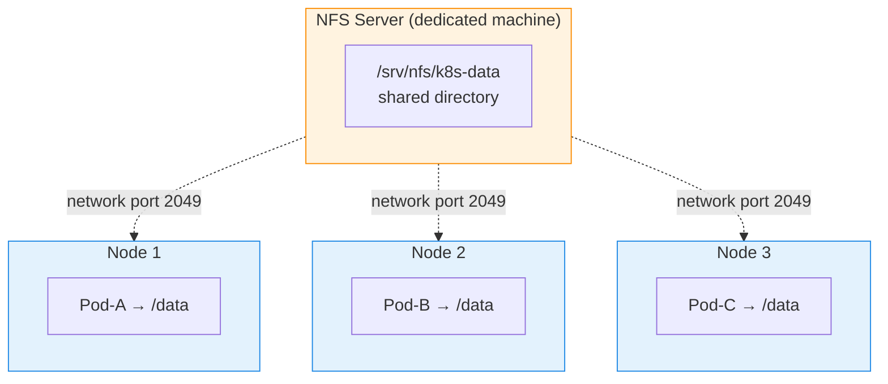

# NFS Volumes for Kubernetes (On-Premises) - Production Guide

> **Goal:** Set up shared, network-based storage for an on-prem Kubernetes cluster using NFS - so multiple pods on different nodes can read and write the same files.

## Learning Objectives

By the end you will be able to:

1. Explain why on-prem clusters need shared network storage and where NFS fits.
2. Install and configure an NFS server and the NFS client on worker nodes.
3. Use NFS in Kubernetes three ways: direct volume, manual PV/PVC, and dynamic provisioning.
4. Apply security and HA best practices, and troubleshoot common NFS errors.

## Real-World Analogy

NFS is like a **shared filing cabinet in the middle of the office**.

- The **NFS server** is the filing cabinet itself - one machine that physically holds all the files.
- Each **worker node** is a desk. To use the cabinet, every desk needs a **key (the `nfs-common` client package)** - without the key, a desk simply can't open the drawer (the pod gets stuck in `ContainerCreating`).
- Because everyone shares the same cabinet, any pod on any node sees the **same files** - that's `ReadWriteMany`.
- The catch: if that single cabinet catches fire (the NFS server dies), **everyone loses access**. That's why production needs a high-availability plan.

## Why NFS for On-Prem Kubernetes?

```
If you're NOT on AWS/Azure/GCP and running K8s on your own servers,
you need shared storage that works across nodes.

Options for on-prem shared storage:
┌──────────────────────────────────────────────────────────┐
│                                                          │
│  1. NFS (Network File System)     ← Most common, easy   │
│  2. Ceph (RADOS Block Device)     ← Enterprise grade    │
│  3. GlusterFS                     ← Distributed storage │
│  4. Longhorn (by Rancher)         ← K8s-native, free    │
│  5. OpenEBS                       ← Container-native    │
│                                                          │
│  NFS is the easiest to set up and most widely used      │
│  for on-prem Kubernetes clusters.                        │
│                                                          │
└──────────────────────────────────────────────────────────┘
```

### NFS vs Other On-Prem Storage

| Storage | Complexity | Shared Access | Best For |
|---------|-----------|--------------|----------|
| **NFS** | Easy | Yes (ReadWriteMany) | General purpose, simplest setup |
| **Ceph** | Hard | Yes | Enterprise, large scale |
| **GlusterFS** | Medium | Yes | Distributed clusters |
| **Longhorn** | Easy | Yes | K8s-native, built-in replication |
| **OpenEBS** | Medium | Depends | Container-attached storage |

**For beginners and most on-prem setups, NFS is the best choice.** It's simple, proven, and supports ReadWriteMany out of the box.

---

## How NFS Works with Kubernetes



All pods see the **same files** because they all mount the same NFS share (ReadWriteMany).

```
┌─── NFS Server (separate machine or VM) ───┐
│                                             │
│  IP: 192.168.1.100                         │
│  Shared directory: /srv/nfs/k8s-data       │
│                                             │
│  Any machine with NFS client can mount     │
│  this directory over the network            │
│                                             │
└──────────────────┬──────────────────────────┘
                   │ Network (port 2049)
          ┌────────┼────────┐
          │        │        │
                          
┌──── Node 1 ──┐ ┌──── Node 2 ──┐ ┌──── Node 3 ──┐
│  Pod-A        │ │  Pod-B        │ │  Pod-C        │
│    ↓          │ │    ↓          │ │    ↓          │
│  /data ───────┼─┼── /data ──────┼─┼── /data      │
│  (NFS mount)  │ │  (NFS mount)  │ │  (NFS mount)  │
└───────────────┘ └───────────────┘ └───────────────┘

All pods see the SAME files because they all
mount the same NFS share!
```

---

## Part 1: Setting Up the NFS Server

You need a dedicated server (or VM) to run the NFS server. This should NOT be one of your K8s nodes (for reliability).

### On Ubuntu/Debian

```bash
# ─── On the NFS Server machine ───

# 1. Install NFS server
sudo apt update
sudo apt install nfs-kernel-server -y

# 2. Create shared directory
sudo mkdir -p /srv/nfs/k8s-data
sudo chown nobody:nogroup /srv/nfs/k8s-data
sudo chmod 777 /srv/nfs/k8s-data

# 3. Configure exports (who can access)
sudo vi /etc/exports

# Add this line (allow all K8s nodes to access):
# /srv/nfs/k8s-data  192.168.1.0/24(rw,sync,no_subtree_check,no_root_squash)
#                     ↑                ↑    ↑        ↑              ↑
#                     Network range    RW   Sync     No subtree     Allow root
#                     of K8s nodes     mode writes   check          access

# For specific nodes only:
# /srv/nfs/k8s-data  192.168.1.10(rw,sync,no_subtree_check,no_root_squash) 192.168.1.11(rw,sync,no_subtree_check,no_root_squash)

# 4. Apply the exports
sudo exportfs -rav
# exporting 192.168.1.0/24:/srv/nfs/k8s-data

# 5. Start and enable NFS server
sudo systemctl restart nfs-kernel-server
sudo systemctl enable nfs-kernel-server

# 6. Verify
sudo systemctl status nfs-kernel-server
sudo exportfs -v
# /srv/nfs/k8s-data   192.168.1.0/24(rw,sync,wdelay,no_root_squash,no_subtree_check,...)
```

### On CentOS/RHEL

```bash
# 1. Install NFS
sudo yum install nfs-utils -y

# 2. Create directory
sudo mkdir -p /srv/nfs/k8s-data
sudo chmod 777 /srv/nfs/k8s-data

# 3. Configure /etc/exports (same as above)
echo '/srv/nfs/k8s-data 192.168.1.0/24(rw,sync,no_subtree_check,no_root_squash)' | sudo tee -a /etc/exports

# 4. Start services
sudo systemctl enable --now nfs-server rpcbind

# 5. Open firewall
sudo firewall-cmd --permanent --add-service=nfs
sudo firewall-cmd --permanent --add-service=mountd
sudo firewall-cmd --permanent --add-service=rpc-bind
sudo firewall-cmd --reload
```

### Verify from K8s Nodes

```bash
# ─── On each Kubernetes worker node ───

# 1. Install NFS client
sudo apt install nfs-common -y          # Ubuntu/Debian
# OR
sudo yum install nfs-utils -y           # CentOS/RHEL

# 2. Test mount manually
sudo mount -t nfs 192.168.1.100:/srv/nfs/k8s-data /mnt
ls /mnt                                 # Should work!
sudo umount /mnt

# If this works, NFS is ready for K8s!
```

---

## Part 2: Using NFS in Kubernetes (Manual PV)

### Method 1: Direct NFS Volume in Pod (Simple, Not Recommended)

```yaml
# nfs-direct-pod.yaml
apiVersion: v1
kind: Pod
metadata:
  name: nfs-direct
spec:
  containers:
  - name: myapp
    image: busybox
    command: ["sh", "-c", "echo 'Hello from $(hostname)' >> /data/log.txt && cat /data/log.txt && sleep 3600"]
    volumeMounts:
    - name: nfs-vol
      mountPath: /data
  volumes:
  - name: nfs-vol
    nfs:
      server: 192.168.1.100              # ← NFS server IP
      path: /srv/nfs/k8s-data            # ← NFS shared path
```

This works but hardcodes the NFS server IP in every pod YAML. Not ideal.

### Method 2: PV + PVC with NFS (Better)

```yaml
# nfs-pv.yaml
apiVersion: v1
kind: PersistentVolume
metadata:
  name: nfs-pv
spec:
  capacity:
    storage: 10Gi
  accessModes:
    - ReadWriteMany                       # ← NFS supports RWX!
  persistentVolumeReclaimPolicy: Retain
  storageClassName: nfs
  nfs:
    server: 192.168.1.100                 # ← NFS server IP
    path: /srv/nfs/k8s-data              # ← NFS shared path
---
apiVersion: v1
kind: PersistentVolumeClaim
metadata:
  name: nfs-pvc
spec:
  accessModes:
    - ReadWriteMany
  storageClassName: nfs
  resources:
    requests:
      storage: 5Gi
```

```bash
kubectl apply -f nfs-pv.yaml
# persistentvolume/nfs-pv created
# persistentvolumeclaim/nfs-pvc created

kubectl get pv,pvc
# NAME                     CAPACITY   ACCESS MODES   RECLAIM POLICY   STATUS   CLAIM             STORAGECLASS   AGE
# persistentvolume/nfs-pv  10Gi       RWX            Retain           Bound    default/nfs-pvc   nfs            5s
#
# NAME                          STATUS   VOLUME   CAPACITY   ACCESS MODES   STORAGECLASS   AGE
# persistentvolumeclaim/nfs-pvc Bound    nfs-pv   10Gi       RWX            nfs            5s
```

### Test with Multiple Pods

```yaml
# nfs-multi-pod.yaml
apiVersion: apps/v1
kind: Deployment
metadata:
  name: nfs-writer
spec:
  replicas: 3                             # ← 3 pods writing to same NFS!
  selector:
    matchLabels:
      app: nfs-writer
  template:
    metadata:
      labels:
        app: nfs-writer
    spec:
      containers:
      - name: writer
        image: busybox
        command: ["sh", "-c"]
        args:
        - |
          while true; do
            echo "$(hostname) at $(date)" >> /shared/entries.txt
            sleep 10
          done
        volumeMounts:
        - name: nfs-storage
          mountPath: /shared
      volumes:
      - name: nfs-storage
        persistentVolumeClaim:
          claimName: nfs-pvc
```

```bash
kubectl apply -f nfs-multi-pod.yaml

# All 3 pods are writing to the same NFS share!
# Check from any pod:
kubectl exec $(kubectl get pod -l app=nfs-writer -o name | head -1) -- cat /shared/entries.txt
# nfs-writer-xxxxxx-aaaaa at Thu Jan 15 10:30:00 UTC 2025
# nfs-writer-xxxxxx-bbbbb at Thu Jan 15 10:30:01 UTC 2025
# nfs-writer-xxxxxx-ccccc at Thu Jan 15 10:30:02 UTC 2025

# Check directly on the NFS server:
# ssh nfs-server
# cat /srv/nfs/k8s-data/entries.txt
# Same data! All synchronized!
```

---

## Part 3: Dynamic NFS Provisioning (Recommended)

Manual PV creation for every PVC is tedious. Use the **NFS Subdir External Provisioner** for automatic PV creation.

### Install NFS Provisioner via Helm

```bash
# Add the Helm repo
helm repo add nfs-subdir-external-provisioner \
  https://kubernetes-sigs.github.io/nfs-subdir-external-provisioner/
helm repo update

# Install the provisioner
helm install nfs-provisioner nfs-subdir-external-provisioner/nfs-subdir-external-provisioner \
  --set nfs.server=192.168.1.100 \
  --set nfs.path=/srv/nfs/k8s-data \
  --set storageClass.name=nfs-dynamic \
  --set storageClass.defaultClass=false \
  --namespace nfs-provisioner \
  --create-namespace

# Verify
kubectl get pods -n nfs-provisioner
# NAME                                              READY   STATUS    RESTARTS   AGE
# nfs-provisioner-nfs-subdir-external-pro-xxxxxxx   1/1     Running   0          30s

kubectl get sc
# NAME          PROVISIONER                                     RECLAIMPOLICY   VOLUMEBINDINGMODE   AGE
# nfs-dynamic   cluster.local/nfs-provisioner-nfs-subdir-ext... Delete          Immediate           30s
```

### Now Just Create PVC - PV is Auto-Created!

```yaml
# dynamic-nfs-pvc.yaml
apiVersion: v1
kind: PersistentVolumeClaim
metadata:
  name: my-app-data
spec:
  accessModes:
    - ReadWriteMany
  storageClassName: nfs-dynamic           # ← Uses the dynamic provisioner
  resources:
    requests:
      storage: 5Gi
```

```bash
kubectl apply -f dynamic-nfs-pvc.yaml

kubectl get pvc my-app-data
# NAME          STATUS   VOLUME                                     CAPACITY   ACCESS MODES   STORAGECLASS   AGE
# my-app-data   Bound    pvc-xxxxxxxx-xxxx-xxxx-xxxx-xxxxxxxxxxxx   5Gi        RWX            nfs-dynamic    5s

# PV was created automatically!
kubectl get pv
# NAME                                       CAPACITY   ACCESS MODES   RECLAIM POLICY   STATUS   CLAIM                STORAGECLASS   AGE
# pvc-xxxxxxxx-xxxx-xxxx-xxxx-xxxxxxxxxxxx   5Gi        RWX            Delete           Bound    default/my-app-data  nfs-dynamic    5s

# On the NFS server, a subdirectory was created:
# /srv/nfs/k8s-data/default-my-app-data-pvc-xxxxxxxx/
```

### Use in Any Pod/Deployment

```yaml
# app-with-nfs.yaml
apiVersion: apps/v1
kind: Deployment
metadata:
  name: my-app
spec:
  replicas: 3
  selector:
    matchLabels:
      app: my-app
  template:
    metadata:
      labels:
        app: my-app
    spec:
      containers:
      - name: app
        image: nginx:1.27
        volumeMounts:
        - name: app-data
          mountPath: /usr/share/nginx/html
      volumes:
      - name: app-data
        persistentVolumeClaim:
          claimName: my-app-data
```

---

## Part 4: NFS Best Practices & Troubleshooting

### Security Hardening

```bash
# In /etc/exports, use specific IPs instead of wide ranges:
/srv/nfs/k8s-data 192.168.1.10(rw,sync,no_subtree_check) 192.168.1.11(rw,sync,no_subtree_check)

# Use root_squash (default) to prevent root access:
# no_root_squash  → root in pod = root on NFS (less secure)
# root_squash     → root in pod = nobody on NFS (more secure)

# Create separate exports for different namespaces:
/srv/nfs/production   192.168.1.0/24(rw,sync,no_subtree_check)
/srv/nfs/staging      192.168.1.0/24(rw,sync,no_subtree_check)
```

### NFS Performance Tuning

```bash
# On the NFS server:

# 1. Increase NFS threads (default is 8, increase for heavy load)
echo 'RPCNFSDCOUNT=32' | sudo tee -a /etc/default/nfs-kernel-server
sudo systemctl restart nfs-kernel-server

# 2. Use async instead of sync for better write performance
# WARNING: Risk of data loss on server crash
# /srv/nfs/k8s-data 192.168.1.0/24(rw,async,no_subtree_check)

# 3. Mount with noatime on clients (reduces NFS traffic)
# In pod spec:
# volumes:
# - name: nfs-vol
#   nfs:
#     server: 192.168.1.100
#     path: /srv/nfs/k8s-data
#     readOnly: false
```

### High Availability NFS

```
Single NFS server = Single Point of Failure!

Options for HA:
1. DRBD + Pacemaker   → Active/passive NFS failover
2. GlusterFS          → Distributed replicated storage
3. Ceph               → Enterprise distributed storage
4. Longhorn           → K8s-native, easiest HA solution

For production on-prem, consider:
  Small team / simple needs  → NFS with daily backups
  Medium team               → Longhorn (K8s-native, auto-replication)
  Enterprise                → Ceph or dedicated NAS (NetApp, Synology)
```

### Common Issues & Fixes

| Problem | Cause | Fix |
|---------|-------|-----|
| Pod stuck in `ContainerCreating` | NFS client not installed on node | `apt install nfs-common` on all nodes |
| `mount.nfs: access denied` | NFS exports not configured | Check `/etc/exports` and `exportfs -rav` |
| `mount.nfs: Connection timed out` | Firewall blocking port 2049 | Open NFS ports in firewall |
| Permission denied inside pod | root_squash enabled | Use `no_root_squash` or set proper UIDs |
| Slow performance | sync mode + high latency | Consider `async` or local caching |
| PVC stuck in Pending | No matching PV or provisioner down | Check PV labels/class, provisioner logs |

### Debugging Commands

```bash
# Check NFS server status
sudo systemctl status nfs-kernel-server
sudo exportfs -v

# Check NFS mounts on a K8s node
ssh node-1
mount | grep nfs
showmount -e 192.168.1.100

# Check pod events
kubectl describe pod <pod-name>
# Look for mount errors in Events section

# Check NFS provisioner logs
kubectl logs -n nfs-provisioner -l app=nfs-subdir-external-provisioner
```

---

## NFS vs AWS EFS vs Longhorn

| Feature | NFS | AWS EFS | Longhorn |
|---------|-----|---------|----------|
| **Where** | On-prem | AWS only | Any K8s |
| **Setup** | Manual server | Managed service | Helm install |
| **HA** | Manual (DRBD) | Built-in | Built-in replication |
| **ReadWriteMany** | Yes | Yes | Yes |
| **Dynamic provisioning** | With provisioner | Built-in | Built-in |
| **Snapshots** | Manual | AWS Backup | Built-in |
| **Cost** | Your hardware | $0.30/GB/month | Your hardware |
| **Complexity** | Medium | Low | Low |
| **Best for** | Existing infra | AWS users | K8s-native HA storage |

---

## Common Mistakes

1. **Forgetting the NFS client on worker nodes.** Without `nfs-common` (Debian/Ubuntu) or `nfs-utils` (RHEL/CentOS) on **every** node, pods get stuck in `ContainerCreating` with a mount error. Install it on all nodes.
2. **Running the NFS server on a Kubernetes node.** If that node goes down or gets drained, your storage disappears too. Use a **dedicated** machine/VM.
3. **Wide-open `/etc/exports` with `no_root_squash`.** Combining a broad CIDR with `no_root_squash` lets a pod's root act as root on the server - a real security hole. Prefer specific IPs and the default `root_squash` unless you truly need otherwise.
4. **Firewall blocking port 2049.** A common cause of `mount.nfs: Connection timed out`. Open NFS ports on the server.
5. **Treating a single NFS server as production-safe.** It's a single point of failure. Plan for HA (Longhorn, Ceph, DRBD/Pacemaker) and regular backups.

## Quick Self-Check

1. Why must a dedicated NFS server (not a K8s node) be used in production?
2. What package must be installed on every worker node, and what happens if it's missing?
3. Which access mode does NFS support that EBS cannot, and why does that matter?
4. What does the NFS Subdir External Provisioner give you over manually creating PVs?
5. Name one security best practice for `/etc/exports`.

<details>
<summary>Answers</summary>

1. So your storage doesn't disappear when a worker node fails, is drained, or is rebooted - storage availability stays independent of the compute nodes.
2. The NFS client (`nfs-common` / `nfs-utils`). Without it, pods can't mount the share and stay stuck in `ContainerCreating`.
3. `ReadWriteMany` (RWX) - many pods across many nodes can read/write the same volume simultaneously, which EBS (block, RWO) can't do.
4. **Dynamic provisioning** - it auto-creates a PV (a subdirectory on the share) for each PVC, so you don't hand-write a PV every time.
5. Use specific node IPs instead of wide CIDR ranges, keep the default `root_squash`, or separate exports per namespace/environment.

</details>

## Summary

NFS is the simplest way to give an on-prem Kubernetes cluster shared, `ReadWriteMany` storage: a dedicated NFS server exports a directory, every worker node mounts it via the NFS client, and pods on any node see the same files. Start with manual PV/PVC to learn it, then switch to the **NFS Subdir External Provisioner** for automatic PV creation. Mind the gotchas - install the client everywhere, lock down `/etc/exports`, and plan for HA since a lone NFS server is a single point of failure.

**Next up →** [AWS Volumes (EBS/EFS)](../aws-volumes/notes.md) for the cloud-managed equivalent, or revisit [Volumes Theory](../notes.md).

## Key Takeaways

1. **NFS is the easiest shared storage** for on-prem Kubernetes
2. **Install nfs-common on ALL K8s worker nodes** - pods can't mount NFS without it
3. **Use a dedicated NFS server** - don't run it on a K8s node
4. **Dynamic provisioning** with NFS Subdir Provisioner saves manual PV work
5. **NFS supports ReadWriteMany (RWX)** - multiple pods can share the same volume
6. **Security:** Use specific IPs in `/etc/exports`, not wide ranges
7. **Single NFS server is a single point of failure** - plan for HA in production
8. **For new on-prem clusters, consider Longhorn** - easier HA than NFS

---

**Back to:** [Volumes Theory](../notes.md) | **Related:** [AWS Volumes (EBS/EFS)](../aws-volumes/notes.md) | [Volumes Demo (Local)](../../day13-volumes-demo/notes.md)
