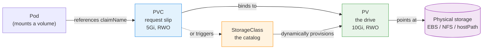

# Day 12 - Volumes & Persistent Storage

> **Goal:** Make your data survive pod restarts, crashes, and rescheduling by learning Kubernetes Volumes, PersistentVolumes, PersistentVolumeClaims, and StorageClasses.

## Learning Objectives

By the end of this lesson you will be able to:

1. Explain why container data is lost by default (ephemeral filesystem).
2. Use `emptyDir` and `hostPath` and know when each is appropriate.
3. Describe the relationship between PV, PVC, and StorageClass.
4. Write correct PV/PVC YAML (matching accessModes, storageClassName, capacity).
5. Choose the right access mode (RWO / ROX / RWX / RWOP) and reclaim policy.
6. Use a StorageClass for dynamic provisioning - the production default.

## Real-World Analogy (read this first!)

Storage in Kubernetes maps neatly onto how you'd get a hard drive in a big company data center:

| Kubernetes | Real-world equivalent |
|-----------|------------------------|
| **PersistentVolume (PV)** | An actual **hard drive** physically installed in the data center |
| **PersistentVolumeClaim (PVC)** | A **request slip** you hand to IT: "I need 5 GB, read-write" |
| **StorageClass** | The **catalog of drive types** IT offers (fast SSD, cheap HDD, network drive) |
| **Dynamic provisioning** | IT **automatically buys and installs** a new drive the moment you submit your slip |
| **accessModes** | The rules on the slip: can one machine use it, or many at once? |
| **reclaimPolicy** | What happens to the drive when you hand back your slip: **wipe & reuse**, **destroy**, or **keep the data** |

Key insight: as a developer you only ever fill out the **request slip (PVC)** and pick from the **catalog (StorageClass)**. You never touch the physical drive (PV) directly - that's the platform team's job (or, with dynamic provisioning, nobody's job at all).

## The Problem - Pods Lose Data!

By default, containers have an **ephemeral (temporary) filesystem**. When a pod dies or restarts, **all data inside the container is lost**.

```
Pod starts          Pod crashes         New Pod starts
┌──────────┐        ┌──────────┐        ┌──────────┐
│ Container │        │ Container│        │ Container │
│           │        │  CRASH!  │        │           │
│ data.txt  │  ───  │    X     │  ───  │ (empty!)  │
│ logs/     │        │    X     │        │           │
└──────────┘        └──────────┘        └──────────┘
   Has data          Data gone!          Fresh start
                                         No old data
```

### Why does this happen?

Each container gets its own **writable layer** from the container image. This layer is:
- **Temporary** - tied to the container's lifecycle
- **Isolated** - other containers can't see it
- **Gone when container stops** - like RAM, not like a hard disk

### Real-world examples where this is a problem

| Use Case | What Happens Without Volumes |
|----------|------------------------------|
| Database (MySQL, PostgreSQL) | All database records are lost on restart |
| File uploads | User-uploaded files disappear |
| Application logs | Logs vanish when pod restarts |
| Shared data between containers | Sidecar containers can't share files |
| Cache (Redis) | Cache rebuilds from scratch every time |

**Solution:** Kubernetes **Volumes** - attach storage to pods that survives container restarts.

---

## Volume Types Overview

Kubernetes supports many volume types. Here are the most important ones:

```
Volume Types (from simple to production-ready)
│
├── emptyDir        ← Temporary shared storage (dies with pod)
├── hostPath        ← Uses the node's filesystem (good for testing)
│
├── PersistentVolume (PV)    ← Cluster-level storage resource
├── PersistentVolumeClaim (PVC) ← Pod's request for storage
│
└── Cloud Provider Volumes
    ├── awsElasticBlockStore (EBS)
    ├── gcePersistentDisk
    └── azureDisk
```

---

## 1. emptyDir - Temporary Shared Storage

An `emptyDir` volume is created when a pod is assigned to a node. It starts **empty** and is **deleted when the pod is removed** from the node.

### When to use emptyDir

- Sharing files between containers in the **same pod**
- Temporary scratch space (e.g., sorting large data)
- Caching

```
┌───────── Pod ─────────────────────┐
│                                    │
│  ┌── Container A ──┐              │
│  │  writes to      │──┐           │
│  │  /shared/data   │  │           │
│  └─────────────────┘  │           │
│                                   │
│              ┌─── emptyDir ───┐   │
│              │  (shared disk) │   │
│              └────────────────┘   │
│                                   │
│  ┌── Container B ──┐  │           │
│  │  reads from     │──┘           │
│  │  /shared/data   │              │
│  └─────────────────┘              │
│                                    │
└────────────────────────────────────┘
```

### YAML Example

```yaml
apiVersion: v1
kind: Pod
metadata:
  name: shared-pod
spec:
  containers:
  - name: writer
    image: busybox
    command: ["sh", "-c", "echo 'Hello from writer' > /shared/data.txt && sleep 3600"]
    volumeMounts:
    - name: shared-vol          # ← Mount the volume
      mountPath: /shared        # ← Where inside the container

  - name: reader
    image: busybox
    command: ["sh", "-c", "sleep 5 && cat /shared/data.txt && sleep 3600"]
    volumeMounts:
    - name: shared-vol          # ← Same volume name
      mountPath: /shared        # ← Can use same or different path

  volumes:                       # ← Define volumes at pod level
  - name: shared-vol
    emptyDir: {}                 # ← Empty directory, created fresh
```

**Key point:** `emptyDir` is deleted when the **pod** is deleted (not just when a container restarts).

---

## 2. hostPath - Use the Node's Filesystem

A `hostPath` volume mounts a file or directory from the **host node's filesystem** into your pod.

```
┌──── Worker Node ────────────────────┐
│                                      │
│  Node filesystem:                    │
│  /data/myapp/  ──── hostPath        │
│       │                              │
│                                     │
│  ┌──── Pod ────────┐                │
│  │  Container      │                │
│  │  /app/data ─────┼── mounted      │
│  └─────────────────┘                │
│                                      │
└──────────────────────────────────────┘
```

### YAML Example

```yaml
apiVersion: v1
kind: Pod
metadata:
  name: hostpath-pod
spec:
  containers:
  - name: myapp
    image: nginx
    volumeMounts:
    - name: host-data
      mountPath: /usr/share/nginx/html   # ← Inside the container
  volumes:
  - name: host-data
    hostPath:
      path: /data/nginx                  # ← Path on the node
      type: DirectoryOrCreate            # ← Create if doesn't exist
```

### hostPath types

| Type | Description |
|------|-------------|
| `""` | No checks (default) |
| `DirectoryOrCreate` | Create directory if it doesn't exist |
| `Directory` | Directory must already exist |
| `FileOrCreate` | Create file if it doesn't exist |
| `File` | File must already exist |

### Warning about hostPath

```
  hostPath problems:
├── Pod is tied to a specific node (data is on THAT node only)
├── If pod moves to another node, it can't find its data
├── Security risk (pod can access host filesystem)
└── NOT recommended for production - use PersistentVolumes instead
```

---

## Local Persistent Volumes (Production Alternative to hostPath)

hostPath is bad for production, but sometimes you WANT to use the node's local disk (NVMe/SSD) for **high-performance** workloads. That's where **Local PV** comes in.

### hostPath vs Local PV

Both put data on a node's **local disk** - but they differ in one thing that changes everything: **whether Kubernetes knows *which* node the data is on.**

| Aspect | `hostPath` | Local PV (local PersistentVolume) |
|--------|------------|-----------------------------------|
| **What it is** | Mounts a path from **whatever node the pod lands on** straight into the pod | A PersistentVolume backed by a disk/path on **one specific, named node** |
| **Node awareness** | **None** - the pod can be scheduled to any node and just uses that node's copy of the path (often empty or wrong) | **`nodeAffinity` is required** - the PV records exactly which node holds the data |
| **Scheduling** | The scheduler ignores where the data lives | The scheduler **guarantees** the pod runs on the node that has the disk (`nodeAffinity` + `WaitForFirstConsumer`) |
| **Abstraction** | A direct pod volume - **no PVC needed** | Full **PV / PVC / StorageClass** lifecycle |
| **Data on reschedule** | Pod may move to another node and silently get a different/empty directory - data appears "lost" | Pod is pinned to the right node, so it always finds its data |
| **Provisioning** | Manual, ad-hoc | Static - you pre-create PVs (or run the local static provisioner); **no dynamic provisioning** |
| **Capacity tracking** | No | Yes (`capacity` on the PV) |
| **StatefulSets** | Not safe | Works well |
| **Security** | **High risk** - exposes the host filesystem (e.g. `/`, `/var/run/docker.sock`) to the pod | Safer - points at dedicated data disks/paths, not the whole host fs |
| **Survives node failure** | No | No (same limitation - data lives on that one node) |
| **Typical use** | Local testing (Minikube), or node agents that genuinely need host files (log shippers, CNI, `/var/log`) | Production high-IOPS local disk for apps that replicate at the app layer (Cassandra, Kafka, Elasticsearch) |

> **The one-line difference:** `hostPath` gives a pod *whatever is at that path on whatever node it happens to run on* (no guarantees). A **Local PV** gives a pod *a specific disk on a specific node*, and Kubernetes **schedules the pod onto that node** - the same physical local disk, but now with node-awareness, the PV/PVC lifecycle, and capacity tracking. **Both still lose the data if that node dies** - neither is a substitute for networked storage (EBS/EFS/NFS) when you need data to outlive a node.

### When to Use Local PV

```
Use Local PV when:
  - You need very high disk I/O (NVMe SSDs)
  - Network latency is unacceptable (databases like Cassandra, Kafka, Elasticsearch)
  - You have dedicated storage nodes

Do NOT use Local PV when:
  - You need data to survive node failure → use EBS, EFS, NFS instead
  - You need shared access across nodes → use EFS or NFS
  - Your pods need to move freely between nodes
```

### Local PV YAML

```yaml
# local-pv.yaml
apiVersion: storage.k8s.io/v1
kind: StorageClass
metadata:
  name: local-storage
provisioner: kubernetes.io/no-provisioner   # ← No dynamic provisioning
volumeBindingMode: WaitForFirstConsumer     # ← Wait until pod is scheduled
---
apiVersion: v1
kind: PersistentVolume
metadata:
  name: local-pv
spec:
  capacity:
    storage: 50Gi
  accessModes:
    - ReadWriteOnce
  persistentVolumeReclaimPolicy: Retain
  storageClassName: local-storage
  local:
    path: /mnt/disks/ssd1                   # ← Actual disk path on the node
  nodeAffinity:                             # ← REQUIRED for local PV!
    required:
      nodeSelectorTerms:
      - matchExpressions:
        - key: kubernetes.io/hostname
          operator: In
          values:
          - worker-node-1                   # ← Only this node has the disk
```

```
Key difference from hostPath:
  hostPath:  Pod lands on any node → might not find the data
  Local PV:  nodeAffinity + WaitForFirstConsumer
             → K8s GUARANTEES pod runs on the right node
```

### Local PV vs Network Storage

| Feature | Local PV | EBS/NFS/EFS |
|---------|----------|-------------|
| **Performance** | Highest (direct disk) | Good (network hop) |
| **Survives node failure** | No | Yes |
| **Pod scheduling** | Tied to node | Flexible |
| **Use case** | High-IOPS databases | General purpose |
| **Dynamic provisioning** | No (manual PV per disk) | Yes |

> **For production storage guides:** See [AWS Volumes (EBS/EFS)](aws-volumes/notes.md) | [NFS Volumes (On-Prem)](nfs-volumes/notes.md)

---

## 3. PersistentVolume (PV) and PersistentVolumeClaim (PVC)

This is the **production way** to handle storage in Kubernetes. It separates the "storage setup" from the "storage usage".

### Why PV/PVC?

Think of it like renting an apartment:

```
Real World Analogy:
├── Apartment (PV)       = The actual storage that exists
├── Lease Agreement (PVC) = Your request to use storage
├── Landlord (Admin)     = Creates the PV (provisions storage)
└── Tenant (Developer)   = Creates a PVC to claim storage

Kubernetes:
├── PersistentVolume (PV)      = A piece of storage in the cluster
├── PersistentVolumeClaim (PVC) = A request for storage by a user
├── Cluster Admin              = Creates PVs
└── Developer                  = Creates PVCs, uses them in Pods
```

### The Big Picture

```
┌─── Cluster Admin ───┐      ┌─── Developer ───────────────────┐
│                      │      │                                  │
│  Creates PV:         │      │  1. Creates PVC:                │
│  "10Gi of SSD on     │      │     "I need 5Gi of storage"     │
│   AWS EBS"           │      │                                  │
│                      │      │  2. Uses PVC in Pod:             │
│  ┌────────────┐      │      │     volumeMounts:                │
│  │     PV     │─────┼──────┼──── PVC ──── Pod                │
│  │   10Gi     │ bind  │      │                                  │
│  │   SSD      │      │      │  Developer never needs to know   │
│  └────────────┘      │      │  WHERE the storage actually is   │
│                      │      │                                  │
└──────────────────────┘      └──────────────────────────────────┘
```

### PersistentVolume (PV) - The Actual Storage

A PV is a **cluster-level resource** (not namespaced). It represents a piece of physical storage.

```yaml
# pv.yaml
apiVersion: v1
kind: PersistentVolume
metadata:
  name: my-pv
spec:
  capacity:
    storage: 10Gi                    # ← How much storage
  accessModes:
    - ReadWriteOnce                  # ← Who can access it
  persistentVolumeReclaimPolicy: Retain   # ← What happens when PVC is deleted
  storageClassName: manual           # ← Grouping label
  hostPath:                          # ← Where the data actually lives
    path: /mnt/data                  #    (hostPath for demo, use cloud volumes in prod)
```

### PersistentVolumeClaim (PVC) - Request for Storage

A PVC is a **namespaced resource**. It's how pods request storage.

```yaml
# pvc.yaml
apiVersion: v1
kind: PersistentVolumeClaim
metadata:
  name: my-pvc
spec:
  accessModes:
    - ReadWriteOnce                  # ← Must match PV's access mode
  resources:
    requests:
      storage: 5Gi                   # ← How much you need (must be <= PV)
  storageClassName: manual           # ← Must match PV's storageClassName
```

### Using PVC in a Pod

```yaml
# pod-with-pvc.yaml
apiVersion: v1
kind: Pod
metadata:
  name: myapp
spec:
  containers:
  - name: myapp
    image: nginx
    volumeMounts:
    - name: my-storage
      mountPath: /usr/share/nginx/html   # ← Mount point inside container
  volumes:
  - name: my-storage
    persistentVolumeClaim:
      claimName: my-pvc                  # ← Reference the PVC (not the PV!)
```

### How PV and PVC Bind Together



For a bind to succeed, the PVC and PV must be **compatible**: the PV must have **at least** the requested capacity, a **matching `storageClassName`**, and a **compatible `accessMode`**.

```
1. Admin creates PV (10Gi, ReadWriteOnce, storageClass=manual)
2. Developer creates PVC (5Gi, ReadWriteOnce, storageClass=manual)
3. Kubernetes BINDS PVC to PV automatically (if compatible)
4. Developer creates Pod referencing the PVC
5. Pod gets the storage!

PV States:
┌───────────┐     ┌───────────┐     ┌───────────┐     ┌───────────┐
│ Available  │────│   Bound   │────│ Released  │────│  Failed   │
│ (no PVC)   │     │ (has PVC) │     │(PVC gone) │     │  (error)  │
└───────────┘     └───────────┘     └───────────┘     └───────────┘
```

---

## Access Modes

Access modes define **how** the volume can be mounted:

| Access Mode | Short | Description | Use Case |
|-------------|-------|-------------|----------|
| `ReadWriteOnce` | RWO | Read-write by a **single node** | Databases (MySQL, PostgreSQL) |
| `ReadOnlyMany` | ROX | Read-only by **many nodes** | Shared config files, static assets |
| `ReadWriteMany` | RWX | Read-write by **many nodes** | Shared file uploads, NFS |
| `ReadWriteOncePod` | RWOP | Read-write by a **single pod** | Strict single-writer (K8s 1.22+) |

```
ReadWriteOnce (RWO):          ReadWriteMany (RWX):
┌────────┐                    ┌────────┐  ┌────────┐  ┌────────┐
│ Node 1 │                    │ Node 1 │  │ Node 2 │  │ Node 3 │
│ ┌────┐ │                    │ ┌────┐ │  │ ┌────┐ │  │ ┌────┐ │
│ │Pod │ │  ← Only this       │ │Pod │ │  │ │Pod │ │  │ │Pod │ │
│ └──┬─┘ │    node can        │ └──┬─┘ │  │ └──┬─┘ │  │ └──┬─┘ │
│    │    │    mount           │    │    │  │    │    │  │    │    │
│  ┌───┐│                    │    │    │  │    │    │  │    │    │
│  │ PV ││                    └────┼────┘  └────┼────┘  └────┼────┘
│  └────┘│                         │            │            │
└────────┘                         └────────┬───┘────────────┘
                                            │
                                         ┌────┐
                                         │ PV  │ (e.g., NFS, EFS)
                                         └─────┘
```

**Important:** Most cloud block storage (EBS, Azure Disk) only supports **RWO**. For RWX, use file storage like NFS, AWS EFS, or Azure Files.

---

## Reclaim Policies

What happens to the PV **after the PVC is deleted**?

| Policy | Description | Use Case |
|--------|-------------|----------|
| `Retain` | PV and data are **kept**. Admin must manually clean up. | Production data you can't afford to lose |
| `Delete` | PV and underlying storage are **deleted automatically** | Temporary/development environments |
| `Recycle` | Data is deleted (`rm -rf /volume/*`), PV becomes Available again | **Deprecated** - use dynamic provisioning instead |

```
PVC Deleted - What happens to PV?

Retain:                    Delete:
┌──────────┐              ┌──────────┐
│    PV    │              │    PV    │
│  Status: │              │          │
│ Released │              │  DELETED │
│          │              │          │
│ Data is  │              │ Data is  │
│ KEPT     │              │ GONE     │
│          │              │          │
│ Admin    │              │ Cloud    │
│ cleans   │              │ disk     │
│ up later │              │ removed  │
└──────────┘              └──────────┘
```

---

## StorageClass - Dynamic Provisioning

So far, we've been **statically provisioning** storage: an admin creates a PV first, then the developer creates a PVC.

**Dynamic provisioning** creates the PV **automatically** when a PVC is created!

### Static vs Dynamic Provisioning

```
STATIC Provisioning (Manual):
1. Admin creates PV           ┌──────┐
2. Developer creates PVC  ── │  PV  │ (already exists)
3. PVC binds to PV            └──────┘

DYNAMIC Provisioning (Automatic):
1. Admin creates StorageClass
2. Developer creates PVC  ── StorageClass ── Creates PV automatically!
                                                ┌──────┐
                                                │  PV  │ (auto-created)
                                                └──────┘
```

### StorageClass YAML

```yaml
# storageclass.yaml
apiVersion: storage.k8s.io/v1
kind: StorageClass
metadata:
  name: fast-ssd
provisioner: ebs.csi.aws.com          # ← Who creates the storage (modern EBS CSI driver)
parameters:
  type: gp3                           # ← AWS EBS volume type
  fsType: ext4                        # ← Filesystem type
reclaimPolicy: Delete                 # ← Delete PV when PVC is deleted
volumeBindingMode: WaitForFirstConsumer  # ← Wait until pod is scheduled
allowVolumeExpansion: true            # ← Allow resizing
```

### Using a StorageClass in PVC

```yaml
# pvc-dynamic.yaml
apiVersion: v1
kind: PersistentVolumeClaim
metadata:
  name: my-dynamic-pvc
spec:
  accessModes:
    - ReadWriteOnce
  resources:
    requests:
      storage: 20Gi
  storageClassName: fast-ssd          # ← Reference the StorageClass
                                      #    PV is created AUTOMATICALLY!
```

### Common StorageClass Provisioners

| Cloud | Provisioner | Volume Type |
|-------|-------------|-------------|
| AWS | `ebs.csi.aws.com` | EBS (gp2, gp3, io1) |
| GCP | `pd.csi.storage.gke.io` | Persistent Disk |
| Azure | `disk.csi.azure.com` | Azure Disk |
| Local | `kubernetes.io/no-provisioner` | Local storage |
| NFS | Various CSI drivers | NFS shares |

### Checking StorageClasses

```bash
# List available StorageClasses
kubectl get storageclass
# NAME                 PROVISIONER                RECLAIMPOLICY   VOLUMEBINDINGMODE
# standard (default)   k8s.io/minikube-hostpath   Delete          Immediate
# fast-ssd             ebs.csi.aws.com            Delete          WaitForFirstConsumer

# See details
kubectl describe storageclass standard
```

**Note:** Minikube comes with a `standard` StorageClass by default that uses `hostPath` storage.

---

## Putting It All Together - The Full Flow

```
┌──────────────────────────────────────────────────────────────┐
│                   The Storage Flow                            │
│                                                              │
│  Developer                  Kubernetes              Storage  │
│                                                              │
│  1. Create PVC ──────  2. Find matching PV                 │
│     (5Gi, RWO)             or StorageClass                   │
│                                   │                          │
│                                                             │
│                          3. Bind PVC to PV ──── 4. Actual   │
│                             (or create PV        Disk/Volume │
│                              dynamically)                    │
│                                   │                          │
│  5. Create Pod ──────  6. Mount volume                     │
│     with PVC ref           into container                    │
│                                   │                          │
│  7. App reads/writes      8. Data persists                   │
│     to mountPath             even if pod                     │
│                              restarts!                       │
│                                                              │
└──────────────────────────────────────────────────────────────┘
```

---

## Quick Reference - Useful kubectl Commands

```bash
# PersistentVolumes (cluster-wide)
kubectl get pv
kubectl describe pv <pv-name>
kubectl delete pv <pv-name>

# PersistentVolumeClaims (namespaced)
kubectl get pvc
kubectl describe pvc <pvc-name>
kubectl delete pvc <pvc-name>

# StorageClasses
kubectl get storageclass    # or: kubectl get sc
kubectl describe sc <name>

# Check which PVC is bound to which PV
kubectl get pv,pvc

# See volume mounts in a pod
kubectl describe pod <pod-name> | grep -A 5 "Mounts"
kubectl describe pod <pod-name> | grep -A 5 "Volumes"
```

---

## Common Mistakes

1. **Mismatched `storageClassName` between PV and PVC.** If they don't match (and you're not using dynamic provisioning), the PVC stays `Pending` forever. The empty string `""` means "no class" and is itself a value that must match.
2. **Requesting an incompatible accessMode.** Asking for `ReadWriteMany` on EBS/Azure Disk (block storage) will never bind - those only support `ReadWriteOnce`. For RWX you need file storage like NFS or AWS EFS.
3. **Requesting more storage than the PV offers.** A PVC asking for 20Gi cannot bind to a 10Gi PV. With static PVs the request must be ≤ the PV capacity.
4. **Expecting `Delete` reclaim policy to be safe for databases.** With `reclaimPolicy: Delete`, deleting the PVC destroys the underlying disk and all data. Use `Retain` for anything you can't lose.
5. **Using `hostPath` in production.** Data is tied to one node; if the pod reschedules elsewhere it can't find its data. Use a PV backed by network storage (EBS/EFS/NFS) or a Local PV instead.

## Quick Self-Check

1. What happens to data written inside a container (not a volume) when the pod is deleted and recreated?
2. In one sentence each, what are a PV, a PVC, and a StorageClass?
3. A teammate's PVC is stuck in `Pending`. Name two things you'd check.
4. Which access mode lets many nodes write to the same volume at once, and what kind of storage supports it?
5. You're deploying a production MySQL. Which reclaim policy should the StorageClass use, and why?

<details>
<summary>Answers</summary>

1. It's lost - the container's writable layer is ephemeral and disappears with the pod.
2. **PV** = a piece of real storage in the cluster (the drive). **PVC** = a request for storage by a developer (the slip). **StorageClass** = a template/catalog that can provision PVs automatically.
3. Any two of: does any PV match its `storageClassName`, capacity, and accessMode? Is a dynamic provisioner installed and running? Is the StorageClass name spelled correctly?
4. `ReadWriteMany` (RWX); supported by file storage such as NFS, AWS EFS, or Azure Files - not by EBS/block storage.
5. `Retain` - so deleting the PVC does not destroy the database's underlying disk and data.

</details>

## Summary

Containers are ephemeral, so anything important must live on a **Volume**. For temporary scratch use `emptyDir`; for testing only use `hostPath`; for real persistence use the **PV / PVC / StorageClass** trio. Developers hand in a **PVC (request slip)** and pick a **StorageClass (catalog)**, and Kubernetes binds it to a **PV (the actual drive)** - dynamically provisioning one when needed. Always match `storageClassName`, `accessModes`, and capacity, and choose your `reclaimPolicy` deliberately (`Retain` for data you can't lose).

**Next up →** [Day 13 - Volumes Demo](../day13-volumes-demo/notes.md), where you'll create PVs, PVCs, and prove data survives a pod restart. See also: [AWS Volumes (EBS/EFS)](aws-volumes/notes.md) and [NFS Volumes (On-Prem)](nfs-volumes/notes.md).

## Key Takeaways

1. **Containers are ephemeral** - data is lost when a pod dies, unless you use volumes
2. **emptyDir** = temporary shared storage between containers in the same pod (dies with the pod)
3. **hostPath** = use the node's filesystem (testing only, not for production)
4. **PersistentVolume (PV)** = a piece of storage provisioned in the cluster (cluster-level resource)
5. **PersistentVolumeClaim (PVC)** = a request for storage by a developer (namespaced resource)
6. **StorageClass** = enables dynamic provisioning (PV created automatically when PVC is created)
7. **Access Modes** = RWO (single node), ROX (read-only many), RWX (read-write many)
8. **Reclaim Policies** = Retain (keep data), Delete (remove data), Recycle (deprecated)
9. Developers only need to know about **PVC** and **StorageClass** - they never touch PVs directly
10. Always use **dynamic provisioning** with StorageClass in production

---

## Practice / Homework

1. Create a pod with `emptyDir` volume shared between two containers
2. Create a PV (5Gi, RWO, hostPath) and a matching PVC (3Gi)
3. Verify they bind: `kubectl get pv,pvc`
4. Create a pod that uses the PVC and writes data
5. Delete the pod and recreate it - verify data persists!
6. Check what StorageClasses are available: `kubectl get sc`
7. Create a PVC using the default StorageClass (no PV needed - it's dynamic!)
8. Experiment with different access modes and reclaim policies

---

**Previous:** [← Day 11 - Amazon EKS](../day11-eks/notes.md)
**Next:** [Day 13 - Volumes Demo →](../day13-volumes-demo/notes.md)
