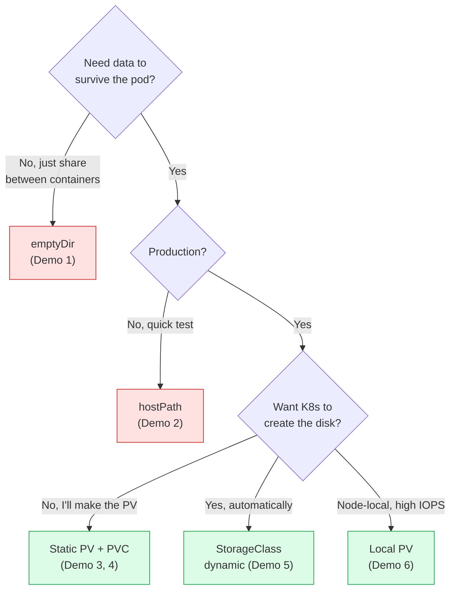

# Day 13 - Volumes Demo (Local / Minikube)

> **Goal:** Get hands-on with Kubernetes storage on Minikube and *prove with your own eyes* which volume types keep your data and which throw it away.

> **Pre-requisite:** Make sure you've read [Day 12 - Volumes Theory](../day12-volumes/notes.md)

In this hands-on session, we'll work through practical volume demos on **Minikube** using emptyDir, hostPath, and local PV/PVC. These are great for learning but **not for production**.

> **For production demos on EKS:** See [Volumes Demo (EKS / Production)](eks-demo.md)
> **For production theory:** See [AWS Volumes (EBS/EFS)](../day12-volumes/aws-volumes/notes.md) | [NFS Volumes (On-Prem)](../day12-volumes/nfs-volumes/notes.md)

---

## Learning Objectives

By the end of this demo you will be able to:

- Share a directory between two containers in the same pod using **emptyDir**
- Use **hostPath** to store data on a node and see why it's testing-only
- Manually create a **PV**, claim it with a **PVC**, and bind them
- Run **MySQL** with persistent storage and prove data survives a pod restart
- Use a **StorageClass** for **dynamic provisioning** (no manual PV)
- Use a **Local PV** the production-safe way (with `nodeAffinity`)

---

## Real-World Analogy: Where Do You Keep Your Stuff?

Think of a **container** as a **hotel room** you check into for one night.

| Storage type | Real-world analogy | Survives pod delete? |
|---|---|---|
| **No volume** (container disk) | Scribbling on the hotel notepad - housekeeping bins it at checkout | No |
| **emptyDir** | A shared whiteboard *inside your room* - both you and your roommate (containers) see it, but it's wiped when you check out (pod dies) | No (dies with pod) |
| **hostPath** | A drawer in *this specific hotel building* - your stuff stays, but only if you get the same building (node) next time | Only on same node |
| **PV + PVC** | A **rented storage locker** outside the hotel - switch rooms or hotels, your locker stays | Yes |
| **StorageClass (dynamic)** | The locker company builds you a **brand-new locker on demand** the moment you ask | Yes |

The whole point of this lab: *stop scribbling on the hotel notepad, start renting lockers.*

---

## Big Picture: The Volume Decision



---

## Demo 1 - emptyDir: Sharing Data Between Containers

**Goal:** Two containers in the same pod share a directory using `emptyDir`.

```
┌─────────── Pod: shared-pod ───────────┐
│                                        │
│  ┌── writer ───┐   ┌── reader ───┐   │
│  │  Writes a   │   │  Reads the  │   │
│  │  file every │   │  file and   │   │
│  │  5 seconds  │   │  prints it  │   │
│  └──────┬──────┘   └──────┬──────┘   │
│         │                  │          │
│                                     │
│     ┌───── emptyDir: shared-vol ───┐ │
│     │  /shared/                     │ │
│     │    timestamp.txt              │ │
│     └───────────────────────────────┘ │
└────────────────────────────────────────┘
```

### Step 1: Create the Pod

```yaml
# emptydir-demo.yaml
apiVersion: v1
kind: Pod
metadata:
  name: emptydir-demo
spec:
  containers:
  # Container 1: Writer - writes timestamp to shared volume
  - name: writer
    image: busybox
    command: ["sh", "-c"]
    args:
    - |
      while true; do
        echo "Written at $(date)" > /shared/timestamp.txt
        echo "Writer: wrote timestamp"
        sleep 5
      done
    volumeMounts:
    - name: shared-vol
      mountPath: /shared

  # Container 2: Reader - reads from shared volume
  - name: reader
    image: busybox
    command: ["sh", "-c"]
    args:
    - |
      while true; do
        if [ -f /shared/timestamp.txt ]; then
          echo "Reader: $(cat /shared/timestamp.txt)"
        else
          echo "Reader: waiting for file..."
        fi
        sleep 5
      done
    volumeMounts:
    - name: shared-vol
      mountPath: /shared

  volumes:
  - name: shared-vol
    emptyDir: {}           # ← Shared temporary directory
```

### Step 2: Apply and Verify

```bash
# Create the pod
kubectl apply -f emptydir-demo.yaml
# pod/emptydir-demo created

# Wait for it to start
kubectl get pod emptydir-demo
# NAME            READY   STATUS    RESTARTS   AGE
# emptydir-demo   2/2     Running   0          10s

# Check writer logs
kubectl logs emptydir-demo -c writer
# Writer: wrote timestamp
# Writer: wrote timestamp

# Check reader logs - it reads what writer wrote!
kubectl logs emptydir-demo -c reader
# Reader: Written at Thu Jan 15 10:30:00 UTC 2025
# Reader: Written at Thu Jan 15 10:30:05 UTC 2025
```

### Step 3: Prove emptyDir Dies with the Pod

```bash
# Delete the pod
kubectl delete pod emptydir-demo
# pod "emptydir-demo" deleted

# Recreate it
kubectl apply -f emptydir-demo.yaml

# Check reader logs - old data is gone, starts fresh
kubectl logs emptydir-demo -c reader
# Reader: waiting for file...
# Reader: Written at Thu Jan 15 10:35:00 UTC 2025   ← New timestamp!
```

### Clean Up

```bash
kubectl delete pod emptydir-demo
```

---

## Demo 2 - hostPath: Using the Node's Filesystem

**Goal:** Mount a directory from the host node into a pod. Data survives pod deletion (but is tied to that specific node).

```
┌──── Minikube Node ──────────────────┐
│                                      │
│  /tmp/hostpath-demo/  ← on node     │
│       │                              │
│        (mounted into pod)           │
│  ┌──── Pod ───────────┐             │
│  │  Container          │             │
│  │  /data/ ← sees      │             │
│  │    same files       │             │
│  └─────────────────────┘             │
│                                      │
└──────────────────────────────────────┘
```

### Step 1: Create the Pod

```yaml
# hostpath-demo.yaml
apiVersion: v1
kind: Pod
metadata:
  name: hostpath-demo
spec:
  containers:
  - name: myapp
    image: busybox
    command: ["sh", "-c", "echo 'Pod started at $(date)' >> /data/log.txt && cat /data/log.txt && sleep 3600"]
    volumeMounts:
    - name: host-vol
      mountPath: /data               # ← Path inside container
  volumes:
  - name: host-vol
    hostPath:
      path: /tmp/hostpath-demo       # ← Path on the node
      type: DirectoryOrCreate        # ← Create the dir if it doesn't exist
```

### Step 2: Apply and Verify

```bash
# Create the pod
kubectl apply -f hostpath-demo.yaml
# pod/hostpath-demo created

# Check the logs - see the file was written
kubectl logs hostpath-demo
# Pod started at Thu Jan 15 11:00:00 UTC 2025

# Exec into the pod and check the file
kubectl exec hostpath-demo -- cat /data/log.txt
# Pod started at Thu Jan 15 11:00:00 UTC 2025
```

### Step 3: Delete and Recreate - Data Survives!

```bash
# Delete the pod
kubectl delete pod hostpath-demo
# pod "hostpath-demo" deleted

# Recreate it
kubectl apply -f hostpath-demo.yaml
# pod/hostpath-demo created

# Check logs - you'll see BOTH entries!
kubectl logs hostpath-demo
# Pod started at Thu Jan 15 11:00:00 UTC 2025    ← OLD entry survived!
# Pod started at Thu Jan 15 11:05:00 UTC 2025    ← NEW entry
```

The data survived because it's stored on the **node's filesystem**, not inside the container.

### Clean Up

```bash
kubectl delete pod hostpath-demo
```

---

## Demo 3 - PersistentVolume and PersistentVolumeClaim (Static)

**Goal:** Create a PV manually, claim it with a PVC, use it in a pod, and prove data survives pod deletion.

```
Step 1: Create PV          Step 2: Create PVC         Step 3: Create Pod
┌─────────────┐           ┌──────────────┐           ┌──────────┐
│     PV      │           │     PVC      │           │   Pod    │
│ 1Gi, RWO    │──bind───│ 500Mi, RWO   │──uses───│  myapp   │
│ hostPath    │           │ manual class │           │          │
│ Available   │           │              │           │          │
└─────────────┘           └──────────────┘           └──────────┘
```

### Step 1: Create the PersistentVolume

```yaml
# pv-demo.yaml
apiVersion: v1
kind: PersistentVolume
metadata:
  name: demo-pv
spec:
  capacity:
    storage: 1Gi                          # ← Total capacity
  accessModes:
    - ReadWriteOnce                       # ← Single node read-write
  persistentVolumeReclaimPolicy: Retain   # ← Keep data after PVC deletion
  storageClassName: manual                # ← Custom class name
  hostPath:
    path: /mnt/demo-data                  # ← Actual path on node
```

```bash
kubectl apply -f pv-demo.yaml
# persistentvolume/demo-pv created

kubectl get pv
# NAME      CAPACITY   ACCESS MODES   RECLAIM POLICY   STATUS      CLAIM   STORAGECLASS   AGE
# demo-pv   1Gi        RWO            Retain           Available           manual         5s
```

Notice the status is **Available** - no one has claimed it yet.

### Step 2: Create the PersistentVolumeClaim

```yaml
# pvc-demo.yaml
apiVersion: v1
kind: PersistentVolumeClaim
metadata:
  name: demo-pvc
spec:
  accessModes:
    - ReadWriteOnce                       # ← Must match PV
  resources:
    requests:
      storage: 500Mi                      # ← Requesting 500Mi (PV has 1Gi - OK!)
  storageClassName: manual                # ← Must match PV
```

```bash
kubectl apply -f pvc-demo.yaml
# persistentvolumeclaim/demo-pvc created

kubectl get pvc
# NAME       STATUS   VOLUME    CAPACITY   ACCESS MODES   STORAGECLASS   AGE
# demo-pvc   Bound    demo-pv   1Gi        RWO            manual         5s

kubectl get pv
# NAME      CAPACITY   ACCESS MODES   RECLAIM POLICY   STATUS   CLAIM              STORAGECLASS   AGE
# demo-pv   1Gi        RWO            Retain           Bound    default/demo-pvc   manual         30s
```

Both PV and PVC now show **Bound** status. The PV's CLAIM column shows `default/demo-pvc`.

### Step 3: Create a Pod Using the PVC

```yaml
# pod-pvc-demo.yaml
apiVersion: v1
kind: Pod
metadata:
  name: pvc-demo-pod
spec:
  containers:
  - name: myapp
    image: busybox
    command: ["sh", "-c"]
    args:
    - |
      echo "=== Existing data ==="
      cat /data/entries.txt 2>/dev/null || echo "(no previous data)"
      echo ""
      echo "Entry from pod at $(date)" >> /data/entries.txt
      echo "=== Updated data ==="
      cat /data/entries.txt
      sleep 3600
    volumeMounts:
    - name: my-storage
      mountPath: /data
  volumes:
  - name: my-storage
    persistentVolumeClaim:
      claimName: demo-pvc                 # ← Reference the PVC!
```

```bash
kubectl apply -f pod-pvc-demo.yaml
# pod/pvc-demo-pod created

# Check the logs
kubectl logs pvc-demo-pod
# === Existing data ===
# (no previous data)
#
# === Updated data ===
# Entry from pod at Thu Jan 15 12:00:00 UTC 2025
```

### Step 4: Delete the Pod and Recreate - Data Persists!

```bash
# Delete ONLY the pod (not the PVC)
kubectl delete pod pvc-demo-pod
# pod "pvc-demo-pod" deleted

# Recreate the same pod
kubectl apply -f pod-pvc-demo.yaml
# pod/pvc-demo-pod created

# Check logs again - old data is still there!
kubectl logs pvc-demo-pod
# === Existing data ===
# Entry from pod at Thu Jan 15 12:00:00 UTC 2025     ← OLD DATA SURVIVED!
#
# === Updated data ===
# Entry from pod at Thu Jan 15 12:00:00 UTC 2025
# Entry from pod at Thu Jan 15 12:05:00 UTC 2025     ← NEW ENTRY ADDED
```

**This is the key takeaway:** PVC storage survives pod deletion!

### Clean Up

```bash
kubectl delete pod pvc-demo-pod
kubectl delete pvc demo-pvc
kubectl get pv
# NAME      CAPACITY   ACCESS MODES   RECLAIM POLICY   STATUS     CLAIM              STORAGECLASS   AGE
# demo-pv   1Gi        RWO            Retain           Released   default/demo-pvc   manual         10m

# Status is "Released" because reclaimPolicy is Retain
# Admin needs to manually delete the PV
kubectl delete pv demo-pv
```

---

## Demo 4 - MySQL with Persistent Storage

**Goal:** Run MySQL with persistent storage so data survives pod restarts. This is a real-world use case.

```
┌──── Pod: mysql ──────────┐
│                           │
│  ┌── mysql container ──┐ │
│  │  MySQL 8.0           │ │
│  │  /var/lib/mysql ─────┼─┼── PVC (mysql-pvc)
│  │                      │ │        │
│  └──────────────────────┘ │        
│                           │    PV (auto or manual)
└───────────────────────────┘        │
                                     
                                 Actual Disk
                              (data survives!)
```

### Step 1: Create PV and PVC

```yaml
# mysql-pv-pvc.yaml
apiVersion: v1
kind: PersistentVolume
metadata:
  name: mysql-pv
spec:
  capacity:
    storage: 2Gi
  accessModes:
    - ReadWriteOnce
  persistentVolumeReclaimPolicy: Retain
  storageClassName: manual
  hostPath:
    path: /mnt/mysql-data
---
apiVersion: v1
kind: PersistentVolumeClaim
metadata:
  name: mysql-pvc
spec:
  accessModes:
    - ReadWriteOnce
  resources:
    requests:
      storage: 2Gi
  storageClassName: manual
```

### Step 2: Create MySQL Pod

```yaml
# mysql-pod.yaml
apiVersion: v1
kind: Pod
metadata:
  name: mysql
  labels:
    app: mysql
spec:
  containers:
  - name: mysql
    image: mysql:8.0
    env:
    - name: MYSQL_ROOT_PASSWORD
      value: "rootpass123"              # ← In production, use Secrets!
    - name: MYSQL_DATABASE
      value: "testdb"
    ports:
    - containerPort: 3306
    volumeMounts:
    - name: mysql-storage
      mountPath: /var/lib/mysql         # ← Where MySQL stores its data
  volumes:
  - name: mysql-storage
    persistentVolumeClaim:
      claimName: mysql-pvc
```

### Step 3: Apply Everything

```bash
# Create PV and PVC
kubectl apply -f mysql-pv-pvc.yaml
# persistentvolume/mysql-pv created
# persistentvolumeclaim/mysql-pvc created

# Create MySQL pod
kubectl apply -f mysql-pod.yaml
# pod/mysql created

# Wait for MySQL to be ready (takes ~30 seconds)
kubectl get pod mysql -w
# NAME    READY   STATUS    RESTARTS   AGE
# mysql   1/1     Running   0          35s
```

### Step 4: Add Some Data

```bash
# Connect to MySQL
kubectl exec -it mysql -- mysql -u root -prootpass123

# Inside MySQL:
mysql> USE testdb;
mysql> CREATE TABLE users (id INT AUTO_INCREMENT PRIMARY KEY, name VARCHAR(50));
mysql> INSERT INTO users (name) VALUES ('Alice'), ('Bob'), ('Charlie');
mysql> SELECT * FROM users;
# +----+---------+
# | id | name    |
# +----+---------+
# |  1 | Alice   |
# |  2 | Bob     |
# |  3 | Charlie |
# +----+---------+
mysql> EXIT;
```

### Step 5: Delete Pod and Recreate - Data Survives!

```bash
# Delete the MySQL pod
kubectl delete pod mysql
# pod "mysql" deleted

# Recreate it (same PVC, same data!)
kubectl apply -f mysql-pod.yaml
# pod/mysql created

# Wait for it to be ready
kubectl get pod mysql -w

# Connect and check - data is still there!
kubectl exec -it mysql -- mysql -u root -prootpass123 -e "SELECT * FROM testdb.users;"
# +----+---------+
# | id | name    |
# +----+---------+
# |  1 | Alice   |
# |  2 | Bob     |
# |  3 | Charlie |
# +----+---------+
```

The data survived the pod deletion because MySQL's data directory (`/var/lib/mysql`) was stored on the PersistentVolume.

### Clean Up

```bash
kubectl delete pod mysql
kubectl delete pvc mysql-pvc
kubectl delete pv mysql-pv
```

---

## Demo 5 - Dynamic Provisioning with StorageClass

**Goal:** Let Kubernetes automatically create a PV when you create a PVC. No need to manually create PVs!

```
Without StorageClass (Static):
  Admin creates PV ── Developer creates PVC ── PVC binds to PV

With StorageClass (Dynamic):
  Developer creates PVC ── StorageClass auto-creates PV ── PVC binds to PV
                                    (No admin needed!)
```

### Step 1: Check Available StorageClasses

```bash
# Minikube comes with a default StorageClass
kubectl get storageclass
# NAME                 PROVISIONER                RECLAIMPOLICY   VOLUMEBINDINGMODE   ALLOWVOLUMEEXPANSION   AGE
# standard (default)   k8s.io/minikube-hostpath   Delete          Immediate           false                  7d
```

The `standard` StorageClass is the default in Minikube. It uses `hostPath` provisioning.

### Step 2: Create PVC (No PV Needed!)

```yaml
# dynamic-pvc.yaml
apiVersion: v1
kind: PersistentVolumeClaim
metadata:
  name: dynamic-pvc
spec:
  accessModes:
    - ReadWriteOnce
  resources:
    requests:
      storage: 1Gi
  storageClassName: standard          # ← Use the default StorageClass
  # Note: If you omit storageClassName entirely, the default class is used
```

```bash
kubectl apply -f dynamic-pvc.yaml
# persistentvolumeclaim/dynamic-pvc created

# Check - PV was created AUTOMATICALLY!
kubectl get pvc
# NAME          STATUS   VOLUME                                     CAPACITY   ACCESS MODES   STORAGECLASS   AGE
# dynamic-pvc   Bound    pvc-a1b2c3d4-e5f6-7890-abcd-ef1234567890   1Gi        RWO            standard       5s

kubectl get pv
# NAME                                       CAPACITY   ACCESS MODES   RECLAIM POLICY   STATUS   CLAIM                 STORAGECLASS   AGE
# pvc-a1b2c3d4-e5f6-7890-abcd-ef1234567890   1Gi        RWO            Delete           Bound    default/dynamic-pvc   standard       5s
```

Notice: We never created a PV! The StorageClass created it automatically.

### Step 3: Use It in a Pod

```yaml
# dynamic-pod.yaml
apiVersion: v1
kind: Pod
metadata:
  name: dynamic-demo
spec:
  containers:
  - name: myapp
    image: busybox
    command: ["sh", "-c", "echo 'Dynamic provisioning works!' > /data/test.txt && cat /data/test.txt && sleep 3600"]
    volumeMounts:
    - name: my-storage
      mountPath: /data
  volumes:
  - name: my-storage
    persistentVolumeClaim:
      claimName: dynamic-pvc
```

```bash
kubectl apply -f dynamic-pod.yaml
# pod/dynamic-demo created

kubectl logs dynamic-demo
# Dynamic provisioning works!
```

### Clean Up

```bash
kubectl delete pod dynamic-demo
kubectl delete pvc dynamic-pvc

# Since reclaimPolicy is Delete, the PV is automatically deleted too!
kubectl get pv
# No resources found
```

---

## Demo 6 - Local PV (Production Alternative to hostPath)

**Goal:** Use a Local PersistentVolume which is the production-grade way to use node-local disks. Unlike hostPath, Local PV ensures the pod is always scheduled on the correct node.

```
hostPath:
  Pod lands on any node → might not find the directory → broken!

Local PV:
  nodeAffinity + WaitForFirstConsumer
  → K8s GUARANTEES pod runs on the node with the disk 
```

### Step 1: Create StorageClass and Local PV

```yaml
# local-pv-demo.yaml
apiVersion: storage.k8s.io/v1
kind: StorageClass
metadata:
  name: local-storage
provisioner: kubernetes.io/no-provisioner   # ← Manual provisioning
volumeBindingMode: WaitForFirstConsumer     # ← Key! Wait until pod needs it
---
apiVersion: v1
kind: PersistentVolume
metadata:
  name: local-pv-demo
spec:
  capacity:
    storage: 5Gi
  accessModes:
    - ReadWriteOnce
  persistentVolumeReclaimPolicy: Retain
  storageClassName: local-storage
  local:
    path: /tmp/local-pv-data               # ← Actual path on the node
  nodeAffinity:                             # ← REQUIRED for local PV
    required:
      nodeSelectorTerms:
      - matchExpressions:
        - key: kubernetes.io/hostname
          operator: In
          values:
          - minikube                        # ← Node name (use kubectl get nodes)
```

### Step 2: Create the Directory on the Node

```bash
# On minikube, SSH in and create the directory
minikube ssh -- sudo mkdir -p /tmp/local-pv-data

# Apply the StorageClass and PV
kubectl apply -f local-pv-demo.yaml
# storageclass.storage.k8s.io/local-storage created
# persistentvolume/local-pv-demo created

kubectl get pv
# NAME             CAPACITY   ACCESS MODES   RECLAIM POLICY   STATUS      CLAIM   STORAGECLASS    AGE
# local-pv-demo    5Gi        RWO            Retain           Available           local-storage   5s
```

### Step 3: Create PVC and Pod

```yaml
# local-pvc-pod.yaml
apiVersion: v1
kind: PersistentVolumeClaim
metadata:
  name: local-pvc
spec:
  accessModes:
    - ReadWriteOnce
  storageClassName: local-storage
  resources:
    requests:
      storage: 3Gi
---
apiVersion: v1
kind: Pod
metadata:
  name: local-pv-pod
spec:
  containers:
  - name: myapp
    image: busybox
    command: ["sh", "-c"]
    args:
    - |
      echo "=== Previous data ==="
      cat /data/log.txt 2>/dev/null || echo "(no previous data)"
      echo "Written by $(hostname) at $(date)" >> /data/log.txt
      echo "=== Current data ==="
      cat /data/log.txt
      sleep 3600
    volumeMounts:
    - name: local-vol
      mountPath: /data
  volumes:
  - name: local-vol
    persistentVolumeClaim:
      claimName: local-pvc
```

```bash
kubectl apply -f local-pvc-pod.yaml

# PVC binds now because the pod triggered scheduling
kubectl get pvc local-pvc
# NAME        STATUS   VOLUME           CAPACITY   ACCESS MODES   STORAGECLASS    AGE
# local-pvc   Bound    local-pv-demo    5Gi        RWO            local-storage   10s

# Check logs
kubectl logs local-pv-pod
# === Previous data ===
# (no previous data)
# === Current data ===
# Written by local-pv-pod at Thu Jan 15 14:00:00 UTC 2025

# Verify the pod is on the correct node
kubectl get pod local-pv-pod -o wide
# NODE column should show "minikube" (the node we specified in nodeAffinity)
```

### Step 4: Delete and Recreate - Data Persists!

```bash
kubectl delete pod local-pv-pod

# Recreate (same PVC)
kubectl apply -f local-pvc-pod.yaml

kubectl logs local-pv-pod
# === Previous data ===
# Written by local-pv-pod at Thu Jan 15 14:00:00 UTC 2025    ← OLD DATA!
# === Current data ===
# Written by local-pv-pod at Thu Jan 15 14:00:00 UTC 2025
# Written by local-pv-pod at Thu Jan 15 14:05:00 UTC 2025    ← NEW ENTRY

# Also verify on the node itself:
minikube ssh -- cat /tmp/local-pv-data/log.txt
# Same content!
```

### Clean Up

```bash
kubectl delete pod local-pv-pod
kubectl delete pvc local-pvc
kubectl delete pv local-pv-demo
kubectl delete sc local-storage
minikube ssh -- sudo rm -rf /tmp/local-pv-data
```

---

## Summary of All Demos

| Demo | Volume Type | Data Survives Pod Delete? | Data Survives Node Delete? | Use Case |
|------|-------------|--------------------------|---------------------------|----------|
| 1 - emptyDir | emptyDir | No | No | Temp storage, sidecar sharing |
| 2 - hostPath | hostPath | Yes | No | Testing only, never production |
| 3 - PV/PVC | PV + PVC (static) | Yes | Depends on backend | Production workloads |
| 4 - MySQL | PV + PVC | Yes | Depends on backend | Databases |
| 5 - Dynamic | StorageClass | Yes | Depends on backend | Production (recommended) |
| 6 - Local PV | Local PV | Yes | No | High-IOPS databases (Cassandra, Kafka) |

---

## Key Takeaways

1. **emptyDir** is great for sharing data between containers but dies with the pod
2. **hostPath** survives pod deletion but ties you to a specific node
3. **PV + PVC** is the production pattern - separates storage provisioning from usage
4. **Dynamic provisioning** with StorageClass is the recommended approach - no manual PV creation
5. **MySQL data persists** across pod restarts when using PVC - this is the real-world use case
6. Always check `kubectl get pv,pvc` to see binding status
7. With `Retain` reclaim policy, you must manually clean up PVs after PVC deletion
8. With `Delete` reclaim policy, PVs are auto-deleted when PVC is deleted

---

## Common Mistakes

1. **Expecting `emptyDir` to persist.** It shares data *between containers* but is wiped when the **pod** is deleted. For survival, use a PVC.
2. **Using `hostPath` and wondering why data vanished.** If the pod gets rescheduled to a *different node*, the old node's directory isn't there. `hostPath` is testing-only - use **Local PV** (Demo 6) for the production-safe version.
3. **Forgetting that `Retain` leaves a `Released` PV behind.** After deleting a PVC, a `Retain` PV does **not** auto-bind to a new claim - an admin must delete or recycle it (`kubectl get pv` shows `Released`).
4. **Mismatched `storageClassName` / `accessModes` between PV and PVC.** A static PVC only binds to a PV with a **matching** class and compatible access mode/size. Mismatch → PVC stuck `Pending`.
5. **Panicking when a dynamic PVC sits `Pending`.** With `WaitForFirstConsumer` (used by Local PV and most cloud classes), the PVC binds only **after a pod consumes it**. Schedule the pod.

---

## Quick Self-Check

1. Two containers in one pod need to share scratch files that don't need to outlive the pod. Which volume type?
2. You delete a pod that used a **PVC**, then recreate it pointing at the same PVC. Is the data still there? Why?
3. A static PV has `reclaimPolicy: Retain`. You delete its PVC. What status does the PV show, and what must happen before it can be reused?
4. Why is **Local PV** safer than **hostPath** for node-local storage?
5. With dynamic provisioning, why might `kubectl get pvc` show `Pending` even though nothing is broken?

<details>
<summary>Answers</summary>

1. **emptyDir** - shared between containers in the pod, wiped when the pod dies.
2. **Yes.** The data lives on the PV (backed by the locker/disk), which survives the pod. The new pod re-binds the same PVC.
3. The PV shows **`Released`**. An admin must **delete it** (or manually recycle/clean it) before it can be bound again - `Retain` never auto-reclaims.
4. **Local PV** uses `nodeAffinity` so Kubernetes *guarantees* the pod is scheduled on the node that actually holds the disk; `hostPath` lets the pod land on any node, where the directory may not exist.
5. Many StorageClasses use **`WaitForFirstConsumer`** - the PV/disk is provisioned only once a pod consumes the PVC, so a brief `Pending` is expected.

</details>

---

## Summary

- **emptyDir** = share-between-containers scratch space; dies with the pod.
- **hostPath** = node-local, survives pod delete but **not** rescheduling - testing only.
- **PV + PVC** = the production pattern; storage is decoupled from the pod.
- **StorageClass** = dynamic provisioning, no manual PV creation (recommended).
- **Local PV** = production-safe node-local disk via `nodeAffinity`.
- Mind the **reclaimPolicy** (`Retain` vs `Delete`) so you don't lose - or leak - data.

---

## Practice / Homework

1. Create a pod with **emptyDir** where one container writes logs and another reads them
2. Create a **hostPath** volume and prove data survives pod deletion
3. Create a PV (2Gi) and PVC (1Gi), bind them, and verify with `kubectl get pv,pvc`
4. Run **MySQL** with persistent storage and prove data survives pod restart
5. Use **dynamic provisioning** with the default StorageClass
6. Experiment: What happens when you delete a PVC with `Retain` vs `Delete` reclaim policy?
7. Try creating a PVC that requests MORE storage than any PV has - what happens?

---

**Next up →** [Day 13 - Volumes Demo (EKS / Production)](eks-demo.md) - do this for real with AWS EBS & EFS.

**Previous:** [← Day 12 - Volumes (Theory)](../day12-volumes/notes.md)
**Next:** [Day 14 - StatefulSets →](../day14-statefulsets/notes.md)
