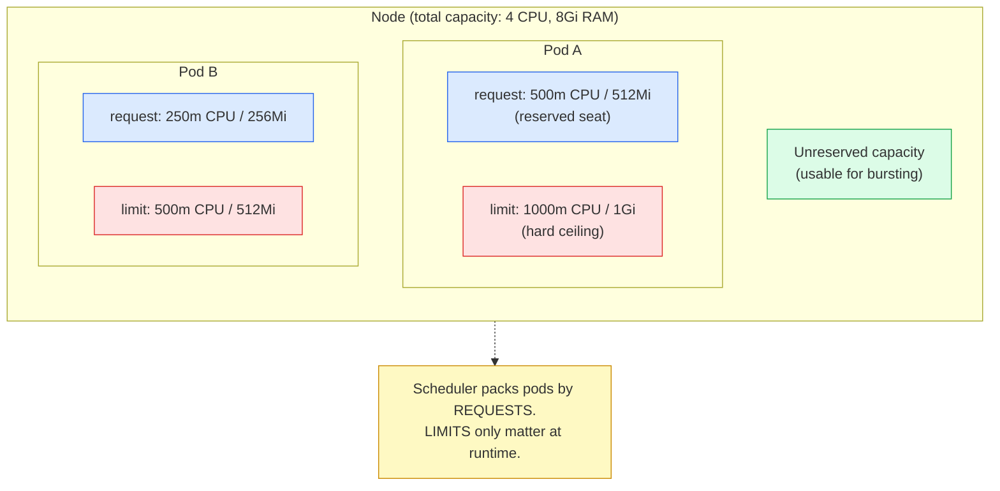
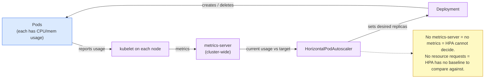
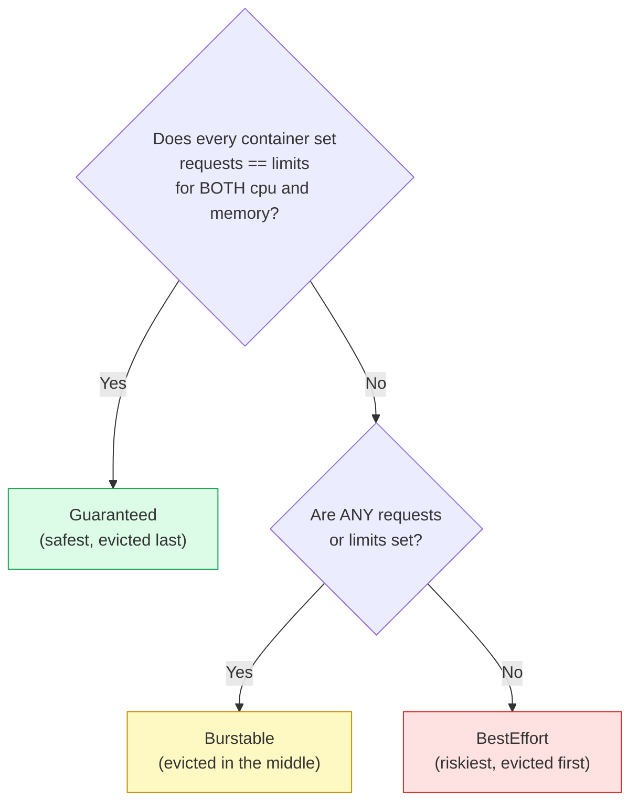
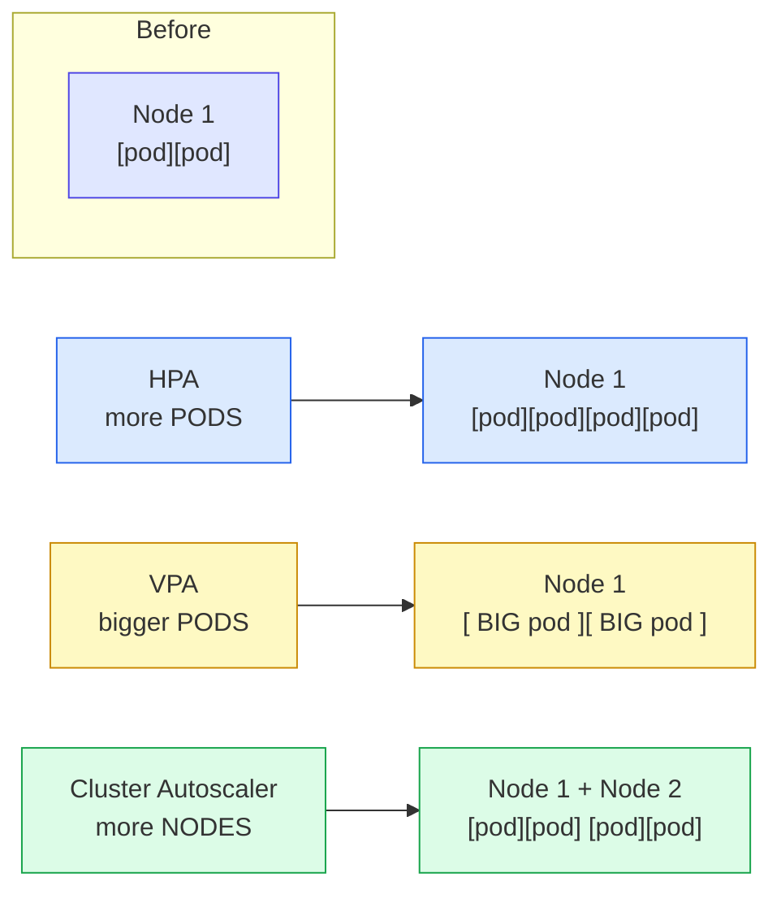

# Day 16 - Resource Management and Autoscaling

> **Goal:** Learn how to tell Kubernetes how much CPU and memory each app needs, what happens when an app asks for too much, and how the cluster can grow and shrink **by itself** - more pods, bigger pods, or more nodes.

## Learning Objectives

By the end of this lesson you will be able to:

- Explain the difference between a resource **request** and a resource **limit**
- Read CPU units (millicores like `250m`) and memory units (`Mi`, `Gi`)
- Predict what happens at the limit: CPU gets **throttled**, memory gets **OOMKilled**
- Identify the three **QoS classes** (Guaranteed, Burstable, BestEffort) and why they matter
- Use **LimitRange** and **ResourceQuota** to set per-namespace defaults and caps
- Set up a **Horizontal Pod Autoscaler (HPA)** with `autoscaling/v2` and `metrics-server`
- Describe what **VPA** and the **Cluster Autoscaler** do, and how they differ from HPA
- Remember the one-line rule: **HPA = more pods, VPA = bigger pods, Cluster Autoscaler = more nodes**

---

## Real-World Analogy: Running a Restaurant

Imagine you run a restaurant, and Kubernetes is the manager seating guests (pods) into the dining room (a node).

- **Request = the table you reserve.** When a party books "a table for 4", the host **holds 4 seats** for them even if they show up with 2 people. The restaurant counts those 4 seats as taken when deciding whether the next party fits. In Kubernetes, the **request** is the amount of CPU and memory the scheduler **reserves** for your pod when it decides which node to place it on.

- **Limit = the most the kitchen will ever serve you.** "All-you-can-eat, but we cut you off at 10 plates." You can eat more than you reserved **if there is spare food**, but never past the hard cap. In Kubernetes, the **limit** is the ceiling a container can use before Kubernetes steps in.

- **What happens at the limit depends on the resource:**
  - Ask for too much **CPU** and the kitchen just **slows your service down** (throttling) - you wait longer between plates, but you are not thrown out.
  - Ask for too much **memory** and there is no "wait" - the food is physically gone. The manager **removes you from the table** (OOMKilled - Out Of Memory Killed) and seats someone else.

- **HPA = calling in more waiters when the restaurant gets busy.** Lunch rush hits, so you bring in extra identical waiters to handle more tables. More waiters = more pods.

- **VPA = giving one waiter a bigger cart.** Instead of more waiters, you give the existing waiter a larger tray so they can carry more per trip. Bigger cart = bigger pod (more requests/limits).

- **Cluster Autoscaler = opening another dining room.** Every table is full and parties are waiting at the door. You unlock the back room and add more tables. More tables = more nodes.

Hold this picture. Everything below is just the precise version of the restaurant.

---

## Diagram: Requests vs Limits on a Node



## Diagram: The HPA Control Loop



---

## Part 1: Requests vs Limits

Every container can declare how much CPU and memory it wants. You write this under `resources` in the pod spec.

```yaml
resources:
  requests:        # the seat you reserve - used by the SCHEDULER
    cpu: "250m"
    memory: "256Mi"
  limits:          # the hard ceiling - enforced at RUNTIME
    cpu: "500m"
    memory: "512Mi"
```

### What a Request Does

The **request** is a promise: "this container needs at least this much to run." Kubernetes uses requests to decide **which node** the pod lands on. It only places the pod on a node that has enough **unreserved** capacity to cover the request.

- If no node has room for the request, the pod stays **Pending** (nothing schedules it).
- Requests are about **placement**, not enforcement. A container can use **more** than its request if the node has spare capacity.

### What a Limit Does

The **limit** is the hard ceiling enforced while the container runs. What happens when you hit it depends on the resource:

| Resource | At the limit | Pod survives? |
|----------|-------------|---------------|
| **CPU** | The container is **throttled** - it is forced to run slower | Yes, it just gets less CPU time |
| **Memory** | The container is **OOMKilled** (terminated) and usually restarted | No, the container is killed |

This asymmetry is the single most important thing on this page:

- **CPU is compressible.** You can always give a process *less* CPU by making it wait. So Kubernetes slows it down instead of killing it.
- **Memory is incompressible.** You cannot give a process "a bit less RAM" once it has allocated it. The only way to reclaim memory is to **kill** the container. That is what OOMKilled means.

### Reading the Units

**CPU is measured in cores and millicores.**

```
1 CPU   = 1 vCPU / 1 core = 1000m (millicores)
500m    = half a core
250m    = a quarter of a core
100m    = one tenth of a core
```

`m` stands for **milli** (thousandths). `250m` = 250/1000 of a CPU. You will see CPU written either as `1`, `0.5`, or `500m` - they are valid, but millicores are the convention because they are exact.

**Memory is measured in bytes, written with binary suffixes.**

```
1Ki = 1024 bytes
1Mi = 1024 Ki  (about 1 megabyte)  -- "mebibyte"
1Gi = 1024 Mi  (about 1 gigabyte)  -- "gibibyte"
```

Use `Mi` and `Gi` (binary, base-1024). There are also `M` and `G` (base-1000) but they are easy to mix up - stick to `Mi`/`Gi`.

```
512Mi = 512 mebibytes
1Gi   = 1024Mi
2Gi   = 2048Mi
```

### Seeing It in Action

```bash
# Describe a pod to see its requests and limits
kubectl describe pod my-app-xyz
# ...
# Limits:
#   cpu:     500m
#   memory:  512Mi
# Requests:
#   cpu:     250m
#   memory:  256Mi

# A pod killed for using too much memory shows this:
kubectl describe pod my-app-xyz
# Last State:  Terminated
#   Reason:    OOMKilled        <-- ran past its memory limit
#   Exit Code: 137              <-- 137 = killed by SIGKILL (128 + 9)
```

> **Rule of thumb:** Always set **requests** so the scheduler can place pods sanely and so HPA has a baseline. Set a **memory limit** to stop one leaky container from eating the whole node. Be careful with **CPU limits** - throttling a healthy app can hurt latency more than it helps (more on this in Common Mistakes).

---

## Part 2: QoS Classes (Quality of Service)

When a node runs low on memory, Kubernetes has to decide **which pods to evict first**. It does this using the pod's **QoS class**, which it figures out automatically from your requests and limits. You do not set the class directly - it is derived.

There are three classes:

| QoS Class | How you get it | Evicted... |
|-----------|----------------|------------|
| **Guaranteed** | Every container sets **both** requests and limits, and request **==** limit, for **both** CPU and memory | **Last** (most protected) |
| **Burstable** | At least one container has a request or limit, but it does not meet the Guaranteed rule | **In the middle** |
| **BestEffort** | **No** requests or limits set at all | **First** (least protected) |



### Examples

```yaml
# Guaranteed: requests == limits for cpu AND memory
resources:
  requests: { cpu: "500m", memory: "512Mi" }
  limits:   { cpu: "500m", memory: "512Mi" }
```

```yaml
# Burstable: has requests, but limits are higher (or partly set)
resources:
  requests: { cpu: "250m", memory: "256Mi" }
  limits:   { cpu: "500m", memory: "512Mi" }
```

```yaml
# BestEffort: nothing set at all
# (no resources block)
```

Check the class of a running pod:

```bash
kubectl get pod my-app-xyz -o jsonpath='{.status.qosClass}'
# Burstable
```

> **Why this matters:** if the node is starved for memory, your **BestEffort** pods are the first to be killed. Critical workloads (databases, payment services) are often run as **Guaranteed** so they survive the longest.

---

## Part 3: LimitRange and ResourceQuota (Namespace Guardrails)

Asking every developer to remember requests and limits on every pod does not scale. Two namespace-level objects fix this:

- **LimitRange** sets **per-pod / per-container** defaults and bounds (applies to each object).
- **ResourceQuota** sets a **total cap for the whole namespace** (applies to the sum of all objects).

Think of it as: LimitRange = "no single party may order more than X"; ResourceQuota = "this whole room has a total food budget."

### LimitRange: Defaults and Bounds Per Container

```yaml
# limitrange.yaml
apiVersion: v1
kind: LimitRange
metadata:
  name: container-limits
  namespace: team-a
spec:
  limits:
  - type: Container
    default:                 # applied as the LIMIT if the pod sets none
      cpu: "500m"
      memory: "512Mi"
    defaultRequest:          # applied as the REQUEST if the pod sets none
      cpu: "250m"
      memory: "256Mi"
    max:                     # no container may exceed these
      cpu: "2"
      memory: "2Gi"
    min:                     # no container may request less than these
      cpu: "50m"
      memory: "64Mi"
```

With this in place, a pod created in `team-a` with **no** `resources` block automatically gets `requests: 250m/256Mi` and `limits: 500m/512Mi`. A pod that asks for `4Gi` is **rejected** because it exceeds `max`.

### ResourceQuota: A Total Cap for the Namespace

```yaml
# resourcequota.yaml
apiVersion: v1
kind: ResourceQuota
metadata:
  name: team-a-quota
  namespace: team-a
spec:
  hard:
    requests.cpu: "4"          # sum of all pod CPU requests <= 4 cores
    requests.memory: "8Gi"     # sum of all pod memory requests <= 8Gi
    limits.cpu: "8"            # sum of all pod CPU limits <= 8 cores
    limits.memory: "16Gi"
    pods: "20"                 # at most 20 pods in this namespace
```

```bash
kubectl apply -f limitrange.yaml
kubectl apply -f resourcequota.yaml

# See how much of the quota is used
kubectl get resourcequota team-a-quota -n team-a
# NAME           AGE   REQUEST                                   LIMIT
# team-a-quota   1m    requests.cpu: 1/4, requests.memory: 2Gi/8Gi   limits.cpu: 2/8 ...
```

> **Important gotcha:** when a **ResourceQuota for requests/limits exists**, Kubernetes **requires** every pod in that namespace to declare those resources, otherwise the pod is rejected. This is exactly why you pair a ResourceQuota with a **LimitRange** - the LimitRange fills in defaults so existing pods do not suddenly break.

---

## Part 4: Horizontal Pod Autoscaler (HPA)

The HPA watches a metric (usually CPU) and **changes the number of pod replicas** to keep that metric near a target. Busy = more pods. Quiet = fewer pods. This is the "call in more waiters" autoscaler.

### Prerequisites (do not skip these)

1. **metrics-server must be installed.** HPA reads current CPU/memory usage from metrics-server. No metrics-server = HPA shows `<unknown>` and never scales. The same component powers `kubectl top`.
2. **The target pods MUST have resource requests set.** HPA scales on a **percentage of the request** (for example "keep average CPU at 50% of the request"). With no request there is no denominator, so HPA cannot compute a percentage and will not scale.

```bash
# Install metrics-server (most clusters)
kubectl apply -f https://github.com/kubernetes-sigs/metrics-server/releases/latest/download/components.yaml

# Verify it works - these need metrics-server
kubectl top nodes
# NAME       CPU(cores)   CPU%   MEMORY(bytes)   MEMORY%
# node-1     180m         9%     1200Mi          30%

kubectl top pods
# NAME             CPU(cores)   MEMORY(bytes)
# my-app-xyz       240m         180Mi
```

> On managed clusters like EKS, metrics-server is often **not** installed by default - you must add it yourself. If `kubectl top` errors with "Metrics API not available", that is your sign.

### The Quick Way: kubectl autoscale

```bash
# Scale the "web" deployment between 2 and 10 pods,
# targeting 50% average CPU utilization (50% of the CPU request)
kubectl autoscale deployment web --cpu-percent=50 --min=2 --max=10

# Watch it
kubectl get hpa web
# NAME   REFERENCE        TARGETS   MINPODS   MAXPODS   REPLICAS
# web    Deployment/web   30%/50%   2         10        2
```

If `TARGETS` shows `<unknown>/50%`, you are missing metrics-server or the deployment has no CPU **request**.

### The YAML Way (recommended for real projects)

Use **`autoscaling/v2`** - it supports multiple metrics, memory, and custom metrics. The older `autoscaling/v1` only did CPU.

```yaml
# hpa.yaml
apiVersion: autoscaling/v2        # v2 - the modern API
kind: HorizontalPodAutoscaler
metadata:
  name: web-hpa
spec:
  scaleTargetRef:                 # what to scale
    apiVersion: apps/v1
    kind: Deployment
    name: web
  minReplicas: 2
  maxReplicas: 10
  metrics:
  - type: Resource               # built-in CPU/memory metric
    resource:
      name: cpu
      target:
        type: Utilization        # percentage of the REQUEST
        averageUtilization: 50   # keep average CPU at 50% of request
  - type: Resource
    resource:
      name: memory
      target:
        type: Utilization
        averageUtilization: 70   # also scale on memory > 70% of request
```

The Deployment it targets **must** declare requests:

```yaml
# deployment.yaml (the part HPA depends on)
spec:
  template:
    spec:
      containers:
      - name: web
        image: nginx
        resources:
          requests:              # <-- REQUIRED for HPA to work
            cpu: "200m"
            memory: "128Mi"
          limits:
            cpu: "500m"
            memory: "256Mi"
```

```bash
kubectl apply -f hpa.yaml
kubectl get hpa web-hpa
kubectl describe hpa web-hpa     # shows scaling events and current metrics
```

### How HPA Decides (the formula)

```
desiredReplicas = ceil( currentReplicas * (currentMetric / targetMetric) )

Example:
  4 pods running, average CPU = 80% of request, target = 50%
  desired = ceil( 4 * (80 / 50) ) = ceil(6.4) = 7 pods
```

HPA also has a **cooldown** so it does not flap: it scales up quickly but waits before scaling back down (default stabilization window ~5 minutes for scale-down).

### Custom and external metrics (brief)

`autoscaling/v2` can also scale on application metrics - requests per second, queue length, etc. - via `type: Pods` or `type: External` (backed by an adapter like Prometheus Adapter or KEDA). The shape is the same; only the metric source changes.

---

## Part 5: Vertical Pod Autoscaler (VPA), Briefly

Where HPA adds **more** pods, the **VPA makes each pod bigger** by adjusting its CPU/memory **requests** (and optionally limits) to match what the app actually uses.

- It is an **add-on**, not built into Kubernetes - you install it separately.
- In its default `Auto`/`Recreate` mode it usually has to **restart (evict and recreate) the pod** to apply new resources, because most pods cannot change resources in place. (In-place resize is a newer, evolving feature.)
- Modes: `Off` (only recommend), `Initial` (set at creation only), `Auto`/`Recreate` (actively adjust).

```yaml
# vpa.yaml (requires the VPA add-on installed)
apiVersion: autoscaling.k8s.io/v1
kind: VerticalPodAutoscaler
metadata:
  name: web-vpa
spec:
  targetRef:
    apiVersion: apps/v1
    kind: Deployment
    name: web
  updatePolicy:
    updateMode: "Auto"
```

> **Do not run VPA and HPA on the same metric (e.g. both on CPU) for the same workload** - they fight each other. A common safe combo is HPA on CPU and VPA on memory, or VPA in `Off` mode just for recommendations.

---

## Part 6: Cluster Autoscaler, Briefly

HPA and VPA work **inside** the existing nodes. But what if there is simply no room left - every node is full and new pods sit **Pending**? That is the job of the **Cluster Autoscaler**: it adds and removes **nodes**.

- **Scale up:** when pods are `Pending` because no node has enough capacity for their **requests**, it asks the cloud provider for a new node.
- **Scale down:** when nodes are underused and their pods could fit elsewhere, it drains and removes the node to save money.
- It works at the **infrastructure** layer (it talks to the cloud provider's node groups / autoscaling groups).

This is why **requests matter even for the Cluster Autoscaler** - it decides whether a pod "fits" based on requests, not actual usage.

> **Karpenter** is a modern alternative on AWS. Instead of pre-defined node groups, it looks at the exact pods that are pending and provisions **right-sized nodes** (often faster and cheaper, picking instance types on demand). Conceptually it does the same job as the Cluster Autoscaler - just smarter about *what* node to add.

---

## The Big Comparison



| | What it changes | Trigger | Needs | Layer |
|---|---|---|---|---|
| **HPA** | Number of pods (replica count) | CPU/memory/custom metric vs target | metrics-server + resource **requests** | App / workload |
| **VPA** | Size of each pod (requests/limits) | Actual usage vs configured | VPA add-on; usually **restarts** pods | App / workload |
| **Cluster Autoscaler** | Number of nodes | Pods stuck **Pending** (no room) | Cloud node groups (or Karpenter) | Infrastructure |

**One-liner to memorize:** HPA = more pods. VPA = bigger pods. Cluster Autoscaler = more nodes.

How they work together in a real cluster: traffic spikes -> **HPA** adds pods -> nodes fill up and new pods go Pending -> **Cluster Autoscaler** adds a node -> the Pending pods schedule. When traffic drops, the chain reverses to save money.

---

## Common Mistakes

1. **No resource requests set, then expecting HPA to work.** HPA scales on a **percentage of the request**. With no request there is no baseline, so `kubectl get hpa` shows `<unknown>` and it never scales. Always set CPU requests on HPA-targeted pods.
2. **No requests at all, so the scheduler guesses.** Without requests your pods become **BestEffort**, get packed onto nodes blindly, and are the **first** to be evicted under memory pressure. Set at least requests on anything that matters.
3. **Setting limits == requests everywhere "to be safe."** That forces **Guaranteed** QoS and gives the app **zero room to burst**. A web app that occasionally needs a CPU spike will be throttled hard at its limit. Reserve request==limit for workloads that genuinely need predictable, isolated performance.
4. **Memory limit set too low, causing constant OOMKills.** Unlike CPU, hitting the memory limit **kills** the container (exit code 137, `Reason: OOMKilled`). If a pod restarts in a loop, check whether its memory limit is below what the app actually needs.
5. **Forgetting metrics-server.** No metrics-server means `kubectl top` errors **and** HPA cannot read usage. On EKS and many managed clusters it is not installed by default - you must add it.
6. **Confusing HPA with the Cluster Autoscaler.** HPA adds **pods**; if the nodes are already full, those new pods just sit **Pending**. You also need the **Cluster Autoscaler** (or Karpenter) to add **nodes**. They solve different problems and are usually used together.

---

## Quick Self-Check

1. What is the difference between a resource **request** and a resource **limit**, and which one does the scheduler use to place a pod?
2. A container hits its CPU limit, and another hits its memory limit. What happens to each?
3. A pod sets `requests: cpu 500m / mem 512Mi` and `limits: cpu 500m / mem 512Mi`. What QoS class is it, and what does that mean during memory pressure?
4. Name the **two** prerequisites without which an HPA will not scale.
5. Your HPA scaled the deployment to 12 pods but several are stuck `Pending`. Which autoscaler do you still need, and why?

<details>
<summary>Answers</summary>

1. The **request** is what Kubernetes **reserves** and uses to decide which node the pod fits on (placement). The **limit** is the hard ceiling enforced at runtime. The **scheduler uses requests**.
2. CPU at the limit: the container is **throttled** (slowed down) but keeps running. Memory at the limit: the container is **OOMKilled** (terminated, exit code 137) and usually restarted.
3. **Guaranteed** (requests == limits for both CPU and memory). It is the **most protected** - evicted **last** when the node runs low on memory.
4. (a) **metrics-server installed** so HPA can read usage, and (b) **resource requests set** on the target pods so HPA has a baseline to compute a percentage.
5. The **Cluster Autoscaler** (or **Karpenter** on AWS). HPA only adds pods; if no node has room, the pods stay Pending until a **new node** is added.

</details>

---

## Summary

- **Requests** reserve capacity and drive **scheduling**; **limits** are the runtime **ceiling**.
- CPU is measured in **millicores** (`250m` = quarter core); memory in **`Mi`/`Gi`** (base-1024).
- At the limit: **CPU is throttled**, **memory is OOMKilled** - because CPU is compressible and memory is not.
- **QoS classes** (Guaranteed > Burstable > BestEffort) are derived from your requests/limits and decide eviction order.
- **LimitRange** sets per-container defaults/bounds; **ResourceQuota** caps a whole namespace - use them together.
- **HPA** scales pod **count** using `autoscaling/v2`; it needs **metrics-server** and **resource requests**.
- **VPA** resizes pods (usually by restarting them); **Cluster Autoscaler** adds/removes **nodes** when pods cannot schedule (Karpenter is the modern AWS alternative).
- Remember: **HPA = more pods, VPA = bigger pods, Cluster Autoscaler = more nodes.**

---

## Practice / Homework

1. Add `requests` and `limits` to a deployment and confirm its QoS class with `kubectl get pod ... -o jsonpath='{.status.qosClass}'`.
2. Install metrics-server and confirm `kubectl top nodes` and `kubectl top pods` return numbers.
3. Create an HPA with `autoscaling/v2` targeting 50% CPU; generate load (for example with a busy loop) and watch `kubectl get hpa -w` add pods.
4. Apply a LimitRange and a ResourceQuota to a namespace, then try to create a pod with no resources and one that exceeds the quota - observe both outcomes.
5. Write one sentence each describing when you would reach for HPA, VPA, and the Cluster Autoscaler.

---

**Next up ->** [Day 17 - RBAC and Security](../day17-rbac-security/notes.md)
