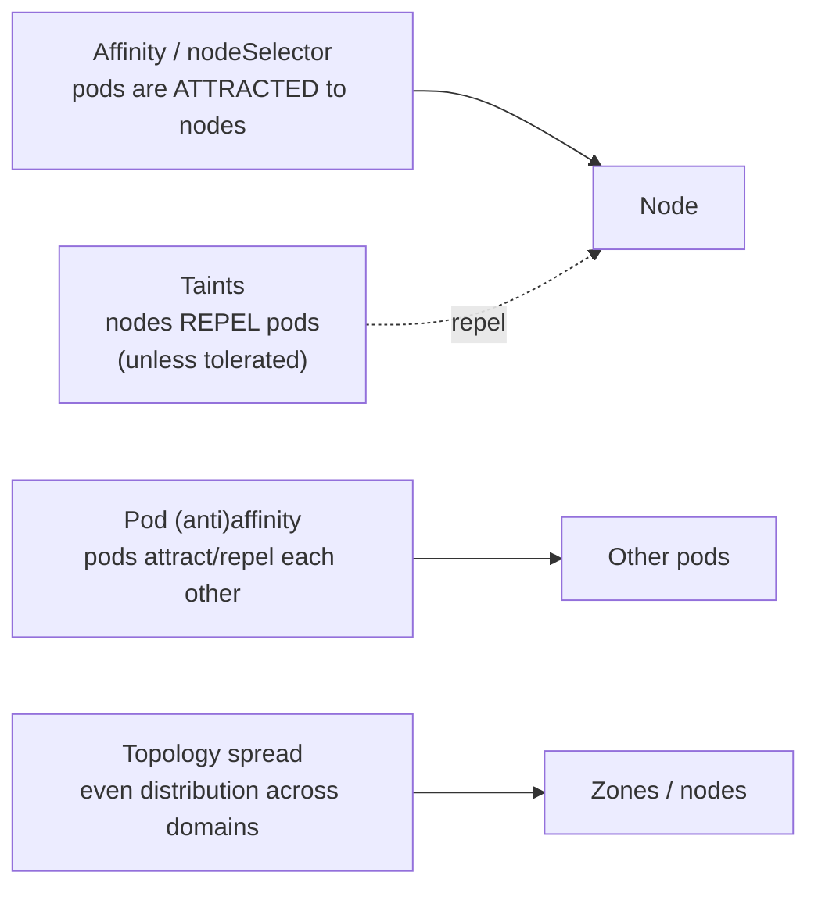
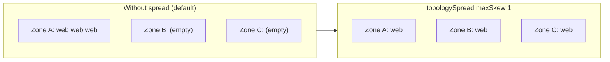

# Day 16 (Deep Dive) - Pod Scheduling: Affinity, Taints, and Topology Spread

> **Companion to [Day 16 - Resource Management and Autoscaling](notes.md).** Requests and limits decide *whether* a pod fits on a node. This page covers the other half of placement: *which* node a pod lands on, and how to **spread pods for high availability**, **pin them to special nodes** (GPU, licensed, zone), and **keep pods together or apart**.

> **Why this matters:** the defaults will happily put all three replicas of your app on the **same node** in the **same AZ**. When that node dies, your "highly available" service goes down. Scheduling controls are how you prevent that - and how you send GPU workloads to GPU nodes and keep noisy neighbours apart.

---

## The Toolbox at a Glance

There are two directions of control, plus a spreader:

| Tool | Direction | One-line purpose |
|------|-----------|------------------|
| **nodeSelector** | pod -> node | Simplest "only run on nodes with this label" |
| **Node affinity** | pod -> node | Richer node targeting (required or preferred, operators) |
| **Taints + tolerations** | node repels pod | Node says "keep out unless you tolerate me" (dedicated/special nodes) |
| **Pod affinity / anti-affinity** | pod -> pod | Place near / away from *other pods* |
| **Topology spread constraints** | pod -> domains | Evenly spread replicas across zones/nodes (the modern HA tool) |



> **The mental split to hold onto:** **affinity = the pod chooses the node** (attraction). **Taints = the node rejects the pod** (repulsion). They are opposites, and you often use them together.

---

## 1. nodeSelector (the simplest)

Run only on nodes carrying a label. Exact match, nothing fancy.

```bash
kubectl label nodes worker-3 disktype=ssd
```

```yaml
spec:
  nodeSelector:
    disktype: ssd        # pod only schedules onto nodes labelled disktype=ssd
```

Good enough for simple "must be an SSD node" cases. When you need *ranges*, *preferences*, or *"any of these values"*, graduate to node affinity.

---

## 2. Node Affinity (richer node targeting)

Same idea as nodeSelector but expressive, and it has a **hard** and a **soft** form:

- `requiredDuringSchedulingIgnoredDuringExecution` = **hard rule** (no matching node = pod stays `Pending`).
- `preferredDuringSchedulingIgnoredDuringExecution` = **soft rule** (try to, but schedule anyway if not possible; carries a `weight`).

```yaml
spec:
  affinity:
    nodeAffinity:
      requiredDuringSchedulingIgnoredDuringExecution:   # MUST
        nodeSelectorTerms:
        - matchExpressions:
          - key: disktype
            operator: In
            values: ["ssd", "nvme"]        # any of these
      preferredDuringSchedulingIgnoredDuringExecution:  # NICE TO HAVE
      - weight: 100
        preference:
          matchExpressions:
          - key: topology.kubernetes.io/zone
            operator: In
            values: ["ap-south-1a"]
```

Operators: `In`, `NotIn`, `Exists`, `DoesNotExist`, `Gt`, `Lt`. `IgnoredDuringExecution` means: once the pod is running, changing node labels will **not** evict it (the rule is only checked at scheduling time).

---

## 3. Taints and Tolerations (nodes that repel)

A **taint** on a node repels pods that do not **tolerate** it. This is how you build **dedicated nodes**: GPU nodes, licensed-software nodes, or nodes reserved for one team.

```bash
# Add a taint: "do not schedule here unless you tolerate gpu=true"
kubectl taint nodes gpu-node-1 gpu=true:NoSchedule

# Remove it later (note the trailing minus)
kubectl taint nodes gpu-node-1 gpu=true:NoSchedule-
```

The three **effects**:

| Effect | Meaning |
|--------|---------|
| `NoSchedule` | New pods without a matching toleration are **not scheduled** here |
| `PreferNoSchedule` | Soft version - avoid if possible, but allowed |
| `NoExecute` | As above **and evicts already-running** pods that do not tolerate it |

A pod opts in with a **toleration**:

```yaml
spec:
  tolerations:
  - key: "gpu"
    operator: "Equal"      # match key=value; or "Exists" to match any value
    value: "true"
    effect: "NoSchedule"
  # For NoExecute you can add a grace period before eviction:
  - key: "node.kubernetes.io/not-ready"
    operator: "Exists"
    effect: "NoExecute"
    tolerationSeconds: 300   # tolerate a not-ready node for 5 min before moving
```

> **Key point:** a toleration only **allows** a pod onto a tainted node - it does **not** force it there. Tolerating the GPU taint does not mean the pod *wants* a GPU node; it just means it *may* land on one. To actually *require* the GPU node, combine the toleration with **node affinity / nodeSelector**. This taint+affinity pair is the standard dedicated-node recipe (below).

> Kubernetes auto-adds taints you will see in the wild: `node.kubernetes.io/not-ready` and `unreachable` (NoExecute, added on node problems), and `node-role.kubernetes.io/control-plane:NoSchedule` (keeps your workloads off control-plane nodes).

---

## 4. Pod Affinity and Anti-Affinity (relative to other pods)

These place a pod **near or away from other pods** (by label), within a **topology domain** you choose with `topologyKey`.

- **podAffinity** = "put me *with*" (co-locate, e.g. app next to its cache for latency).
- **podAntiAffinity** = "keep me *away from*" (spread replicas so one node/zone failure does not take them all).

```yaml
# Spread replicas of 'web' onto DIFFERENT nodes (HA)
spec:
  affinity:
    podAntiAffinity:
      requiredDuringSchedulingIgnoredDuringExecution:
      - labelSelector:
          matchLabels: { app: web }
        topologyKey: kubernetes.io/hostname   # "domain" = one node
```

`topologyKey` defines what "apart" means:

| topologyKey | "Apart/together" means... |
|-------------|---------------------------|
| `kubernetes.io/hostname` | per **node** |
| `topology.kubernetes.io/zone` | per **availability zone** |

> **Caution:** `requiredDuringScheduling` pod anti-affinity is strict - if you ask for 5 replicas each on a different node but only have 3 nodes, **2 replicas stay `Pending` forever**. For even spreading, `topologySpreadConstraints` (next) is usually the better, gentler tool.

---

## 5. Topology Spread Constraints (the modern HA spreader)

The recommended way to **spread replicas evenly** across zones or nodes. You cap the allowed imbalance with `maxSkew`.

```yaml
spec:
  topologySpreadConstraints:
  - maxSkew: 1                                   # counts differ by at most 1
    topologyKey: topology.kubernetes.io/zone     # spread across AZs
    whenUnsatisfiable: DoNotSchedule             # hard: or ScheduleAnyway (soft)
    labelSelector:
      matchLabels: { app: web }
```

- **`maxSkew`** = the biggest allowed difference in pod count between any two domains. With `maxSkew: 1` and 3 zones, 6 replicas land 2/2/2, not 4/1/1.
- **`whenUnsatisfiable`**: `DoNotSchedule` (hard - leave Pending rather than break the spread) or `ScheduleAnyway` (soft - prefer the spread, but place it regardless).



> **Why prefer this over pod anti-affinity for HA:** anti-affinity is all-or-nothing per domain; topology spread lets you say "as even as possible, within a skew of 1," which degrades gracefully as nodes come and go. Reach for **topologySpreadConstraints** first for even zone/node distribution.

---

## Practical Recipes

### Dedicated GPU nodes (the classic taint + affinity pair)

```bash
kubectl taint nodes gpu-1 gpu=true:NoSchedule
kubectl label nodes gpu-1 accelerator=nvidia
```

```yaml
spec:
  tolerations:                     # (1) allowed onto the tainted GPU node
  - { key: gpu, operator: Equal, value: "true", effect: NoSchedule }
  affinity:
    nodeAffinity:                  # (2) actually require a GPU node
      requiredDuringSchedulingIgnoredDuringExecution:
        nodeSelectorTerms:
        - matchExpressions:
          - { key: accelerator, operator: In, values: ["nvidia"] }
```

The taint keeps *other* pods off the expensive GPU nodes; the toleration + affinity pull *this* pod onto them. You need **both**.

### Highly available web tier across AZs

```yaml
spec:
  topologySpreadConstraints:
  - maxSkew: 1
    topologyKey: topology.kubernetes.io/zone
    whenUnsatisfiable: DoNotSchedule
    labelSelector: { matchLabels: { app: web } }
```

### Keep two competing pods off the same node

```yaml
# On the 'batch' pod: never co-locate with 'web'
podAntiAffinity:
  requiredDuringSchedulingIgnoredDuringExecution:
  - labelSelector: { matchLabels: { app: web } }
    topologyKey: kubernetes.io/hostname
```

---

## Which Tool For Which Goal?

| Goal | Use |
|------|-----|
| "Only run on nodes with label X" | **nodeSelector** (or node affinity for ranges/preferences) |
| "Reserve these nodes for special workloads" | **Taint** the nodes + **toleration** (+ affinity to require them) |
| "Spread my replicas across zones/nodes evenly" | **topologySpreadConstraints** |
| "Never put two of these on the same node" | **podAntiAffinity** (`hostname` topologyKey) |
| "Put this pod next to that pod" | **podAffinity** |
| "Prefer, but don't require, a zone/node" | the **preferred** / `ScheduleAnyway` soft forms |

---

## Common Mistakes

1. **No spreading = fake HA.** By default all replicas can land on one node/zone. Add `topologySpreadConstraints` (or pod anti-affinity) for anything that must survive a node/AZ failure.
2. **Toleration without affinity.** Tolerating a taint only *allows* the node; it does not send the pod there. Add nodeSelector/affinity to actually target it.
3. **Over-strict `required` rules -> Pending pods.** Hard anti-affinity or `DoNotSchedule` with too few nodes/zones leaves replicas stuck. Use soft forms or a sensible `maxSkew`.
4. **Forgetting `IgnoredDuringExecution`.** Affinity is checked only at **scheduling** time; relabeling a node later will not move running pods.
5. **Wrong `topologyKey`.** `hostname` spreads per node; `zone` spreads per AZ. Mixing them up gives you "spread" that is not what you meant.
6. **Tainting a node you still need.** `NoExecute` evicts running pods immediately - taint the wrong node and you cause an outage.

---

## Quick Self-Check

1. What is the core difference between **node affinity** and a **taint**?
2. You tainted GPU nodes and added a toleration to your GPU pod, but it lands on normal nodes too. Why, and what do you add?
3. You need 3 replicas, one per availability zone. Which tool, and which field controls the evenness?
4. What is the difference between `requiredDuringScheduling...` and `preferredDuringScheduling...`?
5. What does the `NoExecute` taint effect do that `NoSchedule` does not?

<details>
<summary>Answers</summary>

1. **Node affinity** = the pod is attracted to nodes with certain labels (pod chooses). **Taint** = the node repels pods that do not tolerate it (node rejects). Opposite directions; often combined.
2. A toleration only **allows** the pod onto the tainted node; it does not require it. Add **nodeSelector/nodeAffinity** targeting the GPU node label so it is actually placed there.
3. **topologySpreadConstraints** with `topologyKey: topology.kubernetes.io/zone`; **`maxSkew`** controls how uneven the distribution may be (`maxSkew: 1` gives one per zone).
4. `required` is a **hard** rule (unmet = pod stays Pending); `preferred` is a **soft** rule with a `weight` (tried first, but the pod schedules anyway if unmet).
5. `NoSchedule` blocks **new** pods without a toleration; `NoExecute` also **evicts already-running** pods that do not tolerate it (with an optional `tolerationSeconds` grace period).

</details>

---

## Summary

- **Requests/limits decide *if* a node fits; scheduling controls decide *which* node.**
- **nodeSelector / node affinity** attract a pod to labelled nodes (hard `required` or soft `preferred`).
- **Taints repel; tolerations allow.** Dedicated nodes = taint the node + tolerate it + affinity to require it.
- **Pod (anti-)affinity** places pods relative to other pods within a `topologyKey` domain.
- **topologySpreadConstraints** is the modern, graceful way to spread replicas evenly across zones/nodes for real HA - reach for it first.

---

**Back to:** [Day 16 - Resource Management and Autoscaling](notes.md)
