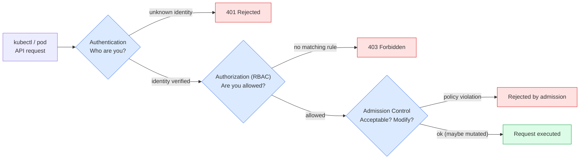
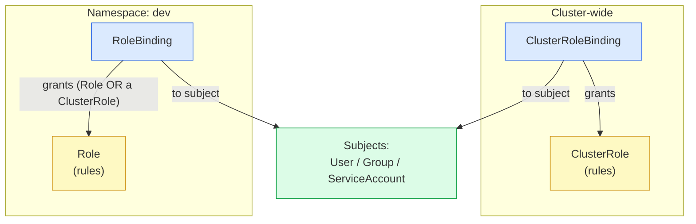
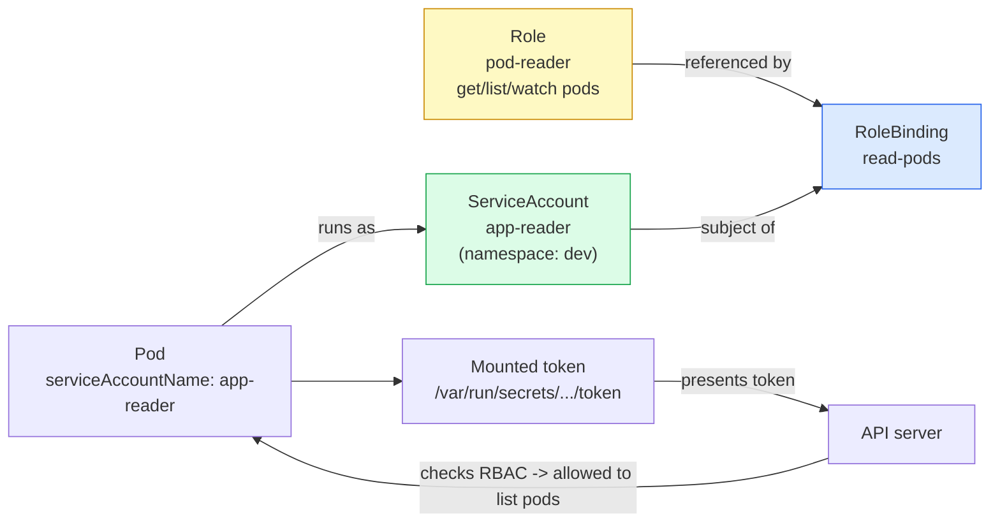

# Day 17 - RBAC and Cluster Security

> **Goal:** Control exactly *who* (and *what*) can do *which* actions on *which* resources in your cluster - using RBAC and the security layers around it - so a mistake or a stolen token cannot wreck everything.

> **On EKS?** RBAC itself is identical everywhere, but EKS adds an **AWS IAM -> Kubernetes identity** layer in front of it (Access Entries, access policies, IRSA). Once you have the basics below, see the companion: **[How RBAC Works on Amazon EKS](rbac-on-eks.md)**.

---

## Learning Objectives

By the end of this lesson you will be able to:

- Explain the **three gates** every Kubernetes API request passes: **Authentication**, **Authorization**, and **Admission**
- Describe the **four RBAC objects**: `Role`, `RoleBinding`, `ClusterRole`, `ClusterRoleBinding`
- Read and write RBAC **rules** (`apiGroups`, `resources`, `verbs`)
- Tell the difference between the three **subjects**: Users, Groups, and **ServiceAccounts**
- Understand what a **ServiceAccount** is (an identity for **pods**, not humans) and how a pod uses it
- Write a `Role` + `RoleBinding` that gives a ServiceAccount **read-only** access to pods
- Write a `ClusterRole` + `ClusterRoleBinding`
- Test permissions with `kubectl auth can-i`
- Apply the **principle of least privilege**
- Recognise the other security layers: **Pod Security Admission**, `securityContext`, disabling token automount, and why Secrets are **not** encrypted by default

---

## Real-World Analogy (read this first)

Think of your cluster as a **large office building**.

- A **Role** is a printed **permission list**: "the holder may open the 3rd-floor store room and read the files inside, but may not throw anything away."
- A **RoleBinding** is the act of **handing that keycard to a specific person or robot**. The list means nothing until it is bound to someone.
- A **ClusterRole** is a permission list that works in **every floor of the building** (or covers building-wide systems like the elevators), instead of just one floor.
- A **ClusterRoleBinding** hands that building-wide keycard to someone for the **whole building**.
- A **User** is a **human employee** (you, logging in with `kubectl`).
- A **ServiceAccount** is the **ID badge worn by an automated robot** - a pod - that runs inside the building. Robots need identity too, but they are not people.
- **Least privilege** = give the cleaner a key **only** to the rooms they actually clean. Do not hand them the master key "just in case."

One more rule that surprises people: in this building, **every door is locked by default**. You can only do what a keycard explicitly allows. There is no "deny" card - you simply do not get a key. This is called **deny-by-default, additive-allow**.

---

## The Three Gates: Authentication -> Authorization -> Admission

Every request to the Kubernetes API server (every `kubectl` command, every pod talking to the API) passes through **three gates in order**. If any gate says no, the request is rejected.

1. **Authentication (authn) - "Who are you?"**
   The API server checks your identity from a certificate, a token, or an external login. Output: a username and a set of groups (for example user `aimotivity`, groups `dev-team`). If it cannot identify you at all, the request is rejected as anonymous.

2. **Authorization (authz) - "Are you allowed to do this?"**
   Now that it knows who you are, the server asks: does this identity have permission for this exact action (for example *list pods in namespace `dev`*)? **This is where RBAC lives.** If no rule allows it, the answer is no.

3. **Admission Control - "Is this request acceptable / should it be modified?"**
   The request is authenticated and authorized, but admission controllers get the final say. They can **reject** it (for example "this pod tries to run as root and policy forbids that") or **mutate** it (for example auto-inject a label or a default). **Pod Security Admission** lives here.



Key point: **Authentication only proves who you are. It grants no powers.** A perfectly authenticated user with no RBAC rules can do almost nothing. Powers come from gate 2.

---

## The Four RBAC Objects

RBAC ("Role-Based Access Control") splits into **what is allowed** (the role) and **who gets it** (the binding). Each of those comes in a **namespaced** version and a **cluster-wide** version.

| Object | Defines | Scope |
|---|---|---|
| `Role` | A set of allowed actions (rules) | **One namespace** |
| `RoleBinding` | Grants a Role (or ClusterRole) to subjects | **One namespace** |
| `ClusterRole` | A set of allowed actions (rules) | **Cluster-wide** (or reusable across namespaces) |
| `ClusterRoleBinding` | Grants a ClusterRole to subjects | **Cluster-wide** |

All four use the API group **`rbac.authorization.k8s.io/v1`**. Memorise that - it is the same for every RBAC object.

A handy mental model:

- **Role / RoleBinding** = permissions that live **inside a single namespace** (pods, deployments, configmaps in that one namespace).
- **ClusterRole / ClusterRoleBinding** = permissions for **cluster-scoped things** (nodes, namespaces, persistentvolumes) or the same permission applied **everywhere**.

A useful trick: a **RoleBinding can reference a ClusterRole**. This lets you define a permission set **once** as a ClusterRole, then bind it into a specific namespace with a RoleBinding. The subject then only gets those powers **in that one namespace**.



---

## Understanding Rules: apiGroups, resources, verbs

A Role or ClusterRole is mostly a list of **rules**. Each rule answers three questions:

```yaml
rules:
- apiGroups: [""]            # WHICH family of resources?
  resources: ["pods"]        # WHICH resource type?
  verbs: ["get", "list", "watch"]   # WHICH actions?
```

**apiGroups** - the family the resource belongs to.
- `""` (an empty string) is the **core group**: pods, services, configmaps, secrets, nodes, persistentvolumes, namespaces.
- `"apps"` covers deployments, daemonsets, statefulsets, replicasets.
- `"batch"` covers jobs and cronjobs.
- `"rbac.authorization.k8s.io"` covers the RBAC objects themselves.
- Not sure which group a resource is in? Run `kubectl api-resources` and read the `APIVERSION` column.

**resources** - the resource type(s) this rule applies to, for example `pods`, `deployments`, `secrets`. Always **lowercase and plural**.

**verbs** - the actions allowed on those resources:

| Verb | Meaning |
|---|---|
| `get` | Read a single named object |
| `list` | List all objects of that type |
| `watch` | Stream live changes (used by `-w` and controllers) |
| `create` | Make a new object |
| `update` | Replace an existing object |
| `patch` | Modify part of an existing object |
| `delete` | Remove an object |

"Read-only" usually means `get`, `list`, `watch`. "Full control" means all of the above. There is also `*` (wildcard = every verb) - powerful and **dangerous**, covered in Common Mistakes.

---

## Subjects: Users, Groups, and ServiceAccounts

A **subject** is *who* a binding grants powers to. There are three kinds.

### Users
A **human** identity (for example you, authenticating with a client certificate or an external login). Kubernetes has **no `User` object** - there is no `kubectl create user`. Users come from your certificates / identity provider, and RBAC simply refers to them **by name**.

### Groups
A **collection of users**, also defined by your authentication system, not stored in Kubernetes. Binding a Role to a group grants it to **every** user in that group. Example built-in group: `system:authenticated` (everyone who logged in).

### ServiceAccounts (the important one)
A **ServiceAccount (SA)** is an identity for **workloads - pods**, not humans. When a pod needs to talk to the Kubernetes API (a controller, an operator, a CI runner, a monitoring agent), it does so **as a ServiceAccount**.

Key facts:

- A ServiceAccount **is a real Kubernetes object** and lives **in a namespace**: `kubectl get sa -n dev`.
- Its full RBAC name is `system:serviceaccount:<namespace>:<name>`.
- **Every namespace has a `default` ServiceAccount.** If a pod does not specify one, it silently uses `default`.
- A pod gets a **token** (a JWT) mounted at `/var/run/secrets/kubernetes.io/serviceaccount/token`. The pod presents this token to the API server to prove "I am this ServiceAccount."
- **A fresh ServiceAccount has almost no permissions.** It can authenticate (gate 1), but until you bind a Role/ClusterRole to it, it cannot do much (gate 2). That is exactly what we want.



---

## Worked Example 1: Read-only access to pods (Role + RoleBinding + ServiceAccount)

We want a pod to be able to **read pods** in the `dev` namespace and nothing else. Three pieces: a ServiceAccount (the identity), a Role (the permission list), and a RoleBinding (handing the list to the identity).

### Step 1 - Create the namespace and ServiceAccount

```bash
kubectl create namespace dev
kubectl create serviceaccount app-reader -n dev
```

Or as YAML:

```yaml
# serviceaccount.yaml
apiVersion: v1
kind: ServiceAccount
metadata:
  name: app-reader
  namespace: dev
```

### Step 2 - Create the Role (the permission list)

```yaml
# role-pod-reader.yaml
apiVersion: rbac.authorization.k8s.io/v1
kind: Role
metadata:
  name: pod-reader
  namespace: dev            # A Role ALWAYS belongs to one namespace
rules:
- apiGroups: [""]           # "" = core group (pods live here)
  resources: ["pods"]       # only pods
  verbs: ["get", "list", "watch"]   # read-only: no create/update/delete
```

This says: "Whoever holds this Role may read pods in `dev`. Nothing else."

### Step 3 - Create the RoleBinding (hand the list to the SA)

```yaml
# rolebinding-read-pods.yaml
apiVersion: rbac.authorization.k8s.io/v1
kind: RoleBinding
metadata:
  name: read-pods
  namespace: dev            # Same namespace as the Role
subjects:
- kind: ServiceAccount      # the WHO
  name: app-reader
  namespace: dev
roleRef:                    # the WHAT (points at the Role above)
  kind: Role
  name: pod-reader
  apiGroup: rbac.authorization.k8s.io
```

```bash
kubectl apply -f role-pod-reader.yaml
kubectl apply -f rolebinding-read-pods.yaml
```

### Step 4 - Use the ServiceAccount in a pod

```yaml
# pod.yaml
apiVersion: v1
kind: Pod
metadata:
  name: reader-pod
  namespace: dev
spec:
  serviceAccountName: app-reader     # <-- this pod runs AS app-reader
  containers:
  - name: app
    image: bitnami/kubectl:latest
    command: ["sleep", "3600"]
```

Now any process in `reader-pod` can `kubectl get pods` in `dev`, but if it tries `kubectl get secrets` or `kubectl delete pod ...`, the API server returns **403 Forbidden**. That is least privilege in action.

---

## Worked Example 2: ClusterRole + ClusterRoleBinding

Some resources are **not** in any namespace - for example `nodes`. To read nodes you need a **ClusterRole** (namespaced Roles cannot grant access to cluster-scoped resources).

### The ClusterRole

```yaml
# clusterrole-node-reader.yaml
apiVersion: rbac.authorization.k8s.io/v1
kind: ClusterRole
metadata:
  name: node-reader          # no namespace field - it is cluster-wide
rules:
- apiGroups: [""]
  resources: ["nodes"]
  verbs: ["get", "list", "watch"]
```

### The ClusterRoleBinding

```yaml
# clusterrolebinding-read-nodes.yaml
apiVersion: rbac.authorization.k8s.io/v1
kind: ClusterRoleBinding
metadata:
  name: read-nodes
subjects:
- kind: ServiceAccount
  name: app-reader
  namespace: dev             # SA still lives in a namespace
roleRef:
  kind: ClusterRole
  name: node-reader
  apiGroup: rbac.authorization.k8s.io
```

```bash
kubectl apply -f clusterrole-node-reader.yaml
kubectl apply -f clusterrolebinding-read-nodes.yaml
```

Now `app-reader` can list nodes across the **whole cluster**.

### Tip: reuse a ClusterRole inside one namespace

If you wanted node-style read permissions but only granted **in `dev`**, you would bind the **ClusterRole** with a **RoleBinding** (not a ClusterRoleBinding). The powers then apply only in `dev`. Define once, scope where you need it.

```yaml
apiVersion: rbac.authorization.k8s.io/v1
kind: RoleBinding
metadata:
  name: read-pods-via-clusterrole
  namespace: dev
subjects:
- kind: ServiceAccount
  name: app-reader
  namespace: dev
roleRef:
  kind: ClusterRole          # referencing a ClusterRole from a RoleBinding
  name: view                 # a handy built-in read-only ClusterRole
  apiGroup: rbac.authorization.k8s.io
```

---

## Testing Permissions: kubectl auth can-i

Never guess whether RBAC works - **ask the API server.** `kubectl auth can-i <verb> <resource>` returns `yes` or `no`.

```bash
# As YOURSELF, can you create deployments in dev?
kubectl auth can-i create deployments -n dev
# yes  (or  no)

# Check a specific resource type in the current namespace
kubectl auth can-i list pods

# The powerful one: impersonate a ServiceAccount with --as
kubectl auth can-i list pods \
  --as=system:serviceaccount:dev:app-reader -n dev
# yes

kubectl auth can-i delete pods \
  --as=system:serviceaccount:dev:app-reader -n dev
# no    <-- read-only Role is working correctly

# Impersonate a human user or a group
kubectl auth can-i get secrets --as=jane -n dev
kubectl auth can-i get secrets --as-group=dev-team -n dev

# List EVERYTHING a subject can do
kubectl auth can-i --list --as=system:serviceaccount:dev:app-reader -n dev
```

The `--as=system:serviceaccount:<namespace>:<name>` form is the exact identity string Kubernetes uses internally for a ServiceAccount. Memorise its shape: `system:serviceaccount:NAMESPACE:NAME`.

---

## Imperative Shortcuts: create role / rolebinding

You do not always need YAML. `kubectl` can build RBAC objects directly (great for quick tests, and add `--dry-run=client -o yaml` to generate a starter manifest).

```bash
# Create a Role granting read-only on pods in dev
kubectl create role pod-reader \
  --verb=get --verb=list --verb=watch \
  --resource=pods \
  -n dev

# Bind that Role to a ServiceAccount
kubectl create rolebinding read-pods \
  --role=pod-reader \
  --serviceaccount=dev:app-reader \
  -n dev

# Cluster-wide versions
kubectl create clusterrole node-reader \
  --verb=get,list,watch --resource=nodes

kubectl create clusterrolebinding read-nodes \
  --clusterrole=node-reader \
  --serviceaccount=dev:app-reader

# Generate YAML instead of applying (best practice for version control)
kubectl create role pod-reader \
  --verb=get,list,watch --resource=pods \
  -n dev --dry-run=client -o yaml > role-pod-reader.yaml
```

---

## The Principle of Least Privilege

**Grant the smallest set of permissions needed to do the job - and nothing more.**

Why it matters: if a pod, token, or account is compromised, the damage is limited to what that identity could already do. A read-only monitoring pod that is breached cannot delete your database. A `cluster-admin` pod that is breached can delete **everything**.

How to apply it in practice:

- Start with **zero** permissions and add only what fails.
- Prefer a `Role` in **one namespace** over a `ClusterRole` everywhere.
- List **specific** `resources` and `verbs` - avoid `*`.
- Give each workload its **own** ServiceAccount, not the shared `default`.
- Re-check periodically with `kubectl auth can-i --list`.

---

## Other Security Layers (brief but accurate)

RBAC controls **API access**. These layers protect the **workloads themselves** and round out cluster security.

### Pod Security Admission (PSA)
The built-in admission controller (gate 3) that replaced the old, removed **PodSecurityPolicy (PSP)**. You label a **namespace** to enforce one of three standard levels:

| Level | Meaning |
|---|---|
| `privileged` | No restrictions (wide open) |
| `baseline` | Blocks the most common dangerous settings |
| `restricted` | Strict hardening (non-root, no privilege escalation, etc.) |

```bash
kubectl label namespace dev \
  pod-security.kubernetes.io/enforce=restricted
```

### securityContext (per-pod / per-container hardening)
Tells the kubelet how to lock down a container:

```yaml
securityContext:
  runAsNonRoot: true            # refuse to run as root
  runAsUser: 1000
  readOnlyRootFilesystem: true  # container cannot write to its own filesystem
  allowPrivilegeEscalation: false
  capabilities:
    drop: ["ALL"]               # drop all Linux capabilities, add back only if needed
```

### Do not mount the SA token when the pod does not need it
By default every pod gets its ServiceAccount token mounted - a credential sitting inside the container. If a pod never talks to the API, **turn it off** to shrink the attack surface:

```yaml
spec:
  automountServiceAccountToken: false   # on the Pod (or on the ServiceAccount)
```

### Secrets are base64-encoded, not encrypted
A common and dangerous misunderstanding. By default, a Kubernetes `Secret` is only **base64-encoded** in etcd - anyone who can read the Secret can trivially decode it (`base64 -d`). Base64 is **encoding, not encryption**. To truly protect them, enable **encryption at rest** in etcd and lock down who can `get`/`list` Secrets via RBAC. (We covered Secret basics in [Day 10 - ConfigMaps and Secrets](../day10-configmaps-secrets/notes.md).)

---

## Common Mistakes

1. **Granting `cluster-admin` everywhere.** Binding the built-in `cluster-admin` ClusterRole to a ServiceAccount "to make it work" gives a workload god-mode over the entire cluster. If that pod is breached, the whole cluster is breached. Grant the narrow permission instead.

2. **Using a `ClusterRoleBinding` when a `RoleBinding` would do.** A ClusterRoleBinding applies the powers in **every namespace**. If the workload only needs access in `dev`, use a RoleBinding so the powers stay in `dev`.

3. **Wildcards in `verbs` or `resources`.** `verbs: ["*"]` or `resources: ["*"]` quietly grants far more than intended (including `secrets`, `delete`, future resource types). List explicit verbs and resources.

4. **Relying on the `default` ServiceAccount with broad rights.** Every pod that does not set `serviceAccountName` uses `default`. If you ever bind real powers to `default`, **every** pod in that namespace silently inherits them. Create a dedicated SA per workload.

5. **Forgetting RBAC is additive and deny-by-default.** There are **no deny rules**. You cannot "subtract" a permission with another binding - if any binding grants an action, it is allowed. To remove access, you must remove/narrow the binding itself.

6. **Editing a `roleRef` and expecting it to change.** A binding's `roleRef` is **immutable**. To point a binding at a different Role, delete and recreate the binding.

---

## Quick Self-Check

1. Name the three gates an API request passes through, in order, and say which one RBAC belongs to.
2. You need a pod to read `nodes` (a cluster-scoped resource). Can a `Role` grant that? If not, what do you use?
3. What is the difference between a `User` and a `ServiceAccount`, and which one is meant for pods?
4. Write the exact `kubectl auth can-i` command to check whether the ServiceAccount `app-reader` in namespace `dev` can `delete pods` in `dev`.
5. A teammate says "I added a second RoleBinding to deny the cleaner access to Secrets." Why does that not work?

<details>
<summary>Answers</summary>

1. **Authentication -> Authorization -> Admission.** RBAC is the **Authorization** gate (gate 2).
2. **No** - a `Role` is namespace-scoped and cannot grant cluster-scoped resources. Use a **ClusterRole** (bound with a ClusterRoleBinding, or a RoleBinding if you want it limited to one namespace).
3. A **User** is a human identity (from certs/an identity provider; Kubernetes stores no User object). A **ServiceAccount** is an in-cluster identity object meant for **pods/workloads**.
4. `kubectl auth can-i delete pods --as=system:serviceaccount:dev:app-reader -n dev`
5. **RBAC has no deny rules and is additive/deny-by-default.** You cannot subtract a permission with another binding - access is removed only by removing or narrowing the binding that grants it.

</details>

---

## Summary

- Every API request passes **Authentication** (who are you), **Authorization/RBAC** (are you allowed), then **Admission** (is it acceptable). Authentication alone grants no powers.
- RBAC has **four objects**, all under `rbac.authorization.k8s.io/v1`: `Role`/`RoleBinding` (one namespace) and `ClusterRole`/`ClusterRoleBinding` (cluster-wide). A RoleBinding can reference a ClusterRole to scope a reusable permission set into one namespace.
- Rules combine **apiGroups + resources + verbs**. Read-only = `get,list,watch`.
- **Subjects** are Users, Groups, and **ServiceAccounts**. A ServiceAccount is an identity for **pods**; the `default` SA is used when none is set; a pod presents a mounted token to the API server.
- Test everything with `kubectl auth can-i ... --as=system:serviceaccount:NS:NAME`, and build objects fast with `kubectl create role/rolebinding`.
- Live by **least privilege**, and harden further with **Pod Security Admission**, **securityContext**, disabling token automount, and remembering Secrets are only base64-encoded by default.

---

**Next up ->** [Day 18 - Ingress](../day18-ingress-demo/notes.md)
