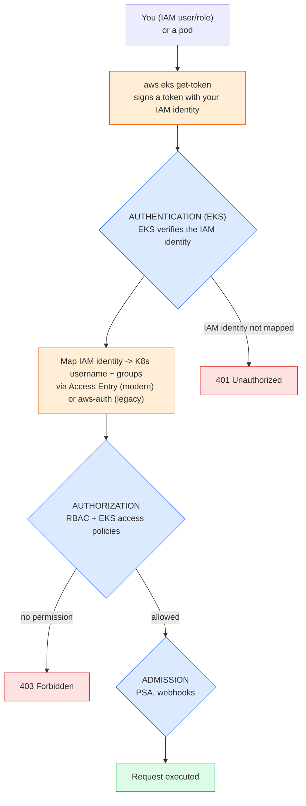
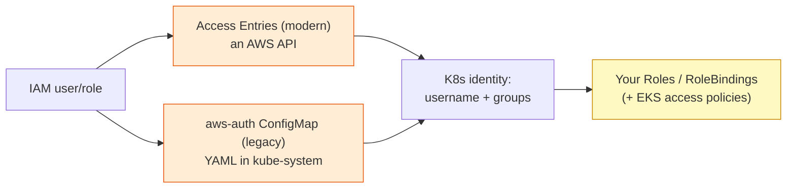
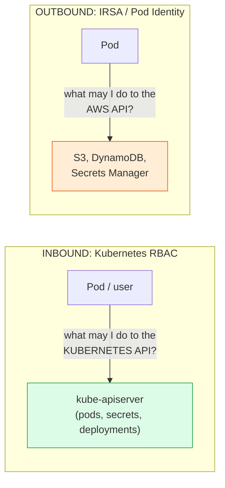
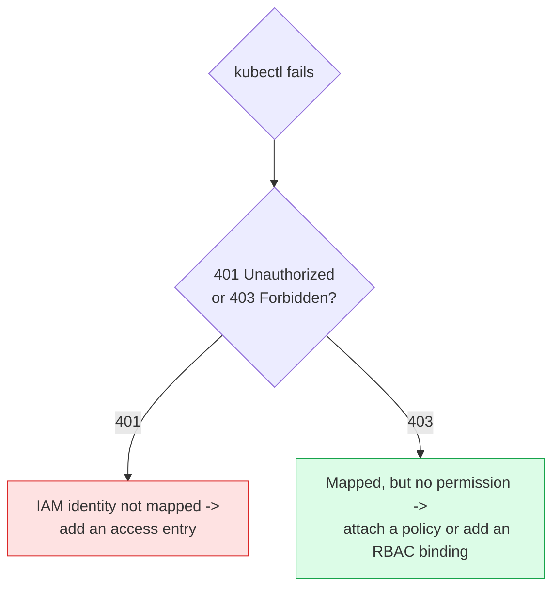

# Day 17 (Deep Dive) - How RBAC Works on Amazon EKS

> **Companion to [Day 17 - RBAC and Cluster Security](notes.md).** That page teaches Kubernetes RBAC, which is **identical on every cluster** - Minikube, kubeadm, EKS. This page explains the part that is **unique to EKS**: how an **AWS IAM identity** becomes a Kubernetes identity *before* RBAC ever runs.

> **The one-sentence idea:** On EKS, **AWS IAM handles "who are you" (authentication); Kubernetes RBAC still handles "what may you do" (authorization).** They are two separate checkpoints, and confusing them is the #1 source of EKS access pain.

---

## Why EKS Needs an Extra Layer

Plain Kubernetes authenticates users with client certificates or tokens. But AWS already has a company-wide identity system - **IAM** - and nobody wants to hand out separate cluster certificates to every engineer. So EKS **bridges IAM into Kubernetes**: you log in as an IAM user/role, and EKS translates that into a Kubernetes username and groups. From that point on, **normal RBAC takes over unchanged.**

> **Analogy:** Day 17's building has an internal keycard system (RBAC). EKS adds a **lobby ID desk (IAM)**. You show your company ID at the lobby; the desk issues you a temporary building pass stamped with your role. The internal doors still only open for the permissions on that pass - the keycard system never changed, it just trusts the lobby to say who you are.

---

## The Full Request Flow on EKS

Every `kubectl` command on EKS passes through this. Notice that **EKS only plugs into the Authentication gate** - the Authorization (RBAC) and Admission gates from [Day 17](notes.md#the-three-gates-authentication---authorization---admission) are exactly the same.



- **Unauthorized (401)** = the IAM identity was never mapped into the cluster (authentication failed). Add an access entry.
- **Forbidden (403)** = you are mapped, but RBAC/access-policies do not allow this action (authorization failed). Grant the permission.

Knowing which of these two you got tells you exactly which layer to fix. (Same distinction as [Day 11 - Connecting to the cluster](../day11-eks/eks-cluster-creation/05-connecting-to-the-cluster.md#iam-access-is-not-kubernetes-access).)

---

## The Two Ways IAM Maps to Kubernetes

EKS offers two mechanisms to turn an IAM principal into a Kubernetes identity. **Use Access Entries** on any recent cluster; `aws-auth` is the legacy path.



### Path A - EKS Access Entries (modern, recommended)

An **access entry** registers an IAM principal on the cluster. You can grant permissions in **two complementary ways**, and you can combine them:

1. **Attach an EKS access policy** (AWS-managed permissions - the easy path).
2. **Assign Kubernetes groups** (`--kubernetes-groups`), then bind those groups with **your own** RBAC (the fine-grained path).

```bash
# Register the principal AND put it in a custom K8s group in one step
aws eks create-access-entry \
  --cluster-name my-cluster \
  --principal-arn arn:aws:iam::111122223333:role/dev-team \
  --kubernetes-groups dev-viewers        # <- your RBAC can bind this group
```

### Path B - the `aws-auth` ConfigMap (legacy)

Older clusters map identities by editing a ConfigMap. The `groups` you list become Kubernetes groups that your RBAC bindings reference:

```yaml
# kubectl edit configmap aws-auth -n kube-system
data:
  mapRoles: |
    - rolearn: arn:aws:iam::111122223333:role/dev-team
      username: dev-team
      groups: ["dev-viewers"]     # <- then bind this group with a RoleBinding
```

> **Prefer Access Entries.** `aws-auth` is a single shared YAML - one bad edit locks everyone out, and it is not governed by IAM. Access Entries are an auditable AWS API and are IAM-recoverable. See [Day 11 - Granting access](../day11-eks/eks-cluster-creation/05-connecting-to-the-cluster.md#granting-access-to-other-people--roles).

---

## EKS Access Policies = AWS-Managed RBAC

The quickest way to grant Kubernetes permissions on EKS is to **associate an access policy** with an access entry. These are AWS-managed and behave like the **built-in Kubernetes ClusterRoles** you met in Day 17 - EKS applies the permissions **for you**, so you do not write a Role/RoleBinding at all.

```bash
aws eks associate-access-policy \
  --cluster-name my-cluster \
  --principal-arn arn:aws:iam::111122223333:role/dev-team \
  --policy-arn arn:aws:eks::aws:cluster-access-policy/AmazonEKSViewPolicy \
  --access-scope type=namespace,namespaces=dev     # limit it to the dev namespace
```

| EKS access policy | Roughly equals built-in ClusterRole | Grants |
|-------------------|-------------------------------------|--------|
| `AmazonEKSViewPolicy` | `view` | Read most resources (not Secrets) |
| `AmazonEKSAdminViewPolicy` | `view` + more | Read everything, including Secrets and RBAC objects |
| `AmazonEKSEditPolicy` | `edit` | Read/write workloads (no RBAC/secrets admin) |
| `AmazonEKSAdminPolicy` | `admin` | Full control within the granted namespaces |
| `AmazonEKSClusterAdminPolicy` | `cluster-admin` | God-mode over the whole cluster |

> There are also specialized policies (for EKS Auto Mode, hybrid nodes, etc.). Check `aws eks list-access-policies` for the current set.

### Access scope: cluster vs namespace

When you associate a policy you choose **how far it reaches** - this is EKS's parallel to RBAC's namespaced-vs-cluster-wide idea:

- `--access-scope type=cluster` - the policy applies **cluster-wide** (like a ClusterRoleBinding).
- `--access-scope type=namespace,namespaces=dev,test` - the policy applies **only in those namespaces** (like a RoleBinding).

---

## Two Models - Managed Policies vs Your Own RBAC

You now have two ways to grant Kubernetes permissions on EKS. They are not mutually exclusive.

| | EKS access policies (managed) | Your own RBAC (via groups) |
|---|---|---|
| **How** | Associate `AmazonEKS*Policy` to an access entry | Access entry (or aws-auth) puts you in a group; you write Role/ClusterRole + bindings for that group |
| **Best for** | Standard view/edit/admin needs, fast | Fine-grained, custom permission sets you fully control |
| **Who maintains the permission set** | AWS | You |
| **Scoping** | `--access-scope` cluster or namespaces | Role (namespace) vs ClusterRole (cluster) |

**Rule of thumb:** reach for a **managed access policy** when a standard role fits (a viewer, an editor, an admin of one namespace). Drop to **your own RBAC bound to a group** when you need something the managed policies do not express (for example "read pods and configmaps but nothing else in this one namespace").

---

## Worked Example: give the `dev-team` IAM role read-only in `dev`

Two ways to achieve the same outcome.

### Option 1 - managed access policy (least effort)

```bash
aws eks create-access-entry --cluster-name my-cluster \
  --principal-arn arn:aws:iam::111122223333:role/dev-team

aws eks associate-access-policy --cluster-name my-cluster \
  --principal-arn arn:aws:iam::111122223333:role/dev-team \
  --policy-arn arn:aws:eks::aws:cluster-access-policy/AmazonEKSViewPolicy \
  --access-scope type=namespace,namespaces=dev
```

Done - no Kubernetes objects to write. AWS maintains the `view` permission set.

### Option 2 - custom RBAC bound to a group (full control)

```bash
# 1. Map the IAM role into a K8s group
aws eks create-access-entry --cluster-name my-cluster \
  --principal-arn arn:aws:iam::111122223333:role/dev-team \
  --kubernetes-groups dev-viewers
```

```yaml
# 2. Bind the built-in "view" ClusterRole to that GROUP, but only in dev
apiVersion: rbac.authorization.k8s.io/v1
kind: RoleBinding
metadata:
  name: dev-viewers-can-view
  namespace: dev
subjects:
- kind: Group                 # the subject is the GROUP from the access entry
  name: dev-viewers
  apiGroup: rbac.authorization.k8s.io
roleRef:
  kind: ClusterRole
  name: view                  # reuse the built-in read-only ClusterRole
  apiGroup: rbac.authorization.k8s.io
```

The subject is a **Group** (from Day 17's [subjects](notes.md#subjects-users-groups-and-serviceaccounts)) - the same RBAC you already know, just fed by an IAM identity.

---

## RBAC vs IRSA / Pod Identity - Two Directions, Do Not Confuse Them

This is the deepest EKS confusion, so pin it down:



| | Kubernetes RBAC | IRSA / EKS Pod Identity |
|---|---|---|
| **Controls** | What an identity can do to the **Kubernetes API** | What a pod can do to **AWS APIs** |
| **Direction** | Inbound (into the cluster) | Outbound (out to AWS) |
| **Defined with** | Role / ClusterRole + bindings | IAM role + ServiceAccount annotation / Pod Identity association |
| **Example** | "may list pods in `dev`" | "may read objects in this S3 bucket" |

A single pod often needs **both**: a Kubernetes ServiceAccount granted RBAC (to read a ConfigMap via the K8s API) **and** IRSA (to read an S3 bucket via the AWS API). They travel together but are enforced by completely different systems. (IRSA detail: [Day 11 - config deep dive](../day11-eks/eks-cluster-creation/02-eks-config-explanation.md#4-iam-roles---the-three-you-must-not-confuse).)

---

## Nodes and System Identities (you rarely touch these)

EKS worker nodes also authenticate via IAM: a node's **node IAM role** is mapped to the Kubernetes group `system:nodes`, which is bound to the node ClusterRole so the kubelet can register and report status. With Access Entries this is handled by special entry **types** (for example `EC2_LINUX`) that EKS sets up automatically for managed node groups - you do not write RBAC for your nodes. Just know that "how does my node get to talk to the API?" has the same IAM-to-RBAC answer underneath.

---

## Debugging RBAC on EKS

```bash
# 1. Who does AWS think I am? (the IAM side)
aws sts get-caller-identity

# 2. Who does Kubernetes think I am? (username + groups) - needs kubectl 1.26+
kubectl auth whoami

# 3. What am I / a role allowed to do? (the RBAC side)
kubectl auth can-i list pods -n dev
kubectl auth can-i --list                                  # everything "I" can do
kubectl auth can-i get secrets --as-group=dev-viewers -n dev

# 4. Who is mapped on this cluster?
aws eks list-access-entries --cluster-name my-cluster
aws eks list-associated-access-policies \
  --cluster-name my-cluster --principal-arn arn:aws:iam::111122223333:role/dev-team
```

**Diagnosis shortcut:**



---

## Common EKS-RBAC Mistakes

1. **Thinking IAM permissions grant kubectl access.** `eks:*` lets you manage the cluster *resource* in AWS; it does **not** by itself let you `kubectl get pods`. You still need an access entry. (But note `eks:*` can *create* one for itself - see [Day 11](../day11-eks/eks-cluster-creation/05-connecting-to-the-cluster.md#iam-access-is-not-kubernetes-access).)
2. **Handing out `AmazonEKSClusterAdminPolicy` freely.** It is `cluster-admin`. Scope with `AmazonEKSEditPolicy`/`AmazonEKSViewPolicy` and namespaces instead.
3. **Assuming IRSA gives cluster access.** IRSA grants **AWS** permissions to a pod, not Kubernetes API permissions. Different plane.
4. **Editing `aws-auth` by hand on a live cluster.** One typo locks everyone out. Migrate to Access Entries.
5. **Forgetting the access scope.** Associating a policy with `type=cluster` when you meant one namespace silently grants it everywhere.
6. **Binding RBAC to the IAM ARN directly.** RBAC subjects are the **username/groups** the access entry produces, not the raw `arn:aws:iam:...` string (unless that is literally the mapped username).

---

## Quick Self-Check

1. On EKS, which gate does IAM handle, and which gate does Kubernetes RBAC handle?
2. You get `error: You must be logged in to the server (Unauthorized)`. Which layer failed, and what do you add?
3. What is the difference between attaching `AmazonEKSViewPolicy` and binding the built-in `view` ClusterRole to a group?
4. A pod must read an S3 bucket and list pods in its namespace. Which mechanism grants each?
5. What does `--access-scope type=namespace,namespaces=dev` do, and which RBAC concept is it analogous to?

<details>
<summary>Answers</summary>

1. **IAM handles Authentication** ("who are you"); **RBAC handles Authorization** ("what may you do"). Admission is unchanged.
2. **Authentication** failed - your IAM identity is not mapped. Add an **access entry** (or aws-auth mapping).
3. `AmazonEKSViewPolicy` is **AWS-managed** - EKS applies the view permissions for you at a chosen scope. Binding the `view` ClusterRole yourself is **your** RBAC object that you maintain; you would first put the identity in a group (via the access entry) and bind that group.
4. **IRSA / Pod Identity** grants the S3 (AWS API) access; **Kubernetes RBAC** grants the list-pods (K8s API) access.
5. It limits the associated access policy to the `dev` namespace only - analogous to a **RoleBinding** (namespace-scoped) versus a ClusterRoleBinding.

</details>

---

## Summary

- Generic RBAC ([Day 17](notes.md)) is **identical on EKS**. What EKS adds is the **IAM -> Kubernetes identity bridge** at the Authentication gate.
- IAM identities become Kubernetes username/groups via **Access Entries** (modern, IAM-governed API) or the legacy **`aws-auth`** ConfigMap.
- **EKS access policies** (`AmazonEKS*Policy`) are AWS-managed permission sets that mirror the built-in `view`/`edit`/`admin`/`cluster-admin` ClusterRoles, applied at a **cluster** or **namespace** scope.
- You can also assign **Kubernetes groups** and write your **own RBAC** for fine-grained control; the two models combine.
- **Kubernetes RBAC (inbound to the K8s API) is not IRSA/Pod Identity (outbound to AWS APIs)** - a pod may need both.
- Debug by reading the error: **401 = not mapped (authn)**, **403 = mapped but not permitted (authz)**; confirm with `aws sts get-caller-identity`, `kubectl auth whoami`, and `kubectl auth can-i`.

---

**Back to:** [Day 17 - RBAC and Cluster Security](notes.md) · **Related:** [Day 11 - Connecting to the cluster](../day11-eks/eks-cluster-creation/05-connecting-to-the-cluster.md)
