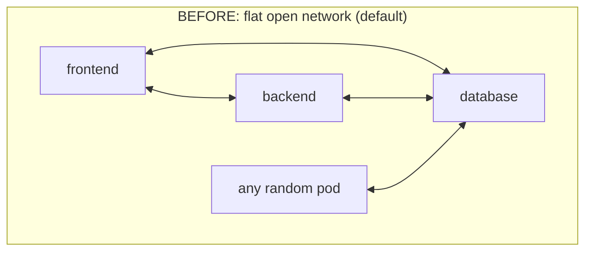
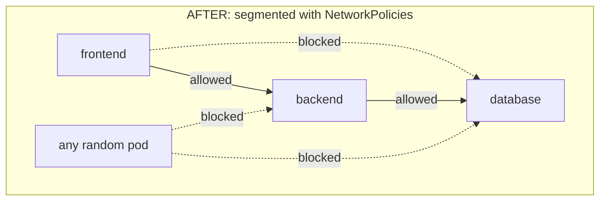
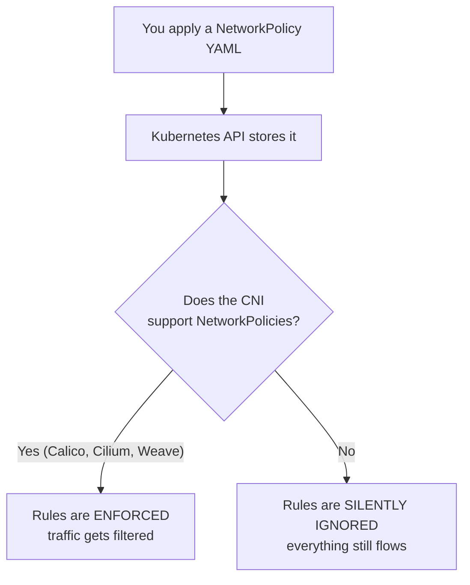
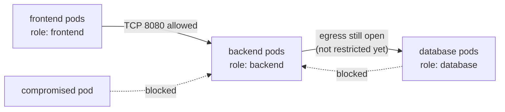

# Day 20 - Network Policies

> **Goal:** Learn how to turn Kubernetes' wide-open default network into a locked-down, badge-controlled one - using NetworkPolicies to control exactly which pods are allowed to talk to which other pods.

## Learning Objectives

By the end of this lesson you will be able to:

1. Explain the default Kubernetes networking model (every pod can reach every other pod) and why that is risky.
2. Describe what a NetworkPolicy is and how it selects pods using labels.
3. Explain the two most important rules: policies are **additive**, and a pod is only **isolated** once a policy selects it.
4. Read and write NetworkPolicy YAML using `podSelector`, `policyTypes`, `ingress.from`, `egress.to`, `namespaceSelector`, `ipBlock`, and `ports`.
5. Understand the critical requirement that your **CNI plugin must support NetworkPolicies** (Calico, Cilium, Weave) or they are silently ignored.
6. Test that a policy actually works by trying to reach a pod before and after applying it.

## Real-World Analogy: The Open-Plan Office

Picture your Kubernetes cluster as a big **open-plan office** on its first day.

- There are no walls, no doors, no badge readers. Anyone can stand up, walk across the floor, and reach **anyone else's desk**. The intern can stroll right into the finance corner and read the payroll spreadsheets.
- This is exactly how Kubernetes works **by default**: every pod can open a network connection to every other pod, in any namespace. The network is completely flat and open.

Now your security team gets nervous and installs **badge-controlled doors**:

- A **NetworkPolicy** is one of those doors. It says, for a chosen group of desks (pods), "only people wearing a *sales* badge may walk in here."
- The safest way to start is **default deny**: first **lock every door** so nobody can get in, then hand out specific keys ("sales team may enter the finance room on door number 8080"). Anything you did not explicitly allow stays locked.

Two subtle but vital points carry over from this analogy:

- A door only protects **the room it is attached to**. Putting a badge reader on the finance room does **not** lock the marketing room. In Kubernetes, a policy only affects the pods it **selects** - everything else stays wide open.
- Badge doors only work if the **building has a security system installed**. If there are no badge readers wired up, your "rules" are just signs on the wall that everyone ignores. In Kubernetes, that security system is the **CNI plugin**. No supporting CNI = your policies are ignored.





## Part 1: The Default Kubernetes Network

### Everything Can Talk to Everything

When you create a Kubernetes cluster, it ships with a flat network. The rules are simple and dangerous:

- Every pod gets its own IP address.
- Any pod can connect to any other pod's IP - **across namespaces too**.
- There is **no firewall** between pods out of the box.

```
┌──────────────────── Default Cluster Network ────────────────────┐
│                                                                  │
│   frontend  <───────>  backend  <───────>  database             │
│      ^                    ^                    ^                 │
│      │                    │                    │                 │
│      └────────────────────┴────────────────────┘               │
│                                                                  │
│   compromised-pod ───────────────────────────> database         │
│   (a hacked pod can reach your DB directly - nothing stops it)   │
└──────────────────────────────────────────────────────────────────┘
```

### Why That Is Risky

Imagine an attacker manages to break into your `frontend` pod (maybe through a web vulnerability). On a flat network, that pod can now directly reach your `database` pod and try to steal data, even though the frontend should **never** talk to the database directly.

This is called **lateral movement** - one compromised pod becomes a launchpad to attack everything else. NetworkPolicies exist to stop it. The principle is **least privilege**: a pod should only be able to reach the few things it genuinely needs, and nothing more.

## Part 2: What Is a NetworkPolicy?

A **NetworkPolicy** is a Kubernetes object that acts like a **firewall for pod-to-pod traffic**. It does two things:

1. It **selects** a group of pods using labels (the `podSelector`).
2. It defines which traffic is **allowed** to those pods (ingress = incoming) and/or from those pods (egress = outgoing).

The key idea: you describe traffic by **labels**, not by IP addresses. You say "pods labeled `role: backend` may receive traffic from pods labeled `role: frontend`," and Kubernetes figures out the IPs for you. Pods come and go, IPs change, but labels stay stable.

### The Two Rules You Must Never Forget

This is the part everyone gets wrong. Read it twice.

**Rule 1 - NetworkPolicies are additive.**
There is no "deny" rule and no ordering or priority. Every policy can only **allow** traffic. If a piece of traffic is allowed by **any** policy that applies to a pod, it goes through. You build up allowances; you never write block rules.

**Rule 2 - A pod is "open" until a policy selects it.**
A pod that is **not selected by any** NetworkPolicy behaves the old way: fully open, all traffic allowed. The moment **at least one** policy selects that pod (for a given direction), the pod becomes **isolated** for that direction - and from then on **only explicitly allowed** traffic is permitted; everything else is dropped.

```
Pod selected by NO policy        -->  wide open (default Kubernetes behavior)
Pod selected by SOME policy      -->  isolated; only allowed traffic gets in/out
Multiple policies select a pod   -->  the allowances are ADDED together (union)
```

So "default deny" is just a policy that selects pods but allows **nothing**. It flips the pod into isolated mode with an empty allow-list, which means: block everything. You then add more policies to poke specific holes.

## Part 3: The Critical CNI Requirement

> **READ THIS BEFORE YOU TEST ANYTHING.** A NetworkPolicy is only a *request*. Something has to actually enforce it. That something is your cluster's **CNI plugin** (Container Network Interface - the component that wires up pod networking).

- CNIs that **enforce** NetworkPolicies: **Calico, Cilium, Weave Net** (and most managed-cloud CNIs).
- CNIs that **do not** enforce them will accept your YAML without error and then **silently ignore it**. Your policy looks applied (`kubectl get networkpolicy` shows it) but traffic flows freely anyway. This causes hours of confusion.

**Minikube users:** the default networking may not enforce NetworkPolicies. Start Minikube with a CNI that does:

```bash
# Start (or recreate) Minikube with Calico, which enforces NetworkPolicies
minikube start --cni=calico

# Verify the CNI pods are running
kubectl get pods -n kube-system | grep -i calico
```

If you already have a running cluster you cannot reconfigure, you can install Calico on top, for example:

```bash
kubectl apply -f https://raw.githubusercontent.com/projectcalico/calico/v3.27.0/manifests/calico.yaml
```



## Part 4: Anatomy of a NetworkPolicy

Every NetworkPolicy uses `apiVersion: networking.k8s.io/v1`. Here are the parts:

```yaml
apiVersion: networking.k8s.io/v1
kind: NetworkPolicy
metadata:
  name: example
  namespace: default          # policies are namespaced - they only act in their namespace
spec:
  podSelector:                 # WHICH pods this policy applies to
    matchLabels:
      role: backend
  policyTypes:                 # WHICH directions this policy controls
    - Ingress                  # incoming traffic to the selected pods
    - Egress                   # outgoing traffic from the selected pods
  ingress:                     # allowed INCOMING traffic
    - from:
        - podSelector:
            matchLabels:
              role: frontend
      ports:
        - protocol: TCP
          port: 8080
  egress:                      # allowed OUTGOING traffic
    - to:
        - podSelector:
            matchLabels:
              role: database
      ports:
        - protocol: TCP
          port: 5432
```

Field by field, in plain language:

| Field | Plain meaning |
|-------|---------------|
| `podSelector` | "This policy applies to pods with these labels." An **empty** `podSelector: {}` means **all pods in the namespace**. |
| `policyTypes` | Which directions you are locking: `Ingress` (in), `Egress` (out), or both. |
| `ingress.from` | The list of allowed sources for incoming traffic. |
| `egress.to` | The list of allowed destinations for outgoing traffic. |
| `podSelector` (inside from/to) | Allow traffic from/to pods with these labels (same namespace by default). |
| `namespaceSelector` | Allow traffic from/to whole namespaces with these labels. |
| `ipBlock` | Allow traffic from/to an IP range (CIDR), e.g. external systems. |
| `ports` | Restrict to specific ports and protocols (TCP/UDP). No `ports` = all ports. |

> **Watch out for a sneaky detail.** Inside one `from`/`to` entry, listing `podSelector` and `namespaceSelector` as **separate list items** (each with its own `-`) means "this OR that." But combining them **under the same list item** (no second `-`) means "pods with this label **AND** in a namespace with that label." The dash placement changes the meaning - we will see this below.

## Part 5: Worked Example 1 - Default Deny All Ingress

The classic first move: lock all incoming traffic to every pod in a namespace. This is the "lock every door first" step.

```yaml
# default-deny-ingress.yaml
apiVersion: networking.k8s.io/v1
kind: NetworkPolicy
metadata:
  name: default-deny-ingress
  namespace: default
spec:
  podSelector: {}            # empty = select EVERY pod in this namespace
  policyTypes:
    - Ingress                # we are controlling incoming traffic...
  # NOTE: there is NO ingress: section, so the allow-list is empty.
  # Selected + nothing allowed = deny all incoming traffic.
```

How to read it: `podSelector: {}` selects all pods, `policyTypes: [Ingress]` flips them into isolated mode for incoming traffic, and because there is **no** `ingress:` block, nothing is allowed. Result: no pod in this namespace can receive traffic from anywhere - until you add more (additive) policies that allow specific traffic.

Egress is **still wide open** here - we only locked Ingress. That is intentional and important to remember.

```bash
kubectl apply -f default-deny-ingress.yaml
kubectl get networkpolicy
# NAME                   POD-SELECTOR   AGE
# default-deny-ingress   <none>         5s
```

## Part 6: Worked Example 2 - Allow Frontend to Reach Backend

Now we poke a specific hole: only `frontend` pods may reach `backend` pods, and only on port 8080. Because policies are additive, this allowance is **added** on top of the default-deny above.

```yaml
# allow-frontend-to-backend.yaml
apiVersion: networking.k8s.io/v1
kind: NetworkPolicy
metadata:
  name: allow-frontend-to-backend
  namespace: default
spec:
  podSelector:
    matchLabels:
      role: backend          # this policy protects the BACKEND pods
  policyTypes:
    - Ingress
  ingress:
    - from:
        - podSelector:
            matchLabels:
              role: frontend # only pods labeled role=frontend are allowed in
      ports:
        - protocol: TCP
          port: 8080         # and only on TCP port 8080
```

What this means in practice:

- Backend pods are now isolated for ingress and accept traffic **only** from frontend pods on port 8080.
- A `database` pod, a random debug pod, or a compromised pod trying to reach the backend on any other port is **dropped**.
- Frontend pods themselves are **not** mentioned in `podSelector`, so this policy does **not** isolate them. If nothing else selects the frontend, the frontend stays open. (This is Rule 2 again.)



### Allowing From Another Namespace

If the frontend lives in a different namespace, a bare `podSelector` will not match it (selectors default to the policy's own namespace). Use `namespaceSelector`:

```yaml
  ingress:
    - from:
        # AND logic: pods labeled role=frontend that ALSO live in a namespace
        # labeled team=web. Both conditions in ONE list item (single dash).
        - namespaceSelector:
            matchLabels:
              team: web
          podSelector:
            matchLabels:
              role: frontend
```

Compare with **OR** logic (two separate list items, each with its own dash):

```yaml
  ingress:
    - from:
        - namespaceSelector:        # allow ALL pods from team=web namespaces
            matchLabels:
              team: web
        - podSelector:              # OR any frontend pod in THIS namespace
            matchLabels:
              role: frontend
```

## Part 7: Worked Example 3 - Default Deny Egress + Allow DNS

Locking egress is powerful but has a famous trap: if you deny all outgoing traffic, your pods can no longer reach **kube-dns / CoreDNS**, so every hostname lookup fails. Then connections to `backend-service`, `database-service`, or anything by name break - even traffic you "allowed" - because the pod cannot resolve the name to an IP. You must explicitly allow DNS.

DNS runs in the `kube-system` namespace on **port 53**, over both **UDP and TCP**.

```yaml
# default-deny-egress-allow-dns.yaml
apiVersion: networking.k8s.io/v1
kind: NetworkPolicy
metadata:
  name: default-deny-egress-allow-dns
  namespace: default
spec:
  podSelector: {}              # apply to every pod in the namespace
  policyTypes:
    - Egress                   # lock OUTGOING traffic
  egress:
    # The ONLY thing we allow out is DNS to kube-system on port 53.
    - to:
        - namespaceSelector:
            matchLabels:
              kubernetes.io/metadata.name: kube-system
      ports:
        - protocol: UDP
          port: 53
        - protocol: TCP
          port: 53
```

Notes:

- `kubernetes.io/metadata.name` is a label Kubernetes automatically puts on every namespace equal to its name - handy for selecting `kube-system` without labeling it yourself.
- Everything else outbound is now blocked. To let these pods reach, say, the backend, you would **add another** egress policy (additive) allowing `to: podSelector role=backend` on the right port.

```yaml
# allow-egress-to-backend.yaml (added on top - additive)
apiVersion: networking.k8s.io/v1
kind: NetworkPolicy
metadata:
  name: allow-egress-to-backend
  namespace: default
spec:
  podSelector:
    matchLabels:
      role: frontend
  policyTypes:
    - Egress
  egress:
    - to:
        - podSelector:
            matchLabels:
              role: backend
      ports:
        - protocol: TCP
          port: 8080
```

### Allowing an External IP Range with ipBlock

To let pods reach an external service (an API, a managed database) by IP, use `ipBlock` with a CIDR:

```yaml
  egress:
    - to:
        - ipBlock:
            cidr: 203.0.113.0/24     # allowed external network
            except:
              - 203.0.113.5/32       # but block this single address
      ports:
        - protocol: TCP
          port: 443
```

## Part 8: How to Test a NetworkPolicy

The only way to trust a policy is to try to break through it. Here is a clean before-and-after test.

```bash
# 1. Create two labeled pods to act as client and server
kubectl run backend  --image=nginx        --labels="role=backend"  --port=80
kubectl run frontend --image=busybox       --labels="role=frontend" --command -- sleep 3600
kubectl run stranger --image=busybox       --labels="role=other"    --command -- sleep 3600

# 2. Find the backend pod's IP (or use the service name if you made a Service)
kubectl get pod backend -o wide

# 3. BEFORE any policy: every pod can reach the backend (flat network)
kubectl exec frontend -- wget -qO- --timeout=2 http://<backend-ip>   # works
kubectl exec stranger -- wget -qO- --timeout=2 http://<backend-ip>   # also works (!)
```

Now apply a default-deny plus an allow-frontend policy targeting `role=backend` on port 80, then test again:

```bash
kubectl apply -f default-deny-ingress.yaml
kubectl apply -f allow-frontend-to-backend.yaml   # (port 80 for this nginx test)

# 4. AFTER: only the frontend gets through
kubectl exec frontend -- wget -qO- --timeout=2 http://<backend-ip>   # still works
kubectl exec stranger -- wget -qO- --timeout=2 http://<backend-ip>   # HANGS / times out = blocked
```

> A **blocked** connection usually **hangs and then times out** (the packets are dropped, not rejected). That is why we pass `--timeout=2` - so the test fails fast instead of waiting forever. If `stranger` still gets through instantly, your CNI is probably not enforcing policies (back to Part 3).

```bash
# Inspect and clean up
kubectl describe networkpolicy allow-frontend-to-backend
kubectl delete networkpolicy --all
kubectl delete pod backend frontend stranger
```

## Common Mistakes

1. **Assuming policies work without a supporting CNI.** If your CNI does not enforce NetworkPolicies (e.g. Minikube's default), your YAML is accepted and silently ignored. Always run a supporting CNI such as Calico (`minikube start --cni=calico`) and verify with a blocked-traffic test.
2. **Thinking one allow rule denies everything else cluster-wide.** A NetworkPolicy only affects the pods its `podSelector` matches, in its own namespace. Allowing frontend-to-backend does **not** lock down the database or any other namespace. Isolation is per-pod, not global.
3. **Forgetting egress is still open.** A default-deny **ingress** policy does nothing to outbound traffic. A compromised pod can still call out. If you need to restrict outbound, you must add an `Egress` policy - they are independent directions.
4. **Locking egress but forgetting to allow DNS.** Deny-all egress kills DNS lookups to kube-dns/CoreDNS, so name-based connections break everywhere. Always allow UDP and TCP port 53 to the `kube-system` namespace before tightening egress.
5. **Selecting the wrong labels.** A typo like `role: backed` instead of `role: backend`, or a selector that matches **no** pods, leaves traffic open (or blocks the wrong pods). Double-check labels with `kubectl get pods --show-labels`.
6. **Confusing OR vs AND in from/to.** Two list items (`- podSelector` then `- namespaceSelector`) means OR. One combined item (`- namespaceSelector` with `podSelector` indented under it) means AND. The dash placement silently changes who is allowed.

## Quick Self-Check

1. In a brand-new cluster with no NetworkPolicies, can `pod-A` reach `pod-B` in a different namespace? Why?
2. You apply a policy that selects `role=backend` and allows ingress only from `role=frontend`. What happens to a `database` pod that tries to reach the backend? What happens to the **frontend** pod's own incoming traffic?
3. NetworkPolicies have no "deny" rule. So how do you actually deny traffic?
4. You wrote a perfect default-deny policy but traffic still flows freely. What is the most likely cause?
5. You apply a deny-all egress policy and suddenly your pods cannot reach any service by name. What did you forget, and what exact rule fixes it?

<details>
<summary>Answers</summary>

1. **Yes.** The default Kubernetes network is flat and open - every pod can reach every other pod, across namespaces, until a policy selects them.
2. The **database** pod is **blocked** (backend is isolated and only allows frontend on the given port). The **frontend** pod's own incoming traffic is **unaffected** - this policy does not select frontend, so frontend stays open unless another policy isolates it.
3. By **selecting** a pod with a policy but allowing nothing (or allowing only specific traffic). Selection flips the pod into isolated mode; anything not explicitly allowed is dropped. That is what "default deny" is.
4. The **CNI plugin does not enforce NetworkPolicies**. Use Calico/Cilium/Weave (e.g. `minikube start --cni=calico`).
5. You forgot to **allow DNS**. Add an egress rule allowing **UDP and TCP port 53** to the `kube-system` namespace so CoreDNS lookups work.

</details>

## Summary

- By **default**, Kubernetes networking is flat and open: every pod can talk to every other pod, even across namespaces. That enables lateral movement and is risky.
- A **NetworkPolicy** is a label-based firewall for pod-to-pod traffic. It selects pods with `podSelector` and allows specific `ingress`/`egress`.
- Policies are **additive** (allow-only, no deny, no ordering). A pod is **open until a policy selects it**; once selected, only explicitly allowed traffic is permitted. "Default deny" = select pods, allow nothing.
- Build rules with `policyTypes`, `ingress.from` / `egress.to`, and inside them `podSelector`, `namespaceSelector`, `ipBlock`, plus `ports`. Mind the OR-vs-AND dash placement.
- Policies are **only enforced by a supporting CNI** (Calico, Cilium, Weave). Without one (including Minikube's default), they are silently ignored - use `minikube start --cni=calico`.
- When locking **egress**, always allow **DNS (port 53, UDP and TCP) to kube-system**, or name resolution breaks.
- Always **test** with `wget`/`curl` between pods before and after applying. Blocked traffic hangs and times out.

**Next up ->** [Day 22 - Monitoring and Logging](../day22-monitoring-logging/notes.md)
