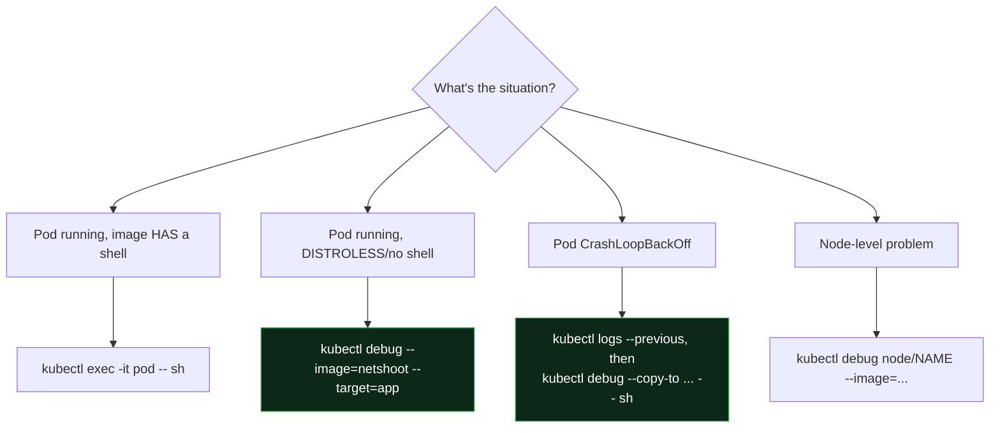

# Day 21 (Deep Dive) - Debugging Pods with kubectl debug and Ephemeral Containers

> **Companion to [Day 21 - Monitoring and Logging](notes.md).** Monitoring tells you *something* is wrong; this page is how you get *inside* a running (or crashing) pod to find out *what* - even when the image has no shell.

> **The problem this solves:** production images are minimal or **distroless** - no `sh`, no `curl`, no `ps`. So `kubectl exec -it pod -- sh` fails with "executable file not found." And a **CrashLoopBackOff** pod restarts before you can exec at all. Ephemeral containers and `kubectl debug` fix both.

---

## First, the Basics You Already Have

Reach for these before anything fancy:

```bash
kubectl logs pod-x                       # current logs
kubectl logs pod-x --previous            # logs from the CRASHED previous container (huge for CrashLoop)
kubectl logs pod-x -c sidecar            # a specific container
kubectl describe pod pod-x               # Events: probe failures, scheduling, image pull, OOMKilled
kubectl get pod pod-x -o yaml            # full live spec + status
kubectl exec -it pod-x -- sh             # a shell INSIDE (only if the image HAS a shell)
```

`kubectl describe` (the **Events** at the bottom) and `logs --previous` solve most incidents. When they are not enough - or the image has no shell - use the tools below.

---

## Ephemeral Containers via kubectl debug

An **ephemeral container** is a temporary container you attach to a **running pod**. It shares the pod's network (and optionally the process namespace), so you get **your** tools next to the app - **without restarting the pod**.

```bash
# Attach a debug container (busybox) to a running pod, sharing the target's process view
kubectl debug -it pod-x --image=busybox:1.36 --target=app

# Now inside, you have a shell + tools the distroless app lacks:
#   wget -qO- localhost:8080/healthz     # hit the app over shared localhost
#   ps aux                               # see the app's processes (needs --target)
#   ls -l /proc/1/root/                  # peek at the app container's filesystem
```

- `--target=<container>` shares that container's **process namespace**, so you can see and inspect its processes and (via `/proc/1/root`) its files.
- The ephemeral container appears under the pod but **cannot** have ports, resources, or probes, and **cannot be removed** - it lives until the pod dies. That is fine; it is a throwaway debug session.

```bash
# A debug image loaded with network tools
kubectl debug -it pod-x --image=nicolaka/netshoot --target=app
# then: curl, dig, nslookup, tcpdump, ss, etc.
```

---

## Debugging a CrashLoopBackOff (copy the pod)

You cannot exec into a pod that keeps crashing - it is never up long enough. So **copy** it to a new pod with a changed command (so it starts but does nothing), then poke around:

```bash
# Make a copy named 'pod-x-debug' that runs a shell instead of the crashing entrypoint
kubectl debug pod-x -it --copy-to=pod-x-debug --container=app -- sh
#   -> the copy starts with 'sh' as its command, so it stays up
#   -> inspect config, env, mounted files, run the real binary by hand to see the error

# Or copy but ADD a debug sidecar image alongside the original (keep original command)
kubectl debug pod-x --copy-to=pod-x-debug --image=busybox:1.36 --share-processes

# Clean up when done
kubectl delete pod pod-x-debug
```

`--copy-to` leaves the original pod untouched (still crashing, still observable) and gives you a modifiable clone. `--share-processes` lets the debug container see the other containers' processes.

---

## Debugging a Node

`kubectl debug node/...` launches a privileged pod on a specific node with the **host filesystem mounted at `/host`** - for when the problem is the node, not the pod:

```bash
kubectl debug node/ip-10-0-1-23 -it --image=busybox:1.36
# inside:
#   chroot /host                         # act as if on the node
#   cat /host/var/log/...                # read node logs, check kubelet, disk, etc.
```

---

## Which Tool When



| Situation | Command |
|-----------|---------|
| Image has a shell | `kubectl exec -it pod -- sh` |
| Distroless / no tools | `kubectl debug -it pod --image=nicolaka/netshoot --target=app` |
| CrashLoopBackOff | `kubectl logs --previous` then `kubectl debug pod --copy-to=dbg -it -- sh` |
| Node problem | `kubectl debug node/NAME -it --image=busybox` |
| Just need the events | `kubectl describe pod pod` |

---

## Common Mistakes

1. **Trying to `exec` into a distroless pod.** No shell = "executable file not found." Use `kubectl debug` with a tools image instead.
2. **Forgetting `--previous` on a crashed pod.** The current container may be empty; the crash reason is in the **previous** container's logs.
3. **Expecting to remove an ephemeral container.** You cannot; it persists until the pod is deleted. Use `--copy-to` if you want a disposable pod.
4. **Debugging the crashing pod directly.** It never stays up. **Copy it** with a changed command so it starts, then investigate.
5. **Ignoring `describe` events.** OOMKilled, ImagePullBackOff, FailedScheduling, and probe failures are all right there - check events before deep debugging.

---

## Quick Self-Check

1. Your production image is distroless and `kubectl exec -- sh` fails. How do you get a shell's worth of tools next to it?
2. A pod is in CrashLoopBackOff. What two steps get you the crash reason and a way to poke around?
3. What does `--target=<container>` add to an ephemeral debug container?
4. Why can't you just remove an ephemeral container after you finish?
5. How do you inspect the underlying **node's** filesystem with kubectl?

<details>
<summary>Answers</summary>

1. `kubectl debug -it pod --image=nicolaka/netshoot --target=app` - attaches an ephemeral container with tools, sharing the app's namespaces, without restarting the pod.
2. `kubectl logs pod --previous` (crash reason from the last run), then `kubectl debug pod --copy-to=dbg -it -- sh` to get a startable clone to inspect.
3. It shares that container's **process namespace**, so you can see its processes and reach its filesystem via `/proc/1/root`.
4. Ephemeral containers are permanent additions to a running pod's spec; they live until the pod is deleted. Use `--copy-to` for a disposable debug pod.
5. `kubectl debug node/NAME -it --image=busybox` - it mounts the host filesystem at `/host` (chroot into it to act on the node).

</details>

---

## Summary

- Start with `kubectl logs` (`--previous`), `kubectl describe` (**Events**), and `exec` when a shell exists.
- For **distroless / no-shell** pods, attach an **ephemeral container** with `kubectl debug --image=... --target=...` to bring your own tools without a restart.
- For **CrashLoopBackOff**, `--copy-to` a modified clone (changed command) so it stays up and you can investigate.
- For **node** issues, `kubectl debug node/NAME` mounts the host at `/host`.

---

**Back to:** [Day 21 - Monitoring and Logging](notes.md)
