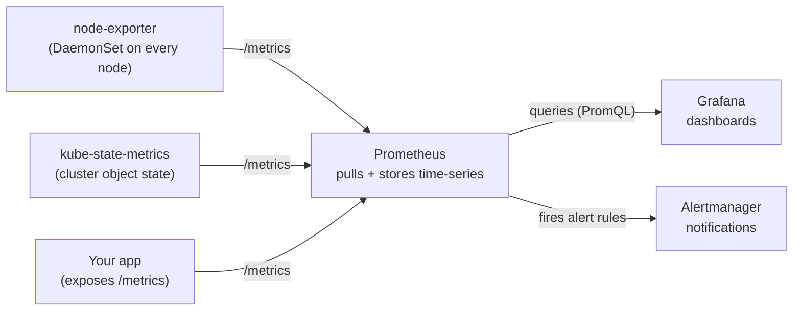
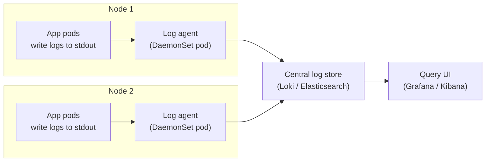

# Day 21 - Monitoring and Logging

> **Goal:** Learn how to *see inside* a running cluster - collecting **metrics**, **logs**, and **traces** so you know what is happening, get warned before things break, and can find the cause when they do.

## Learning Objectives

By the end of this lesson you will be able to:

1. Explain the three pillars of observability - metrics, logs, and traces - in plain language.
2. Say why `kubectl logs` alone is not enough once you have many pods.
3. Describe how Prometheus scrapes metrics (the pull model) and the role of exporters.
4. Read a simple PromQL query and build a Grafana dashboard on top of Prometheus data.
5. Install the whole monitoring stack with the `kube-prometheus-stack` Helm chart.
6. Set up a basic Alertmanager rule that fires a notification.
7. Understand the logging pipeline (EFK / PLG) and why the log agent is a DaemonSet.
8. Tell the difference between liveness, readiness, and startup probes, and write valid probe YAML.

## Real-World Analogy: Driving a Car With the Dashboard Covered

Imagine driving a car at night with a blanket thrown over the dashboard. The engine still runs - but you cannot see your speed, your fuel level, or whether the engine is overheating. You only find out something is wrong when the car coughs and stops on the motorway. That is what running a Kubernetes cluster with no monitoring feels like.

Now uncover the dashboard:

- **Metrics** = the **speedometer and fuel gauge** - numbers, sampled constantly, that tell you "how fast, how full, how hot" right now.
- **Logs** = the **trip diary** - a written record of *what happened*: "started engine 08:00", "took a wrong turn 08:14", "error: low oil 08:31."
- **Traces** = following **one single journey end to end** - "this exact trip went home -> petrol station -> office, and the petrol stop took 9 minutes." Useful when one request is slow and you want to know *which leg* caused it.
- **Alerts** = the **warning light** that comes on *before* you break down ("low fuel", "engine hot") so you can act in time.
- **Prometheus** = the **sensors** wired into the car that read those numbers continuously.
- **Grafana** = the **dashboard display** that turns the sensor numbers into dials and graphs you can actually read.

Monitoring is not a luxury. It is how you drive a production cluster without crashing blind.

## The Three Pillars of Observability

| Pillar | What it answers | Plain-language definition | Example tool |
|--------|-----------------|---------------------------|--------------|
| **Metrics** | "Is it healthy *right now*?" | Numbers measured over time (CPU %, memory MB, requests/sec, error rate). Cheap to store, great for graphs and alerts. | Prometheus |
| **Logs** | "What exactly happened?" | Text lines an app writes describing events ("user logged in", "ERROR: db timeout"). Rich detail, but bulkier. | Loki, Elasticsearch |
| **Traces** | "Where did the time go?" | The full path of *one* request as it hops between services, with timing for each hop. | Jaeger, Tempo |

You want all three. Metrics tell you *something* is wrong, logs tell you *what*, traces tell you *where*. This lesson focuses mainly on metrics and logs, which is where most teams start.

## Why `kubectl logs` Alone Does Not Scale

When you are learning, `kubectl logs my-pod` is perfect. In production it falls apart for three reasons:

1. **Pods are ephemeral.** A pod is a temporary thing. When it crashes, gets rescheduled, or is rolled out in a new version, the old pod is deleted - and its logs are **gone forever**. The most interesting logs (the ones right before a crash) are exactly the ones you lose.
2. **There are hundreds of pods.** Across many nodes and namespaces, you cannot `kubectl logs` each one by hand to find a problem. You would not even know which pod to look in.
3. **You cannot search or correlate.** `kubectl logs` shows one container's raw stream. You cannot ask "show me every ERROR across all services in the last 10 minutes" or line up logs from three pods that handled the same request.

The fix is the same idea for both logs and metrics: **ship the data off the pod, into a central store, and query it in one place.** Even after a pod dies, its history lives on.

## Metrics With Prometheus

Prometheus is the most common metrics system for Kubernetes. The key idea to understand is the **pull model**.

### The Pull Model (Prometheus Scrapes You)

Most people expect apps to *push* their numbers somewhere. Prometheus does the opposite. Each thing you want to monitor exposes a plain HTTP page at `/metrics`, and **Prometheus reaches out and reads (scrapes) that page** every few seconds.

A `/metrics` page is just text that looks like this:

```text
# HELP http_requests_total Total HTTP requests handled
# TYPE http_requests_total counter
http_requests_total{method="GET",status="200"} 48211
http_requests_total{method="GET",status="500"} 12
node_memory_MemAvailable_bytes 5.1283968e+09
```

Each line is `metric_name{labels} value`. The labels (the bits in `{...}`) let you slice the data later - for example "only the 500 errors."

### Exporters: Translators for Things That Do Not Speak Prometheus

A modern app can expose `/metrics` itself. But how do you monitor a Linux node's CPU, or the state of Kubernetes objects? You use an **exporter** - a small program that reads stats from somewhere and republishes them as a `/metrics` page Prometheus can scrape.

- **node-exporter** - runs on every node (as a DaemonSet) and exposes node-level metrics: CPU, memory, disk, network. This is your "speedometer per machine."
- **kube-state-metrics** - talks to the Kubernetes API and exposes the *state of objects*: how many pods are Running vs Pending, deployment replica counts, restart counts, job status. This is your "state of the fleet."



Read the arrows as "Prometheus reaches out and scrapes each `/metrics` endpoint on a timer," then serves that data to Grafana and Alertmanager.

### PromQL in One Line

**PromQL** (Prometheus Query Language) is how you ask questions of the stored metrics. Two simple examples:

```promql
# 1) Memory still available on each node, in gigabytes
node_memory_MemAvailable_bytes / 1024 / 1024 / 1024
```

```promql
# 2) HTTP requests per second over the last 5 minutes, per service
rate(http_requests_total[5m])
```

`rate(...[5m])` means "average per-second increase over a 5-minute window" - the standard way to turn an ever-growing counter into a readable "per second" graph.

### A Note on metrics-server (Different Thing!)

Do not confuse Prometheus with **metrics-server**. metrics-server is a tiny built-in component that powers `kubectl top nodes` / `kubectl top pods` and Horizontal Pod Autoscaling. It keeps only the latest reading and has no history or graphs. Prometheus is the full system with storage, queries, and alerting. Many clusters run both.

```bash
# metrics-server gives you quick "right now" numbers (if installed):
kubectl top nodes
kubectl top pods -A
```

## Visualisation With Grafana

Prometheus can draw basic graphs, but **Grafana** is the tool everyone uses to build real dashboards. Grafana does not store data itself - you point it at Prometheus as a **data source**, then arrange panels (each running a PromQL query) into a dashboard: CPU per node, request rate, error rate, pod restarts, and so on.

The best part: you rarely build from scratch. The community publishes thousands of ready-made dashboards (search grafana.com by ID, e.g. node-exporter dashboard `1860`), and the Helm stack below imports many automatically.

## The Common Install Path: kube-prometheus-stack (Helm)

Installing Prometheus, Grafana, Alertmanager, node-exporter, and kube-state-metrics one by one - and wiring them together correctly - is a lot of fiddly work. The community packaged all of it into a single Helm chart called **kube-prometheus-stack**. This ties straight back to the Helm lesson: one chart, one command, the whole stack.

```bash
# 1) Add the Helm repo that hosts the chart, then refresh the index
helm repo add prometheus-community https://prometheus-community.github.io/helm-charts
helm repo update

# 2) Install the whole stack into its own namespace
helm install monitoring prometheus-community/kube-prometheus-stack \
  --namespace monitoring \
  --create-namespace
```

```bash
# Check what got created (Prometheus, Grafana, Alertmanager, exporters)
kubectl get pods -n monitoring

# Open Grafana locally by forwarding its port to your laptop
kubectl port-forward -n monitoring svc/monitoring-grafana 3000:80
# then browse to http://localhost:3000

# Get the auto-generated Grafana admin password
kubectl get secret -n monitoring monitoring-grafana \
  -o jsonpath="{.data.admin-password}" | base64 -d
# (default username is: admin)
```

> The release name `monitoring` becomes the prefix on the created Services (`monitoring-grafana`, `monitoring-kube-prometheus-prometheus`, etc.). If you name your release something else, adjust those Service names to match.

To customise (storage size, retention, passwords) you pass a values file, exactly like any Helm chart:

```bash
helm install monitoring prometheus-community/kube-prometheus-stack \
  --namespace monitoring --create-namespace \
  -f my-values.yaml
```

## Alerting With Alertmanager

Dashboards are great, but no one stares at them all day. **Alertmanager** sends you a notification when something is wrong. The flow:

1. Prometheus continuously evaluates **alert rules** (each rule is a PromQL expression plus a duration).
2. When a rule is true for long enough, Prometheus marks it as *firing* and hands it to Alertmanager.
3. Alertmanager groups, de-duplicates, and routes the alert to a **receiver**: email, Slack, PagerDuty, etc.

### A Short Example Alert Rule

```yaml
# A PrometheusRule: alert if a node has under 10% memory free for 5 minutes
apiVersion: monitoring.coreos.com/v1
kind: PrometheusRule
metadata:
  name: node-memory-rules
  namespace: monitoring
spec:
  groups:
  - name: node.rules
    rules:
    - alert: NodeMemoryLow
      expr: |
        node_memory_MemAvailable_bytes / node_memory_MemTotal_bytes < 0.10
      for: 5m                          # must stay true for 5 min before firing
      labels:
        severity: warning
      annotations:
        summary: "Low memory on {{ $labels.instance }}"
        description: "Available memory is below 10% for 5 minutes."
```

The `for: 5m` is important - it stops a brief one-second blip from waking you up. The alert only fires if the condition holds for the full window.

## Logging: EFK / PLG Stacks

Metrics tell you *that* something is wrong; logs tell you *what*. The pattern is the same central-store idea, and it always has the same three roles:

1. A **log agent runs on every node** (a **DaemonSet** - exactly like Day 19). It tails the container log files written on that node.
2. The agent **ships** those logs to a **central store**.
3. You **query** them in one UI.

There are two popular stacks that fill those three roles:

| Role | EFK stack | PLG stack (lighter) |
|------|-----------|---------------------|
| Log agent (DaemonSet on each node) | **Fluentd** or **Fluent Bit** | **Promtail** (or Grafana Alloy) |
| Central store | **Elasticsearch** | **Loki** |
| Query UI | **Kibana** | **Grafana** |

EFK is powerful and full-text searchable but heavier on resources. PLG (Promtail + Loki + Grafana) is lighter - Loki indexes only labels, not full text, which makes it cheaper - and it reuses Grafana, so your metrics and logs live in one screen.



Why a DaemonSet? Because logs are written on *each node*, so you need one collector *per node* - never more, never fewer - which is precisely what a DaemonSet guarantees (see Day 19).

```bash
# Example: install the lightweight Loki logging stack via Helm
helm repo add grafana https://grafana.github.io/helm-charts
helm repo update
helm install loki grafana/loki-stack \
  --namespace logging --create-namespace \
  --set promtail.enabled=true
```

## Health Probes Recap (and How They Relate)

> **Want the full, hands-on version?** This is a recap. For every tuning field, the boot/timeout math, health-endpoint design, rolling-update and graceful-shutdown interaction, and probe debugging, see the deep dive: **[Health Probes in Practice](probes.md)**. And to get *inside* a running or crashing pod (even a distroless one), see **[Debugging Pods with kubectl debug](debugging-pods.md)**.

Monitoring tells *you* about problems. **Probes** let Kubernetes *act on them automatically*. A probe is a periodic health check Kubernetes runs against your container. There are three kinds, and mixing them up is a classic mistake.

| Probe | Question it asks | What happens on failure |
|-------|------------------|-------------------------|
| **liveness** | "Is the container *stuck/dead*?" | Kubernetes **restarts** the container. |
| **readiness** | "Is it *ready to serve traffic right now*?" | Pod is **removed from the Service** (no traffic) until it passes again - no restart. |
| **startup** | "Has a *slow* app finished booting yet?" | Holds off liveness/readiness until the app is up, so slow starters are not killed prematurely. |

- **liveness** restarts a stuck container (e.g. a deadlocked process that is running but not responding).
- **readiness** gates traffic - a pod that is alive but still warming a cache should not receive requests yet.
- **startup** protects slow-starting apps - it gives a generous grace period at boot, then hands over to the liveness probe.

### Probe Check Types

A probe can check health three ways: `httpGet` (HTTP 200-399 = healthy), `tcpSocket` (port accepts a connection), or `exec` (a command exits 0).

```yaml
apiVersion: v1
kind: Pod
metadata:
  name: web
spec:
  containers:
  - name: web
    image: my-web-app:1.0
    ports:
    - containerPort: 8080
    # Startup: give a slow app up to 30 x 5s = 150s to boot before other probes run
    startupProbe:
      httpGet:
        path: /healthz
        port: 8080
      failureThreshold: 30
      periodSeconds: 5
    # Liveness: if /healthz fails, restart the container
    livenessProbe:
      httpGet:
        path: /healthz
        port: 8080
      initialDelaySeconds: 10        # wait 10s after start before first check
      periodSeconds: 10              # then check every 10s
      failureThreshold: 3            # 3 failures in a row = restart
    # Readiness: if /ready fails, stop sending traffic (no restart)
    readinessProbe:
      httpGet:
        path: /ready
        port: 8080
      initialDelaySeconds: 5
      periodSeconds: 5
```

```yaml
# Other probe styles - a TCP check and an exec check
livenessProbe:
  tcpSocket:
    port: 5432                       # healthy if the port accepts a connection
  initialDelaySeconds: 15
  periodSeconds: 20
readinessProbe:
  exec:
    command: ["cat", "/tmp/ready"]   # healthy if this command exits 0
  initialDelaySeconds: 5
  periodSeconds: 10
```

> Tip: use a *light* endpoint for liveness (just "am I alive?"). Do not check the database in a liveness probe - if the DB hiccups, Kubernetes will pointlessly restart every healthy pod. Check dependencies in **readiness** instead.

## Common Mistakes

1. **Relying on `kubectl logs` only.** It works for one pod while learning, but logs vanish when a pod dies and you cannot search across hundreds of pods. Ship logs to a central store (Loki/Elasticsearch) so the history survives.
2. **No resource metrics because the collectors are missing.** `kubectl top` returns an error without **metrics-server**; Grafana panels stay empty without **node-exporter** and **kube-state-metrics**. No exporters, no data.
3. **Confusing liveness and readiness.** Liveness *restarts* a stuck container; readiness *removes it from traffic* without restarting. Putting a database check in a liveness probe causes mass restarts whenever the DB blips - that check belongs in readiness.
4. **Alert fatigue from noisy rules.** Alerts with no `for:` duration or with hair-trigger thresholds fire constantly, people start ignoring them, and the one real alert gets missed. Add `for:` windows, sensible thresholds, and severity levels.
5. **Not persisting Prometheus and Grafana data.** If they store data on the pod's local disk with no PersistentVolume, a restart wipes all your history and dashboards. Configure retention plus persistent storage in your Helm values.
6. **Logging everything at debug in production.** Debug-level logging on every service drowns your store, blows up storage cost, and buries real errors in noise. Default to info (or warn) in production and raise the level only when investigating.

## Quick Self-Check

1. Name the three pillars of observability and what question each one answers.
2. Give two reasons `kubectl logs` is not enough for a production cluster.
3. In one sentence, how does Prometheus get metrics out of your apps and nodes?
4. A pod is alive but its cache is still loading and it should not get traffic yet. Which probe handles this - liveness, readiness, or startup?
5. Why does the log-collecting agent run as a DaemonSet rather than a Deployment?

<details>
<summary>Answers</summary>

1. **Metrics** ("is it healthy right now?"), **logs** ("what exactly happened?"), **traces** ("where did the time go for one request?").
2. Pods are ephemeral so logs disappear when a pod dies; and you cannot search/correlate across hundreds of pods by hand.
3. It uses a **pull model** - Prometheus scrapes each target's `/metrics` HTTP endpoint on a timer.
4. **Readiness** - it gates traffic without restarting the container.
5. Logs are written on every node, so you need exactly one collector per node, which is what a DaemonSet guarantees.

</details>

## Summary

- **Observability has three pillars:** metrics (numbers over time), logs (text records of events), and traces (one request's full path). Metrics say *something* broke, logs say *what*, traces say *where*.
- **`kubectl logs` does not scale:** pods are ephemeral so logs vanish, there are too many pods to check by hand, and you cannot search across them. Ship everything to a central store.
- **Prometheus uses a pull model** - it scrapes `/metrics` endpoints. **Exporters** (node-exporter for node stats, kube-state-metrics for object state) expose data for things that do not speak Prometheus. **PromQL** queries it, e.g. `rate(http_requests_total[5m])`.
- **Grafana** builds dashboards on Prometheus data; **Alertmanager** sends notifications when a PromQL alert rule fires (use a `for:` window to avoid noise).
- **Install it all with one Helm chart:** `kube-prometheus-stack` bundles Prometheus + Grafana + Alertmanager + exporters.
- **Logging follows one pattern:** a log agent DaemonSet on every node ships logs to a central store, queried in one UI - EFK (Fluentd/Fluent Bit + Elasticsearch + Kibana) or the lighter PLG (Promtail + Loki + Grafana).
- **Probes let Kubernetes self-heal:** liveness restarts a stuck container, readiness gates traffic, startup protects slow-starting apps.

**Next up ->** [Day 22 - Helm](../day22-helm/notes.md)
