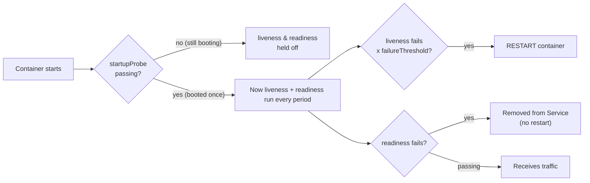
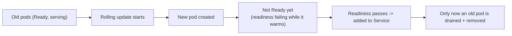
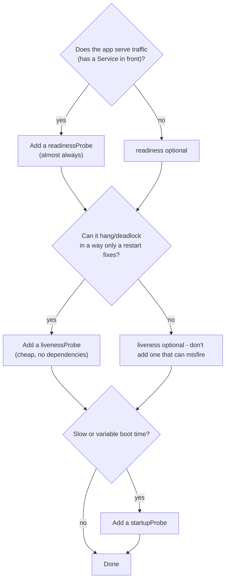

# Day 21 (Deep Dive) - Health Probes in Practice

> **Companion to [Day 21 - Monitoring and Logging](notes.md).** That page recaps *what* the three probes are. This page is the **practical, hands-on** version: every tuning field, the boot/timeout math, how probes interact with rolling updates and graceful shutdown, how to design your health endpoints, and how to debug a probe that is fighting you.

> **Why probes matter:** they are how Kubernetes **self-heals** and **routes traffic safely**. Get them right and a stuck pod restarts itself and a warming-up pod never receives a request. Get them wrong and you cause the exact outage you were trying to prevent - mass restarts, stalled rollouts, or traffic sent to a dead pod.

---

## The Three Probes (fast mental model)

| Probe | Question | On failure | Typical use |
|-------|----------|-----------|-------------|
| **startupProbe** | "Has the app finished **booting**?" | After enough failures, restart. **Disables liveness/readiness until it passes once.** | Slow-starting apps (JVM, big caches, migrations) |
| **livenessProbe** | "Is the app **stuck/dead**?" | **Restart the container** | Detect deadlocks/hangs a process can't recover from |
| **readinessProbe** | "Can it **serve traffic right now**?" | **Remove the pod from the Service** (no restart) | Gate traffic while warming up or when a dependency is down |



> **The single most useful sentence:** **liveness restarts, readiness reroutes, startup waits.** If you remember only one thing, remember that.

---

## What Happens If You Omit a Probe (the defaults)

Probes are **optional**. Before configuring them, understand what Kubernetes does when each one is **absent** - the defaults are not "safe," they are just permissive.

| If you have NO... | Kubernetes assumes... | The consequence |
|-------------------|----------------------|-----------------|
| **livenessProbe** | The container is alive **as long as the process is running** | A **hung/deadlocked** process (running but serving nothing) is **never restarted** - it stays broken until you notice. Kubernetes only restarts on an actual process **exit/crash** (per `restartPolicy`). |
| **readinessProbe** | The pod is **Ready the instant the container starts** | It is added to the Service and **receives traffic immediately** - before the app can serve. Users hit **half-booted pods** (errors/timeouts), and **rollouts do not wait**, so a bad version goes live at once. |
| **startupProbe** | Liveness/readiness start running **right away** (after their `initialDelaySeconds`) | A **slow-booting** app can **fail liveness during boot and get killed** -> `CrashLoopBackOff` that never recovers. Your only fix without a startup probe is a large `initialDelaySeconds` (the clumsy old way). |

### Walking through each "what if"

- **No liveness probe:** fine for a simple app that either works or crashes outright (the crash itself triggers a restart). **Dangerous** for anything that can **deadlock, hang, or wedge a thread pool** while the process stays alive - Kubernetes sees "process running = healthy" and leaves it broken forever.
- **No readiness probe:** the single most common cause of "**500s during every deploy**." Without it, a new pod is treated as ready at t=0, gets traffic before its cache/DB/warm-up is done, and the rollout replaces old pods while new ones cannot yet serve. **Almost every Service-backed workload should have one.**
- **No startup probe:** usually fine for fast starters. But a JVM, a big cache load, or DB migrations can take longer than the liveness `failureThreshold x periodSeconds`, so liveness kills the app mid-boot and it never comes up. The startup probe exists precisely to give slow apps a boot grace period without making liveness sluggish forever.

> **The asymmetry to remember:** omitting **readiness** is an **availability** bug (traffic to pods that cannot serve). Omitting **liveness** is a **recovery** bug (hung pods never self-heal). Omitting **startup** is a **boot** bug (slow apps get killed before they finish starting). None of the defaults protect you - they just say "assume healthy."

---

## The Tuning Fields (this is where people go wrong)

Every probe shares the same six fields. The defaults are aggressive, so know them:

| Field | Default | Meaning | Watch out |
|-------|---------|---------|-----------|
| `initialDelaySeconds` | 0 | Wait this long before the **first** probe | Too low on liveness = killed before boot -> CrashLoop. Prefer a **startupProbe** over a big initialDelay |
| `periodSeconds` | 10 | How often to run the probe | Too frequent = load; too slow = slow reaction |
| `timeoutSeconds` | 1 | How long to wait for one probe response | **1s is often too short** for a real endpoint under load -> false failures |
| `failureThreshold` | 3 | Consecutive failures before acting | This x `periodSeconds` = how long a fault must persist before restart/removal |
| `successThreshold` | 1 | Consecutive successes to be "healthy" again | **Must be 1** for liveness and startup; readiness can be higher |
| `terminationGracePeriodSeconds` | (pod's value) | Grace before SIGKILL after a **liveness** kill | Lets a probe-triggered restart still shut down cleanly |

**The reaction-time formula to keep in your head:**

```
Time before Kubernetes acts  =  failureThreshold x periodSeconds
   (plus up to timeoutSeconds on the failing check)

Example (liveness): failureThreshold 3 x periodSeconds 10  =  ~30s
   -> a hung container is restarted about 30 seconds after it hangs.
```

---

## The Startup Probe Math (how to size it)

A startup probe exists to give a slow app a **generous boot window** without making liveness/readiness sluggish forever. The max boot time you allow is:

```
max boot time allowed  =  failureThreshold x periodSeconds
```

```yaml
startupProbe:
  httpGet:
    path: /healthz
    port: 8080
  failureThreshold: 30      # 30 attempts...
  periodSeconds: 10         # ...every 10s  = up to 300s (5 min) to boot
```

While the startup probe is still failing, **liveness and readiness do not run at all**, so a slow JVM or a DB migration will not be killed mid-boot. The instant startup passes once, it never runs again and liveness/readiness take over with their own (tighter) timings. This is the modern, correct replacement for a large `initialDelaySeconds`.

---

## The Four Ways to Check Health

| Mechanism | Healthy when | Use for |
|-----------|--------------|---------|
| `httpGet` | HTTP status **200-399** | Web apps/APIs (the most common) |
| `tcpSocket` | The port **accepts a connection** | Databases, brokers, non-HTTP services |
| `exec` | The command **exits 0** | Anything scriptable inside the container (check a file, run a CLI) |
| `grpc` | The gRPC health service returns SERVING | gRPC services (stable since 1.27) |

```yaml
# httpGet (most common)
livenessProbe:
  httpGet:
    path: /livez
    port: 8080
    httpHeaders:
    - name: X-Probe
      value: k8s

# tcpSocket (e.g. a database)
readinessProbe:
  tcpSocket:
    port: 5432

# exec (script inside the container)
livenessProbe:
  exec:
    command: ["sh", "-c", "test -f /tmp/healthy"]

# grpc
readinessProbe:
  grpc:
    port: 9000
```

---

## Designing Your Health Endpoints (the part apps get wrong)

The probes are only as good as what your app reports. The rule:

- **Liveness = "is my own process healthy?"** Keep it **cheap and dependency-free**. It should answer "yes" as long as the process itself is not deadlocked. **Never check the database or a downstream service here.**
- **Readiness = "can I serve a request right now?"** This is where you **check dependencies** the request needs (DB reachable, cache warm, config loaded, migrations done).

```
GET /livez   -> 200 if the event loop / main thread is responsive   (liveness)
GET /readyz  -> 200 only if DB + cache + downstream are reachable    (readiness)
GET /healthz -> often used as the startup/boot check
```

> **Why this split matters (the classic outage):** if you put a **DB check in the liveness probe** and the database blips for 40 seconds, **every pod fails liveness and restarts at once** - turning a brief DB hiccup into a full app outage and a thundering-herd reconnect. The DB check belongs in **readiness**, where a blip just pauses traffic and then resumes. No restarts.

---

## A Complete, Production-Shaped Example

```yaml
apiVersion: apps/v1
kind: Deployment
metadata:
  name: web
spec:
  replicas: 3
  selector:
    matchLabels: { app: web }
  template:
    metadata:
      labels: { app: web }
    spec:
      terminationGracePeriodSeconds: 30      # time to drain + shut down cleanly
      containers:
      - name: web
        image: myapp:1.4.2
        ports:
        - containerPort: 8080

        # 1) STARTUP: allow up to 150s to boot, then hand over
        startupProbe:
          httpGet: { path: /healthz, port: 8080 }
          failureThreshold: 30
          periodSeconds: 5                    # 30 x 5s = 150s boot budget

        # 2) LIVENESS: cheap, dependency-free "am I deadlocked?"
        livenessProbe:
          httpGet: { path: /livez, port: 8080 }
          periodSeconds: 10
          timeoutSeconds: 2
          failureThreshold: 3                 # ~30s of hang -> restart

        # 3) READINESS: gate traffic on real dependencies
        readinessProbe:
          httpGet: { path: /readyz, port: 8080 }
          periodSeconds: 5
          timeoutSeconds: 2
          failureThreshold: 3                 # 3 fails -> out of the Service
          successThreshold: 1

        # Graceful shutdown: stop receiving traffic, then drain in-flight requests
        lifecycle:
          preStop:
            exec:
              command: ["sh", "-c", "sleep 5"]
```

---

## How Probes Interact With Rolling Updates and Shutdown

Readiness is not just "traffic on/off" - it is the backbone of **zero-downtime deploys** and **clean shutdowns**.

### Rolling update



Because the rollout waits for **readiness** before shifting traffic, a new pod never receives requests before it can serve them, and (with a sane `maxUnavailable`) you never drop below capacity. **No readiness probe = the rollout assumes a pod is ready the instant it starts, and users hit half-booted pods.**

### Graceful shutdown (the ordering that avoids dropped requests)

```
Pod deletion begins
   -> Pod marked Terminating; readiness starts failing
   -> Kubernetes removes it from the Service endpoints (no NEW traffic)
   -> preStop hook runs (e.g. sleep 5) so in-flight requests + endpoint
      propagation finish
   -> SIGTERM sent to the app (start graceful shutdown)
   -> up to terminationGracePeriodSeconds to exit
   -> SIGKILL if still running
```

> **Practical tip:** a short `preStop: sleep 5` plus handling **SIGTERM** in your app is the standard trick to avoid the "connection refused during deploy" errors - it covers the brief window while the pod's removal propagates to every kube-proxy/load balancer.

---

## Which Probes Do I Actually Need?



- **Most web services:** readiness (yes) + liveness (cheap) + startup (if boot is slow).
- **A simple stateless worker that cannot deadlock:** you may need **no liveness at all** - a needless liveness probe that can misfire only *adds* failure modes.
- **Rule:** never add a liveness probe you are not confident is dependency-free and reliable. A flaky liveness probe is worse than none.

---

## Debugging Probes

```bash
# Restart count climbing? Liveness is (probably) killing the pod.
kubectl get pods
# NAME        READY   STATUS             RESTARTS   AGE
# web-x       0/1     CrashLoopBackOff   7          6m     <- liveness or bad startup

# The events tell you exactly which probe failed and why
kubectl describe pod web-x
# Events:
#   Warning  Unhealthy  ...  Liveness probe failed: HTTP probe failed with statuscode: 500
#   Warning  Unhealthy  ...  Readiness probe failed: dial tcp ...: connect: connection refused
#   Normal   Killing    ...  Container web failed liveness probe, will be restarted

# Is the pod actually in the Service? (readiness gate)
kubectl get endpointslices -l kubernetes.io/service-name=web
kubectl get pod web-x -o jsonpath='{.status.conditions[?(@.type=="Ready")]}'

# Watch it live
kubectl get events --sort-by=.lastTimestamp | grep -i probe
```

**Reading the symptoms:**

| Symptom | Likely cause | Fix |
|---------|-------------|-----|
| `CrashLoopBackOff`, RESTARTS climbing | Liveness fails before app is ready, or app truly crashes | Add/loosen **startupProbe**; make liveness dependency-free |
| Pod `Running` but `0/1 READY`, no traffic | Readiness never passes (dependency down, wrong path/port) | Fix the readiness target; check the dependency |
| Rollout stuck / `progressDeadlineExceeded` | New pods never become Ready | Same as above - readiness is failing |
| Mass restarts when DB blips | Dependency check in **liveness** | Move that check to **readiness** |
| Random restarts under load | `timeoutSeconds: 1` too tight | Raise `timeoutSeconds`, lighten the endpoint |

---

## Best-Practice Checklist

- [ ] **readinessProbe** on every Service-backed workload (zero-downtime deploys + safe traffic)
- [ ] **livenessProbe** only if the app can hang unrecoverably, and kept **dependency-free**
- [ ] **startupProbe** for slow/variable boots (instead of a large `initialDelaySeconds`)
- [ ] Liveness checks the **process**, readiness checks the **dependencies** - never swap them
- [ ] `timeoutSeconds` >= 2 (1s default is too tight for real endpoints)
- [ ] Size startup as `failureThreshold x periodSeconds` >= worst-case boot time
- [ ] `preStop: sleep 5` + handle **SIGTERM** for clean shutdown
- [ ] Separate light endpoints: `/livez` (liveness), `/readyz` (readiness)
- [ ] Do not point liveness and readiness at the **same dependency-checking** endpoint

---

## Quick Self-Check

1. A pod is alive but its cache is still loading and it should not get traffic yet. Which probe?
2. Why should a **liveness** probe never check the database?
3. Your app takes up to 2 minutes to boot and keeps getting killed with `CrashLoopBackOff`. Which probe fixes this, and how do you size it?
4. What is the difference in *action* between a failed liveness probe and a failed readiness probe?
5. During a deploy you see brief "connection refused" errors. Which two settings (a probe behaviour + a lifecycle hook) fix this?
6. A pod has **no probes at all**. What does Kubernetes assume about it, and which of the three omissions is the most dangerous for a Service-backed app?

<details>
<summary>Answers</summary>

1. **readiness** - it removes the pod from the Service until the cache is warm, without restarting it.
2. Because a DB blip would fail liveness on **every** pod at once and **restart them all**, turning a brief hiccup into an outage. Dependency checks belong in **readiness**.
3. A **startupProbe** with `failureThreshold x periodSeconds` >= 120s (e.g. `failureThreshold: 30`, `periodSeconds: 5` = 150s). It holds off liveness until the app has booted.
4. **Liveness failure restarts** the container; **readiness failure removes it from the Service** (no restart) until it passes again.
5. **readiness** fails first on termination (so the pod leaves the Service) **plus** a `preStop` hook (e.g. `sleep 5`) to let endpoint removal propagate and in-flight requests drain before SIGTERM.
6. Kubernetes assumes it is **healthy and Ready the moment the container starts** (defaults are permissive, not safe). For a Service-backed app the most dangerous omission is the **readiness** probe - traffic is sent to a pod that cannot serve yet, causing errors on every deploy.

</details>

---

## Summary

- **startup waits, liveness restarts, readiness reroutes.** Use readiness almost always; liveness only when a hang needs a restart; startup for slow boots.
- The **tuning fields** (`initialDelaySeconds`, `periodSeconds`, `timeoutSeconds`, `failureThreshold`, `successThreshold`) decide how fast and how forgiving a probe is; reaction time is `failureThreshold x periodSeconds`.
- **Design your endpoints:** liveness = cheap and dependency-free (`/livez`); readiness = check real dependencies (`/readyz`). Swapping them causes cascading restarts.
- Readiness underpins **zero-downtime rollouts** and, with `preStop` + SIGTERM handling, **clean shutdowns**.
- Debug via `kubectl describe pod` events and the RESTARTS/READY columns.

---

**Back to:** [Day 21 - Monitoring and Logging](notes.md)
