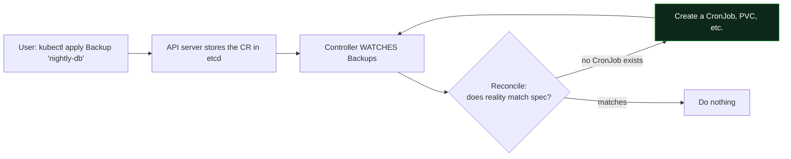

# Day 22 (Deep Dive) - Custom Resources, CRDs, and Operators

> **Companion to [Day 22 - Helm](notes.md).** Helm *packages* existing Kubernetes objects. This page is about *extending Kubernetes itself* - teaching the cluster brand-new object types (**CRDs**) and the controllers that act on them (**Operators**). It is how cert-manager, Prometheus, Argo CD, and the External Secrets Operator all work.

> **Why this matters:** almost every serious add-on you install is an operator. When you `kubectl apply` a `Certificate`, a `ServiceMonitor`, or an `ExternalSecret`, you are using a **custom resource** that some operator is watching. Understanding this demystifies the whole ecosystem.

---

## Kubernetes Is Extensible by Design

Built-in kinds (`Pod`, `Deployment`, `Service`) are not special-cased hard-coding - they are objects the API server stores and controllers reconcile. Kubernetes lets **you add your own kinds** the same way, with two pieces:

| Piece | What it is |
|-------|------------|
| **CustomResourceDefinition (CRD)** | Teaches the API server a **new kind** (e.g. `PostgresCluster`). After applying it, `kubectl get postgresclusters` works. |
| **Custom Resource (CR)** | An **instance** of that kind - the actual object a user creates. |
| **Controller / Operator** | Code that **watches** those CRs and makes reality match them. |

> **Crucial point:** a CRD by itself only lets you **store data** in etcd - applying a `PostgresCluster` does nothing on its own. The magic is the **controller** that watches it and *acts*. CRD = the new vocabulary word; controller = the thing that understands it.

---

## CustomResourceDefinition (the new kind)

A CRD registers a new resource type, including a schema the API server validates against:

```yaml
apiVersion: apiextensions.k8s.io/v1
kind: CustomResourceDefinition
metadata:
  name: backups.example.com          # <plural>.<group>
spec:
  group: example.com
  names:
    kind: Backup
    plural: backups
    singular: backup
    shortNames: ["bk"]
  scope: Namespaced
  versions:
  - name: v1
    served: true
    storage: true
    schema:
      openAPIV3Schema:
        type: object
        properties:
          spec:
            type: object
            properties:
              schedule: { type: string }     # e.g. "0 2 * * *"
              target:   { type: string }
```

Once applied, the new kind is first-class - `kubectl` treats it like any built-in:

```bash
kubectl get crds
kubectl get backups            # or 'kubectl get bk'
kubectl explain backup.spec    # schema-aware help, just like built-ins
```

```yaml
# A Custom Resource (an instance the user creates)
apiVersion: example.com/v1
kind: Backup
metadata:
  name: nightly-db
spec:
  schedule: "0 2 * * *"
  target: postgres-prod
```

---

## The Controller and the Reconcile Loop

A **controller** watches its resource type and continuously drives **actual state -> desired state**. This loop is **level-triggered**: it does not react to one-off events, it repeatedly asks "does reality match the spec?" and fixes any drift.



So for the `Backup` above, its controller would create a `CronJob` (and whatever else) that performs the backup - and recreate it if someone deletes it. The user only ever declares the **high-level intent** (`Backup`); the controller handles the low-level objects.

---

## Operator = CRD + Controller + Operational Knowledge

An **Operator** is a CRD plus a controller that encodes **how to actually run a specific application** - install, configure, upgrade, back up, fail over. It is often described as *"a human operator's runbook, turned into software."*

> **Analogy:** a plain controller keeps a simple object in shape. An **operator** is like hiring an experienced **DBA as code** - it does not just start Postgres, it knows how to take backups, run failovers, and do version upgrades safely, all triggered by editing a single custom resource.

**Operators you have already met in these notes:**

| Operator | Custom resource | What it manages |
|----------|-----------------|-----------------|
| **External Secrets Operator** | `ExternalSecret` | Syncs secrets from AWS/Vault into K8s ([Day 10](../day10-configmaps-secrets/production-secrets.md)) |
| **Prometheus Operator** | `ServiceMonitor`, `Prometheus` | Configures monitoring ([Day 21](../day21-monitoring-logging/notes.md)) |
| **cert-manager** | `Certificate`, `Issuer` | Issues and renews TLS certificates |
| **Argo CD** | `Application` | GitOps delivery ([Day 11 best practices](../day11-eks/eks-cluster-creation/03-eks-best-practices.md)) |

You **install** most operators with Helm or a manifest (that is the Helm connection): the chart ships the **CRDs + the controller Deployment + RBAC**, and from then on you just apply custom resources.

---

## Why a CRD Instead of a ConfigMap?

You *could* stuff config in a ConfigMap and write a script. A CRD is better when you want a real API:

| | ConfigMap + script | CRD + controller |
|---|--------------------|------------------|
| **Schema validation** | None (free-form) | API server validates the spec |
| **kubectl-native** | No | `get`/`describe`/`explain`, status, events |
| **RBAC** | Per ConfigMap only | Per **kind** (fine-grained) |
| **Reconciliation** | You script it | Continuous, self-healing loop |
| **Versioning** | Manual | Built-in (`v1alpha1` -> `v1`) with conversion |

---

## When to Build Your Own (and when not to)

- **Use existing operators** for common needs (databases, certs, secrets, monitoring) - do not reinvent them.
- **Build your own** when you have a **complex, stateful, app-specific workflow** you keep doing by hand (provisioning tenants, orchestrating a bespoke system). Tools: **Kubebuilder** or the **Operator SDK** (Go), which scaffold the CRD + controller for you.
- **Do not build one** for simple config - a Helm chart or a ConfigMap is enough. Operators are worth it when there is real *operational logic* to automate.

---

## Quick Self-Check

1. What does a CRD give you, and why is it useless on its own?
2. What is the difference between a **custom resource** and a **CRD**?
3. What does a controller's **reconcile loop** do, and what does "level-triggered" mean?
4. What makes an **operator** more than just a controller?
5. Name two operators from earlier in the course and the custom resource each one watches.

<details>
<summary>Answers</summary>

1. A CRD teaches the API server a **new kind** (so you can store/validate/`kubectl get` it). On its own it only stores data - nothing acts on it until a **controller** watches it.
2. A **CRD** defines the *type* (like a class); a **custom resource** is an *instance* of that type (like an object) that a user creates.
3. It continuously compares **actual state to desired spec** and makes changes to close the gap. **Level-triggered** = it repeatedly reconciles to the desired state rather than reacting to one-off events, so it self-heals drift.
4. An operator's controller encodes **application-specific operational knowledge** (install, upgrade, backup, failover) - not just keeping a simple object in shape.
5. For example: **External Secrets Operator** watches `ExternalSecret`; **Prometheus Operator** watches `ServiceMonitor`/`Prometheus`; **cert-manager** watches `Certificate`.

</details>

---

## Summary

- Kubernetes is **extensible**: a **CRD** adds a new kind, a **custom resource** is an instance of it, and a **controller** makes reality match it.
- A CRD alone only stores data - the **controller's reconcile loop** (level-triggered, self-healing) is what acts.
- An **Operator** = CRD + controller that encodes how to **run a specific app** (install/upgrade/backup/failover).
- Most add-ons you install (ESO, Prometheus, cert-manager, Argo CD) are operators, usually shipped as Helm charts (CRDs + controller + RBAC).
- Build your own with **Kubebuilder / Operator SDK** only when there is real operational logic to automate.

---

**Back to:** [Day 22 - Helm](notes.md)
