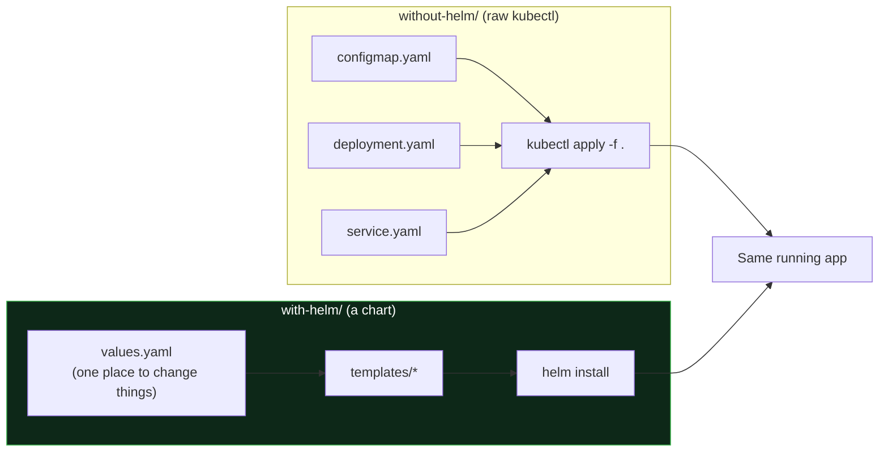

# Deploying an App: Without Helm vs With Helm

> A side-by-side demo of the **same web app** deployed two ways, so you can *feel* the difference Helm makes.
>
> - [`without-helm/`](without-helm/) - three raw Kubernetes manifests you `kubectl apply`.
> - [`with-helm/`](with-helm/) - the same app as a Helm **chart** you `helm install`.

The app is a tiny nginx page that shows which environment and release it is - so when you change a value, you can see it change in the browser.

---

## The Same App, Two Ways

---

## Why It Matters (what Helm buys you)

| Task | Without Helm (raw YAML) | With Helm |
|------|-------------------------|-----------|
| **Change replicas / image / message** | Hand-edit the YAML files | Change one line in `values.yaml` (or `--set`) |
| **Deploy to dev AND prod** | Copy the whole folder, edit each file | One chart + a `values-prod.yaml` |
| **Track what is deployed** | You have to remember | `helm list` shows every release + revision |
| **Upgrade** | `kubectl apply` and hope | `helm upgrade` (versioned) |
| **Roll back a bad deploy** | Manually revert files and re-apply | `helm rollback <release> <revision>` - one command |
| **Uninstall cleanly** | Delete each object by hand | `helm uninstall` removes everything |
| **Reuse someone else's app** | Copy/paste their YAML | `helm install bitnami/...` |

> **The one-line takeaway:** raw YAML is fine for one app in one environment. **Helm turns your app into a versioned, parameterised package** you can install, upgrade, roll back, and reuse - the difference between editing files and running a package manager.

---

## Run the Demo

Both use a **ClusterIP** Service (no cloud LoadBalancer, so no surprise cost) - you reach the app with `kubectl port-forward`.

1. **Without Helm:** follow [`without-helm/README.md`](without-helm/README.md) - `kubectl apply -f .`, then edit a file and re-apply to see how manual it is.
2. **With Helm:** follow [`with-helm/README.md`](with-helm/README.md) - `helm install`, then `helm upgrade --set replicaCount=5`, then `helm rollback` to feel the difference.

---

**Part of:** [Day 22 - Helm](../notes.md) | [Helm chart-building demo](../demo.md)
