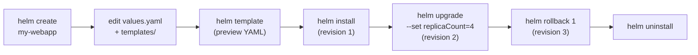

# Day 24 - Helm Demo (Hands-On)

> **Goal:** Build a Helm chart from scratch, then **install -> test -> upgrade -> roll back -> uninstall** it - the full release lifecycle in your own hands.

> **Pre-requisite:** [Day 24 - Helm Theory](notes.md)

## Learning Objectives

By the end of this demo you will be able to:

1. Scaffold a chart with `helm create` and understand the generated files.
2. Write your own `values.yaml` and templates (ConfigMap, Deployment, Service).
3. Preview rendered YAML with `helm template` / `--dry-run` before installing.
4. Install, upgrade (changing values), and roll back a release by revision.
5. Use conditionals, helpers, and per-environment values files.

## Quick Reminder: The Recipe Analogy

If the theory page was the *menu*, this demo is *cooking the meal*:

- The **chart** is your recipe card.
- **`values.yaml`** is the ingredient list you can tweak (2 portions vs 5).
- **`helm install`** cooks and serves it (a **release**).
- **`helm upgrade`** re-cooks with new ingredient amounts; **`helm rollback`** brings back the previous dish from the fridge.



## Demo 1 - Create and Deploy Your First Helm Chart

**Goal:** Build a simple Helm chart from scratch, deploy it, upgrade it, and roll it back.

```
What we'll build:
  A simple nginx web app chart that deploys:
  - Deployment (with configurable replicas and image)
  - Service (ClusterIP)
  - ConfigMap (custom index.html)
```

---

### Step 1: Create a New Chart

```bash
# Create chart scaffold
helm create my-webapp

# See what was generated
ls my-webapp/
# Chart.yaml  charts/  templates/  values.yaml
```

```
Generated structure:
  my-webapp/
  ├── Chart.yaml            # Chart metadata
  ├── values.yaml           # Default values
  ├── charts/               # Dependencies (empty for now)
  └── templates/
      ├── deployment.yaml   # Deployment template
      ├── service.yaml      # Service template
      ├── ingress.yaml      # Ingress template
      ├── hpa.yaml          # HPA template
      ├── serviceaccount.yaml
      ├── _helpers.tpl      # Helper template functions
      ├── NOTES.txt         # Post-install message
      └── tests/
          └── test-connection.yaml
```

The default chart is too complex for learning. Let's **delete everything in templates/** and build our own from scratch.

---

### Step 2: Clean Up and Build From Scratch

```bash
# Delete all generated templates
rm -rf my-webapp/templates/*

# We'll create our own simple templates
```

---

### Step 3: Edit Chart.yaml

```yaml
# my-webapp/Chart.yaml
apiVersion: v2
name: my-webapp
description: A simple web application Helm chart for learning
type: application
version: 0.1.0
appVersion: "1.0.0"
```

---

### Step 4: Edit values.yaml

This is where all configurable values live. Users override these without touching templates.

```yaml
# my-webapp/values.yaml

# App settings
appName: my-webapp

# Deployment
replicaCount: 2
image:
  repository: nginx
  tag: "1.27"
  pullPolicy: IfNotPresent

# Service
service:
  type: ClusterIP
  port: 80

# Custom HTML page
message: "Hello from Helm! This is version 1.0"

# Resources
resources:
  requests:
    cpu: 50m
    memory: 64Mi
  limits:
    cpu: 100m
    memory: 128Mi
```

---

### Step 5: Create Templates

#### 5a. ConfigMap Template

```yaml
# my-webapp/templates/configmap.yaml
apiVersion: v1
kind: ConfigMap
metadata:
  name: {{ .Release.Name }}-html
data:
  index.html: |
    <html>
    <body>
      <h1>{{ .Values.message }}</h1>
      <p>Release: {{ .Release.Name }}</p>
      <p>Chart: {{ .Chart.Name }}-{{ .Chart.Version }}</p>
      <p>App Version: {{ .Chart.AppVersion }}</p>
    </body>
    </html>
```

```
What's happening here?

  {{ .Release.Name }}    --> The name you pass to "helm install <NAME>"
  {{ .Values.message }}  --> Comes from values.yaml (message field)
  {{ .Chart.Name }}      --> Comes from Chart.yaml (name field)
  {{ .Chart.Version }}   --> Comes from Chart.yaml (version field)

  These placeholders get replaced with actual values during install.
```

#### 5b. Deployment Template

```yaml
# my-webapp/templates/deployment.yaml
apiVersion: apps/v1
kind: Deployment
metadata:
  name: {{ .Release.Name }}-deployment
  labels:
    app: {{ .Values.appName }}
    release: {{ .Release.Name }}
spec:
  replicas: {{ .Values.replicaCount }}
  selector:
    matchLabels:
      app: {{ .Values.appName }}
      release: {{ .Release.Name }}
  template:
    metadata:
      labels:
        app: {{ .Values.appName }}
        release: {{ .Release.Name }}
    spec:
      containers:
      - name: {{ .Values.appName }}
        image: "{{ .Values.image.repository }}:{{ .Values.image.tag }}"
        imagePullPolicy: {{ .Values.image.pullPolicy }}
        ports:
        - containerPort: 80
        resources:
          {{- toYaml .Values.resources | nindent 10 }}
        volumeMounts:
        - name: html-volume
          mountPath: /usr/share/nginx/html
      volumes:
      - name: html-volume
        configMap:
          name: {{ .Release.Name }}-html
```

```
Template breakdown:

  {{ .Values.replicaCount }}     --> 2 (from values.yaml)
  {{ .Values.image.repository }} --> nginx
  {{ .Values.image.tag }}        --> 1.27

  {{- toYaml .Values.resources | nindent 10 }}
       This converts the resources block from values.yaml
       into proper YAML with 10 spaces of indentation.

  The "-" in {{- removes whitespace before the tag.
```

#### 5c. Service Template

```yaml
# my-webapp/templates/service.yaml
apiVersion: v1
kind: Service
metadata:
  name: {{ .Release.Name }}-service
  labels:
    app: {{ .Values.appName }}
spec:
  type: {{ .Values.service.type }}
  ports:
  - port: {{ .Values.service.port }}
    targetPort: 80
  selector:
    app: {{ .Values.appName }}
    release: {{ .Release.Name }}
```

#### 5d. NOTES.txt (Post-Install Message)

```
# my-webapp/templates/NOTES.txt
=======================================
  {{ .Chart.Name }} has been deployed!
=======================================

Release Name: {{ .Release.Name }}
Namespace:    {{ .Release.Namespace }}
Replicas:     {{ .Values.replicaCount }}

To access the app:
  kubectl port-forward svc/{{ .Release.Name }}-service {{ .Values.service.port }}:{{ .Values.service.port }}
  Then open: http://localhost:{{ .Values.service.port }}

To check pods:
  kubectl get pods -l release={{ .Release.Name }}
```

---

### Step 6: Verify Your Chart

```bash
# Your chart should now look like this:
# my-webapp/
# ├── Chart.yaml
# ├── values.yaml
# └── templates/
#     ├── configmap.yaml
#     ├── deployment.yaml
#     ├── service.yaml
#     └── NOTES.txt

# Lint the chart (check for errors)
helm lint ./my-webapp
# ==> Linting ./my-webapp
# [INFO] Chart.yaml: icon is recommended
# 1 chart(s) linted, 0 chart(s) failed

# Preview the rendered YAML (without installing)
helm template test-release ./my-webapp
```

```
What "helm template" shows you:

  It replaces all {{ .Values.xxx }} and {{ .Release.xxx }}
  with actual values and prints the final YAML.

  This is how you debug templates before installing!
```

```bash
# Example output of helm template:
# ---
# apiVersion: v1
# kind: ConfigMap
# metadata:
#   name: test-release-html
# data:
#   index.html: |
#     <html>
#     <body>
#       <h1>Hello from Helm! This is version 1.0</h1>
#       <p>Release: test-release</p>
#       ...
#     </body>
#     </html>
# ---
# apiVersion: apps/v1
# kind: Deployment
# metadata:
#   name: test-release-deployment
#   ...
```

---

### Step 7: Install the Chart

```bash
# Install with default values
helm install webapp-v1 ./my-webapp

# You'll see the NOTES.txt output:
# =======================================
#   my-webapp has been deployed!
# =======================================
# Release Name: webapp-v1
# Namespace:    default
# Replicas:     2
# ...
```

```bash
# Verify everything is running
helm list
# NAME       NAMESPACE   REVISION   STATUS     CHART            APP VERSION
# webapp-v1  default     1          deployed   my-webapp-0.1.0  1.0.0

kubectl get all -l release=webapp-v1
# NAME                                        READY   STATUS    RESTARTS   AGE
# pod/webapp-v1-deployment-xxx                 1/1     Running   0          30s
# pod/webapp-v1-deployment-yyy                 1/1     Running   0          30s
#
# NAME                        TYPE        CLUSTER-IP      PORT(S)   AGE
# service/webapp-v1-service   ClusterIP   10.100.45.123   80/TCP    30s

# Test it
kubectl port-forward svc/webapp-v1-service 8080:80
# Open http://localhost:8080
# You'll see: "Hello from Helm! This is version 1.0"
```

---

## Demo 2 - Upgrade and Rollback

### Upgrade: Change the Message and Replicas

```bash
# Upgrade with new values (override via --set)
helm upgrade webapp-v1 ./my-webapp \
  --set message="Hello from Helm v2! We upgraded!" \
  --set replicaCount=3

# Check the release
helm list
# NAME       NAMESPACE   REVISION   STATUS     CHART            APP VERSION
# webapp-v1  default     2          deployed   my-webapp-0.1.0  1.0.0
#                        ^^
#                    Now revision 2!
```

```bash
# Verify
kubectl get pods -l release=webapp-v1
# NAME                                    READY   STATUS    RESTARTS   AGE
# webapp-v1-deployment-xxx                1/1     Running   0          10s
# webapp-v1-deployment-yyy                1/1     Running   0          10s
# webapp-v1-deployment-zzz                1/1     Running   0          10s
#                                                            3 pods now!

# Test
kubectl port-forward svc/webapp-v1-service 8080:80
# Open http://localhost:8080
# You'll see: "Hello from Helm v2! We upgraded!"
```

### Check History

```bash
helm history webapp-v1
# REVISION   STATUS       CHART            APP VERSION   DESCRIPTION
# 1          superseded   my-webapp-0.1.0  1.0.0         Install complete
# 2          deployed     my-webapp-0.1.0  1.0.0         Upgrade complete
```

### Rollback to Revision 1

```bash
helm rollback webapp-v1 1
# Rollback was a success! Happy Helming!

helm history webapp-v1
# REVISION   STATUS       CHART            APP VERSION   DESCRIPTION
# 1          superseded   my-webapp-0.1.0  1.0.0         Install complete
# 2          superseded   my-webapp-0.1.0  1.0.0         Upgrade complete
# 3          deployed     my-webapp-0.1.0  1.0.0         Rollback to 1
```

```bash
# Verify - back to 2 replicas and original message
kubectl get pods -l release=webapp-v1
# 2 pods again!

kubectl port-forward svc/webapp-v1-service 8080:80
# "Hello from Helm! This is version 1.0"   <-- Original message is back!
```

```
What happened:

  Revision 1: Install  (2 replicas, original message)
  Revision 2: Upgrade  (3 replicas, new message)
  Revision 3: Rollback (back to revision 1 settings)

  Helm keeps ALL revisions. You can rollback to ANY revision!
```

---

## Demo 3 - Multiple Environments with Values Files

**Goal:** Deploy the same chart to dev and prod with different configs.

### Create Environment-Specific Values Files

```yaml
# values-dev.yaml
replicaCount: 1
image:
  tag: "latest"
message: "DEV Environment - Do not use in production!"
resources:
  requests:
    cpu: 50m
    memory: 64Mi
  limits:
    cpu: 100m
    memory: 128Mi
```

```yaml
# values-prod.yaml
replicaCount: 5
image:
  tag: "1.27"
message: "Production Environment - Handle with care"
service:
  type: NodePort
resources:
  requests:
    cpu: 200m
    memory: 256Mi
  limits:
    cpu: 500m
    memory: 512Mi
```

### Deploy to Both Environments

```bash
# Deploy to dev namespace
helm install webapp-dev ./my-webapp \
  -f values-dev.yaml \
  -n dev --create-namespace

# Deploy to prod namespace
helm install webapp-prod ./my-webapp \
  -f values-prod.yaml \
  -n prod --create-namespace
```

```bash
# Check both releases
helm list -A
# NAME          NAMESPACE   REVISION   STATUS     CHART
# webapp-dev    dev         1          deployed   my-webapp-0.1.0
# webapp-prod   prod        1          deployed   my-webapp-0.1.0

kubectl get pods -n dev
# 1 pod (dev has replicaCount: 1)

kubectl get pods -n prod
# 5 pods (prod has replicaCount: 5)
```

```
Same chart, different values:

  DEV:                              PROD:
    1 replica                        5 replicas
    image: nginx:latest              image: nginx:1.27
    CPU: 50m-100m                    CPU: 200m-500m
    Memory: 64Mi-128Mi              Memory: 256Mi-512Mi
    ClusterIP                        NodePort

  This is the real power of Helm!
  One chart = unlimited deployments with different configs.
```

---

## Demo 4 - Using a Public Chart (Bitnami Nginx)

**Goal:** Install a production-ready nginx from Bitnami's chart repo.

```bash
# Add the Bitnami repo
helm repo add bitnami https://charts.bitnami.com/bitnami
helm repo update

# Search for nginx
helm search repo bitnami/nginx
# NAME            CHART VERSION   APP VERSION   DESCRIPTION
# bitnami/nginx   15.4.0          1.25.3        NGINX Open Source is a web server...

# See what values are available (HUGE list!)
helm show values bitnami/nginx | head -50

# Install with some custom values
helm install my-nginx bitnami/nginx \
  --set replicaCount=2 \
  --set service.type=ClusterIP

# Check it
helm list
kubectl get pods -l app.kubernetes.io/name=nginx
kubectl get svc -l app.kubernetes.io/name=nginx
```

```bash
# Clean up
helm uninstall my-nginx
```

```
Why use public charts?

  Your chart:       Basic templates, you maintain everything
  Bitnami chart:    Battle-tested, security updates, best practices,
                    health checks, metrics, PDBs, everything included

  For learning:     Build your own chart (understand how it works)
  For production:   Use public charts when available (save time)
```

---

## Clean Up Everything

```bash
# List all releases
helm list -A

# Uninstall all
helm uninstall webapp-v1
helm uninstall webapp-dev -n dev
helm uninstall webapp-prod -n prod

# Delete namespaces
kubectl delete namespace dev prod

# Delete the chart directory
rm -rf my-webapp
```

---

## Key Takeaways

```
1. helm create <name>     --> Scaffold a new chart
2. helm lint              --> Validate chart before installing
3. helm template          --> Preview rendered YAML (debug)
4. helm install           --> Deploy the chart
5. helm upgrade           --> Update with new values
6. helm rollback          --> Revert to any previous revision
7. helm history           --> See all revisions
8. -f values-prod.yaml    --> Use environment-specific values
9. --set key=value        --> Override individual values
10. helm uninstall        --> Clean up everything
```

---

## Common Mistakes

1. **Running `helm install` twice with the same release name.** You'll get "release already exists." Use a different name, `helm uninstall` first, or `helm upgrade --install` (install if missing, upgrade if present).
2. **Forgetting `helm repo update` before installing a remote chart** (Demo 4) - you may pull a stale chart version.
3. **`kubectl edit` on Helm-managed resources.** Your edit is wiped on the next `helm upgrade`. Change `values.yaml` / `--set` and upgrade instead.
4. **Pasting `values-dev.yaml` and `values-prod.yaml` into one file.** They are *two separate files* (Demo 3) - save each on its own.
5. **Skipping the preview.** Always run `helm lint`, then `helm template` (or `--dry-run --debug`) before a real install; it catches template/whitespace errors before they hit the cluster.

## Quick Self-Check

1. Which command creates the starter chart structure?
2. How do you see the final rendered YAML *without* touching the cluster?
3. After `helm upgrade ... --set replicaCount=3`, how do you go back to the previous version?
4. What does `helm upgrade --install` do that plain `helm install` doesn't?
5. In Demo 1, where does the web page's heading text actually come from?

<details>
<summary>Answers</summary>

1. `helm create my-webapp`.
2. `helm template <release> <chart>` (or `helm install ... --dry-run --debug`).
3. `helm rollback webapp-v1 1` (rolls back to revision 1).
4. It installs the release if it doesn't exist yet, and upgrades it if it does - safe to run repeatedly (great for CI/CD).
5. From `values.yaml` - the `message` field, injected into the ConfigMap template via `{{ .Values.message }}`.

</details>

---

## Summary

- You built a real chart, rendered it, installed it as a **release**, upgraded it, and rolled it back - the complete Helm lifecycle.
- `helm lint` + `helm template` / `--dry-run --debug` are your safety net: **preview before you install**.
- `helm rollback <release> <revision>` is one-command "undo" for an entire application.
- One chart + per-environment values files (`values-dev.yaml`, `values-prod.yaml`) = one app, many environments.
- Prefer `helm upgrade --install` in automation so the same command works whether or not the release exists.

**Next up ->** That is the full Helm lifecycle, and it is also the last numbered day of the Kubernetes module - congratulations on completing the K8s journey. Head back to the [Kubernetes Module README](../README.md) to review the whole roadmap and choose your next module.

---

**Theory:** [Day 24 - Helm](notes.md)
